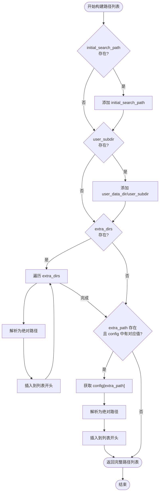

# 策略路径构建机制

<cite>
**Referenced Files in This Document**   
- [strategy_resolver.py](file://freqtrade/resolvers/strategy_resolver.py)
- [iresolver.py](file://freqtrade/resolvers/iresolver.py)
- [interface.py](file://freqtrade/strategy/interface.py)
- [constants.py](file://freqtrade/constants.py)
</cite>

## 目录
1. [简介](#简介)
2. [核心路径构建逻辑](#核心路径构建逻辑)
3. [路径优先级与排序规则](#路径优先级与排序规则)
4. [递归搜索机制](#递归搜索机制)
5. [策略模块查找流程](#策略模块查找流程)
6. [配置参数详解](#配置参数详解)

## 简介
本文档深入解析 `StrategyResolver` 类中 `build_search_paths` 方法的实现细节，该方法负责构建策略模块的搜索路径列表。`StrategyResolver` 继承自 `IResolver` 基类，利用其通用的路径构建逻辑，结合策略特有的配置参数，为策略加载器提供完整的搜索路径。这些路径直接影响后续策略模块的查找和加载过程。

## 核心路径构建逻辑

`build_search_paths` 方法是 `IResolver` 基类中定义的类方法，为所有解析器（如策略、保护、配对列表等）提供通用的路径构建逻辑。`StrategyResolver` 通过继承和配置，利用此方法构建其特定的搜索路径。

该方法的核心逻辑是根据配置和参数，按特定顺序将多个路径源组合成一个完整的搜索路径列表。路径的构建遵循以下步骤：

1.  **初始搜索路径 (initial_search_path)**：如果子类定义了 `initial_search_path`，则将其添加到路径列表中。
2.  **用户数据子目录 (user_subdir)**：如果提供了 `user_subdir` 参数，则将 `user_data_dir` 配置项与该子目录拼接后的路径插入到列表的最前面。
3.  **额外目录 (extra_dirs)**：如果提供了 `extra_dirs` 列表，则将列表中的每个目录解析为绝对路径，并依次插入到列表的最前面。
4.  **配置路径 (extra_path)**：如果子类定义了 `extra_path` 字符串，并且该字符串作为键存在于配置中，则将配置中对应的路径解析为绝对路径，并插入到列表的最前面。

最终返回的路径列表是一个有序集合，搜索器会按照从前往后的顺序依次在这些路径中查找目标模块。

**Section sources**
- [iresolver.py](file://freqtrade/resolvers/iresolver.py#L51-L72)

## 路径优先级与排序规则

路径的优先级由其在搜索列表中的位置决定，**列表前面的路径具有更高的优先级**。`build_search_paths` 方法通过在列表开头插入（`insert(0, ...)`）新路径来实现优先级的控制。

具体优先级顺序如下（从高到低）：

1.  **配置路径 (`strategy_path`)**：通过 `config['strategy_path']` 指定的路径具有最高优先级。这允许用户通过配置文件临时覆盖默认的策略查找位置。
2.  **额外目录 (`extra_dirs`)**：在运行时通过代码或命令行参数动态添加的目录。这些目录的优先级次之，且列表中靠前的目录优先级更高。
3.  **用户数据子目录 (`user_data_dir/strategies`)**：这是用户存放自定义策略的标准目录，优先级中等。例如，`user_data/strategies`。
4.  **初始搜索路径 (`initial_search_path`)**：这是最后的备选路径，通常指向框架内置的策略目录，优先级最低。

这种设计确保了用户可以通过多种方式灵活地指定策略位置，且更具体的配置会覆盖更通用的默认设置。



**Diagram sources**
- [iresolver.py](file://freqtrade/resolvers/iresolver.py#L51-L72)

**Section sources**
- [iresolver.py](file://freqtrade/resolvers/iresolver.py#L51-L72)

## 递归搜索机制

`StrategyResolver` 在其 `_load_strategy` 方法中实现了递归搜索功能。当配置项 `recursive_strategy_search` 被设置为 `True` 时，该机制会被激活。

具体实现如下：
1.  使用 Python 的 `os.walk` 函数遍历 `user_data_dir/strategies` 目录下的所有子目录。
2.  将所有找到的子目录路径收集到一个 `extra_dirs` 列表中。
3.  将这个包含所有子目录的 `extra_dirs` 列表传递给 `build_search_paths` 方法。

通过这种方式，`build_search_paths` 方法会将所有子目录的路径都插入到搜索列表的前面，从而实现了对用户策略目录及其所有子目录的递归搜索。这使得用户可以将策略文件组织在多层文件夹结构中，而框架仍能正确找到它们。

**Section sources**
- [strategy_resolver.py](file://freqtrade/resolvers/strategy_resolver.py#L280-L283)

## 策略模块查找流程

路径构建完成后，`StrategyResolver` 会利用这些路径来查找和加载策略模块。其查找流程如下：

1.  **调用 `build_search_paths`**：`_load_strategy` 方法首先调用 `StrategyResolver.build_search_paths`，传入 `config`、`user_subdir=USERPATH_STRATEGIES` 和 `extra_dirs`（包含递归搜索的子目录和 `strategy_path`），获取一个完整的、有序的路径列表 `abs_paths`。
2.  **遍历搜索路径**：`_load_object` 方法会遍历 `abs_paths` 列表中的每一个路径。
3.  **在目录中搜索**：对于每一个路径，`_search_object` 方法会遍历该目录下的所有 `.py` 文件。
4.  **验证并加载模块**：`_get_valid_object` 方法会尝试导入每个 Python 文件，并检查其中是否定义了继承自 `IStrategy` 的类，且类名与要查找的 `strategy_name` 匹配。
5.  **返回结果**：一旦找到匹配的类，就会实例化并返回该策略对象。如果遍历完所有路径都未找到，则抛出异常。

整个流程依赖于 `build_search_paths` 提供的精确路径列表，确保了策略查找的准确性和可预测性。

```mermaid
sequenceDiagram
participant Resolver as StrategyResolver
participant Builder as build_search_paths
participant Loader as _load_object
participant Searcher as _search_object
participant Validator as _get_valid_object
Resolver->>Builder : build_search_paths(config, user_subdir, extra_dirs)
Builder-->>Resolver : 返回 abs_paths (路径列表)
loop 遍历每个路径
Resolver->>Loader : _load_object(abs_paths, strategy_name)
Loader->>Searcher : _search_object(路径, strategy_name)
loop 遍历目录下每个.py文件
Searcher->>Validator : _get_valid_object(文件, strategy_name)
Validator-->>Searcher : 返回 (类, 源码) 或 None
alt 找到有效类
Searcher-->>Loader : 返回 (类, 模块路径)
Loader->>Resolver : 实例化策略并返回
break 找到策略
end
end
end
alt 未找到策略
Loader-->>Resolver : 返回 None
Resolver->>Resolver : 抛出 OperationalException
end
```

**Diagram sources**
- [strategy_resolver.py](file://freqtrade/resolvers/strategy_resolver.py#L290-L298)
- [iresolver.py](file://freqtrade/resolvers/iresolver.py#L150-L170)

**Section sources**
- [strategy_resolver.py](file://freqtrade/resolvers/strategy_resolver.py#L290-L307)
- [iresolver.py](file://freqtrade/resolvers/iresolver.py#L150-L170)

## 配置参数详解

`build_search_paths` 方法的实现依赖于以下几个关键的配置参数和类属性：

- **`user_data_dir`**: 这是用户数据的根目录，通常在 `config.json` 中配置。它是构建用户子目录路径的基础。
- **`USERPATH_STRATEGIES`**: 定义在 `constants.py` 中的常量，值为 `"strategies"`。它指定了策略文件在 `user_data_dir` 下的默认子目录。
- **`strategy_path`**: 这是一个可选的配置项，允许用户指定一个额外的、优先级最高的策略搜索路径。
- **`recursive_strategy_search`**: 一个布尔型配置项，用于控制是否启用对 `user_data_dir/strategies` 目录的递归搜索。
- **`IResolver.extra_path`**: 在 `StrategyResolver` 中被设置为 `"strategy_path"`，这告诉基类在配置中查找哪个键来获取额外的路径。
- **`IResolver.user_subdir`**: 在 `StrategyResolver` 中被设置为 `USERPATH_STRATEGIES`，这指定了用户数据子目录的名称。

这些参数和属性共同协作，使得路径构建过程既灵活又强大，能够适应各种复杂的部署和组织需求。

**Section sources**
- [constants.py](file://freqtrade/constants.py#L217)
- [strategy_resolver.py](file://freqtrade/resolvers/strategy_resolver.py#L34-L37)
- [iresolver.py](file://freqtrade/resolvers/iresolver.py#L43-L46)