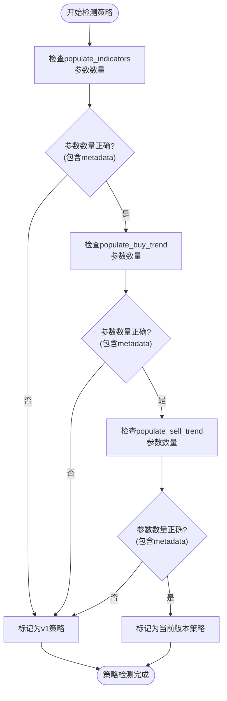
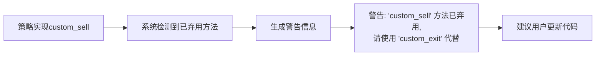
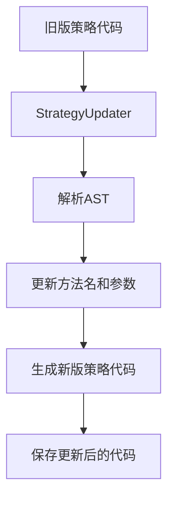

# 废弃方法检测与迁移警告

<cite>
**本文档引用的文件**
- [interface.py](file://freqtrade/strategy/interface.py)
- [legacy_strategy_v1.py](file://tests/strategy/strats/broken_strats/legacy_strategy_v1.py)
- [strategyupdater.py](file://freqtrade/strategy/strategyupdater.py)
- [strategy_wrapper.py](file://freqtrade/strategy/strategy_wrapper.py)
</cite>

## 目录
1. [简介](#简介)
2. [v1策略接口废弃检测机制](#v1策略接口废弃检测机制)
3. [已弃用方法的迁移警告系统](#已弃用方法的迁移警告系统)
4. [从v1接口迁移至当前接口](#从v1接口迁移至当前接口)
5. [结论](#结论)

## 简介
本文档深入解析Freqtrade框架中对旧版策略接口（v1）的检测机制，特别是通过`getfullargspec`检查`populate_indicators`、`populate_buy_trend`和`populate_sell_trend`方法参数数量来识别旧版策略。同时，说明当策略实现`custom_sell`等已弃用方法时触发的迁移警告系统，包括警告信息内容和建议的更新路径，并提供具体的代码修改示例，帮助用户顺利完成策略升级。

## v1策略接口废弃检测机制

### 检测原理
Freqtrade通过检查策略类中关键方法的参数签名来识别v1版本的旧策略。v1版本的策略方法不接受`metadata`参数，而新版本的策略方法则必须包含此参数。

#### 关键检测点
- **`populate_indicators`方法**: 检查是否接受`metadata`参数。
- **`populate_buy_trend`方法**: 检查是否接受`metadata`参数。
- **`populate_sell_trend`方法**: 检查是否接受`metadata`参数。

当这些方法的参数数量少于预期时，系统会判定该策略为v1版本的旧策略。



**Diagram sources**
- [interface.py](file://freqtrade/strategy/interface.py#L227-L243)
- [interface.py](file://freqtrade/strategy/interface.py#L236-L243)
- [interface.py](file://freqtrade/strategy/interface.py#L254-L262)

**Section sources**
- [interface.py](file://freqtrade/strategy/interface.py#L227-L262)

### 检测实现
检测逻辑主要在策略加载和验证过程中执行。系统会使用Python的`inspect`模块（如`getfullargspec`）来检查方法的签名。

```python
# 伪代码示例：检测方法参数
import inspect

def is_v1_strategy(strategy_class):
    for method_name in ['populate_indicators', 'populate_buy_trend', 'populate_sell_trend']:
        method = getattr(strategy_class, method_name, None)
        if method:
            sig = inspect.signature(method)
            if 'metadata' not in sig.parameters:
                return True
    return False
```

**Section sources**
- [interface.py](file://freqtrade/strategy/interface.py#L227-L262)

## 已弃用方法的迁移警告系统

### 触发条件
当用户策略中实现了已弃用的方法（如`custom_sell`）时，系统会触发迁移警告。这些方法已被`custom_exit`等新方法取代。

### 警告信息内容
系统会生成详细的警告信息，提示用户方法已弃用，并建议使用新的替代方法。



**Diagram sources**
- [interface.py](file://freqtrade/strategy/interface.py#L556-L586)
- [interface.py](file://freqtrade/strategy/interface.py#L588-L617)

**Section sources**
- [interface.py](file://freqtrade/strategy/interface.py#L556-L617)

### 警告系统实现
警告系统通过在方法定义中添加`DEPRECATED`注释来实现，并在运行时通过日志系统输出警告。

```python
def custom_sell(
    self,
    pair: str,
    trade: Trade,
    current_time: datetime,
    current_rate: float,
    current_profit: float,
    **kwargs,
) -> str | bool | None:
    """
    DEPRECATED - please use custom_exit instead.
    ...
    """
    return None
```

**Section sources**
- [interface.py](file://freqtrade/strategy/interface.py#L556-L586)

## 从v1接口迁移至当前接口

### 迁移路径
1. **更新方法签名**: 为`populate_indicators`、`populate_buy_trend`和`populate_sell_trend`方法添加`metadata`参数。
2. **替换已弃用方法**: 将`custom_sell`替换为`custom_exit`。
3. **更新方法名**: 将`populate_buy_trend`和`populate_sell_trend`分别替换为`populate_entry_trend`和`populate_exit_trend`。

### 代码修改示例

#### v1版本策略示例
```python
class TestStrategyLegacyV1(IStrategy):
    minimal_roi = {"40": 0.0, "30": 0.01, "20": 0.02, "0": 0.04}
    stoploss = -0.10
    timeframe = "5m"

    def populate_indicators(self, dataframe: DataFrame) -> DataFrame:
        return dataframe

    def populate_buy_trend(self, dataframe: DataFrame) -> DataFrame:
        return dataframe

    def populate_sell_trend(self, dataframe: DataFrame) -> DataFrame:
        return dataframe
```

**Section sources**
- [legacy_strategy_v1.py](file://tests/strategy/strats/broken_strats/legacy_strategy_v1.py#L7-L20)

#### 迁移至当前接口
```python
class TestStrategyUpdated(IStrategy):
    INTERFACE_VERSION = 3  # 明确指定接口版本
    minimal_roi = {"40": 0.0, "30": 0.01, "20": 0.02, "0": 0.04}
    stoploss = -0.10
    timeframe = "5m"

    def populate_indicators(self, dataframe: DataFrame, metadata: dict) -> DataFrame:
        # 添加metadata参数
        return dataframe

    def populate_entry_trend(self, dataframe: DataFrame, metadata: dict) -> DataFrame:
        # 方法名更新为populate_entry_trend
        return dataframe

    def populate_exit_trend(self, dataframe: DataFrame, metadata: dict) -> DataFrame:
        # 方法名更新为populate_exit_trend
        return dataframe

    def custom_exit(self, pair: str, trade: Trade, current_time: datetime, current_rate: float, current_profit: float, **kwargs) -> str | bool | None:
        # 替换custom_sell为custom_exit
        return None
```

**Section sources**
- [interface.py](file://freqtrade/strategy/interface.py#L227-L271)
- [interface.py](file://freqtrade/strategy/interface.py#L588-L617)

### 自动化迁移工具
Freqtrade提供了`StrategyUpdater`工具，可以自动将旧版策略更新为新版。



**Diagram sources**
- [strategyupdater.py](file://freqtrade/strategy/strategyupdater.py#L0-L278)

**Section sources**
- [strategyupdater.py](file://freqtrade/strategy/strategyupdater.py#L0-L278)

## 结论
Freqtrade通过严格的接口版本控制和方法签名检测，确保了策略的兼容性和可维护性。用户应遵循文档中的迁移指南，及时更新旧版策略，以充分利用框架的最新功能和性能优化。自动化迁移工具的引入大大降低了升级成本，使用户能够更轻松地保持策略的现代化。