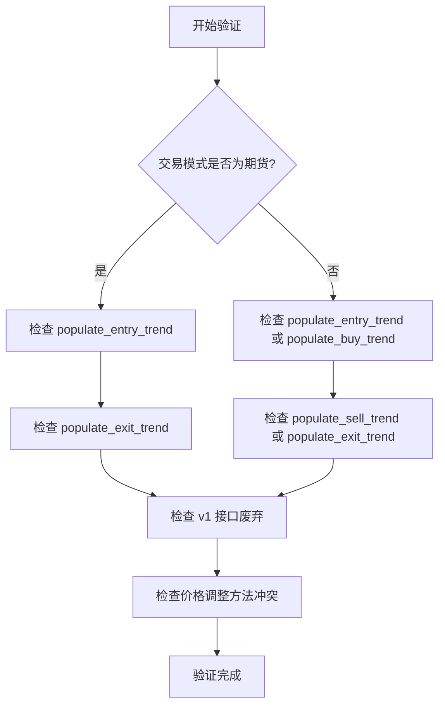
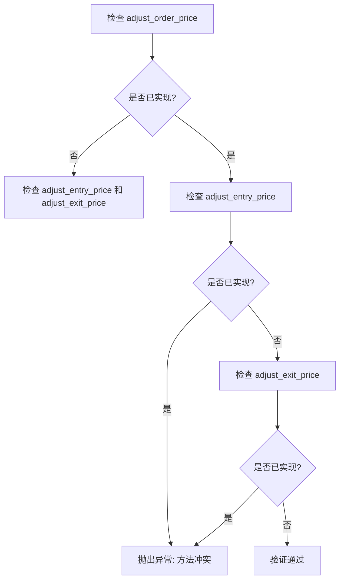
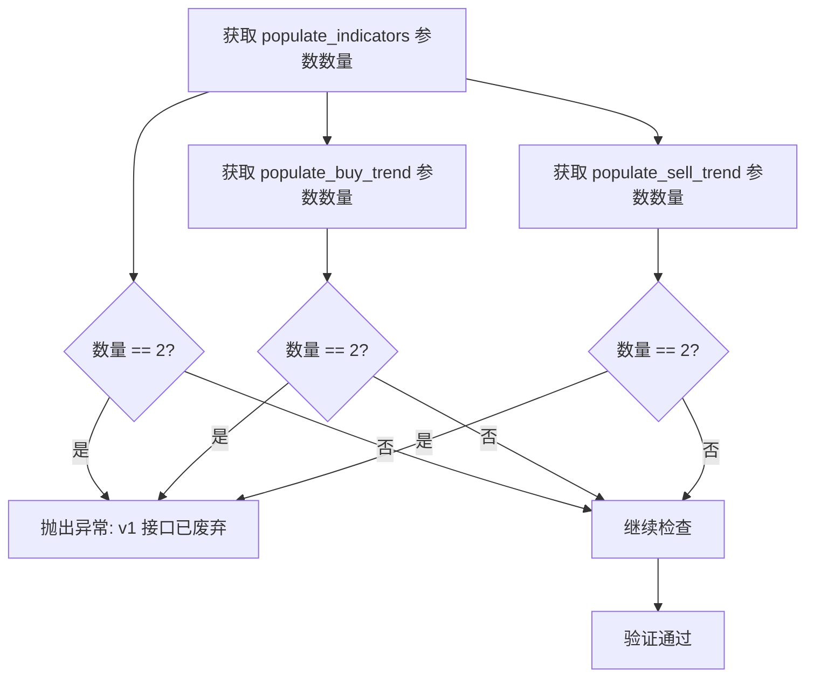
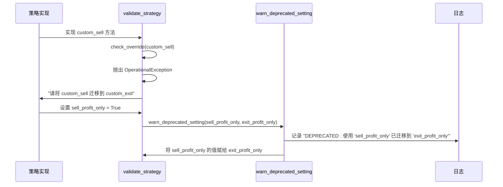

# 策略验证与兼容性检查

<cite>
**本文档引用的文件**  
- [strategy_resolver.py](file://freqtrade/resolvers/strategy_resolver.py#L173-L325)
- [interface.py](file://freqtrade/strategy/interface.py#L50-L1884)
- [legacy_strategy_v1.py](file://tests/strategy/strats/broken_strats/legacy_strategy_v1.py#L1-L22)
</cite>

## 目录
1. [现货与期货交易模式的实现要求](#现货与期货交易模式的实现要求)
2. [混合使用价格调整方法的检测](#混合使用价格调整方法的检测)
3. [废弃版本接口的检测机制](#废弃版本接口的检测机制)
4. [已弃用方法的迁移警告系统](#已弃用方法的迁移警告系统)

## 现货与期货交易模式的实现要求

策略验证方法 `validate_strategy` 根据交易模式的不同，对策略实现提出了不同的要求。这种区分确保了策略在不同市场环境下的正确性和兼容性。

对于期货交易模式（非现货模式），系统强制要求策略必须实现 `populate_entry_trend` 和 `populate_exit_trend` 这两个核心方法。如果策略未实现这些方法，验证过程将抛出 `OperationalException` 异常，阻止策略加载。这确保了期货策略具备完整的入场和出场信号逻辑。

**Diagram sources**
- [strategy_resolver.py](file://freqtrade/resolvers/strategy_resolver.py#L173-L251)

**Section sources**
- [strategy_resolver.py](file://freqtrade/resolvers/strategy_resolver.py#L173-L251)

## 混合使用价格调整方法的检测

系统通过 `validate_strategy` 方法严格检测 `adjust_order_price` 与 `adjust_entry_price`/`adjust_exit_price` 的混合使用情况。这种检测机制旨在防止策略开发者同时实现两套价格调整逻辑，从而避免潜在的冲突和不可预测的行为。

验证逻辑通过 `check_override` 函数检查策略是否重写了 `adjust_order_price` 方法，同时是否也重写了 `adjust_entry_price` 或 `adjust_exit_price` 方法。如果检测到同时重写的情况，系统将抛出 `OperationalException` 异常，明确提示用户“请为您的策略选择一种方法”。

**Diagram sources**
- [strategy_resolver.py](file://freqtrade/resolvers/strategy_resolver.py#L173-L251)

**Section sources**
- [strategy_resolver.py](file://freqtrade/resolvers/strategy_resolver.py#L173-L251)

## 废弃版本接口的检测机制

系统实现了对已废弃的 Strategy Interface v1 版本的检测。该机制通过检查 `populate_indicators`、`populate_buy_trend` 和 `populate_sell_trend` 这三个核心方法的参数数量来判断策略是否仍在使用旧版接口。

具体而言，验证逻辑会获取这三个方法的参数规范（`getfullargspec`），并检查其参数数量是否等于2。如果任一方法的参数数量为2，则表明该策略仍在使用不包含 `metadata` 参数的旧版接口。此时，系统会抛出 `OperationalException` 异常，明确提示用户“Strategy Interface v1 已不再支持”，并指导用户更新策略以实现包含 `metadata` 参数的新方法。

**Diagram sources**
- [strategy_resolver.py](file://freqtrade/resolvers/strategy_resolver.py#L173-L251)

**Section sources**
- [strategy_resolver.py](file://freqtrade/resolvers/strategy_resolver.py#L173-L251)

## 已弃用方法的迁移警告系统

系统内置了一套迁移警告系统，用于引导用户从已弃用的方法迁移到新的推荐方法。该系统通过 `warn_deprecated_setting` 函数实现，当策略中使用了已弃用的属性或方法时，会记录警告日志，并自动将旧属性的值赋给新属性。

例如，当策略中使用了 `sell_profit_only` 时，系统会发出警告，提示用户应迁移到 `exit_profit_only`，并自动将 `sell_profit_only` 的值赋给 `exit_profit_only`。同样，对于 `custom_sell` 方法，如果策略实现了该方法，验证过程会直接抛出 `OperationalException` 异常，强制要求用户迁移到 `custom_exit`。

**Diagram sources**
- [strategy_resolver.py](file://freqtrade/resolvers/strategy_resolver.py#L173-L251)
- [interface.py](file://freqtrade/strategy/interface.py#L50-L1884)

**Section sources**
- [strategy_resolver.py](file://freqtrade/resolvers/strategy_resolver.py#L173-L251)
- [interface.py](file://freqtrade/strategy/interface.py#L50-L1884)