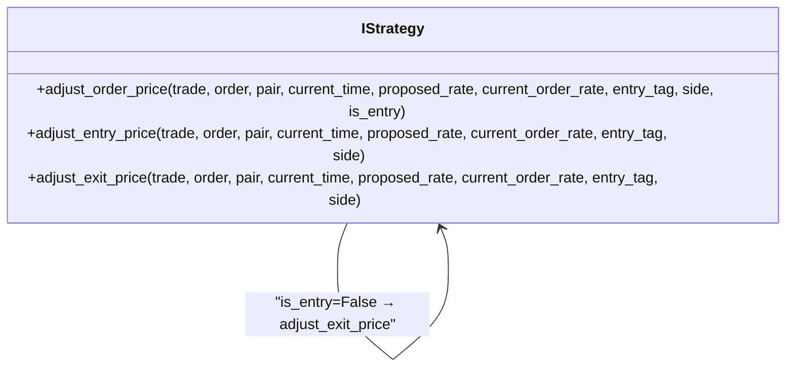
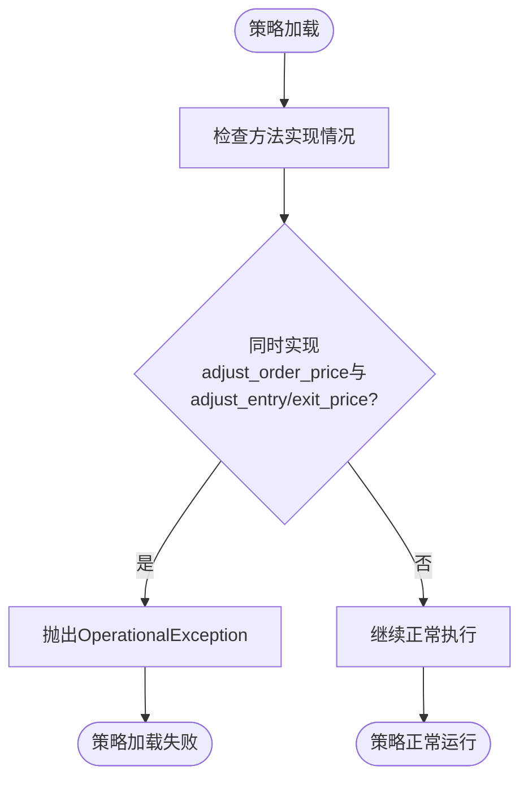

# 订单价格调整方法冲突检测

<cite>
**本文档中引用的文件**  
- [interface.py](file://freqtrade/strategy/interface.py#L691-L824)
- [strategy_wrapper.py](file://freqtrade/strategy/strategy_wrapper.py#L15-L42)
- [exceptions.py](file://freqtrade/exceptions.py#L7-L11)
</cite>

## 目录
1. [简介](#简介)
2. [核心机制分析](#核心机制分析)
3. [方法范式冲突说明](#方法范式冲突说明)
4. [异常触发条件](#异常触发条件)
5. [正确使用范例](#正确使用范例)
6. [结论](#结论)

## 简介
本文档全面说明 `adjust_order_price` 与 `adjust_entry_price`/`adjust_exit_price` 混合使用的检测机制。解释为何不允许同时实现这些方法，因为它们代表了两种不同的订单价格调整范式。描述当策略同时覆盖这些方法时抛出 `OperationalException` 的具体条件和错误信息，并提供正确的使用范例。

## 核心机制分析
在 Freqtrade 策略系统中，订单价格调整功能通过一组回调方法实现。核心方法包括：

- `adjust_order_price`: 统一入口方法，根据订单类型分发到具体调整逻辑
- `adjust_entry_price`: 专门处理入场订单价格调整
- `adjust_exit_price`: 专门处理出场订单价格调整



**Diagram sources**
- [interface.py](file://freqtrade/strategy/interface.py#L691-L824)

**Section sources**
- [interface.py](file://freqtrade/strategy/interface.py#L691-L824)

## 方法范式冲突说明
系统不允许同时实现 `adjust_order_price` 与 `adjust_entry_price`/`adjust_exit_price` 的根本原因在于它们代表了两种互斥的设计范式：

1. **统一调整范式**：通过 `adjust_order_price` 单一入口方法处理所有订单调整，内部根据 `is_entry` 参数分发逻辑
2. **分离调整范式**：分别实现 `adjust_entry_price` 和 `adjust_exit_price` 方法，由系统自动调用对应方法

混合使用会导致逻辑冲突和行为不可预测，因为：
- `adjust_order_price` 内部默认会调用 `adjust_entry_price` 和 `adjust_exit_price`
- 如果用户同时重写这三个方法，会造成调用链混乱
- 系统无法确定应该使用哪种调整逻辑

这种设计确保了策略行为的一致性和可预测性，避免了潜在的逻辑冲突。

**Section sources**
- [interface.py](file://freqtrade/strategy/interface.py#L765-L824)

## 异常触发条件
当策略同时实现了 `adjust_order_price` 与 `adjust_entry_price`/`adjust_exit_price` 时，系统会在运行时检测到这种冲突并抛出 `OperationalException`。

具体触发条件包括：
- 策略类同时重写了 `adjust_order_price` 和 `adjust_entry_price` 方法
- 策略类同时重写了 `adjust_order_price` 和 `adjust_exit_price` 方法
- 策略类同时重写了所有三个方法

错误信息会明确指出："Cannot implement both adjust_order_price and adjust_entry_price/adjust_exit_price"，提示用户选择其中一种范式。

该检测通过策略包装器 `strategy_safe_wrapper` 实现，在方法调用时进行安全检查，确保策略实现的合规性。



**Diagram sources**
- [interface.py](file://freqtrade/strategy/interface.py#L765-L824)
- [strategy_wrapper.py](file://freqtrade/strategy/strategy_wrapper.py#L15-L42)
- [exceptions.py](file://freqtrade/exceptions.py#L7-L11)

**Section sources**
- [interface.py](file://freqtrade/strategy/interface.py#L765-L824)

## 正确使用范例
正确的使用方式是选择其中一种范式并保持一致性：

### 范式一：统一调整（推荐）
```python
def adjust_order_price(self, trade, order, pair, current_time, proposed_rate, 
                      current_order_rate, entry_tag, side, is_entry, **kwargs):
    # 统一处理入场和出场订单调整
    if is_entry:
        # 入场订单调整逻辑
        return proposed_rate * 0.99
    else:
        # 出场订单调整逻辑
        return proposed_rate * 1.01
```

### 范式二：分离调整
```python
def adjust_entry_price(self, trade, order, pair, current_time, proposed_rate, 
                      current_order_rate, entry_tag, side, **kwargs):
    # 仅处理入场订单调整
    return proposed_rate * 0.99

def adjust_exit_price(self, trade, order, pair, current_time, proposed_rate, 
                     current_order_rate, entry_tag, side, **kwargs):
    # 仅处理出场订单调整
    return proposed_rate * 1.01
```

关键原则：
- 只选择一种范式
- 不要混合使用
- 保持逻辑一致性
- 确保策略行为可预测

**Section sources**
- [interface.py](file://freqtrade/strategy/interface.py#L691-L824)

## 结论
`adjust_order_price` 与 `adjust_entry_price`/`adjust_exit_price` 的混合使用被禁止，因为它们代表了两种互斥的订单价格调整范式。系统通过运行时检测确保策略实现的一致性，当发现冲突实现时会抛出 `OperationalException`。用户应选择其中一种范式并保持一致性，以确保策略行为的可预测性和稳定性。