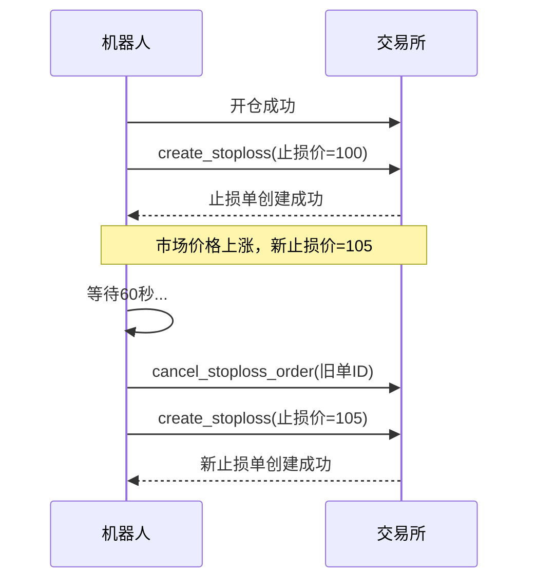

# 订单类型配置

<cite>
**本文档引用的文件**
- [interface.py](file://freqtrade/strategy/interface.py#L93-L99)
- [exchange.py](file://freqtrade/exchange/exchange.py#L1423-L1449)
- [freqtradebot.py](file://freqtrade/freqtradebot.py#L1524-L1549)
- [SampleStrategy.py](file://user_data/strategies/SampleStrategy.py#L123-L128)
- [test_stoploss_on_exchange.py](file://tests/freqtradebot/test_stoploss_on_exchange.py)
</cite>

## 目录
1. [订单类型字典详解](#订单类型字典详解)
2. [启用交易所止损](#启用交易所止损)
3. [交易所止损价格同步机制](#交易所止损价格同步机制)
4. [实盘交易中的订单类型影响](#实盘交易中的订单类型影响)

## 订单类型字典详解

`order_types` 字典是Freqtrade策略中的核心配置，用于定义不同交易操作所使用的订单类型。该字典在 `IStrategy` 接口中定义了默认值，用户可以在具体策略中进行覆盖。

字典中的主要键包括：
- **entry**: 定义开仓订单的类型，通常设置为 "limit"（限价单）以控制入场价格。
- **exit**: 定义平仓订单的类型，同样通常为 "limit"。
- **stoploss**: 定义止损单的类型，可以是 "market"（市价单）或 "limit"（限价单）。市价单能确保快速成交，而限价单则试图以更优价格成交。
- **stoploss_on_exchange**: 布尔值，决定止损单是否直接在交易所创建。默认为 `False`，即由机器人在本地监控并触发市价单。
- **stoploss_on_exchange_interval**: 当 `stoploss_on_exchange` 为 `True` 且启用追踪止损时，此参数定义了同步止损价格到交易所的最小时间间隔（秒），默认为60秒，用于避免过于频繁的API调用。

**Section sources**
- [interface.py](file://freqtrade/strategy/interface.py#L93-L99)
- [SampleStrategy.py](file://user_data/strategies/SampleStrategy.py#L123-L128)

## 启用交易所止损

将 `stoploss_on_exchange` 设置为 `True` 是提升止损响应速度的关键配置。当此选项启用时，机器人会在开仓成功后，立即在交易所创建一个真正的止损单（Stop-Loss Order），而不是在本地监控价格并在触发时再发送市价单。

其工作流程如下：
1.  **开仓成功**：当一个交易的开仓订单完全成交后，系统会检查 `stoploss_on_exchange` 配置。
2.  **创建止损单**：如果配置为 `True`，机器人会调用交易所的 `create_stoploss` API，在交易所服务器上创建一个止损单。此单据的触发价格（`stop_price`）基于策略计算出的止损价。
3.  **交易所监控**：一旦止损单被交易所接受，后续的价格监控和触发将由交易所自身完成。这意味着即使机器人的网络连接中断或程序崩溃，只要交易所的服务器正常运行，止损单依然有效。
4.  **快速执行**：由于止损单已在交易所内部，一旦市场价格触及或跌破（做多时）止损价，交易所会以极快的速度（通常为毫秒级）执行该订单，从而显著降低了因网络延迟或机器人处理延迟导致的滑点风险。

**Section sources**
- [freqtradebot.py](file://freqtrade/freqtradebot.py#L1410-L1438)
- [test_stoploss_on_exchange.py](file://tests/freqtradebot/test_stoploss_on_exchange.py)

## 交易所止损价格同步机制

当 `stoploss_on_exchange` 为 `True` 并且同时启用了追踪止损（`trailing_stop: True`）时，`stoploss_on_exchange_interval` 参数变得至关重要。

其作用机制如下：
1.  **初始创建**：开仓后，机器人会在交易所创建第一个止损单。
2.  **价格变动**：随着市场价格朝着有利方向移动，策略计算出的止损价（`stop_loss`）也会相应上移（做多时）。
3.  **检查更新时机**：机器人会定期检查是否需要更新交易所的止损单。`stoploss_on_exchange_interval` 定义了两次更新操作之间的最小等待时间。例如，若设置为60秒，则机器人至少要等待60秒后才会尝试更新。
4.  **取消与重建**：当需要更新止损价时，机器人不会直接修改现有订单（大多数交易所不支持修改止损价）。它会先调用 `cancel_stoploss_order` 取消旧的止损单，然后立即调用 `create_stoploss` 创建一个具有新止损价的新订单。
5.  **防止过度调用**：`stoploss_on_exchange_interval` 的存在是为了防止在价格快速波动时，机器人过于频繁地取消和重建止损单，从而避免触发交易所的API速率限制（Rate Limiting）。

**Diagram sources**
- [freqtradebot.py](file://freqtrade/freqtradebot.py#L1524-L1549)
- [exchange.py](file://freqtrade/exchange/exchange.py#L1423-L1449)

## 实盘交易中的订单类型影响

不同的订单类型配置在实盘交易中会产生显著不同的实际影响：

- **`stoploss: "market"` vs `"limit"`**:
    - `"market"`：保证止损单能立即成交，但成交价可能因市场深度不足而产生较大滑点，尤其是在剧烈波动时。
    - `"limit"`：试图以指定价格或更优价格成交，但存在无法成交的风险，可能导致亏损扩大。

- **`stoploss_on_exchange: False` vs `True`**:
    - `False`（默认）：机器人负责监控和执行。优点是逻辑完全由机器人控制，但缺点是存在单点故障风险（机器人宕机则止损失效），且从价格触发到发送市价单有额外延迟。
    - `True`：止损由交易所执行。优点是响应速度极快，且不依赖机器人在线，安全性更高。缺点是需要支付额外的订单费用，且在某些交易所，止损单可能会占用保证金。

- **`stoploss_on_exchange_interval` 的影响**：
    - 设置过小（如10秒）：在趋势行情中能更紧密地追踪止损，但会大幅增加API调用次数，可能导致被交易所限速。
    - 设置过大（如300秒）：能有效保护API，但止损价更新不及时，可能错失将止损上移至更安全位置的机会。

**Section sources**
- [SampleStrategy.py](file://user_data/strategies/SampleStrategy.py#L123-L128)
- [test_stoploss_on_exchange.py](file://tests/freqtradebot/test_stoploss_on_exchange.py)