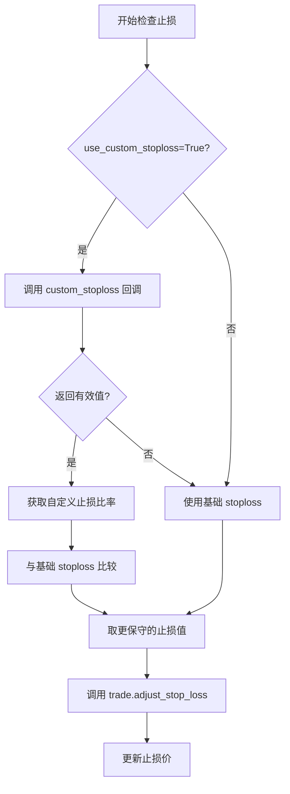

# 动态止损回调(custom_stoploss)

<cite>
**本文档中引用的文件**
- [interface.py](file://freqtrade/strategy/interface.py)
- [trade_model.py](file://freqtrade/persistence/trade_model.py)
- [CustomStoplossWithPSAR.py](file://user_data/strategies/CustomStoplossWithPSAR.py)
- [FixedRiskRewardLoss.py](file://user_data/strategies/FixedRiskRewardLoss.py)
- [SmoothScalp.py](file://user_data/strategies/SmoothScalp.py)
</cite>

## 目录
1. [简介](#简介)
2. [核心机制与工作流程](#核心机制与工作流程)
3. [高级用法与实现策略](#高级用法与实现策略)
4. [性能影响与最佳实践](#性能影响与最佳实践)
5. [回测验证方法](#回测验证方法)
6. [结论](#结论)

## 简介

`custom_stoploss` 是 Freqtrade 交易策略框架中的一个核心回调方法，它允许策略开发者实现高度动态和智能的止损逻辑。当策略中的 `use_custom_stoploss` 属性被设置为 `True` 时，该方法将被激活，取代静态的 `stoploss` 配置。`custom_stoploss` 方法能够根据交易对、当前时间、市场价格、当前利润以及其他技术指标，实时计算出最优的止损距离。其返回值是一个相对于当前价格的负比率（例如 -0.03 表示在当前价格下方 3% 的位置设置止损），并且最终的止损价永远不会低于基础 `stoploss` 所设定的硬性亏损限制，从而确保了风险控制的底线。

## 核心机制与工作流程

### 方法定义与调用时机

`custom_stoploss` 方法在 `IStrategy` 接口中被定义，其签名如下：

```python
def custom_stoploss(
    self,
    pair: str,
    trade: Trade,
    current_time: datetime,
    current_rate: float,
    current_profit: float,
    after_fill: bool,
    **kwargs,
) -> float | None:
```

该方法在每次检查是否触发止损时被调用，其核心参数包括：
- **pair**: 当前正在分析的交易对。
- **trade**: 代表当前持仓的 `Trade` 对象，包含开仓价、开仓时间等关键信息。
- **current_time**: 当前时间戳。
- **current_rate**: 基于定价设置计算出的当前价格。
- **current_profit**: 基于当前价格计算出的当前利润比率。

**Section sources**
- [interface.py](file://freqtrade/strategy/interface.py#L440-L469)

### 执行流程与硬性限制

`custom_stoploss` 的执行流程由框架的 `ft_stoploss_adjust` 方法管理。框架首先检查 `use_custom_stoploss` 是否为 `True`，如果是，则安全地调用用户定义的 `custom_stoploss` 方法。如果该方法返回一个有效的数值（非 `None`、非 `NaN`、非 `inf`），则此值将被用作新的止损比率。随后，框架会调用 `trade.adjust_stop_loss` 方法来更新止损价。

最关键的安全机制在于，`custom_stoploss` 的返回值仅作为建议值，最终的止损价会与基础的 `stoploss` 值进行比较，确保最终的止损不会低于基础 `stoploss` 所设定的硬性最大亏损比例。这保证了即使自定义逻辑出现错误，也不会导致灾难性的损失。



**Diagram sources**
- [interface.py](file://freqtrade/strategy/interface.py#L1546-L1574)
- [trade_model.py](file://freqtrade/persistence/trade_model.py#L835-L855)

## 高级用法与实现策略

### 基于ATR波动率的动态止损

平均真实波幅（ATR）是衡量市场波动性的经典指标。一个常见的高级用法是根据ATR的倍数来动态设置止损距离。在市场波动性高时，使用较宽的止损以避免被噪音触发；在市场波动性低时，使用较窄的止损以提高风险回报比。

在 `SmoothScalp` 策略中，`custom_stoploss` 方法实现了这一逻辑：
1.  获取当前K线的ATR值。
2.  计算 `ATR * multiplier / current_rate`，得到一个基于波动率的止损比率。
3.  将此比率与基础 `stoploss` 进行比较，取更保守（即绝对值更小）的值作为最终止损。

```mermaid
flowchart TD
A[获取当前ATR值] --> B[计算 ATR止损比率 = -(ATR * 2.0 / 当前价格)]
B --> C{ATR止损比率 > 基础止损?}
C --> |是| D[采用ATR止损比率]
C --> |否| E[采用基础止损]
D --> F[更新止损]
E --> F
```

**Section sources**
- [SmoothScalp.py](file://user_data/strategies/SmoothScalp.py#L305-L336)

### 基于支撑位/阻力位的智能止损

`CustomStoplossWithPSAR` 策略提供了一个基于抛物线转向指标（PSAR）的示例。PSAR 在上升趋势中位于价格下方，可以被视为动态的支撑位。该策略的 `custom_stoploss` 方法直接将止损价设置为最新的PSAR值，从而实现一个追踪止损，让利润奔跑。

```python
def custom_stoploss(self, pair: str, trade: 'Trade', current_time: datetime,
                    current_rate: float, current_profit: float, **kwargs) -> float:
    # ... 获取数据 ...
    relative_sl = last_candle['sar']  # 获取PSAR值
    new_stoploss = (current_rate - relative_sl) / current_rate
    result = new_stoploss - 1  # 转换为负比率
    return result
```

这种方法可以扩展到其他支撑/阻力位，如斐波那契回撤位、前低/前高点等。

**Section sources**
- [CustomStoplossWithPSAR.py](file://user_data/strategies/CustomStoplossWithPSAR.py#L62-L96)

### 基于机器学习预测的止损

虽然代码库中没有直接示例，但 `custom_stoploss` 为集成机器学习模型提供了可能性。例如，可以训练一个模型来预测未来价格的潜在回撤幅度。`custom_stoploss` 方法可以调用这个模型，根据模型的预测结果动态调整止损距离。如果模型预测市场即将出现大幅回调，则收紧止损；如果预测市场将平稳上涨，则放宽止损。

### 多阶段风险管理

`FixedRiskRewardLoss` 策略展示了如何实现复杂的多阶段止损管理，以强制执行固定的风险回报比：
1.  **初始止损**: 使用ATR计算一个动态的初始止损价，定义了这笔交易的“风险单位”。
2.  **保本止损**: 当利润达到预设的阈值（例如1倍风险单位）时，将止损价移动到开仓成本价，确保此交易不会亏损。
3.  **止盈止损**: 当利润达到预设的止盈目标（例如3.5倍风险单位）时，将止损价上移到止盈价格，从而锁定全部利润。

这种策略将止损从一个简单的风险控制工具，转变为一个主动的利润管理工具。

**Section sources**
- [FixedRiskRewardLoss.py](file://user_data/strategies/FixedRiskRewardLoss.py#L73-L127)

## 性能影响与最佳实践

### 性能影响

`custom_stoploss` 方法在每次检查止损时都会被调用，其执行频率非常高。因此，任何在此方法中进行的复杂计算都会对策略的整体性能产生显著影响。例如，进行网络请求、加载大型模型或执行耗时的数学运算都可能导致策略响应延迟，错失交易机会。

### 最佳实践

1.  **避免复杂计算**: 将所有耗时的指标计算（如ATR、PSAR）放在 `populate_indicators` 方法中完成。`custom_stoploss` 方法应仅从已计算好的 `dataframe` 中读取数据并进行简单的算术运算。
2.  **缓存数据**: 对于需要跨K线访问的数据，可以使用类级别的字典（如 `self.custom_info`）进行缓存，避免重复计算。
3.  **错误处理**: 确保方法在任何情况下都能返回一个有效的数值或 `None`，避免因异常导致策略崩溃。
4.  **回测验证**: 在实盘使用前，务必在历史数据上进行充分的回测，验证自定义止损逻辑的有效性和稳定性。

**Section sources**
- [CustomStoplossWithPSAR.py](file://user_data/strategies/CustomStoplossWithPSAR.py#L13-L137)
- [FixedRiskRewardLoss.py](file://user_data/strategies/FixedRiskRewardLoss.py#L1-L158)

## 回测验证方法

验证自定义止损有效性的最佳方法是通过回测。可以使用 Freqtrade 的 `backtesting` 模块，将策略在历史数据上运行。通过分析回测报告，可以评估：
- **胜率**: 使用自定义止损后，盈利交易的比例是否提高。
- **盈亏比**: 平均盈利与平均亏损的比率是否得到改善。
- **最大回撤**: 策略的最大资金回撤是否被有效控制。
- **夏普比率**: 策略的风险调整后收益是否提升。

通过对比启用和禁用 `use_custom_stoploss` 的回测结果，可以量化自定义止损策略的实际效果。

## 结论

`custom_stoploss` 回调方法为 Freqtrade 策略提供了强大的动态风险管理能力。通过结合ATR波动率、支撑/阻力位或机器学习预测，可以实现远超静态止损的智能风险控制。然而，开发者必须注意其性能影响，遵循最佳实践，确保逻辑简洁高效，并通过严谨的回测来验证其有效性，才能充分发挥其潜力。