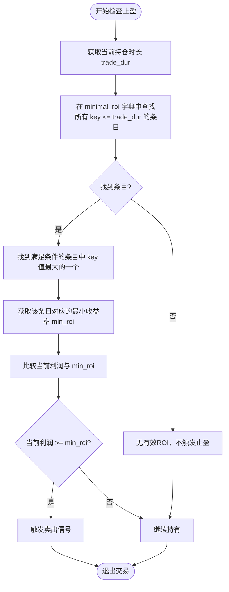

# 动态止盈(minimal_roi)

<cite>
**Referenced Files in This Document**   
- [SampleStrategy.py](file://user_data/strategies/SampleStrategy.py)
- [interface.py](file://freqtrade/strategy/interface.py)
</cite>

## Table of Contents
1. [动态止盈机制概述](#动态止盈机制概述)
2. [minimal_roi字典结构与时间递减策略](#minimal_roi字典结构与时间递减策略)
3. [动态参数组合实现](#动态参数组合实现)
4. [与use_custom_roi的共存逻辑](#与use_custom_roi的共存逻辑)
5. [高频与低波动市场配置技巧](#高频与低波动市场配置技巧)

## 动态止盈机制概述

动态止盈机制是Freqtrade量化交易框架中的核心退出策略之一，通过`minimal_roi`参数实现。该机制允许策略根据持仓时间动态调整预期收益率，从而在捕捉短期高收益的同时，为长期持仓设置更现实的回报预期。此机制与`use_custom_roi`等高级功能协同工作，构成了一个灵活且强大的退出信号系统。

**Section sources**
- [interface.py](file://freqtrade/strategy/interface.py#L70-L71)

## minimal_roi字典结构与时间递减策略

`minimal_roi`参数采用字典数据结构，其键（key）为持仓分钟数，值（value）为目标收益率。该字典定义了一个随时间递减的收益目标曲线，实现了时间递减止盈策略。

具体工作原理如下：当一笔交易发生后，系统会根据当前的持仓时长（`trade_dur`），在`minimal_roi`字典中查找所有键值小于或等于当前持仓时长的条目。然后，系统会选择其中键值最大的条目所对应的收益率作为当前的最小收益目标。随着持仓时间的增加，系统会自动切换到收益率更低的条目，从而实现了收益目标随时间递减的效果。

例如，在`SampleStrategy`中，配置`{"60": 0.05, "30": 0.1, "0": 0.2}`意味着：持仓0分钟时，目标收益率为20%；持仓30分钟时，目标降至10%；持仓60分钟及以上时，目标进一步降至5%。这种设计激励策略在短期内实现高收益，同时为长期持仓保留盈利空间。

**Diagram sources**
- [interface.py](file://freqtrade/strategy/interface.py#L1649-L1691)

**Section sources**
- [interface.py](file://freqtrade/strategy/interface.py#L1649-L1691)

## 动态参数组合实现

`SampleStrategy`通过Python的`@property`装饰器，将超参数`roi_p1`, `roi_p2`, `roi_p3`动态组合成`minimal_roi`字典，展示了高度灵活的配置方法。

`roi_p1`, `roi_p2`, `roi_p3`是使用`RealParameter`定义的可优化超参数，它们分别代表不同时间区间的收益率目标。通过`@property`装饰器，`minimal_roi`被定义为一个属性方法，每次被访问时都会动态地创建一个新的字典，其值来源于当前优化后的`roi_p1.value`, `roi_p2.value`, `roi_p3.value`。这种方式使得`minimal_roi`的内容可以在超参数优化（Hyperopt）过程中被自动调整，无需硬编码具体的数值。

这种设计模式极大地增强了策略的适应性和可优化性。用户可以定义参数的搜索范围（如`roi_p3`在0.15到0.25之间），让超参数优化工具自动寻找最优的收益率组合，从而实现策略的自动化调优。

**Section sources**
- [SampleStrategy.py](file://user_data/strategies/SampleStrategy.py#L70-L85)

## 与use_custom_roi的共存逻辑

`minimal_roi`可以与`use_custom_roi`标志共存，形成一个更复杂的退出逻辑。当`use_custom_roi`被设置为`True`时，策略会优先调用`custom_roi()`方法来获取一个动态计算的收益率目标。

最终的退出触发逻辑是取`minimal_roi`和`custom_roi`返回值中的较低者。这意味着，只要当前利润达到了`minimal_roi`或`custom_roi`中任何一个设定的目标，就会触发卖出信号。这种“或”逻辑确保了策略能够以最有利的条件退出。

具体触发逻辑如下：系统会同时计算基于`minimal_roi`的`min_roi`和基于`custom_roi`的`custom_roi`。如果`custom_roi`不为空且小于`min_roi`，则采用`custom_roi`的值；否则，采用`min_roi`的值。这使得`custom_roi`可以作为一种更激进的、基于市场条件的止盈策略，而`minimal_roi`则作为基础的、基于时间的保障性止盈策略。

**Section sources**
- [interface.py](file://freqtrade/strategy/interface.py#L1649-L1691)

## 高频与低波动市场配置技巧

在高频交易和低波动市场中，`minimal_roi`的配置需要更加精细。

对于**高频交易**，应设置更短的时间间隔和更低的收益率目标。例如，可以配置`{"0": 0.005, "5": 0.002, "15": 0}`，即在0分钟时目标0.5%，5分钟后降至0.2%，15分钟后目标为0。这符合高频交易快进快出、积小胜为大胜的特点。

对于**低波动市场**，由于价格波动幅度小，应相应调低收益率目标，并可能延长持仓时间。例如，可以配置`{"0": 0.02, "120": 0.01, "360": 0}`，即允许更长的持仓时间来换取较低的收益。同时，可以结合`trailing_stop`（追踪止损）来保护已实现的利润，防止市场反转。

核心原则是，`minimal_roi`的配置必须与市场特性、交易频率和策略风险偏好相匹配，通过超参数优化来寻找最优参数组合是最佳实践。

**Section sources**
- [SampleStrategy.py](file://user_data/strategies/SampleStrategy.py#L70-L85)
- [interface.py](file://freqtrade/strategy/interface.py#L1649-L1691)