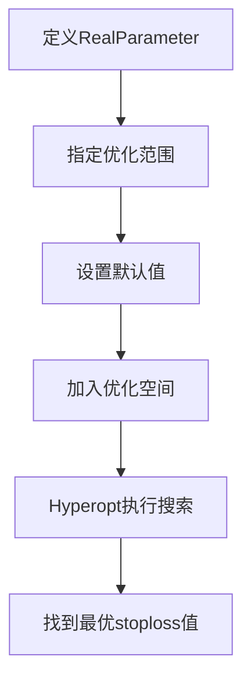
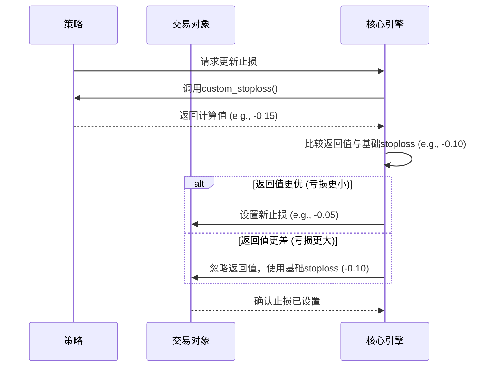

# 硬性止损(stoploss)

<cite>
**Referenced Files in This Document**   
- [interface.py](file://freqtrade/strategy/interface.py)
- [trade_model.py](file://freqtrade/persistence/trade_model.py)
- [parameters.py](file://freqtrade/strategy/parameters.py)
- [SampleStrategy.py](file://user_data/strategies/SampleStrategy.py)
- [CustomStoplossWithPSAR.py](file://user_data/strategies/CustomStoplossWithPSAR.py)
</cite>

## 目录
1. [引言](#引言)
2. [硬性止损(stoploss)参数详解](#硬性止损stoploss参数详解)
3. [超参数优化与RealParameter](#超参数优化与realparameter)
4. [自定义止损(custom_stoploss)与优先级](#自定义止损custom_stoploss与优先级)
5. [设置合理止损的策略](#设置合理止损的策略)
6. [回测中评估止损有效性](#回测中评估止损有效性)
7. [结论](#结论)

## 引言

在量化交易中，风险管理是决定长期成功与否的核心。硬性止损（`stoploss`）作为一项关键的风险控制机制，其作用是为单笔交易设定一个最大亏损阈值。一旦市场价格触及这个预设的价位，交易将被强制平仓，从而防止亏损无限扩大。本文档将深入探讨Freqtrade框架中`stoploss`参数的实现原理、配置方法、与自定义止损的交互关系，并结合具体示例说明如何在不同市场条件下设置和优化止损策略。

**Section sources**
- [interface.py](file://freqtrade/strategy/interface.py#L74)

## 硬性止损(stoploss)参数详解

`stoploss`参数是策略类（`IStrategy`）中的一个核心属性，它定义了该策略所能承受的最大亏损比例。其核心特性如下：

1.  **负数比率表示法**：`stoploss`的值必须是一个负数，表示相对于开仓价格的亏损百分比。例如，`stoploss = -0.10` 表示当亏损达到10%时，将触发止损。这个值是绝对的、强制性的，任何交易逻辑都不能让亏损超过这个底线。

2.  **作为硬性底线**：`stoploss`扮演着“最后防线”的角色。无论策略的其他部分如何计算，最终的止损价格都不能低于（对于多头）或高于（对于空头）由`stoploss`计算出的价格。这确保了即使在极端市场波动或代码逻辑错误的情况下，单笔交易的损失也被严格限制。

3.  **在代码中的实现**：在`freqtrade/strategy/interface.py`文件中，`stoploss`被定义为一个浮点数（`float`）类型的类变量。当策略被加载后，这个值会被传递给交易对象（`Trade`），并在`trade_model.py`中通过`adjust_stop_loss`方法来计算和更新实际的止损价位。

**Section sources**
- [interface.py](file://freqtrade/strategy/interface.py#L74)
- [trade_model.py](file://freqtrade/persistence/trade_model.py#L835-L855)

## 超参数优化与RealParameter

为了找到最优的`stoploss`值，Freqtrade支持通过超参数优化（Hyperopt）来自动搜索最佳参数。这通过使用`RealParameter`类来实现。



**Diagram sources**
- [parameters.py](file://freqtrade/strategy/parameters.py#L186-L222)
- [SampleStrategy.py](file://user_data/strategies/SampleStrategy.py#L58)

**Section sources**
- [parameters.py](file://freqtrade/strategy/parameters.py#L186-L222)
- [SampleStrategy.py](file://user_data/strategies/SampleStrategy.py#L58)

`RealParameter`允许将`stoploss`从一个固定的数值转变为一个可优化的范围。以`SampleStrategy.py`中的代码为例：
```python
stoploss = RealParameter(-0.15, -0.05, default=-0.10, space='protection', optimize=True)
```
- `(-0.15, -0.05)`：定义了优化的搜索空间，即`stoploss`的值将在-15%到-5%之间进行搜索。
- `default=-0.10`：指定了默认值为-10%，当不进行优化时使用此值。
- `space='protection'`：将此参数归类到“保护”空间，便于在配置文件中统一管理。
- `optimize=True`：启用此参数的优化。

通过这种方式，用户可以让算法自动测试数百种不同的止损设置，从而找到在历史数据上表现最佳的组合。

## 自定义止损(custom_stoploss)与优先级

Freqtrade提供了更高级的`custom_stoploss`功能，允许用户编写自定义的Python函数来动态计算止损价位。这可以实现追踪止损、基于波动率的止损等复杂逻辑。

然而，`custom_stoploss`并非无限制的。它与基础的`stoploss`参数之间存在严格的优先级关系：

1.  **`custom_stoploss`可以收紧，但不能放宽**：自定义止损函数可以计算出一个比基础`stoploss`更优（即亏损更小）的止损位。例如，如果基础`stoploss`是-10%，而`custom_stoploss`计算出当前应止损在-5%的位置，那么系统会采用-5%。
2.  **`stoploss`是硬性上限**：如果`custom_stoploss`函数由于某种原因计算出一个比基础`stoploss`更差（即亏损更大）的止损位，例如计算出-15%，那么这个值将被**忽略**。系统会强制使用基础`stoploss`的-10%作为最终的止损位。

这种设计确保了`stoploss`作为“最大亏损阈值”的强制性作用不会被自定义逻辑所破坏。



**Diagram sources**
- [interface.py](file://freqtrade/strategy/interface.py#L440-L469)
- [interface.py](file://freqtrade/strategy/interface.py#L1546-L1574)
- [CustomStoplossWithPSAR.py](file://user_data/strategies/CustomStoplossWithPSAR.py#L62-L96)

**Section sources**
- [interface.py](file://freqtrade/strategy/interface.py#L440-L469)
- [interface.py](file://freqtrade/strategy/interface.py#L1546-L1574)
- [CustomStoplossWithPSAR.py](file://user_data/strategies/CustomStoplossWithPSAR.py#L62-L96)

## 设置合理止损的策略

设置一个合理的`stoploss`值需要综合考虑多种因素：

1.  **市场波动性**：在高波动性的市场（如加密货币）中，需要设置更宽松的止损（例如-10%到-15%），以避免被正常的市场噪音触发。在低波动性的市场（如蓝筹股），可以设置更紧密的止损（例如-3%到-5%）。
2.  **交易时间框架**：在较短的时间框架（如5分钟图）上交易，价格波动更频繁，因此止损应相对宽松。在较长的时间框架（如日线图）上，可以设置更精确的止损。
3.  **技术分析支撑/阻力位**：将止损设置在关键的技术位（如前低点、趋势线、整数关口）之外，可以增加止损的有效性，避免被短期假突破扫掉。
4.  **风险回报比**：一个好的交易策略应追求正的风险回报比（例如1:2或1:3）。这意味着止损的幅度应小于预期盈利的幅度。例如，如果计划盈利20%，那么止损不应超过10%。

## 回测中评估止损有效性

在回测过程中，评估`stoploss`的有效性至关重要。可以通过以下方法进行：

1.  **分析最大回撤（Max Drawdown）**：观察策略在回测期间的最大单笔亏损和整体账户回撤。一个有效的止损应能显著降低最大回撤。
2.  **检查胜率与盈亏比**：一个过紧的止损可能会导致胜率很高但盈亏比很低（赚小钱亏大钱），而一个过松的止损则可能导致胜率很低。理想的止损设置应在两者之间取得平衡。
3.  **观察止损触发频率**：在回测报告中，查看有多少笔交易是因止损而平仓的。如果比例过高，可能意味着止损设置过紧或入场时机不佳。
4.  **对比不同止损设置**：运行多组回测，分别使用不同的`stoploss`值（或不同的`custom_stoploss`逻辑），比较它们的总收益、夏普比率等关键指标，从而选出最优方案。

## 结论

`stoploss`参数是Freqtrade策略中不可或缺的风险管理工具。它以负数比率的形式强制性地设定了单笔交易的最大亏损上限。通过`RealParameter`，用户可以将其纳入超参数优化流程，自动化地寻找最佳值。虽然`custom_stoploss`提供了极大的灵活性来实现动态止损，但其计算结果永远不能突破基础`stoploss`设定的硬性底线。最终，一个成功的交易策略需要结合市场分析、技术判断和严谨的回测，来设置一个既能保护资本又能给交易留出合理波动空间的止损策略。