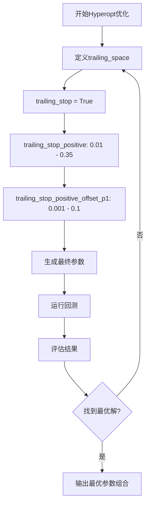
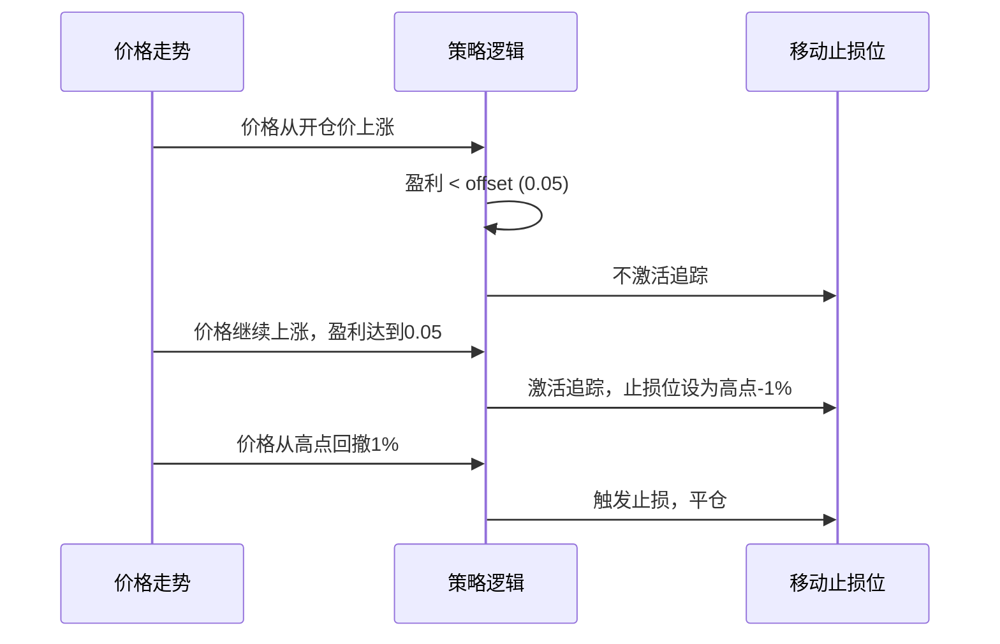

# 移动止损(trailing_stop)

<cite>
**Referenced Files in This Document**   
- [SampleStrategy.py](file://user_data/strategies/SampleStrategy.py)
- [parameters.py](file://freqtrade/strategy/parameters.py)
- [hyperopt_interface.py](file://freqtrade/optimize/hyperopt/hyperopt_interface.py)
- [interface.py](file://freqtrade/strategy/interface.py)
</cite>

## 目录
1. [引言](#引言)
2. [移动止损核心参数详解](#移动止损核心参数详解)
3. [在SampleStrategy中的实现](#在samplestrategy中的实现)
4. [通过Hyperopt进行参数优化](#通过hyperopt进行参数优化)
5. [trailing_only_offset_is_reached参数的深度分析](#trailing_only_offset_is_reached参数的深度分析)
6. [风险收益平衡与策略建议](#风险收益平衡与策略建议)

## 引言

移动止损（Trailing Stop）是量化交易中一种重要的风险管理工具，它允许交易者在资产价格上涨时动态地调整止损位，从而在保护已实现利润的同时，给予趋势足够的运行空间。与固定止损不同，移动止损会随着价格的有利变动而“移动”，旨在锁定收益，防止利润大幅回吐。本文档将深入解析Freqtrade框架中移动止损机制的参数配置，重点阐述`trailing_stop`、`trailing_stop_positive`、`trailing_stop_positive_offset`以及`trailing_only_offset_is_reached`等关键参数的作用，并结合`SampleStrategy`中的实际应用，说明如何通过Hyperopt寻找最优参数组合，以实现风险与收益的最佳平衡。

**Section sources**
- [SampleStrategy.py](file://user_data/strategies/SampleStrategy.py#L1-L280)

## 移动止损核心参数详解

移动止损机制由一组相互关联的参数共同控制，这些参数定义了止损触发的条件和行为。

### 启用开关：trailing_stop

`trailing_stop`是一个布尔型参数（BooleanParameter），它是整个移动止损功能的总开关。当其值为`True`时，移动止损功能被激活；当其值为`False`时，该功能被完全禁用，系统将回退到使用固定的止损策略。在策略开发中，此参数通常被设置为可优化的（`optimize=True`），以便Hyperopt可以探索启用或禁用移动止损对整体策略表现的影响。

### 盈利回撤阈值：trailing_stop_positive

`trailing_stop_positive`（正向移动止损）定义了从最高盈利点开始计算的回撤百分比阈值。例如，如果该参数设置为`0.01`，则意味着当价格从其最高点回撤1%时，将触发止损并平仓。这是一个浮点型参数（RealParameter），其值通常在0.005（0.5%）到0.05（5%）之间进行优化。较小的值意味着更严格的保护，能更快地锁定利润，但也可能因市场正常波动而过早地被触发；较大的值则允许更大的回撤，能更好地让利润奔跑，但同时也增加了利润回吐的风险。

### 初始触发偏移量：trailing_stop_positive_offset

`trailing_stop_positive_offset`（正向移动止损偏移量）设定了一个初始的盈利目标。它规定了只有当交易的盈利达到这个预设的偏移量后，移动止损的追踪机制才会被激活。例如，如果该参数设置为`0.05`，则意味着必须先实现5%的账面盈利，系统才会开始监控价格从高点的回撤情况。这个参数同样是一个浮点型参数（RealParameter），其值通常略大于`trailing_stop_positive`，以确保在追踪开始前有足够的安全边际。

**Section sources**
- [SampleStrategy.py](file://user_data/strategies/SampleStrategy.py#L70-L73)
- [interface.py](file://freqtrade/strategy/interface.py#L80-L83)

## 在SampleStrategy中的实现

`SampleStrategy`是Freqtrade提供的一个官方示例策略，它完整地展示了如何配置和使用移动止损参数。

在该策略中，移动止损相关的参数被定义为类属性，如下所示：
```python
# 追踪止损
trailing_stop = BooleanParameter(default=True, space='protection', optimize=True)
trailing_stop_positive = RealParameter(0.005, 0.02, default=0.01, space='protection', optimize=True)
trailing_stop_positive_offset = RealParameter(0.03, 0.08, default=0.05, space='protection', optimize=True)
```
这些参数被放置在`'protection'`优化空间中，表明它们属于风险保护类参数。`SampleStrategy`通过这些参数，构建了一个典型的“让利润奔跑，截断亏损”的交易逻辑。当价格快速上涨时，`trailing_stop_positive_offset`确保了在达到一定盈利前不会过早地启动追踪，而一旦达到，`trailing_stop_positive`则开始保护已实现的利润。

**Section sources**
- [SampleStrategy.py](file://user_data/strategies/SampleStrategy.py#L70-L73)

## 通过Hyperopt进行参数优化

Freqtrade的Hyperopt模块允许用户自动搜索最优的策略参数组合。移动止损参数是Hyperopt优化的重要目标之一。

### 参数空间定义

在`freqtrade/optimize/hyperopt/hyperopt_interface.py`文件中，`trailing_space()`方法定义了移动止损参数的优化空间。该方法返回一个包含多个维度的列表，其中：
- `trailing_stop`被强制设置为`[True]`，因为一旦进入此优化空间，就意味着要启用移动止损。
- `trailing_stop_positive`和`trailing_stop_positive_offset_p1`（偏移量差值）被定义为连续的浮点数空间，Hyperopt将在这些范围内搜索最佳值。



**Diagram sources**
- [hyperopt_interface.py](file://freqtrade/optimize/hyperopt/hyperopt_interface.py#L200-L230)

### 优化过程

Hyperopt会遍历`trailing_space`中定义的所有参数组合，为每一组参数运行一次回测，并根据指定的优化目标（如总利润、夏普比率等）来评估其表现。最终，它会输出一组在历史数据上表现最优的参数值。通过这种方式，用户可以科学地确定`trailing_stop_positive`和`trailing_stop_positive_offset`的最佳值，而不是依赖于主观猜测。

**Section sources**
- [hyperopt_interface.py](file://freqtrade/optimize/hyperopt/hyperopt_interface.py#L200-L230)

## trailing_only_offset_is_reached参数的深度分析

`trailing_only_offset_is_reached`是一个布尔型参数，它对移动止损的行为有着至关重要的影响，直接决定了风险收益的平衡点。

### 参数作用

该参数控制着移动止损的激活时机。当其值为`True`时，系统会严格检查交易的当前盈利是否已经达到了`trailing_stop_positive_offset`所设定的初始偏移量。只有在盈利目标达成后，`trailing_stop_positive`的回撤追踪才会被激活。如果盈利未达标，即使价格从高点回撤了超过`trailing_stop_positive`的百分比，系统也不会触发止损。

### 行为影响

- **设置为`True`（推荐）**：这种模式更加稳健。它确保了移动止损只在交易已经实现了一定盈利后才开始工作，避免了在交易初期因价格小幅波动而被“震出”市场。这有助于策略更好地捕捉趋势行情，让利润有更大的增长空间，是“让利润奔跑”理念的体现。
- **设置为`False`**：这种模式更为激进。移动止损会立即开始追踪价格的高点，无论当前盈利是否达到了`trailing_stop_positive_offset`。这可能导致在交易尚未盈利或盈利很少时，就因为价格回撤而被止损出局，从而错失后续的上涨行情。

在`SampleStrategy`中，此参数被设置为`True`，这表明该策略倾向于在确保一定盈利后才启动保护机制，以追求更高的收益潜力。



**Diagram sources**
- [interface.py](file://freqtrade/strategy/interface.py#L1514-L1586)
- [SampleStrategy.py](file://user_data/strategies/SampleStrategy.py#L73)

**Section sources**
- [interface.py](file://freqtrade/strategy/interface.py#L1514-L1586)
- [SampleStrategy.py](file://user_data/strategies/SampleStrategy.py#L73)

## 风险收益平衡与策略建议

移动止损参数的配置本质上是在风险控制和收益最大化之间寻找平衡。

- **激进策略**：可以设置较小的`trailing_stop_positive_offset`（如0.03）和较大的`trailing_stop_positive`（如0.03），并配合`trailing_only_offset_is_reached=False`。这种组合能更快地锁定利润，但可能牺牲了部分上涨空间。
- **稳健策略**：推荐使用较大的`trailing_stop_positive_offset`（如0.05-0.08）和较小的`trailing_stop_positive`（如0.01-0.02），并始终将`trailing_only_offset_is_reached`设置为`True`。这种组合能有效保护利润，同时给予趋势足够的运行空间，适合捕捉中长线行情。

最终，最优的参数组合应通过Hyperopt在历史数据上进行充分验证，并结合具体的交易品种和市场环境来确定。`SampleStrategy`提供了一个优秀的起点，开发者应在此基础上进行调整和优化。

**Section sources**
- [SampleStrategy.py](file://user_data/strategies/SampleStrategy.py#L70-L73)
- [hyperopt_interface.py](file://freqtrade/optimize/hyperopt/hyperopt_interface.py#L200-L230)