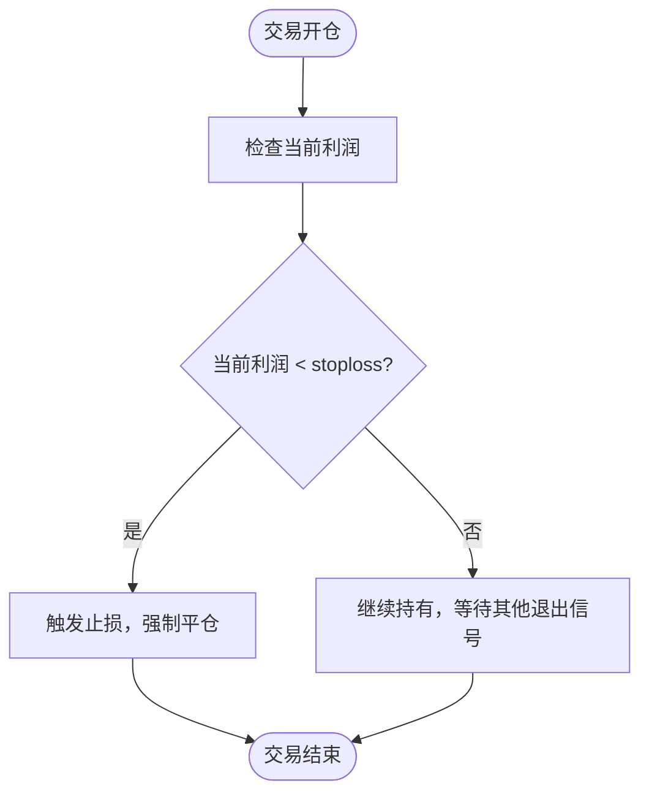
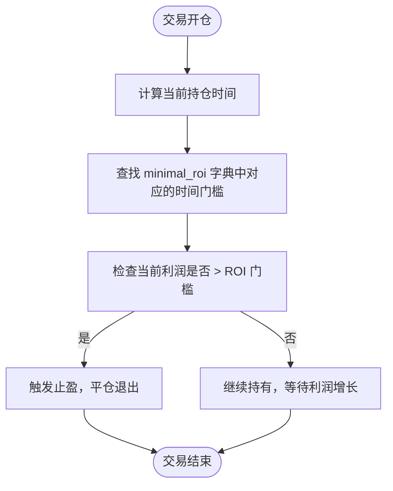
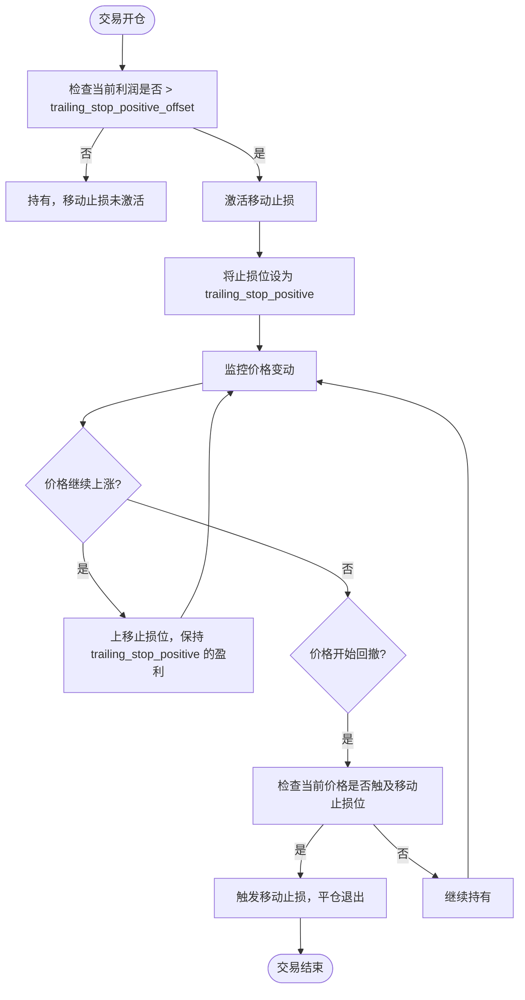

# 风险管理参数

<cite>
**本文档中引用的文件**   
- [interface.py](file://freqtrade/strategy/interface.py)
- [hyperopt_interface.py](file://freqtrade/optimize/hyperopt/hyperopt_interface.py)
- [hlhb.py](file://user_data/strategies/hlhb.py)
- [GodStra.py](file://user_data/strategies/GodStra.py)
- [Diamond.py](file://user_data/strategies/Diamond.py)
</cite>

## 目录
1. [引言](#引言)
2. [核心风险管理参数](#核心风险管理参数)
3. [stoploss 硬性止损](#stoploss-硬性止损)
4. [minimal_roi 动态止盈](#minimal_roi-动态止盈)
5. [移动止损 (Trailing Stop)](#移动止损-trailing-stop)
6. [Hyperopt 参数优化](#hyperopt-参数优化)
7. [自定义动态止损 (custom_stoploss)](#自定义动态止损-custom_stoploss)
8. [结论](#结论)

## 引言

在量化交易策略中，风险管理是决定长期盈利能力的核心要素。一个优秀的策略不仅需要精准的入场信号，更需要一套严谨的风险控制机制来保护资本。Freqtrade 框架提供了多种强大的风险管理参数，允许交易者根据市场状况和策略特性进行精细化配置。本文将深入解析 `stoploss`、`minimal_roi`、`trailing_stop` 及其关联参数 `trailing_stop_positive` 和 `trailing_stop_positive_offset` 的作用机制、配置逻辑和高级用法。我们将结合实际策略示例，探讨如何利用 Hyperopt 进行参数优化，并介绍通过 `custom_stoploss` 回调方法实现更复杂的动态止损策略。

**Section sources**
- [interface.py](file://freqtrade/strategy/interface.py#L66-L84)

## 核心风险管理参数

Freqtrade 策略中的风险管理主要通过一组核心参数来实现，这些参数共同构成了一个完整的风险控制框架。`stoploss` 作为最基础的硬性止损，为每笔交易设定了最大可承受的亏损阈值。`minimal_roi` 则是一个动态的止盈目标，它允许交易者根据持仓时间的长短来设定不同的盈利目标，从而实现“让利润奔跑”的策略思想。当市场出现强劲趋势时，`trailing_stop`（移动止损）机制可以被激活，它会随着价格的有利变动而动态调整止损位，以锁定已实现的利润。`trailing_stop_positive` 和 `trailing_stop_positive_offset` 是移动止损的两个关键关联参数，它们共同决定了移动止损的触发条件和调整幅度。这些参数协同工作，使策略能够在控制下行风险的同时，最大化地捕捉上行收益。

**Section sources**
- [interface.py](file://freqtrade/strategy/interface.py#L66-L84)

## stoploss 硬性止损

`stoploss` 参数是风险管理中最直接、最基础的组成部分，它定义了一个硬性的、固定的止损阈值。该参数以一个负的浮点数表示，代表了从开仓价格计算的最大亏损百分比。例如，`stoploss = -0.10` 表示当交易的亏损达到10%时，系统将强制平仓以限制损失。这个值是绝对的，一旦设定，除非通过其他机制（如移动止损）进行调整，否则不会改变。`stoploss` 的主要作用是防止单笔交易因市场剧烈波动或策略失效而造成灾难性的亏损。在代码实现中，`stoploss` 是 `IStrategy` 类的一个必需属性，其值在策略初始化时被设定，并在整个交易过程中作为计算初始止损价格的基准。在用户策略中，该参数通常被定义为一个 `RealParameter`，以便在使用 Hyperopt 进行优化时，可以在一个指定的范围内搜索最优值。



**Diagram sources **
- [interface.py](file://freqtrade/strategy/interface.py#L74)
- [hlhb.py](file://user_data/strategies/hlhb.py#L56)

## minimal_roi 动态止盈

`minimal_roi` 参数用于配置一个动态的止盈目标，它是一个字典（dict）类型的数据结构，其键（key）代表持仓时间（以分钟为单位），值（value）代表在该时间点或之后需要达到的最小收益率（以小数表示）。这种配置方式允许策略根据时间推移来调整盈利预期。例如，一个典型的 `minimal_roi` 配置可能如下：
```python
minimal_roi = {
    "0": 0.10,   # 开仓后立即生效，目标盈利10%
    "30": 0.07,  # 持仓30分钟后，目标盈利降至7%
    "60": 0.05,  # 持仓60分钟后，目标盈利降至5%
    "120": 0    # 持仓120分钟后，不再有盈利要求，等待其他信号
}
```
该机制的工作逻辑是：系统会查找所有小于或等于当前持仓时间的键，并选择其中最大的一个作为当前的 ROI 门槛。这意味着，随着持仓时间的增加，策略的盈利目标会逐步降低，从而鼓励在市场趋势不明朗时及时获利了结。`minimal_roi` 提供了一种灵活的止盈方式，避免了固定止盈点可能错失更大利润或过早平仓的缺点。



**Diagram sources **
- [interface.py](file://freqtrade/strategy/interface.py#L70)
- [GodStra.py](file://user_data/strategies/GodStra.py#L86-L91)

## 移动止损 (Trailing Stop)

移动止损（Trailing Stop）是一种更为智能的止损机制，旨在保护已实现的利润。当 `trailing_stop` 参数被设置为 `True` 时，该功能被启用。其核心逻辑是：一旦交易的利润超过了 `trailing_stop_positive_offset` 所设定的偏移量，移动止损机制就会被激活。此时，止损价格将不再固定，而是会随着价格的有利变动而“移动”或“追踪”。具体来说，新的止损价格将被设定为 `trailing_stop_positive` 所定义的值。例如，如果 `trailing_stop_positive_offset = 0.05` 且 `trailing_stop_positive = 0.03`，这意味着当利润达到5%时，移动止损被激活，并将止损位上移至3%的盈利位置。此后，如果价格继续上涨，止损位会继续跟随，但永远不会低于3%的盈利水平。`trailing_only_offset_is_reached` 参数则是一个布尔值，用于控制在偏移量未被触及前，是否允许移动止损调整。如果设置为 `True`，则在利润未达到偏移量之前，即使价格回撤，止损位也不会下移。



**Diagram sources **
- [interface.py](file://freqtrade/strategy/interface.py#L80-L82)
- [Diamond.py](file://user_data/strategies/Diamond.py#L103-L105)

## Hyperopt 参数优化

Hyperopt 是 Freqtrade 中用于自动化参数优化的强大工具。对于风险管理参数，可以通过在策略中将 `stoploss`、`trailing_stop_positive` 等定义为 `HyperoptParameter`（如 `RealParameter` 或 `BooleanParameter`），并将其 `optimize=True`，来指示 Hyperopt 将这些参数纳入优化范围。例如，在 `hlhb.py` 策略中，`stoploss` 被定义为 `RealParameter(-0.35, -0.25, default=-0.3211, space='protection', optimize=True)`，这表示 Hyperopt 将在 -0.35 到 -0.25 的范围内搜索最优的止损值。`space='protection'` 参数将这些风险管理参数归类到“protection”空间，可以在运行 Hyperopt 时通过 `--spaces` 参数指定只优化该空间的参数。在 `hyperopt_interface.py` 文件中，`stoploss_space()` 和 `trailing_space()` 方法分别定义了 `stoploss` 和移动止损参数的搜索空间。值得注意的是，`trailing_stop` 参数在 `trailing_space()` 中被硬编码为 `Categorical([True])`，这意味着当使用 `trailing` 空间时，`trailing_stop` 总是被设置为 `True`，以确保其他移动止损参数的优化有意义。

**Section sources**
- [hlhb.py](file://user_data/strategies/hlhb.py#L56-L61)
- [hyperopt_interface.py](file://freqtrade/optimize/hyperopt/hyperopt_interface.py#L116-L198)

## 自定义动态止损 (custom_stoploss)

对于需要更复杂、更动态止损逻辑的高级用户，Freqtrade 提供了 `custom_stoploss` 回调方法。通过在策略中将 `use_custom_stoploss = True` 并实现 `custom_stoploss()` 方法，用户可以完全接管止损逻辑的计算。该方法在每次检查止损条件时被调用，接收当前交易对、交易对象、当前时间、当前价格和当前利润等信息，并返回一个新的止损距离（相对于当前价格的比率）。这使得用户可以实现基于技术指标（如ATR、布林带）、市场波动率、时间衰减或任何其他自定义逻辑的止损策略。例如，可以实现一个止损位随市场波动率增大而放宽的策略，或者一个在特定时间后自动收紧止损的策略。`custom_stoploss` 方法的返回值会与 `stoploss` 属性进行比较，最终的止损位将取两者中更保守（即亏损更小）的值，从而确保了硬性止损的保护作用不会被完全绕过。

**Section sources**
- [interface.py](file://freqtrade/strategy/interface.py#L84)
- [interface.py](file://freqtrade/strategy/interface.py#L440-L469)

## 结论

综上所述，`stoploss`、`minimal_roi` 和 `trailing_stop` 及其关联参数构成了 Freqtrade 策略中一个层次分明、功能强大的风险管理体系。`stoploss` 提供了基础的下行风险保护，`minimal_roi` 实现了灵活的动态止盈，而 `trailing_stop` 则能在趋势行情中有效锁定利润。通过 Hyperopt，交易者可以科学地优化这些参数，找到最适合特定策略和市场的配置。对于有更高需求的用户，`custom_stoploss` 回调方法提供了无限的定制可能性，允许实现远超于固定参数的复杂止损逻辑。深入理解并合理运用这些参数，是构建稳健、可持续盈利的量化交易策略的关键。