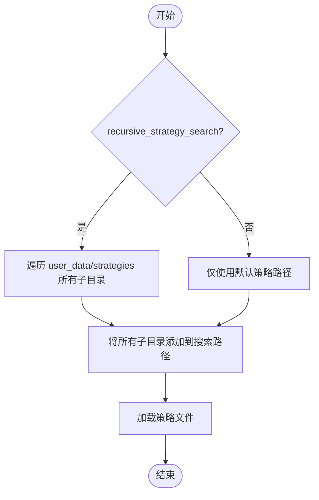

# 策略路径管理

<cite>
**本文档中引用的文件**  
- [configuration.py](file://freqtrade/configuration/configuration.py)
- [strategy_resolver.py](file://freqtrade/resolvers/strategy_resolver.py)
- [config.json](file://user_data/config.json)
- [config_full.example.json](file://config_examples/config_full.example.json)
- [constants.py](file://freqtrade/constants.py)
</cite>

## 目录
1. [简介](#简介)
2. [策略路径配置详解](#策略路径配置详解)
3. [递归搜索机制](#递归搜索机制)
4. [路径配置示例](#路径配置示例)
5. [路径权限与安全实践](#路径权限与安全实践)
6. [结论](#结论)

## 简介
本指南详细说明了 `strategy_path` 配置项的作用和使用方法，包括如何设置自定义策略文件的查找路径，支持的路径格式（相对路径、绝对路径）以及多路径配置方案。同时解释了 `recursive_strategy_search` 参数如何影响策略文件的搜索行为，包括递归遍历子目录的条件和性能影响。结合实际配置示例，演示不同场景下的路径管理策略，并提供路径权限管理和安全检查的最佳实践。

**Section sources**
- [configuration.py](file://freqtrade/configuration/configuration.py#L160-L163)

## 策略路径配置详解
`strategy_path` 配置项用于指定自定义策略文件的查找路径。该配置项允许用户将策略文件存储在非默认位置，并在运行时动态加载。支持相对路径和绝对路径两种格式：

- **相对路径**：相对于项目根目录或用户数据目录的路径，例如 `user_data/strategies/`。
- **绝对路径**：完整的文件系统路径，例如 `C:\freqtrade\custom_strategies\`。

多路径配置可以通过在配置文件中指定多个路径来实现，系统会按顺序搜索这些路径以查找指定的策略文件。路径之间使用逗号分隔。

当配置 `strategy_path` 时，系统会在启动时根据配置值构建搜索路径列表，并优先从指定路径中加载策略文件。如果未指定 `strategy_path`，则默认使用用户数据目录下的 `strategies` 子目录。

**Section sources**
- [configuration.py](file://freqtrade/configuration/configuration.py#L160-L163)
- [constants.py](file://freqtrade/constants.py#L220)

## 递归搜索机制
`recursive_strategy_search` 参数控制是否递归搜索策略文件。当此参数设置为 `true` 时，系统将递归遍历 `strategy_path` 指定目录及其所有子目录，以查找匹配的策略文件。

递归搜索的行为如下：
- 如果 `recursive_strategy_search` 为 `true`，系统会使用 `os.walk` 函数遍历 `user_data_dir/strategies` 目录下的所有子目录。
- 所有找到的子目录都会被添加到搜索路径中，确保能够发现嵌套在深层目录中的策略文件。
- 递归搜索会增加文件系统扫描的时间和资源消耗，特别是在包含大量文件和深层目录结构的情况下。

性能影响主要体现在：
- **启动时间**：递归搜索需要更多时间来遍历目录树，可能导致启动延迟。
- **内存使用**：维护更大的搜索路径列表会占用更多内存。
- **I/O 操作**：频繁的文件系统访问可能影响整体性能。

建议仅在确实需要从深层目录结构中加载策略时启用递归搜索，并定期清理不必要的策略文件以优化性能。



**Diagram sources**
- [strategy_resolver.py](file://freqtrade/resolvers/strategy_resolver.py#L254-L260)

**Section sources**
- [strategy_resolver.py](file://freqtrade/resolvers/strategy_resolver.py#L254-L260)

## 路径配置示例
以下是一些常见的路径配置示例，展示了不同场景下的路径管理策略：

### 单一相对路径配置
```json
{
  "strategy_path": "user_data/strategies/"
}
```
此配置指定使用用户数据目录下的 `strategies` 子目录作为策略文件的查找路径。

### 多路径配置
```json
{
  "strategy_path": "user_data/strategies/,custom_strategies/"
}
```
此配置指定两个路径，系统会依次搜索这两个目录以查找策略文件。

### 绝对路径配置
```json
{
  "strategy_path": "C:\\freqtrade\\custom_strategies\\"
}
```
此配置指定一个绝对路径，适用于跨项目共享策略文件的场景。

### 启用递归搜索
```json
{
  "strategy_path": "user_data/strategies/",
  "recursive_strategy_search": true
}
```
此配置不仅指定了策略路径，还启用了递归搜索功能，允许从深层子目录中加载策略。

**Section sources**
- [config_full.example.json](file://config_examples/config_full.example.json#L210-L215)
- [config.json](file://user_data/config.json)

## 路径权限与安全实践
为了确保策略文件的安全性和完整性，建议遵循以下最佳实践：

1. **权限管理**：
   - 确保策略文件目录具有适当的读取权限，防止未授权访问。
   - 避免将策略文件存放在公共可写目录中，以减少被篡改的风险。

2. **安全检查**：
   - 定期审查策略文件的内容，确保没有恶意代码。
   - 使用版本控制系统（如 Git）跟踪策略文件的变更历史。

3. **路径验证**：
   - 在配置路径时，确保路径存在且可访问。
   - 避免使用符号链接或硬链接，以防路径解析错误。

4. **备份策略**：
   - 定期备份重要的策略文件，防止意外丢失。
   - 使用加密存储敏感策略文件，增强安全性。

通过遵循这些实践，可以有效提升策略文件的管理和安全性，确保交易系统的稳定运行。

**Section sources**
- [configuration.py](file://freqtrade/configuration/configuration.py#L160-L163)
- [strategy_resolver.py](file://freqtrade/resolvers/strategy_resolver.py#L254-L260)

## 结论
`strategy_path` 和 `recursive_strategy_search` 是 freqtrade 中重要的配置项，它们共同决定了策略文件的查找和加载方式。合理配置这些参数不仅可以提高策略管理的灵活性，还能优化系统性能。通过理解其工作原理和最佳实践，用户可以更有效地组织和保护自己的策略文件，从而构建更加稳健和安全的交易系统。