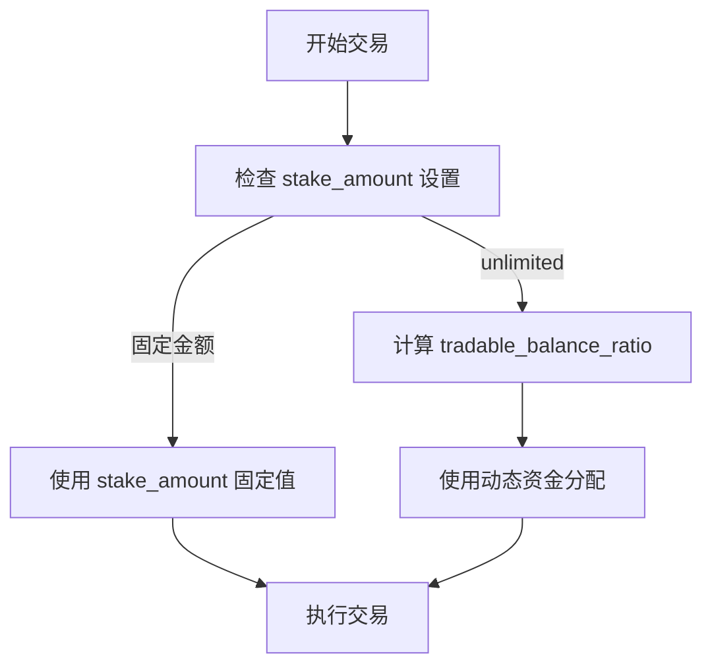
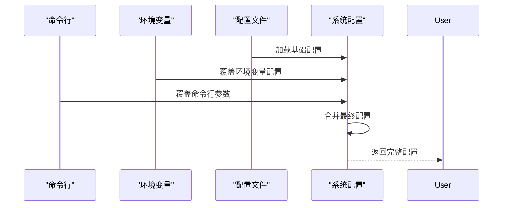

# 基础配置

<cite>
**Referenced Files in This Document**   
- [config_full.example.json](file://config_examples/config_full.example.json)
- [load_config.py](file://freqtrade/configuration/load_config.py)
- [configuration.py](file://freqtrade/configuration/configuration.py)
</cite>

## 目录
1. [核心配置项详解](#核心配置项详解)
2. [资金与交易配置](#资金与交易配置)
3. [配置加载与优先级机制](#配置加载与优先级机制)
4. [配置示例与错误排查](#配置示例与错误排查)

## 核心配置项详解

### max_open_trades 参数
`max_open_trades` 参数定义了同时可持有的最大交易对数量。该参数直接影响资金分配和风险管理策略。当设置为 `-1` 时，系统将允许无限数量的并发交易。此参数在回测和实盘交易中均有效，用于控制仓位的分散程度。

**Section sources**
- [config_full.example.json](file://config_examples/config_full.example.json#L2)
- [configuration.py](file://freqtrade/configuration/configuration.py#L247-L255)

### stake_currency 与 stake_amount
`stake_currency` 指定了用于交易的基准货币（如 BTC、USDT），而 `stake_amount` 定义了每笔交易的固定金额或使用 "unlimited" 实现动态资金分配。当 `stake_amount` 设置为 "unlimited" 时，系统将根据 `tradable_balance_ratio` 计算可用资金比例进行动态分配。

**Diagram sources**
- [config_full.example.json](file://config_examples/config_full.example.json#L3-L4)
- [configuration.py](file://freqtrade/configuration/configuration.py#L268-L275)

### dry_run 模式
`dry_run` 参数控制是否启用模拟交易模式。在模拟模式下，所有交易操作都不会实际执行，而是记录在内存数据库中。当 `dry_run` 为 `true` 时，系统会自动将数据库连接指向内存数据库（sqlite://），确保不会影响真实交易数据。

**Section sources**
- [config_full.example.json](file://config_examples/config_full.example.json#L12)
- [configuration.py](file://freqtrade/configuration/configuration.py#L144-L158)

## 资金与交易配置

### tradable_balance_ratio 资金比例控制
`tradable_balance_ratio` 参数用于控制可用资金的比例，其值为 0 到 1 之间的浮点数。该参数与 `stake_amount` 配合使用，当 `stake_amount` 为 "unlimited" 时，系统将根据此比例计算每笔交易的实际投入金额。例如，当账户总资金为 1000 USDT，`tradable_balance_ratio` 为 0.99 时，可用于交易的资金为 990 USDT。

**Section sources**
- [config_full.example.json](file://config_examples/config_full.example.json#L5)
- [configuration.py](file://freqtrade/configuration/configuration.py#L275-L284)

### fiat_display_currency 法币显示
`fiat_display_currency` 参数用于设置法币显示货币（如 USD、CNY），主要用于在日志和报告中显示资产的法币价值。该设置不影响实际交易，仅用于信息展示和价值换算。

**Section sources**
- [config_full.example.json](file://config_examples/config_full.example.json#L6)
- [configuration.py](file://freqtrade/configuration/configuration.py#L70-L120)

## 配置加载与优先级机制

### 配置加载流程
配置加载流程遵循严格的优先级顺序：命令行参数 > 环境变量 > 配置文件。系统首先加载配置文件中的基础设置，然后读取环境变量进行覆盖，最后应用命令行参数的覆盖。这种分层覆盖机制确保了配置的灵活性和可管理性。

**Diagram sources**
- [load_config.py](file://freqtrade/configuration/load_config.py#L100-L120)
- [configuration.py](file://freqtrade/configuration/configuration.py#L70-L120)

### 命令行参数覆盖
命令行参数具有最高优先级，可以覆盖配置文件中的任何设置。例如，`--max-open-trades 5` 参数会覆盖配置文件中定义的 `max_open_trades` 值。系统通过 `_args_to_config` 方法实现参数覆盖，确保命令行输入的配置能够及时生效。

**Section sources**
- [configuration.py](file://freqtrade/configuration/configuration.py#L247-L255)
- [configuration.py](file://freqtrade/configuration/configuration.py#L481-L509)

## 配置示例与错误排查

### 实际配置示例
以下是一个典型的配置示例，展示了核心参数的合理设置：
- `max_open_trades`: 3 (控制并发交易数量)
- `stake_currency`: "USDT" (使用稳定币作为交易货币)
- `stake_amount`: "unlimited" (启用动态资金分配)
- `tradable_balance_ratio`: 0.95 (使用95%的可用资金)
- `dry_run`: true (启用模拟交易模式)

**Section sources**
- [config_full.example.json](file://config_examples/config_full.example.json#L2-L12)

### 常见配置错误排查
常见配置错误包括 JSON 语法错误、参数类型不匹配和路径配置错误。系统在加载配置时会进行语法验证，对于 JSON 解析错误，会提供错误位置的上下文信息以便快速定位问题。建议使用标准的 JSON 验证工具检查配置文件的正确性。

**Section sources**
- [load_config.py](file://freqtrade/configuration/load_config.py#L50-L60)
- [configuration.py](file://freqtrade/configuration/configuration.py#L70-L120)