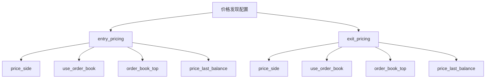
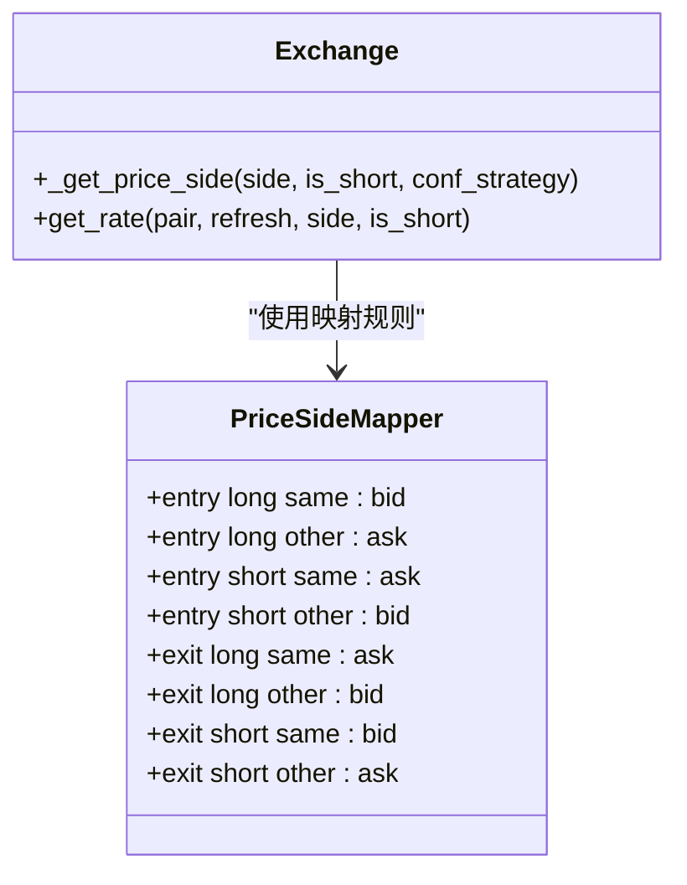
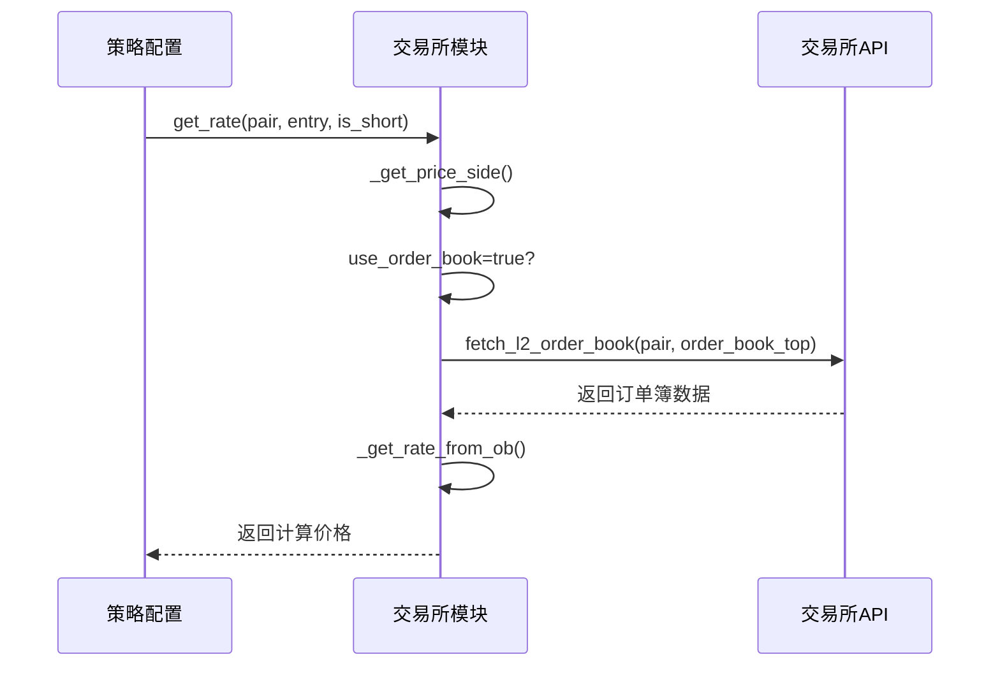
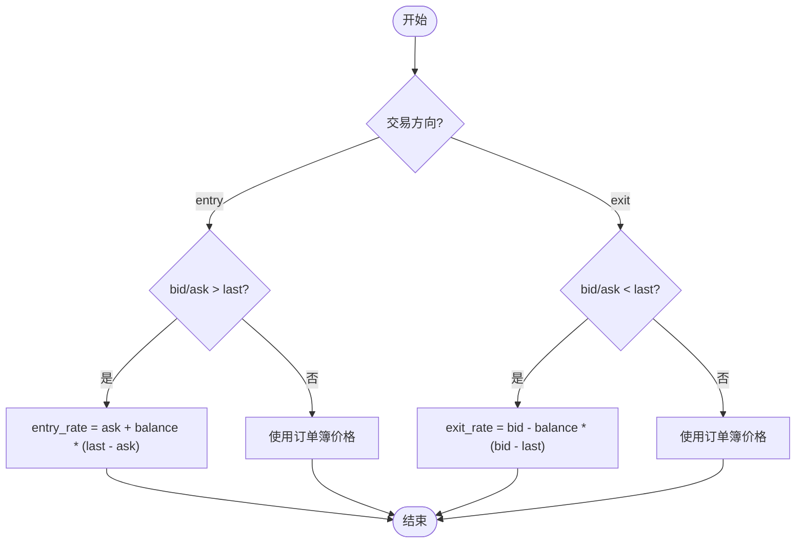
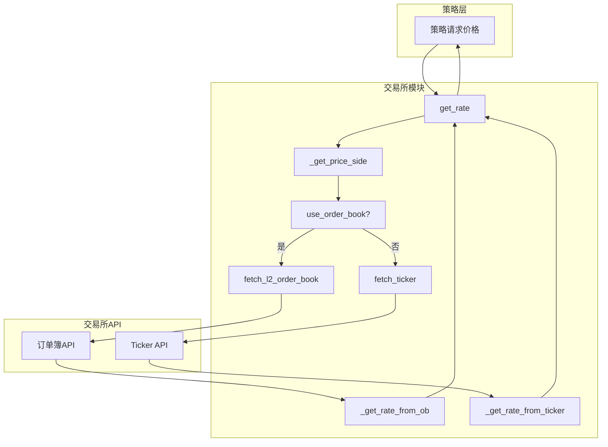
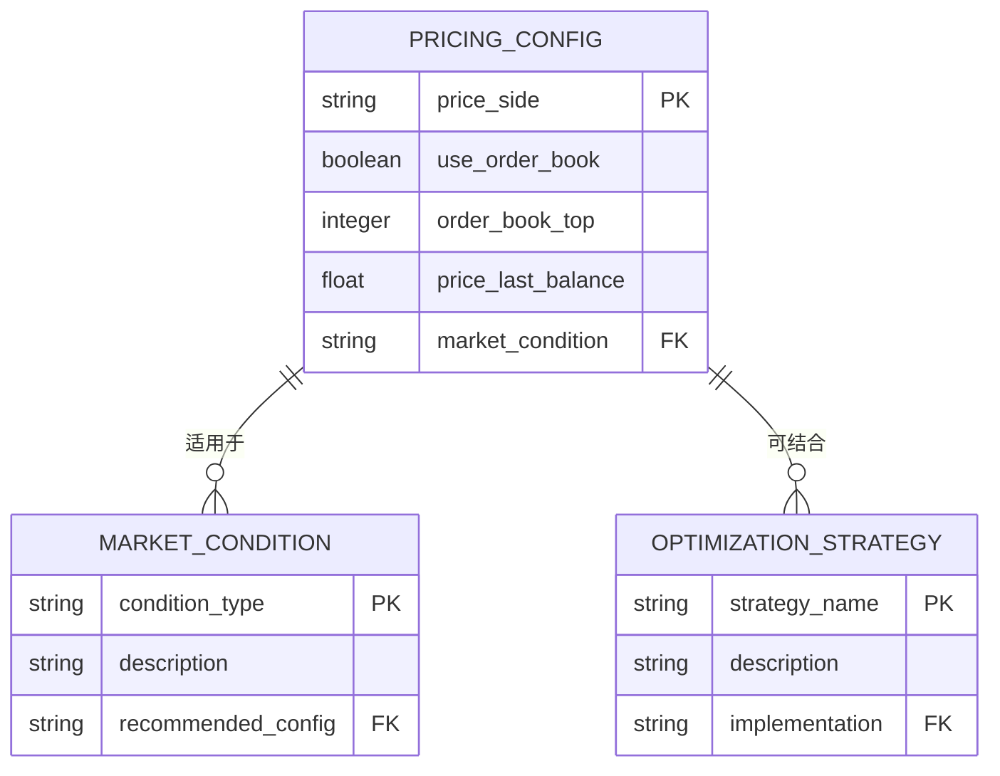

# 价格发现机制配置

<cite>
**本文档中引用的文件**   
- [exchange.py](file://freqtrade/exchange/exchange.py)
- [config_schema.py](file://freqtrade/config_schema/config_schema.py)
- [test_exchange.py](file://tests/exchange/test_exchange.py)
- [constants.py](file://freqtrade/constants.py)
- [test_pricing_conf.json](file://tests/testdata/testconfigs/test_pricing_conf.json)
</cite>

## 目录
1. [简介](#简介)
2. [价格发现配置详解](#价格发现配置详解)
3. [price_side参数行为分析](#price_side参数行为分析)
4. [订单簿加权定价实现](#订单簿加权定价实现)
5. [混合定价策略中的price_last_balance](#混合定价策略中的price_last_balance)
6. [价格发现与交易所API交互流程](#价格发现与交易所API交互流程)
7. [配置建议与延迟优化](#配置建议与延迟优化)

## 简介
本文档深入解析Freqtrade系统中entry_pricing和exit_pricing的价格发现配置机制。详细说明price_side参数在不同交易模式下的行为差异，阐述use_order_book和order_book_top如何实现订单簿加权定价，分析price_last_balance在混合定价策略中的作用，并结合exchange模块的实现，说明价格发现机制与交易所API的交互流程。

**Section sources**
- [exchange.py](file://freqtrade/exchange/exchange.py#L2099-L2168)
- [config_schema.py](file://freqtrade/config_schema/config_schema.py#L301-L337)

## 价格发现配置详解
价格发现配置主要通过entry_pricing和exit_pricing两个配置项实现，用于确定交易执行时的价格策略。这些配置允许用户根据市场条件和交易策略需求，灵活选择价格来源和计算方式。

**Diagram sources **
- [config_schema.py](file://freqtrade/config_schema/config_schema.py#L301-L337)

**Section sources**
- [config_schema.py](file://freqtrade/config_schema/config_schema.py#L301-L337)

## price_side参数行为分析
price_side参数定义了价格发现的方向，支持'same'、'ask'、'bid'和'other'四种选项。该参数的行为根据交易方向（entry/exit）和持仓类型（long/short）而变化。

**Diagram sources **
- [exchange.py](file://freqtrade/exchange/exchange.py#L2099-L2114)

**Section sources**
- [exchange.py](file://freqtrade/exchange/exchange.py#L2099-L2114)
- [constants.py](file://freqtrade/constants.py#L218-L218)

## 订单簿加权定价实现
当use_order_book设置为true时，系统通过订单簿数据实现加权定价。order_book_top参数指定使用订单簿的前N层深度数据，从而实现更精确的价格发现。

**Diagram sources **
- [exchange.py](file://freqtrade/exchange/exchange.py#L2071-L2097)
- [exchange.py](file://freqtrade/exchange/exchange.py#L2187-L2215)

**Section sources**
- [exchange.py](file://freqtrade/exchange/exchange.py#L2071-L2097)
- [exchange.py](file://freqtrade/exchange/exchange.py#L2187-L2215)

## 混合定价策略中的price_last_balance
price_last_balance参数在混合定价策略中起到平衡作用，它允许在订单簿价格和最新成交价之间进行加权计算。该参数值为0到1之间的浮点数，表示最新价格的权重比例。

**Diagram sources **
- [exchange.py](file://freqtrade/exchange/exchange.py#L2170-L2185)

**Section sources**
- [exchange.py](file://freqtrade/exchange/exchange.py#L2170-L2185)
- [test_exchange.py](file://tests/exchange/test_exchange.py#L3074-L3109)

## 价格发现与交易所API交互流程
价格发现机制通过exchange模块与交易所API进行交互，获取必要的市场数据。该流程包括订单簿数据获取、ticker数据获取以及价格计算等步骤。

**Diagram sources **
- [exchange.py](file://freqtrade/exchange/exchange.py#L2116-L2168)
- [exchange.py](file://freqtrade/exchange/exchange.py#L2010-L2023)

**Section sources**
- [exchange.py](file://freqtrade/exchange/exchange.py#L2116-L2168)
- [exchange.py](file://freqtrade/exchange/exchange.py#L2010-L2023)

## 配置建议与延迟优化
根据不同的市场条件和交易需求，建议采用不同的价格发现配置策略。同时，通过合理的缓存机制和API调用优化，可以有效降低系统延迟。

**Diagram sources **
- [test_pricing_conf.json](file://tests/testdata/testconfigs/test_pricing_conf.json#L0-L20)
- [exchange.py](file://freqtrade/exchange/exchange.py#L2217-L2245)

**Section sources**
- [test_pricing_conf.json](file://tests/testdata/testconfigs/test_pricing_conf.json#L0-L20)
- [exchange.py](file://freqtrade/exchange/exchange.py#L2217-L2245)