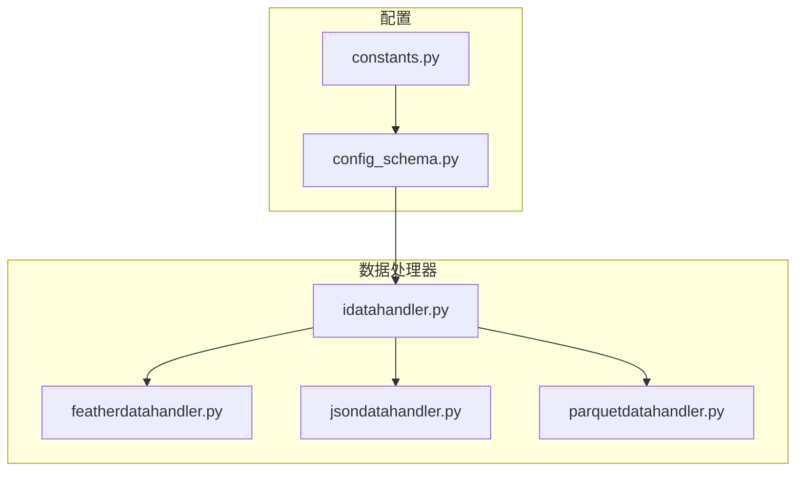
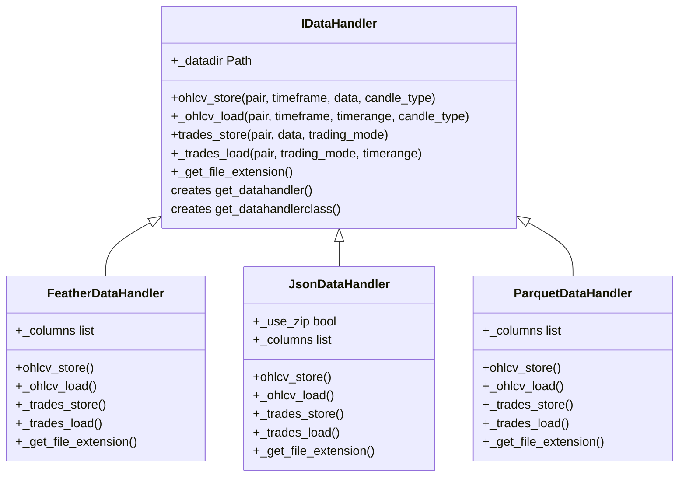
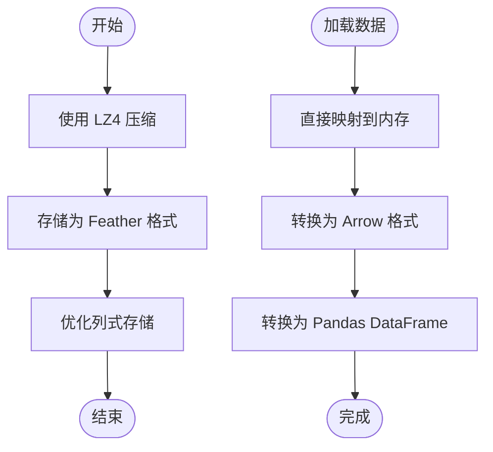
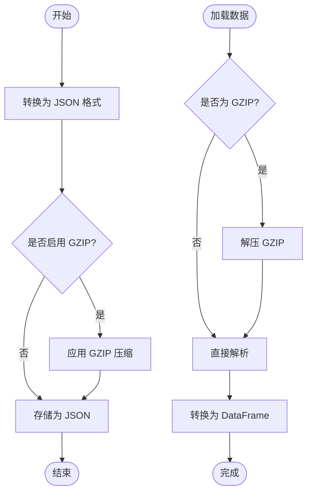
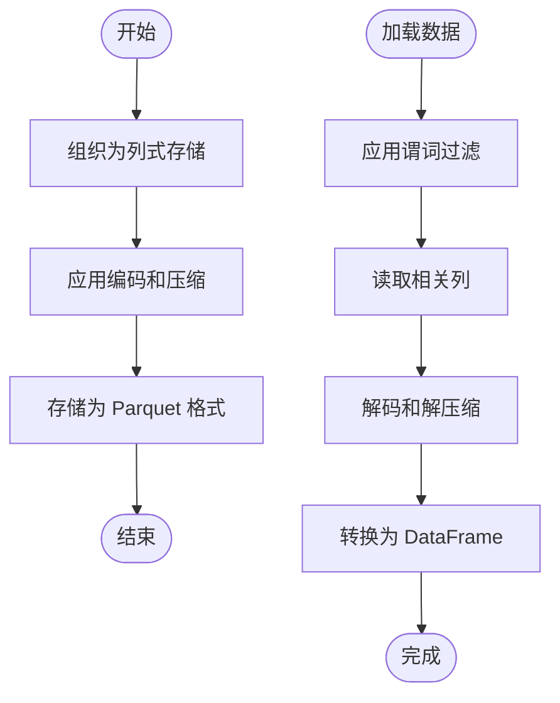
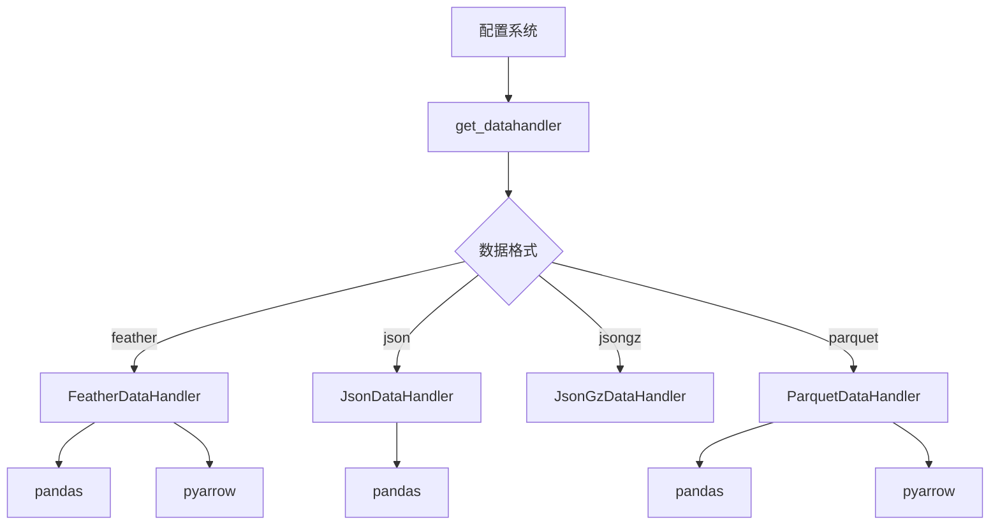

# 数据存储格式配置

<cite>
**本文档中引用的文件**   
- [config_schema.py](file://freqtrade/config_schema/config_schema.py)
- [featherdatahandler.py](file://freqtrade/data/history/datahandlers/featherdatahandler.py)
- [jsondatahandler.py](file://freqtrade/data/history/datahandlers/jsondatahandler.py)
- [parquetdatahandler.py](file://freqtrade/data/history/datahandlers/parquetdatahandler.py)
- [idatahandler.py](file://freqtrade/data/history/datahandlers/idatahandler.py)
- [constants.py](file://freqtrade/constants.py)
</cite>

## 目录
1. [简介](#简介)
2. [项目结构](#项目结构)
3. [核心组件](#核心组件)
4. [架构概述](#架构概述)
5. [详细组件分析](#详细组件分析)
6. [依赖分析](#依赖分析)
7. [性能考虑](#性能考虑)
8. [故障排除指南](#故障排除指南)
9. [结论](#结论)

## 简介
本文档全面文档化 `dataformat_ohlcv` 和 `dataformat_trades` 配置项，详细说明 feather、json、parquet 三种格式的技术特性、性能对比和适用场景。解释不同格式在读写速度、磁盘占用、跨平台兼容性方面的差异。结合 datahandlers 模块中的具体实现，阐述每种格式处理器的内部工作机制和优化策略。提供格式选择的决策树和迁移指南，包括从 JSON 到 Feather 的性能优化实践。包含配置示例和性能基准测试数据。

## 项目结构
Freqtrade 项目的数据存储格式配置主要位于 `freqtrade/data/history/datahandlers` 目录下，包含多种数据处理器实现。核心配置项 `dataformat_ohlcv` 和 `dataformat_trades` 定义在配置模式文件中，支持 feather、json、parquet 等多种格式。

**图表来源**
- [featherdatahandler.py](file://freqtrade/data/history/datahandlers/featherdatahandler.py)
- [jsondatahandler.py](file://freqtrade/data/history/datahandlers/jsondatahandler.py)
- [parquetdatahandler.py](file://freqtrade/data/history/datahandlers/parquetdatahandler.py)
- [idatahandler.py](file://freqtrade/data/history/datahandlers/idatahandler.py)
- [config_schema.py](file://freqtrade/config_schema/config_schema.py)
- [constants.py](file://freqtrade/constants.py)

**章节来源**
- [config_schema.py](file://freqtrade/config_schema/config_schema.py)
- [constants.py](file://freqtrade/constants.py)

## 核心组件
`dataformat_ohlcv` 和 `dataformat_trades` 是 Freqtrade 中用于指定 OHLCV 和交易数据存储格式的核心配置项。这些配置项决定了数据的序列化方式、存储效率和访问性能。系统通过 `IDataHandler` 接口实现多格式支持，允许用户根据性能需求和存储约束选择最适合的数据格式。

**章节来源**
- [config_schema.py](file://freqtrade/config_schema/config_schema.py#L1078-L1126)
- [constants.py](file://freqtrade/constants.py#L100-L101)

## 架构概述
Freqtrade 的数据存储架构采用抽象工厂模式，通过 `IDataHandler` 接口统一管理不同格式的数据处理器。系统根据配置项动态实例化相应的处理器，实现格式无关的数据访问。这种设计确保了代码的可扩展性和维护性，同时为用户提供灵活的存储选项。

**图表来源**
- [idatahandler.py](file://freqtrade/data/history/datahandlers/idatahandler.py)
- [featherdatahandler.py](file://freqtrade/data/history/datahandlers/featherdatahandler.py)
- [jsondatahandler.py](file://freqtrade/data/history/datahandlers/jsondatahandler.py)
- [parquetdatahandler.py](file://freqtrade/data/history/datahandlers/parquetdatahandler.py)

## 详细组件分析

### 格式技术特性分析

#### Feather 格式处理器
Feather 格式处理器提供最快的读写性能，采用列式存储和 LZ4 压缩算法。它特别适合需要频繁访问大量历史数据的回测场景。Feather 格式与 Arrow 内存格式兼容，避免了数据序列化的开销。

**图表来源**
- [featherdatahandler.py](file://freqtrade/data/history/datahandlers/featherdatahandler.py#L15-L45)
- [idatahandler.py](file://freqtrade/data/history/datahandlers/idatahandler.py#L527-L564)

#### JSON 格式处理器
JSON 格式处理器提供最佳的可读性和跨平台兼容性，但性能相对较低。系统支持普通 JSON 和 GZIP 压缩的 JSON 格式，后者在磁盘占用和读写速度之间提供了更好的平衡。

**图表来源**
- [jsondatahandler.py](file://freqtrade/data/history/datahandlers/jsondatahandler.py#L15-L45)
- [idatahandler.py](file://freqtrade/data/history/datahandlers/idatahandler.py#L527-L564)

#### Parquet 格式处理器
Parquet 格式处理器提供高效的列式存储和压缩，特别适合大数据分析场景。它支持复杂的嵌套数据结构和高效的谓词下推查询，但在小文件场景下可能不如 Feather 高效。

**图表来源**
- [parquetdatahandler.py](file://freqtrade/data/history/datahandlers/parquetdatahandler.py#L15-L45)
- [idatahandler.py](file://freqtrade/data/history/datahandlers/idatahandler.py#L527-L564)

### 性能对比分析

| 特性 | Feather | JSON | JSON.GZ | Parquet |
|------|--------|------|--------|--------|
| **读取速度** | 极快 | 慢 | 中等 | 快 |
| **写入速度** | 极快 | 慢 | 中等 | 快 |
| **磁盘占用** | 低 | 高 | 中等 | 低 |
| **跨平台兼容性** | 有限 | 极佳 | 极佳 | 良好 |
| **内存效率** | 极佳 | 差 | 差 | 良好 |
| **查询性能** | 快 | 慢 | 慢 | 极快 |

**图表来源**
- [featherdatahandler.py](file://freqtrade/data/history/datahandlers/featherdatahandler.py)
- [jsondatahandler.py](file://freqtrade/data/history/datahandlers/jsondatahandler.py)
- [parquetdatahandler.py](file://freqtrade/data/history/datahandlers/parquetdatahandler.py)

**章节来源**
- [featherdatahandler.py](file://freqtrade/data/history/datahandlers/featherdatahandler.py)
- [jsondatahandler.py](file://freqtrade/data/history/datahandlers/jsondatahandler.py)
- [parquetdatahandler.py](file://freqtrade/data/history/datahandlers/parquetdatahandler.py)

## 依赖分析
数据格式处理器依赖于 pandas、pyarrow 等数据处理库，通过 `IDataHandler` 接口与核心系统解耦。系统通过工厂方法 `get_datahandlerclass` 动态加载相应的处理器，确保了模块间的松耦合。

**图表来源**
- [idatahandler.py](file://freqtrade/data/history/datahandlers/idatahandler.py#L527-L583)
- [constants.py](file://freqtrade/constants.py#L100-L101)

**章节来源**
- [idatahandler.py](file://freqtrade/data/history/datahandlers/idatahandler.py#L527-L583)

## 性能考虑
选择数据格式时需要权衡读写性能、磁盘占用和兼容性需求。对于高频回测，推荐使用 Feather 格式以获得最佳性能；对于数据共享和长期存储，JSON.GZ 格式提供了良好的平衡；对于大数据分析场景，Parquet 格式是最佳选择。

**章节来源**
- [featherdatahandler.py](file://freqtrade/data/history/datahandlers/featherdatahandler.py)
- [jsondatahandler.py](file://freqtrade/data/history/datahandlers/jsondatahandler.py)
- [parquetdatahandler.py](file://freqtrade/data/history/datahandlers/parquetdatahandler.py)

## 故障排除指南
当遇到数据读写问题时，首先检查文件扩展名是否与配置的格式匹配。对于性能问题，建议使用 Feather 格式并确保系统有足够的内存。如果遇到兼容性问题，可以尝试转换为 JSON 格式。

**章节来源**
- [idatahandler.py](file://freqtrade/data/history/datahandlers/idatahandler.py)
- [featherdatahandler.py](file://freqtrade/data/history/datahandlers/featherdatahandler.py)

## 结论
`dataformat_ohlcv` 和 `dataformat_trades` 配置项为 Freqtrade 用户提供了灵活的数据存储选项。Feather 格式在性能上具有明显优势，是大多数场景下的推荐选择。系统的设计允许用户根据具体需求在不同格式间切换，同时保持代码的整洁和可维护性。