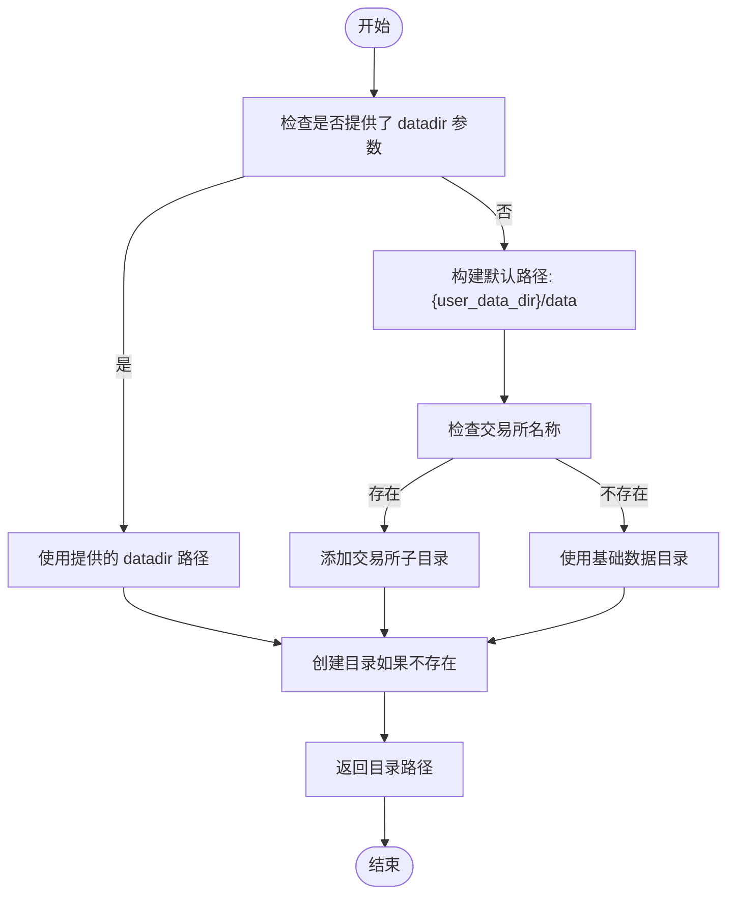
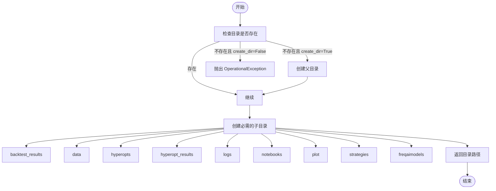
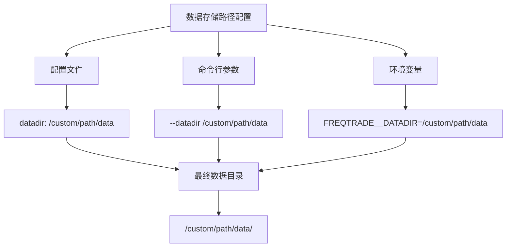
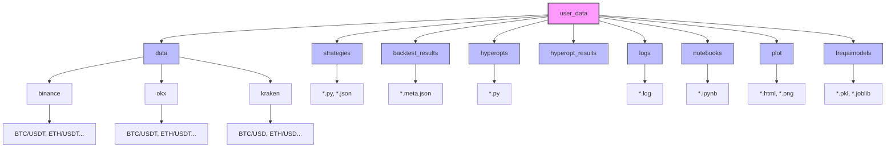

# 数据目录结构配置

<cite>
**本文档中引用的文件**   
- [directory_operations.py](file://freqtrade/configuration/directory_operations.py)
- [configuration.py](file://freqtrade/configuration/configuration.py)
- [constants.py](file://freqtrade/constants.py)
- [user_data](file://user_data)
</cite>

## 目录

1. [介绍](#介绍)
2. [核心配置参数](#核心配置参数)
3. [目录创建函数分析](#目录创建函数分析)
4. [标准目录结构](#标准目录结构)
5. [多交易所数据存储组织](#多交易所数据存储组织)
6. [目录结构示意图](#目录结构示意图)
7. [权限管理与数据持久化建议](#权限管理与数据持久化建议)

## 介绍
Freqtrade 是一个用于加密货币交易的开源机器人，其数据目录结构设计旨在提供灵活、可扩展和易于管理的数据存储方案。本文档详细说明了 `datadir` 和 `user_data_dir` 配置参数的作用和默认值，解释了 `create_datadir` 和 `create_userdata_dir` 函数如何根据配置构建目录层级，并文档化了标准目录结构及其子目录的用途。

**Section sources**
- [directory_operations.py](file://freqtrade/configuration/directory_operations.py#L1-L112)
- [configuration.py](file://freqtrade/configuration/configuration.py#L1-L547)

## 核心配置参数

### datadir 参数
`datadir` 参数用于指定数据文件的存储目录，特别是市场数据（如K线数据）的存储位置。如果未在配置中明确指定，将根据 `user_data_dir` 和交易所名称自动生成。

- **默认值**: `{user_data_dir}/data/{exchange_name}`
- **作用**: 存储从交易所下载的历史数据，按交易所名称组织

### user_data_dir 参数
`user_data_dir` 参数定义了用户数据目录的根路径，包含策略、回测结果、日志等用户特定的数据。

- **默认值**: 当前工作目录下的 `user_data` 文件夹
- **作用**: 作为用户数据的根目录，包含所有用户生成的文件和配置

**Section sources**
- [configuration.py](file://freqtrade/configuration/configuration.py#L188-L245)
- [constants.py](file://freqtrade/constants.py#L1-L228)

## 目录创建函数分析

### create_datadir 函数
`create_datadir` 函数负责创建数据目录，其逻辑如下：

1. 如果提供了 `datadir` 参数，则使用该路径
2. 否则，基于 `user_data_dir` 构建路径：`{user_data_dir}/data`
3. 如果未指定交易所，则添加交易所名称作为子目录
4. 创建目录（如果不存在）



**Diagram sources**
- [directory_operations.py](file://freqtrade/configuration/directory_operations.py#L19-L29)

### create_userdata_dir 函数
`create_userdata_dir` 函数负责创建用户数据目录结构，包括所有必需的子目录。



**Diagram sources**
- [directory_operations.py](file://freqtrade/configuration/directory_operations.py#L46-L89)

**Section sources**
- [directory_operations.py](file://freqtrade/configuration/directory_operations.py#L46-L89)

## 标准目录结构

Freqtrade 的标准用户数据目录结构包含以下主要子目录：

### user_data/strategies
- **用途**: 存储交易策略文件
- **文件类型**: Python 策略文件（.py）和策略配置文件（.json）
- **示例**: `MACDStrategy.py`, `BbandRsi.json`

### user_data/backtest_results
- **用途**: 存储回测结果文件
- **文件类型**: JSON 格式的回测结果文件
- **命名规范**: `backtest-result-<timestamp>.meta.json`

### user_data/data
- **用途**: 存储市场数据文件
- **组织方式**: 按交易所名称组织子目录
- **示例**: `user_data/data/binance/`, `user_data/data/okx/`

### 其他重要子目录
- **hyperopts**: 存储超参数优化相关的文件和策略
- **logs**: 存储系统日志文件
- **plot**: 存储图表输出文件
- **freqaimodels**: 存储 FreqAI 模型文件

**Section sources**
- [directory_operations.py](file://freqtrade/configuration/directory_operations.py#L55-L65)
- [user_data](file://user_data)

## 多交易所数据存储组织

### 组织方式
Freqtrade 采用分层的目录结构来组织多交易所的数据存储：

```
user_data/
└── data/
    ├── binance/
    │   ├── BTC/USDT/
    │   ├── ETH/USDT/
    │   └── ...
    ├── okx/
    │   ├── BTC/USDT/
    │   ├── ETH/USDT/
    │   └── ...
    └── kraken/
        ├── BTC/USD/
        ├── ETH/USD/
        └── ...
```

### 自定义数据存储路径
可以通过以下方式自定义数据存储路径：

1. **配置文件设置**: 在配置文件中设置 `datadir` 参数
2. **命令行参数**: 使用 `--datadir` 命令行参数
3. **环境变量**: 通过环境变量设置



**Diagram sources**
- [directory_operations.py](file://freqtrade/configuration/directory_operations.py#L19-L29)
- [configuration.py](file://freqtrade/configuration/configuration.py#L188-L245)

**Section sources**
- [directory_operations.py](file://freqtrade/configuration/directory_operations.py#L19-L29)
- [configuration.py](file://freqtrade/configuration/configuration.py#L188-L245)

## 目录结构示意图



**Diagram sources**
- [directory_operations.py](file://freqtrade/configuration/directory_operations.py#L46-L89)
- [user_data](file://user_data)

## 权限管理与数据持久化建议

### 权限管理
当在 Docker 环境中运行时，`chown_user_directory` 函数会使用 sudo 命令更改目录权限，确保 `ftuser` 用户对用户数据目录有适当的访问权限。

### 数据持久化策略
1. **定期备份**: 定期备份 `user_data` 目录，特别是策略文件和回测结果
2. **版本控制**: 将策略文件纳入版本控制系统（如 Git）
3. **云存储**: 考虑将重要数据同步到云存储服务
4. **监控**: 监控磁盘使用情况，确保有足够的存储空间

### 备份建议
- **完整备份**: 定期备份整个 `user_data` 目录
- **增量备份**: 对频繁更改的文件（如日志）进行增量备份
- **异地备份**: 将备份存储在不同的物理位置或云服务中

**Section sources**
- [directory_operations.py](file://freqtrade/configuration/directory_operations.py#L31-L43)
- [user_data](file://user_data)