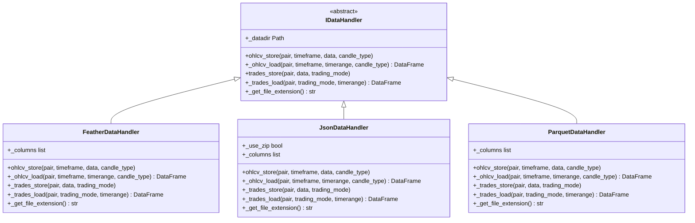
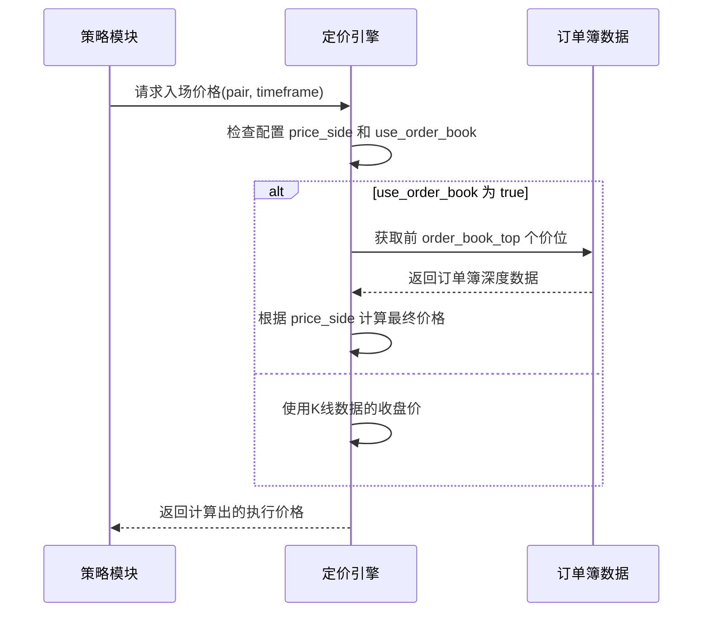

# 数据管理配置

<cite>
**本文档中引用的文件**  
- [config_full.example.json](file://config_examples/config_full.example.json)
- [config.json](file://user_data/config.json)
- [idatahandler.py](file://freqtrade/data/history/datahandlers/idatahandler.py)
- [featherdatahandler.py](file://freqtrade/data/history/datahandlers/featherdatahandler.py)
- [jsondatahandler.py](file://freqtrade/data/history/datahandlers/jsondatahandler.py)
- [parquetdatahandler.py](file://freqtrade/data/history/datahandlers/parquetdatahandler.py)
- [configuration.py](file://freqtrade/configuration/configuration.py)
- [load_config.py](file://freqtrade/configuration/load_config.py)
- [directory_operations.py](file://freqtrade/configuration/directory_operations.py)
</cite>

## 目录
1. [简介](#简介)
2. [核心配置项详解](#核心配置项详解)
3. [数据格式性能分析](#数据格式性能分析)
4. [目录结构设计](#目录结构设计)
5. [价格发现机制配置](#价格发现机制配置)
6. [数据处理管道配置](#数据处理管道配置)
7. [数据存储策略与性能调优](#数据存储策略与性能调优)

## 简介
本文档全面阐述了Freqtrade系统中与数据管理相关的配置项，涵盖timeframe、dataformat_ohlcv、dataformat_trades等关键参数。详细说明了datadir和user_data_dir的目录结构设计及其配置方法，分析了entry_pricing和exit_pricing中的价格发现机制配置，并结合data/history/datahandlers中的实现，阐述了数据处理管道的配置选项和优化建议。最后提供了数据存储策略和性能调优的配置指南。

## 核心配置项详解

**Section sources**
- [config_full.example.json](file://config_examples/config_full.example.json#L1-L218)
- [config.json](file://user_data/config.json#L1-L94)

### 时间框架配置 (timeframe)
`timeframe` 参数定义了策略运行和回测所使用的K线周期。该参数在配置文件中直接设置，也可通过命令行参数 `-i` 或 `--timeframe` 覆盖。支持的格式包括分钟（m）、小时（h）和天（d），例如 "5m"、"1h" 或 "1d"。此配置是策略逻辑的基础，直接影响交易信号的生成频率。

### 数据格式配置 (dataformat_ohlcv, dataformat_trades)
`dataformat_ohlcv` 和 `dataformat_trades` 参数分别指定了OHLCV（开高低收成交量）数据和逐笔交易数据的存储格式。这些格式决定了数据的读写效率、存储空间占用和兼容性。可用的格式包括 `feather`、`json`、`jsongz` 和 `parquet`。默认配置通常设置为 `feather`，因其在性能和空间上表现优异。

## 数据格式性能分析

**Section sources**
- [idatahandler.py](file://freqtrade/data/history/datahandlers/idatahandler.py#L1-L585)
- [featherdatahandler.py](file://freqtrade/data/history/datahandlers/featherdatahandler.py#L1-L186)
- [jsondatahandler.py](file://freqtrade/data/history/datahandlers/jsondatahandler.py#L1-L151)
- [parquetdatahandler.py](file://freqtrade/data/history/datahandlers/parquetdatahandler.py#L1-L134)

### Feather 格式
Feather 是一种由 Apache Arrow 项目支持的快速、轻量级的列式存储格式。在 Freqtrade 中，`FeatherDataHandler` 类实现了该格式的读写。其特点包括：
- **高性能**：读写速度极快，特别适合频繁访问的场景。
- **高效压缩**：使用 LZ4 压缩算法，有效减少磁盘占用。
- **内存友好**：加载数据时能直接映射到内存，减少数据转换开销。
- **推荐使用**：作为默认和推荐的数据格式，适用于大多数用户。

**Diagram sources**
- [idatahandler.py](file://freqtrade/data/history/datahandlers/idatahandler.py#L1-L585)
- [featherdatahandler.py](file://freqtrade/data/history/datahandlers/featherdatahandler.py#L1-L186)
- [jsondatahandler.py](file://freqtrade/data/history/datahandlers/jsondatahandler.py#L1-L151)
- [parquetdatahandler.py](file://freqtrade/data/history/datahandlers/parquetdatahandler.py#L1-L134)

### JSON/JSONGZ 格式
`JsonDataHandler` 和 `JsonGzDataHandler` 分别处理未压缩的JSON和GZIP压缩的JSON（.json.gz）文件。
- **JSON**：纯文本格式，人类可读，但文件体积大，读写速度慢。
- **JSONGZ**：通过GZIP压缩显著减小文件体积，但压缩和解压过程消耗CPU资源，读写速度较慢。
- **适用场景**：主要用于数据交换或需要人工检查数据内容的场景，不推荐用于生产环境的高频数据存储。

### Parquet 格式
`ParquetDataHandler` 实现了 Apache Parquet 格式的读写。
- **列式存储**：特别适合只读取部分列的分析场景，能有效跳过无关数据。
- **高压缩比**：通常能提供比 Feather 更好的压缩效果。
- **生态系统支持**：广泛用于大数据分析生态系统。
- **权衡**：虽然压缩比高，但读写速度通常略慢于 Feather，且对内存要求可能更高。

**配置选择建议**：
- **追求极致性能**：选择 `feather`。
- **需要高压缩比且不介意稍慢速度**：选择 `parquet`。
- **需要人类可读性或数据交换**：选择 `json` 或 `jsongz`。
- **避免使用**：已弃用的 `hdf5` 格式。

## 目录结构设计

**Section sources**
- [configuration.py](file://freqtrade/configuration/configuration.py#L177-L209)
- [directory_operations.py](file://freqtrade/configuration/directory_operations.py#L1-L77)
- [load_config.py](file://freqtrade/configuration/load_config.py#L1-L120)

### 用户数据目录 (user_data_dir)
`user_data_dir` 是用户配置和数据的根目录。其默认路径为程序运行目录下的 `user_data` 文件夹，可通过 `--user-data-dir` 命令行参数或在配置文件中设置 `user_data_dir` 字段来指定。Freqtrade 会在此目录下创建一系列子目录，形成标准化的结构：
- **backtest_results**：存储回测结果文件。
- **data**：存放从交易所下载的原始市场数据（OHLCV 和 trades）。
- **hyperopt_results**：存储超参数优化（Hyperopt）的结果。
- **logs**：存放系统日志文件。
- **plot**：存放图表生成的文件。
- **strategies**：存放用户自定义的交易策略文件（.py）。
- **freqaimodels**：存放 FreqAI 模型文件。
- **notebooks**：存放 Jupyter Notebook 文件。

### 数据目录 (datadir)
`datadir` 是 `user_data_dir` 下的 `data` 子目录，专门用于存放市场数据。其路径会根据配置的交易所名称进一步细分，例如 `user_data/data/binance`。如果启用了期货交易模式（`trading_mode: futures`），还会在 `datadir` 下创建 `futures` 子目录来存放期货相关数据。此目录结构由 `create_datadir` 函数在程序启动时自动创建和管理。

## 价格发现机制配置

**Section sources**
- [config_full.example.json](file://config_examples/config_full.example.json#L58-L80)
- [config.json](file://user_data/config.json#L24-L35)
- [config_schema.py](file://freqtrade/config_schema/config_schema.py#L301-L337)

### 价格侧配置 (price_side)
`price_side` 参数决定了在下单时使用订单簿的哪一侧价格。
- **same**：入场和出场时都使用与交易方向相同的一侧价格。例如，买入时使用卖一价（ask），卖出时使用买一价（bid）。这模拟了市价成交，通常会产生滑点。
- **other**：入场和出场时都使用与交易方向相反的一侧价格。例如，买入时使用买一价（bid），卖出时使用卖一价（ask）。这模拟了限价单成交，可能无法立即成交。
- **bid**：始终使用买一价（bid）。
- **ask**：始终使用卖一价（ask）。

### 订单簿定价 (use_order_book, order_book_top)
- **use_order_book**：一个布尔值，启用后将使用订单簿数据来确定执行价格，而不是使用K线的收盘价。
- **order_book_top**：指定在订单簿中考虑的前 N 个价位。例如，设置为 `1` 表示使用最优的买一/卖一价，设置为 `5` 则可能考虑前五个价位的加权平均或其他计算方式（具体实现取决于代码）。这可以用来模拟大额订单对市场的影响。

**Diagram sources**
- [config_full.example.json](file://config_examples/config_full.example.json#L58-L80)
- [config.json](file://user_data/config.json#L24-L35)

## 数据处理管道配置

**Section sources**
- [idatahandler.py](file://freqtrade/data/history/datahandlers/idatahandler.py#L1-L585)
- [configuration.py](file://freqtrade/configuration/configuration.py#L1-L548)

### 数据处理管道实现
数据处理管道的核心是 `IDataHandler` 接口及其具体实现（如 `FeatherDataHandler`）。该管道负责所有与磁盘数据交互的操作，包括：
- **数据加载** (`_ohlcv_load`, `_trades_load`)：根据交易对、时间框架和时间段从磁盘加载数据。
- **数据存储** (`ohlcv_store`, `_trades_store`)：将下载或生成的数据保存到磁盘。
- **数据查询** (`ohlcv_get_available_data`, `trades_get_pairs`)：列出可用数据的交易对和时间框架。
- **数据清理** (`ohlcv_purge`, `trades_purge`)：删除指定的旧数据。

### 配置选项与优化
- **数据格式选择**：如前所述，选择合适的 `dataformat` 是管道性能优化的关键。
- **数据目录管理**：正确配置 `datadir` 确保数据被存储在合适的物理位置（如SSD）。
- **数据加载优化**：`FeatherDataHandler` 利用 Arrow 的 `dataset` 功能实现了基于时间范围的过滤，可以在加载时只读取所需时间段的数据，避免加载整个大文件，这是重要的性能优化点。

## 数据存储策略与性能调优

**Section sources**
- [idatahandler.py](file://freqtrade/data/history/datahandlers/idatahandler.py#L1-L585)
- [featherdatahandler.py](file://freqtrade/data/history/datahandlers/featherdatahandler.py#L1-L186)

### 存储策略
- **格式选择**：优先使用 `feather` 格式以获得最佳的读写性能和合理的存储空间。
- **目录规划**：将 `datadir` 放置在高速存储设备（如SSD）上，以减少I/O延迟。
- **数据归档**：对于历史久远且不常访问的数据，可考虑手动归档或使用 `parquet` 格式进行压缩存储。

### 性能调优建议
1. **启用订单簿定价**：对于追求精确回测的用户，启用 `use_order_book` 并合理设置 `order_book_top` 可以更真实地模拟交易执行。
2. **监控日志**：关注日志中关于数据加载的警告，如 "No history for ... found"，及时下载缺失的数据。
3. **避免HDF5**：切勿使用已弃用的 `hdf5` 格式，它已被移除，使用旧版本数据需先转换。
4. **利用数据处理管道**：理解 `IDataHandler` 的工作方式，可以在自定义脚本中复用其功能，确保数据处理的一致性。
5. **定期维护**：定期检查 `datadir` 的磁盘空间，并清理不再需要的旧数据文件。