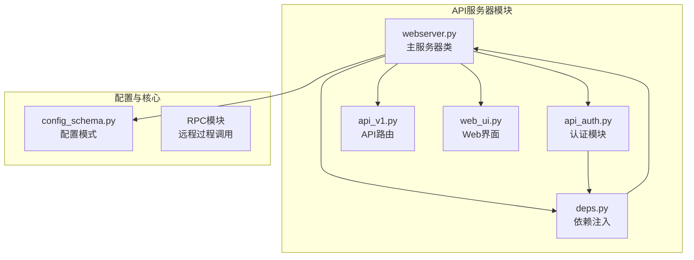
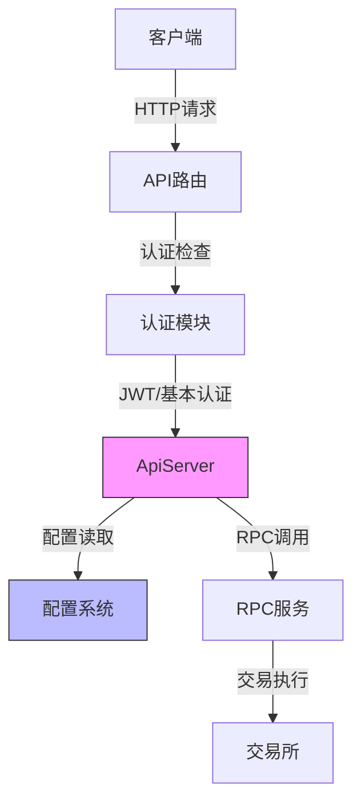
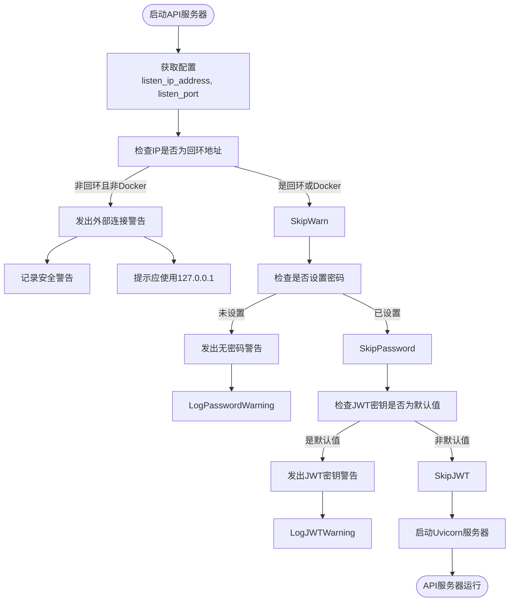
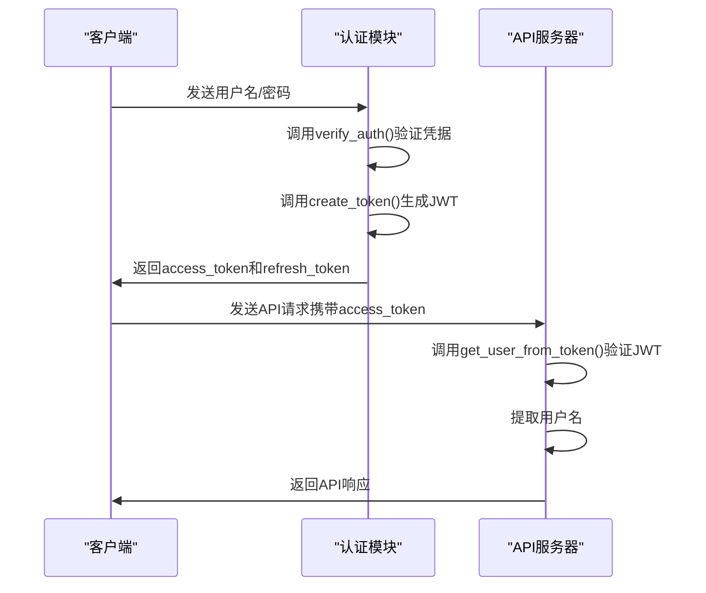
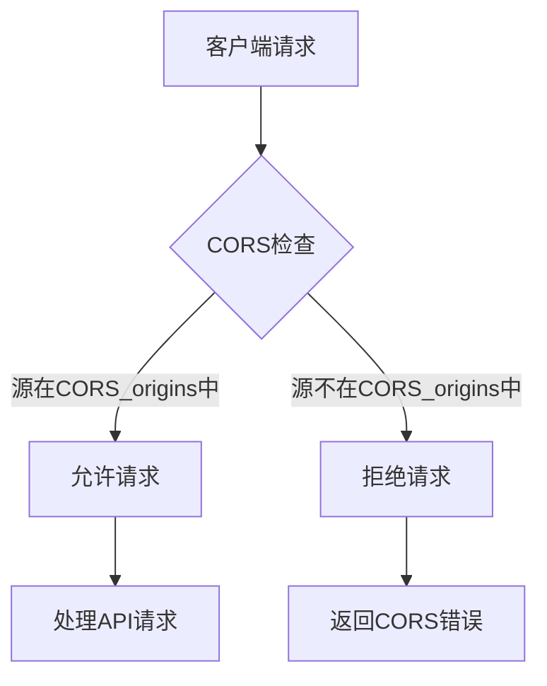
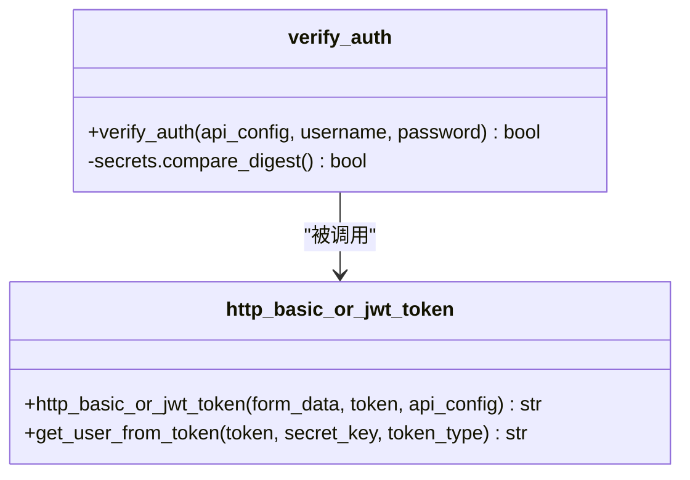
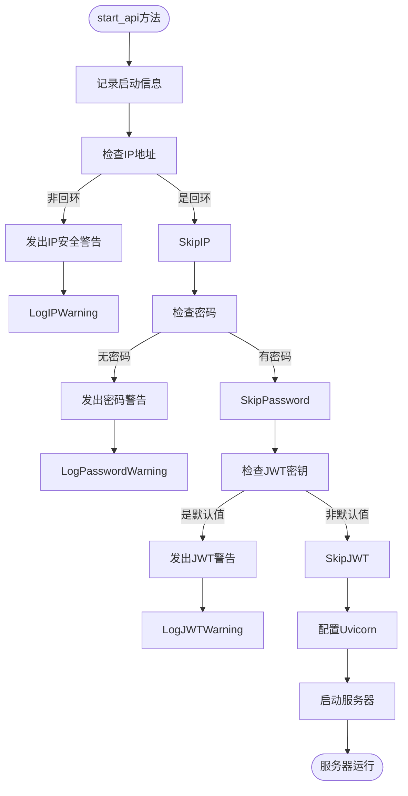
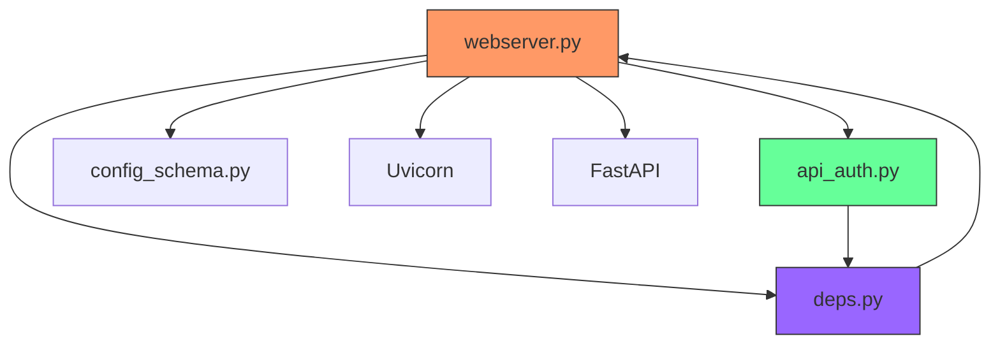

# API服务器配置

<cite>
**本文档中引用的文件**  
- [webserver.py](file://freqtrade/rpc/api_server/webserver.py)
- [config_schema.py](file://freqtrade/config_schema/config_schema.py)
- [api_auth.py](file://freqtrade/rpc/api_server/api_auth.py)
- [deps.py](file://freqtrade/rpc/api_server/deps.py)
</cite>

## 目录
1. [简介](#简介)
2. [项目结构](#项目结构)
3. [核心组件](#核心组件)
4. [架构概述](#架构概述)
5. [详细组件分析](#详细组件分析)
6. [依赖分析](#依赖分析)
7. [性能考虑](#性能考虑)
8. [故障排除指南](#故障排除指南)
9. [结论](#结论)
10. [附录](#附录)（如有必要）

## 简介
本文档全面阐述了Freqtrade项目中REST API服务器的配置体系。重点分析了网络绑定、身份验证、跨域资源共享等关键安全配置项，并结合代码实现详细解释了API服务器启动时的安全检查机制。文档还提供了生产环境下的安全加固建议和防火墙配置指南，帮助用户构建安全可靠的交易机器人API服务。

## 项目结构
Freqtrade项目的API服务器功能主要集中在`freqtrade/rpc/api_server/`目录下，采用模块化设计，各组件职责分明。核心配置通过`config_schema.py`定义，确保配置的规范性和完整性。

**图示来源**
- [webserver.py](file://freqtrade/rpc/api_server/webserver.py#L34-L243)
- [api_auth.py](file://freqtrade/rpc/api_server/api_auth.py#L21-L147)
- [deps.py](file://freqtrade/rpc/api_server/deps.py#L42-L43)
- [config_schema.py](file://freqtrade/config_schema/config_schema.py#L662-L696)

**本节来源**
- [webserver.py](file://freqtrade/rpc/api_server/webserver.py)
- [config_schema.py](file://freqtrade/config_schema/config_schema.py)

## 核心组件
API服务器的核心组件包括`ApiServer`类，负责启动和管理HTTP服务；`api_auth`模块，处理JWT和基本认证；以及`deps`模块，提供配置和依赖注入。这些组件协同工作，确保API服务的安全性和功能性。

**本节来源**
- [webserver.py](file://freqtrade/rpc/api_server/webserver.py#L34-L243)
- [api_auth.py](file://freqtrade/rpc/api_server/api_auth.py#L21-L147)
- [deps.py](file://freqtrade/rpc/api_server/deps.py#L42-L43)

## 架构概述
Freqtrade的API服务器基于FastAPI框架构建，采用分层架构。最上层是API路由，处理各种HTTP请求；中间层是认证和授权模块；底层是核心RPC服务。配置系统贯穿整个架构，确保所有组件使用一致的配置。

**图示来源**
- [webserver.py](file://freqtrade/rpc/api_server/webserver.py#L34-L243)
- [api_auth.py](file://freqtrade/rpc/api_server/api_auth.py#L21-L147)
- [deps.py](file://freqtrade/rpc/api_server/deps.py#L42-L43)

## 详细组件分析

### 网络绑定配置分析
API服务器的网络绑定通过`listen_ip_address`和`listen_port`配置项实现。服务器启动时会进行安全检查，防止非回环地址暴露。

**图示来源**
- [webserver.py](file://freqtrade/rpc/api_server/webserver.py#L202-L243)

**本节来源**
- [webserver.py](file://freqtrade/rpc/api_server/webserver.py#L202-L243)

### JWT身份验证分析
`jwt_secret_key`在JWT身份验证中起着核心作用，用于签名和验证JWT令牌。使用默认密钥会带来严重的安全风险。

**图示来源**
- [api_auth.py](file://freqtrade/rpc/api_server/api_auth.py#L21-L147)

**本节来源**
- [api_auth.py](file://freqtrade/rpc/api_server/api_auth.py#L21-L147)

### CORS配置分析
CORS_origins配置用于控制跨域资源共享，允许指定的源访问API服务器。

**图示来源**
- [webserver.py](file://freqtrade/rpc/api_server/webserver.py#L169)

**本节来源**
- [webserver.py](file://freqtrade/rpc/api_server/webserver.py#L169)

### 基本身份验证分析
username和password配置项用于基本的身份验证机制，确保只有授权用户可以访问API。

**图示来源**
- [api_auth.py](file://freqtrade/rpc/api_server/api_auth.py#L21-L25)

**本节来源**
- [api_auth.py](file://freqtrade/rpc/api_server/api_auth.py#L21-L25)

### 安全检查逻辑分析
API服务器启动时会执行一系列安全检查，包括密码缺失和JWT密钥默认值的警告机制。

**图示来源**
- [webserver.py](file://freqtrade/rpc/api_server/webserver.py#L202-L243)

**本节来源**
- [webserver.py](file://freqtrade/rpc/api_server/webserver.py#L202-L243)

## 依赖分析
API服务器模块依赖于多个核心组件，形成了清晰的依赖关系。

**图示来源**
- [webserver.py](file://freqtrade/rpc/api_server/webserver.py#L34-L243)
- [api_auth.py](file://freqtrade/rpc/api_server/api_auth.py#L21-L147)
- [deps.py](file://freqtrade/rpc/api_server/deps.py#L42-L43)

**本节来源**
- [webserver.py](file://freqtrade/rpc/api_server/webserver.py)
- [api_auth.py](file://freqtrade/rpc/api_server/api_auth.py)
- [deps.py](file://freqtrade/rpc/api_server/deps.py)

## 性能考虑
API服务器的性能主要受配置和运行环境影响。建议在生产环境中使用适当的日志级别，避免过度记录影响性能。同时，合理的CORS配置可以减少不必要的预检请求开销。

## 故障排除指南
当API服务器无法启动或访问时，应首先检查配置文件中的`listen_ip_address`和`listen_port`是否正确。如果出现安全警告，应根据警告内容调整配置。对于认证问题，应检查`username`、`password`和`jwt_secret_key`的设置。

**本节来源**
- [webserver.py](file://freqtrade/rpc/api_server/webserver.py#L202-L243)
- [api_auth.py](file://freqtrade/rpc/api_server/api_auth.py#L21-L147)

## 结论
Freqtrade的API服务器配置体系设计合理，提供了丰富的安全特性。通过正确配置网络绑定、身份验证和CORS，可以构建一个安全可靠的API服务。生产环境中应特别注意避免使用默认配置，定期更新密钥，并结合防火墙规则进一步增强安全性。

## 附录

### API服务器配置项说明
| 配置项 | 类型 | 描述 | 安全建议 |
|-------|------|------|---------|
| listen_ip_address | 字符串 | API服务器监听的IP地址 | 生产环境应设置为127.0.0.1 |
| listen_port | 整数 | API服务器监听的端口 | 选择1024以上的端口 |
| username | 字符串 | API服务器认证用户名 | 使用强用户名 |
| password | 字符串 | API服务器认证密码 | 使用强密码，不要使用默认值 |
| jwt_secret_key | 字符串 | JWT认证密钥 | 必须生成强密钥，不要使用默认值 |
| CORS_origins | 数组 | 允许的CORS源列表 | 仅添加必要的源 |

**本节来源**
- [config_schema.py](file://freqtrade/config_schema/config_schema.py#L662-L696)