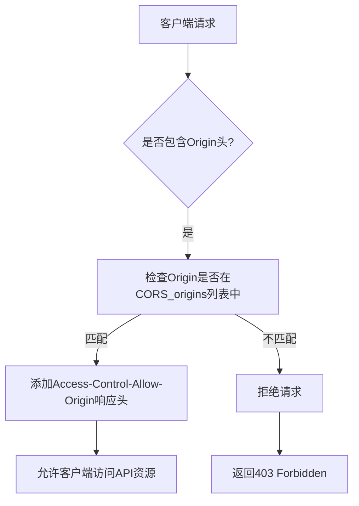

# 安全策略与CORS配置

<cite>
**Referenced Files in This Document**   
- [webserver.py](file://freqtrade/rpc/api_server/webserver.py)
- [config_schema.py](file://freqtrade/config_schema/config_schema.py)
</cite>

## 目录
1. [引言](#引言)
2. [CORS配置机制](#cors配置机制)
3. [安全风险与生产环境建议](#安全风险与生产环境建议)
4. [日志级别对安全审计的影响](#日志级别对安全审计的影响)
5. [安全加固检查清单](#安全加固检查清单)

## 引言
本文档全面分析API服务器的安全防护机制，重点阐述CORS_origins配置的作用。跨域资源共享（CORS）策略是防止恶意网站发起API请求的关键安全机制。通过在webserver.py中集成CORSMiddleware中间件，系统能够精确控制哪些外部源可以访问API资源。本文将详细说明该配置的具体参数及其安全含义，并提供完整的安全加固建议。

## CORS配置机制
CORS（跨域资源共享）是一种W3C标准，允许服务器明确指定哪些外部源可以访问其资源。在Freqtrade系统中，这一机制通过FastAPI的CORSMiddleware实现，确保只有受信任的源才能与API进行交互。

**Diagram sources**
- [webserver.py](file://freqtrade/rpc/api_server/webserver.py#L167-L177)

**Section sources**
- [webserver.py](file://freqtrade/rpc/api_server/webserver.py#L167-L177)
- [config_schema.py](file://freqtrade/config_schema/config_schema.py#L682-L686)

### 中间件参数详解
在webserver.py文件中，CORSMiddleware的配置包含以下关键参数：

- **allow_origins**: 从配置中获取的CORS_origins列表，定义了允许访问API的源
- **allow_credentials**: 设置为True，允许携带身份验证凭据（如cookies）
- **allow_methods**: 设置为["*"]，允许所有HTTP方法（GET、POST等）
- **allow_headers**: 设置为["*"]，允许所有请求头

这些参数共同构成了系统的跨域安全策略，其中allow_origins是最关键的安全控制点。

## 安全风险与生产环境建议
在生产环境中，必须严格限制CORS_origins列表，避免使用通配符带来的安全风险。不恰当的CORS配置可能导致跨站请求伪造（CSRF）攻击，使攻击者能够以用户身份执行未经授权的操作。

### 安全警告分析
系统在启动时会进行多项安全检查，并在检测到潜在风险时发出警告：

- 当API服务器监听外部IP地址时，会提示"SECURITY WARNING - Local Rest Server listening to external connections"
- 当未设置密码时，会提示"SECURITY WARNING - No password for local REST Server defined"
- 当JWT密钥使用默认值时，会提示"SECURITY WARNING - `jwt_secret_key` seems to be default"

这些警告机制有助于管理员及时发现并修复安全配置问题。

**Section sources**
- [webserver.py](file://freqtrade/rpc/api_server/webserver.py#L195-L243)

## 日志级别对安全审计的影响
日志级别（verbosity）配置直接影响安全审计的能力。系统支持"error"和"info"两种日志级别，不同的设置对安全监控产生显著影响：

- **error级别**: 仅记录错误信息，适合生产环境以减少日志量
- **info级别**: 记录详细的访问日志，包括成功的API调用，便于安全审计和异常行为检测

在安全敏感环境中，建议在必要时临时启用info级别日志，以便全面监控API访问行为，及时发现潜在的安全威胁。

**Section sources**
- [webserver.py](file://freqtrade/rpc/api_server/webserver.py#L230-L232)
- [config_schema.py](file://freqtrade/config_schema/config_schema.py#L694-L696)

## 安全加固检查清单
为确保API服务器的安全性，建议遵循以下检查清单进行配置和部署：

| 检查项 | 安全建议 | 配置位置 |
|--------|---------|---------|
| CORS_origins配置 | 严格限制允许的源列表，避免使用通配符 | config.json |
| API服务器监听地址 | 仅监听本地回环地址(127.0.0.1)，避免外部直接访问 | config.json |
| 认证密码 | 必须设置强密码，禁止使用默认或空密码 | config.json |
| JWT密钥 | 必须修改默认密钥，使用高强度随机字符串 | config.json |
| 日志级别 | 生产环境使用error级别，审计时临时启用info级别 | config.json |
| Docker部署 | 在Docker环境中运行以隔离系统资源 | docker-compose.yml |

**Section sources**
- [webserver.py](file://freqtrade/rpc/api_server/webserver.py#L195-L243)
- [config_schema.py](file://freqtrade/config_schema/config_schema.py#L662-L696)