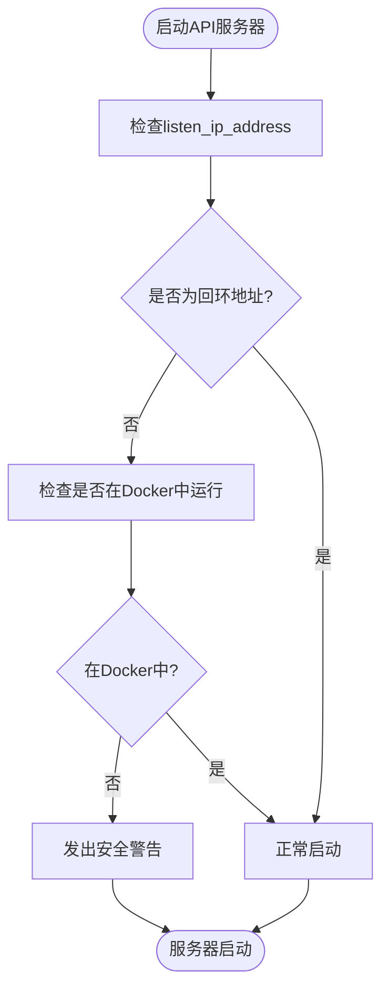
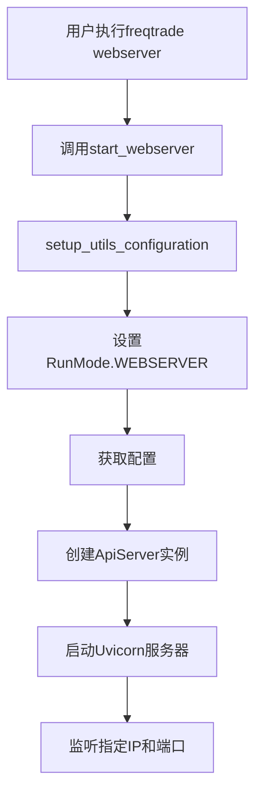

# 网络配置

<cite>
**Referenced Files in This Document**   
- [webserver.py](file://freqtrade/rpc/api_server/webserver.py)
- [config_schema.py](file://freqtrade/config_schema/config_schema.py)
- [detect_environment.py](file://freqtrade/configuration/detect_environment.py)
- [uvicorn_threaded.py](file://freqtrade/rpc/api_server/uvicorn_threaded.py)
- [webserver_commands.py](file://freqtrade/commands/webserver_commands.py)
- [config_setup.py](file://freqtrade/configuration/config_setup.py)
</cite>

## 目录
1. [API服务器网络绑定配置](#api服务器网络绑定配置)
2. [安全风险分析](#安全风险分析)
3. [Docker与本地环境最佳实践](#docker与本地环境最佳实践)
4. [IP地址验证机制](#ip地址验证机制)
5. [防火墙配置建议](#防火墙配置建议)

## API服务器网络绑定配置

API服务器的网络绑定配置通过`api_server`配置块中的`listen_ip_address`和`listen_port`参数实现。这些参数在`config_schema.py`中定义了严格的验证规则，确保IP地址格式正确且端口号在1024-65535范围内。

`listen_ip_address`参数指定API服务器监听的网络接口，支持IPv4格式。`listen_port`参数定义服务监听的端口，必须为有效端口号。配置示例如下：
```json
"api_server": {
    "enabled": true,
    "listen_ip_address": "0.0.0.0",
    "listen_port": 8080,
    "username": "freqtrade",
    "password": "your_password"
}
```

当API服务器启动时，`ApiServer`类的`start_api`方法会读取这些配置值并初始化Uvicorn服务器实例。服务器绑定过程在`webserver.py`文件中实现，通过FastAPI框架提供REST接口和WebSocket通信功能。

**Section sources**
- [config_schema.py](file://freqtrade/config_schema/config_schema.py#L1421-L1421)
- [webserver.py](file://freqtrade/rpc/api_server/webserver.py#L150-L155)

## 安全风险分析

将`listen_ip_address`设置为非回环地址（如`0.0.0.0`）会带来显著的安全风险，特别是在非Docker环境中运行时。系统在启动时会执行安全检查，当检测到外部接口监听且未运行在Docker容器中时，会触发运行时安全警告。

安全警告机制在`webserver.py`的`start_api`方法中实现，通过`ip_address(rest_ip).is_loopback`检查IP地址是否为回环地址，并结合`running_in_docker()`函数判断执行环境。如果服务器监听外部连接且不在Docker环境中，系统会输出以下警告：
```
SECURITY WARNING - Local Rest Server listening to external connections
SECURITY WARNING - This is insecure please set to your loopback, e.g 127.0.0.1 in config.json
```

此外，系统还会检查是否存在未设置密码的情况以及JWT密钥是否为默认值，这些都会触发相应的安全警告，提醒用户加强安全配置。



**Diagram sources**
- [webserver.py](file://freqtrade/rpc/api_server/webserver.py#L157-L164)

**Section sources**
- [webserver.py](file://freqtrade/rpc/api_server/webserver.py#L157-L164)
- [detect_environment.py](file://freqtrade/configuration/detect_environment.py#L3-L7)

## Docker与本地环境最佳实践

在Docker和本地环境中配置网络接口需要遵循不同的最佳实践。对于Docker环境，推荐将`listen_ip_address`设置为`0.0.0.0`以允许容器外部访问，同时通过Docker的端口映射机制控制访问权限。

Docker部署示例：
```yaml
version: '3'
services:
  freqtrade:
    image: freqtrade
    command: webserver
    ports:
      - "127.0.0.1:8080:8080"
    environment:
      - FT_APP_ENV=docker
```

在本地环境中，最佳实践是将`listen_ip_address`设置为`127.0.0.1`（回环地址），限制服务仅在本地访问。如果需要外部访问，应通过SSH隧道或反向代理实现，而不是直接暴露API服务器。

Web服务器模式的启动流程在`webserver_commands.py`中定义，通过`setup_utils_configuration`函数初始化配置，并创建`ApiServer`实例。该流程确保在不同运行模式下正确设置配置参数。



**Diagram sources**
- [webserver_commands.py](file://freqtrade/commands/webserver_commands.py#L5-L15)
- [config_setup.py](file://freqtrade/configuration/config_setup.py#L15-L25)

**Section sources**
- [webserver_commands.py](file://freqtrade/commands/webserver_commands.py#L5-L15)
- [config_setup.py](file://freqtrade/configuration/config_setup.py#L15-L25)

## IP地址验证机制

IP地址验证机制在API服务器启动过程中起着关键作用。系统使用Python标准库中的`ipaddress`模块对`listen_ip_address`进行格式验证，确保其为有效的IPv4地址。

验证过程在`webserver.py`的`start_api`方法中实现，通过`ip_address(rest_ip)`尝试解析配置的IP地址。如果地址格式无效，将抛出异常阻止服务器启动。同时，系统通过`is_loopback`属性检查地址是否为回环地址，这是安全警告触发的关键条件之一。

对于Docker环境的识别，系统依赖环境变量`FT_APP_ENV`的值。`running_in_docker()`函数检查该环境变量是否设置为`docker`，从而决定是否忽略外部接口监听的安全警告。这种机制允许Docker容器内的服务安全地绑定到`0.0.0.0`地址。

**Section sources**
- [webserver.py](file://freqtrade/rpc/api_server/webserver.py#L157-L164)
- [detect_environment.py](file://freqtrade/configuration/detect_environment.py#L3-L7)

## 防火墙配置建议

为确保API服务器的安全性，建议实施严格的防火墙配置策略。对于生产环境，推荐使用以下防火墙规则：

1. **本地环境**：配置防火墙仅允许来自`127.0.0.1`的连接，完全阻止外部访问。
2. **Docker环境**：利用Docker的网络隔离特性，仅映射必要的端口，并限制主机绑定到`127.0.0.1`。
3. **云环境**：配置安全组规则，仅允许可信IP地址范围访问API端口。

具体iptables配置示例：
```bash
# 允许本地回环访问
iptables -A INPUT -p tcp --dport 8080 -s 127.0.0.1 -j ACCEPT
# 拒绝其他所有访问
iptables -A INPUT -p tcp --dport 8080 -j DROP
```

此外，建议结合使用反向代理（如Nginx）实现HTTPS加密、访问控制和速率限制。反向代理可以提供额外的安全层，包括：
- SSL/TLS加密
- 基于IP的访问控制
- 请求速率限制
- Web应用防火墙（WAF）功能

通过综合运用防火墙规则和反向代理，可以有效保护API服务器免受未授权访问和网络攻击。

**Section sources**
- [webserver.py](file://freqtrade/rpc/api_server/webserver.py#L157-L164)