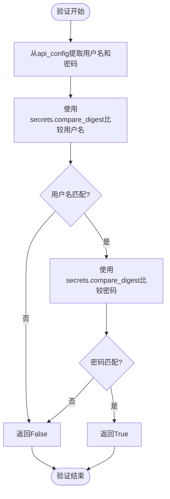
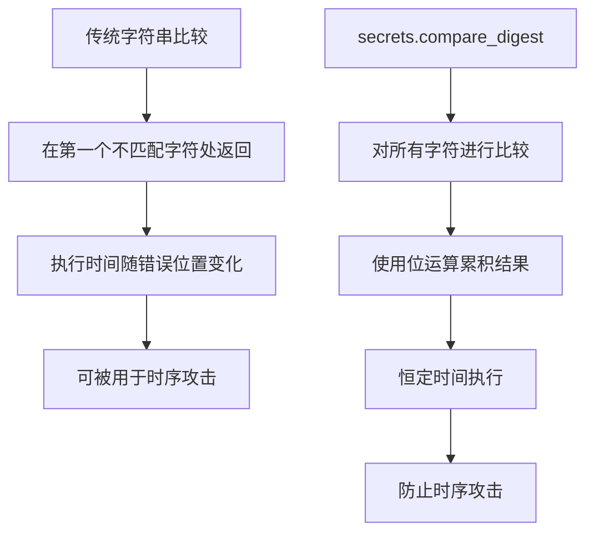

# HTTP基本认证

<cite>
**本文档中引用的文件**   
- [api_auth.py](file://freqtrade/rpc/api_server/api_auth.py)
- [config.json](file://user_data/config.json)
- [deps.py](file://freqtrade/rpc/api_server/deps.py)
- [config_schema.py](file://freqtrade/config_schema/config_schema.py)
</cite>

## 目录
1. [HTTP基本认证机制](#http基本认证机制)
2. [配置文件中的认证配置](#配置文件中的认证配置)
3. [安全验证函数分析](#安全验证函数分析)
4. [时序攻击防护原理](#时序攻击防护原理)
5. [安全实践建议](#安全实践建议)

## HTTP基本认证机制

HTTP基本认证是一种简单的身份验证机制，通过在HTTP请求头中传输Base64编码的用户名和密码来进行身份验证。在Freqtrade系统中，该机制被用于API服务器的安全访问控制，确保只有授权用户能够访问交易机器人的重要功能。

该认证机制通过`api_auth.py`文件中的`verify_auth`函数实现，结合FastAPI框架的安全模块，为API端点提供双重认证支持（HTTP基本认证和JWT令牌认证）。当客户端尝试访问受保护的API端点时，系统会检查请求中提供的凭据是否与配置文件中定义的凭据匹配。

**Section sources**
- [api_auth.py](file://freqtrade/rpc/api_server/api_auth.py#L21-L25)
- [api_auth.py](file://freqtrade/rpc/api_server/api_auth.py#L107-L120)

## 配置文件中的认证配置

在Freqtrade系统中，HTTP基本认证的用户名和密码通过`config.json`文件中的`api_server`部分进行配置。配置项必须包含`username`和`password`字段，这两个字段是API服务器认证的必要条件。

```json
"api_server": {
    "enabled": true,
    "listen_ip_address": "127.0.0.1",
    "listen_port": 8080,
    "username": "freqtrader",
    "password": "SuperSecurePassword"
}
```

根据系统架构，`username`和`password`字段在`config_schema.py`中被定义为必需字段，确保配置的完整性。这些凭据通过`deps.py`文件中的`get_api_config`函数从主配置中提取，并传递给认证逻辑进行验证。

**Section sources**
- [config.json](file://user_data/config.json#L70-L75)
- [config_schema.py](file://freqtrade/config_schema/config_schema.py#L662-L696)
- [deps.py](file://freqtrade/rpc/api_server/deps.py#L28-L30)

## 安全验证函数分析

`verify_auth`函数是HTTP基本认证的核心验证逻辑，位于`api_auth.py`文件中。该函数使用Python标准库中的`secrets.compare_digest`函数进行安全的字符串比较，而不是使用普通的`==`操作符。



**Diagram sources**
- [api_auth.py](file://freqtrade/rpc/api_server/api_auth.py#L21-L25)

**Section sources**
- [api_auth.py](file://freqtrade/rpc/api_server/api_auth.py#L21-L25)

## 时序攻击防护原理

时序攻击（Timing Attack）是一种通过测量系统响应时间来推断秘密信息的侧信道攻击。传统的字符串比较操作在遇到第一个不匹配字符时会立即返回，导致不同位置的字符不匹配会产生不同的执行时间。攻击者可以利用这种时间差异，逐个字符地猜测正确的凭据。

`secrets.compare_digest`函数通过以下方式防止时序攻击：
1. **恒定时间执行**：无论输入字符串是否匹配，函数的执行时间都是恒定的
2. **逐字符比较**：对所有字符进行比较，而不是在第一个不匹配处提前返回
3. **位运算操作**：使用位运算来累积比较结果，避免条件分支影响执行时间

这种安全比较确保了即使攻击者能够精确测量响应时间，也无法获得关于凭据正确性的任何信息，从而有效防止了时序攻击。



**Diagram sources**
- [api_auth.py](file://freqtrade/rpc/api_server/api_auth.py#L23)
- [api_auth.py](file://freqtrade/rpc/api_server/api_auth.py#L67-L70)

**Section sources**
- [api_auth.py](file://freqtrade/rpc/api_server/api_auth.py#L23)
- [api_auth.py](file://freqtrade/rpc/api_server/api_auth.py#L67-L70)

## 安全实践建议

### 配置示例
```json
"api_server": {
    "enabled": true,
    "listen_ip_address": "127.0.0.1",
    "listen_port": 8080,
    "username": "your_unique_username",
    "password": "your_very_strong_password_with_mixed_characters_123!@#"
}
```

### 强密码必要性
使用高强度密码至关重要，因为：
- 增加暴力破解的难度
- 减少字典攻击的成功率
- 提高系统的整体安全性

### 明文传输风险
HTTP基本认证将用户名和密码以Base64编码的形式在HTTP头中传输，虽然进行了编码但并未加密，本质上仍是明文传输。Base64编码可以轻易被解码，因此在没有额外保护的情况下，凭据容易被中间人攻击截获。

### HTTPS使用要求
必须配合HTTPS使用，原因包括：
1. **加密传输**：HTTPS通过TLS/SSL加密所有通信内容，防止凭据被窃听
2. **完整性保护**：确保数据在传输过程中不被篡改
3. **身份验证**：验证服务器身份，防止中间人攻击

**Section sources**
- [config.json](file://user_data/config.json#L70-L75)
- [api_auth.py](file://freqtrade/rpc/api_server/api_auth.py#L21-L25)