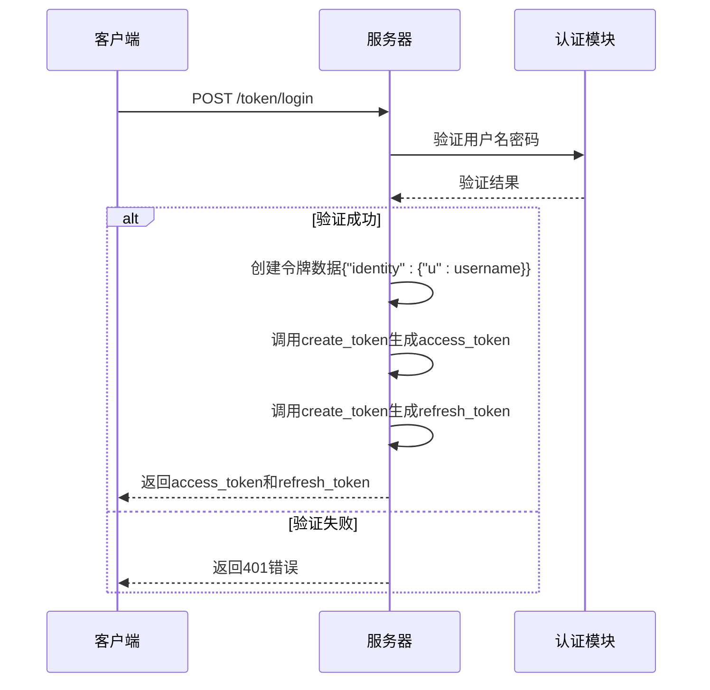
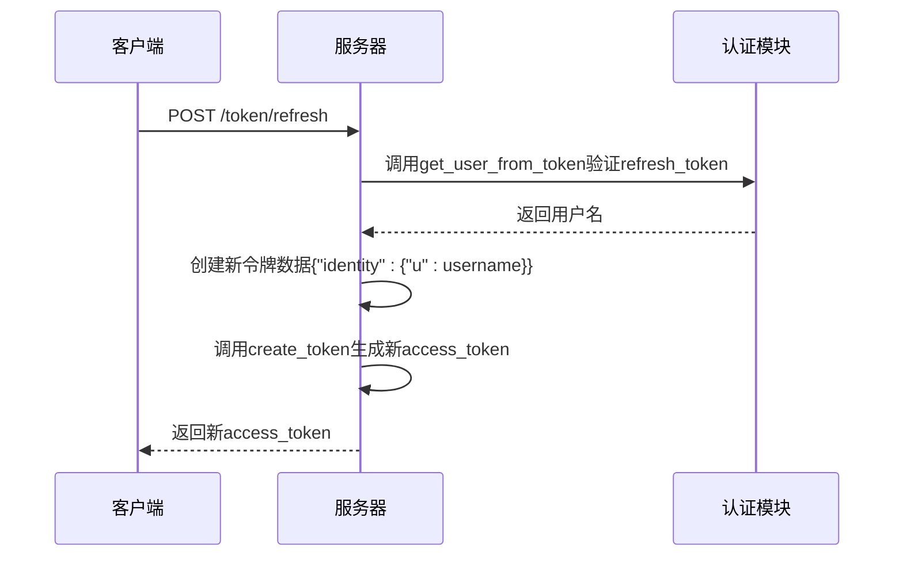
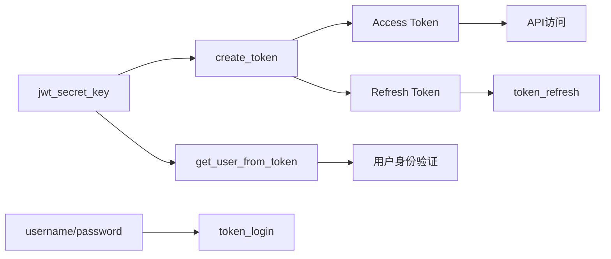

# JWT令牌认证

<cite>
**本文档中引用的文件**  
- [api_auth.py](file://freqtrade/rpc/api_server/api_auth.py)
- [config_full.example.json](file://config_examples/config_full.example.json)
- [config.json](file://user_data/config.json)
</cite>

## 目录
1. [简介](#简介)
2. [JWT认证机制概述](#jwt认证机制概述)
3. [核心组件分析](#核心组件分析)
4. [令牌生成与验证流程](#令牌生成与验证流程)
5. [安全配置建议](#安全配置建议)
6. [依赖关系分析](#依赖关系分析)

## 简介
本文档深入解析Freqtrade系统中基于JWT（JSON Web Token）的身份认证机制。重点分析`api_auth.py`文件中的`create_token`和`get_user_from_token`函数，详细说明HS256算法的应用、access_token（15分钟有效期）与refresh_token（30天有效期）的设计意图，以及jwt_secret_key在签名和验证中的核心作用。

## JWT认证机制概述
Freqtrade的API服务器采用JWT标准实现安全的身份认证机制，支持HTTP Basic认证和Bearer Token认证两种方式。该机制通过HS256算法对令牌进行签名，确保令牌的完整性和防篡改性。系统设计了双令牌机制，包含短期有效的access_token和长期有效的refresh_token，以平衡安全性和用户体验。

```mermaid
graph TD
A[用户登录] --> B[验证用户名密码]
B --> C{验证成功?}
C --> |是| D[生成Access Token<br/>(15分钟有效期)]
C --> |是| E[生成Refresh Token<br/>(30天有效期)]
C --> |否| F[返回401错误]
D --> G[返回令牌对]
E --> G
G --> H[客户端存储令牌]
H --> I[访问受保护API]
I --> J[验证Access Token]
J --> K{有效?}
K --> |是| L[执行API操作]
K --> |否| M[尝试用Refresh Token<br/>获取新Access Token]
M --> N[验证Refresh Token]
N --> O{有效?}
O --> |是| P[生成新Access Token]
O --> |否| Q[要求重新登录]
```

**图表来源**  
- [api_auth.py](file://freqtrade/rpc/api_server/api_auth.py#L88-L104)
- [api_auth.py](file://freqtrade/rpc/api_server/api_auth.py#L33-L49)

## 核心组件分析

### 令牌创建函数
`create_token`函数负责生成JWT令牌，根据令牌类型设置不同的过期时间。对于access_token，设置15分钟的有效期；对于refresh_token，设置30天的有效期。函数在令牌中包含过期时间(exp)、签发时间(iat)和令牌类型(type)等声明。

**代码路径**  
- `freqtrade.rpc.api_server.api_auth.create_token`

**功能特点**  
- 使用HS256算法进行签名
- 支持access和refresh两种令牌类型
- 自动设置相应的过期时间
- 包含必要的JWT标准声明

### 令牌验证函数
`get_user_from_token`函数负责验证JWT令牌的有效性。函数首先使用密钥解码令牌，然后检查用户名是否存在以及令牌类型是否匹配。如果验证失败，抛出HTTP 401异常。

**代码路径**  
- `freqtrade.rpc.api_server.api_auth.get_user_from_token`

**验证流程**  
1. 使用jwt_secret_key解码令牌
2. 检查payload中的用户名是否存在
3. 验证令牌类型与预期类型匹配
4. 捕获并处理JWT解码异常

**节来源**  
- [api_auth.py](file://freqtrade/rpc/api_server/api_auth.py#L33-L49)
- [api_auth.py](file://freqtrade/rpc/api_server/api_auth.py#L88-L104)

## 令牌生成与验证流程

### 登录认证流程
当用户通过用户名和密码登录时，系统执行以下流程：



**图表来源**  
- [api_auth.py](file://freqtrade/rpc/api_server/api_auth.py#L124-L147)

### 令牌刷新流程
当access_token过期时，客户端可以使用refresh_token获取新的access_token：



**图表来源**  
- [api_auth.py](file://freqtrade/rpc/api_server/api_auth.py#L151-L160)

## 安全配置建议

### jwt_secret_key的重要性
`jwt_secret_key`是JWT认证机制的核心安全要素，用于对令牌进行签名和验证。系统默认使用"super-secret"作为密钥，但这存在严重的安全风险。攻击者如果知道密钥，可以伪造任意用户的令牌。

### 密钥配置位置
`jwt_secret_key`在配置文件的api_server部分定义：

```json
"api_server": {
    "enabled": true,
    "listen_ip_address": "127.0.0.1",
    "listen_port": 8080,
    "username": "freqtrader",
    "password": "SuperSecurePassword",
    "jwt_secret_key": "somethingrandom"
}
```

**节来源**  
- [config_full.example.json](file://config_examples/config_full.example.json#L179)
- [config.json](file://user_data/config.json#L70)

### 安全密钥生成建议
为确保系统安全，建议采取以下措施：

1. **生成高强度密钥**：使用密码学安全的随机数生成器创建至少32字符的密钥
2. **避免默认值**：绝对不要使用"super-secret"或"somethingrandom"等默认值
3. **定期轮换**：定期更换密钥以降低泄露风险
4. **安全存储**：将密钥存储在安全的位置，避免硬编码在代码中

示例密钥生成命令：
```bash
python -c "import secrets; print(secrets.token_urlsafe(32))"
```

## 依赖关系分析
JWT认证机制与其他组件存在明确的依赖关系：



**图表来源**  
- [api_auth.py](file://freqtrade/rpc/api_server/api_auth.py#L16)
- [api_auth.py](file://freqtrade/rpc/api_server/api_auth.py#L107-L120)

**节来源**  
- [api_auth.py](file://freqtrade/rpc/api_server/api_auth.py#L0-L30)
- [deps.py](file://freqtrade/rpc/api_server/deps.py#L0-L71)