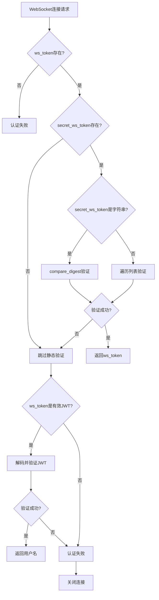
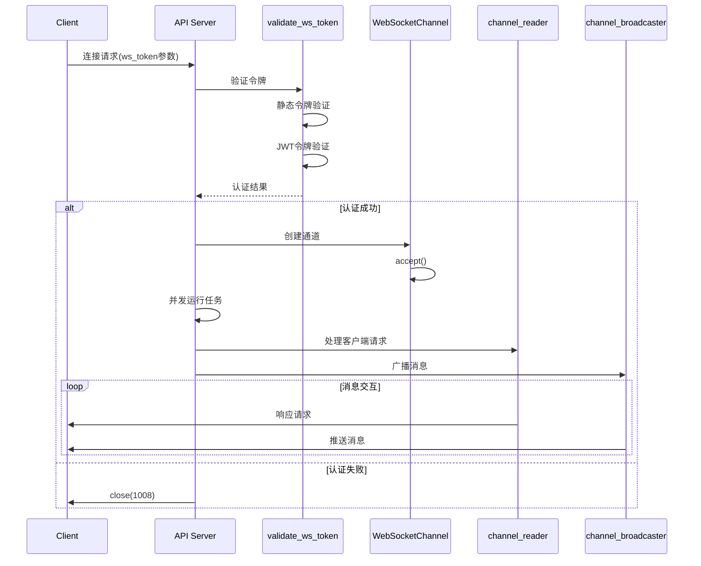
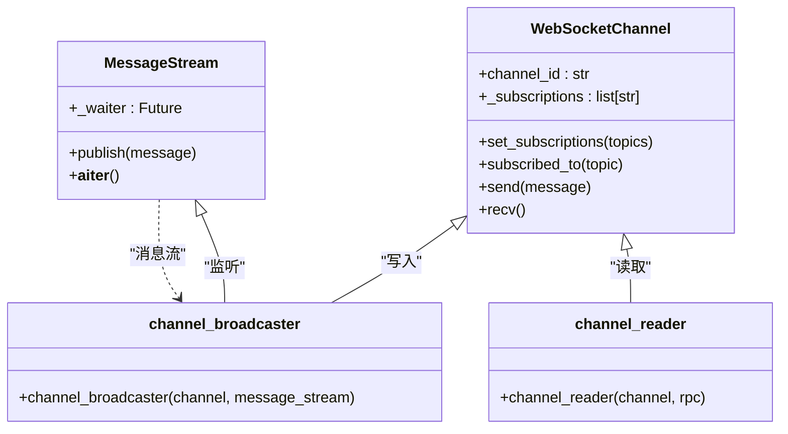

# WebSocket认证

<cite>
**Referenced Files in This Document**   
- [api_auth.py](file://freqtrade/rpc/api_server/api_auth.py)
- [api_ws.py](file://freqtrade/rpc/api_server/api_ws.py)
- [deps.py](file://freqtrade/rpc/api_server/deps.py)
- [message_stream.py](file://freqtrade/rpc/api_server/ws/message_stream.py)
</cite>

## Table of Contents
1. [WebSocket双重认证机制](#websocket双重认证机制)
2. [静态令牌与JWT令牌验证流程](#静态令牌与jwt令牌验证流程)
3. [认证失败处理与安全策略](#认证失败处理与安全策略)
4. [WebSocket连接建立流程](#websocket连接建立流程)
5. [消息流与通道管理](#消息流与通道管理)

## WebSocket双重认证机制

WebSocket连接的双重认证机制通过`validate_ws_token`函数实现，该函数位于`api_auth.py`文件中，作为FastAPI依赖项被WebSocket端点调用。系统支持两种认证方式：静态令牌（ws_token）和JWT令牌，客户端可通过`ws_token`查询参数提供认证信息。

当WebSocket连接请求到达时，系统首先从API配置中获取预设的`secret_ws_token`（支持字符串或列表形式）和`jwt_secret_key`。认证流程采用优先级顺序：先验证静态令牌，再尝试JWT验证。这种双重机制为不同安全需求的部署场景提供了灵活性，既支持简单的静态密钥认证，也支持具备时效性和用户身份信息的JWT认证。

**Section sources**
- [api_auth.py](file://freqtrade/rpc/api_server/api_auth.py#L55-L85)

## 静态令牌与JWT令牌验证流程

### 静态令牌验证
静态令牌验证支持两种配置形式：单个字符串或字符串列表。系统首先检查`secret_ws_token`的类型，若为字符串则直接使用`secrets.compare_digest`进行恒定时间比较；若为列表则遍历所有可能的令牌，任一匹配即通过验证。此设计允许系统配置多个有效令牌，便于令牌轮换和多客户端管理。

### JWT令牌验证
当静态令牌验证失败后，系统将`ws_token`参数视为JWT令牌进行验证。通过`get_user_from_token`函数，使用配置的`jwt_secret_key`解码令牌，并验证其签名、过期时间（exp）和签发时间（iat）。系统特别检查令牌的`type`字段是否为`access`，确保仅接受访问令牌。JWT验证成功后，函数返回用户名作为认证结果。

两种验证方式均采用安全实践：静态令牌比较使用`secrets.compare_digest`防止时序攻击，JWT验证使用标准的`HS256`算法和适当的异常处理。

**Diagram sources**
- [api_auth.py](file://freqtrade/rpc/api_server/api_auth.py#L55-L85)
- [api_auth.py](file://freqtrade/rpc/api_server/api_auth.py#L33-L49)

**Section sources**
- [api_auth.py](file://freqtrade/rpc/api_server/api_auth.py#L55-L85)
- [api_auth.py](file://freqtrade/rpc/api_server/api_auth.py#L33-L49)

## 认证失败处理与安全策略

当静态令牌和JWT令牌验证均失败时，系统执行严格的安全策略：通过`await ws.close(code=status.WS_1008_POLICY_VIOLATION)`关闭WebSocket连接，并返回状态码`1008`（POLICY_VIOLATION）。此状态码明确表示连接因违反安全策略而被终止，而非普通的连接关闭。

这种设计确保了系统的零信任原则：任何无法通过双重认证的客户端都无法建立实时通信通道。`WS_1008_POLICY_VIOLATION`状态码的选择符合WebSocket协议规范，能够向客户端清晰传达连接终止的原因，便于故障排查。同时，该机制防止了未授权客户端消耗服务器资源或获取敏感市场数据。

**Section sources**
- [api_auth.py](file://freqtrade/rpc/api_server/api_auth.py#L75-L85)

## WebSocket连接建立流程

WebSocket连接的建立由`message_endpoint`函数管理，该函数定义在`api_ws.py`文件中，映射到`/api/v1/message/ws`路径。该端点采用依赖注入模式，自动调用`validate_ws_token`进行认证，并获取RPC实例和消息流。

认证成功后，系统通过`create_channel`上下文管理器创建`WebSocketChannel`实例，确保连接的正确打开和关闭。连接建立后，系统并发运行两个核心任务：`channel_reader`负责处理客户端请求，`channel_broadcaster`负责向客户端广播消息。这种分离设计实现了请求处理和消息推送的解耦，提高了系统的可维护性和扩展性。

**Diagram sources**
- [api_ws.py](file://freqtrade/rpc/api_server/api_ws.py#L113-L123)
- [api_ws.py](file://freqtrade/rpc/api_server/api_ws.py#L30-L41)
- [api_ws.py](file://freqtrade/rpc/api_server/api_ws.py#L44-L60)

**Section sources**
- [api_ws.py](file://freqtrade/rpc/api_server/api_ws.py#L113-L123)

## 消息流与通道管理

系统采用发布-订阅模式管理WebSocket消息流。`MessageStream`类作为中央消息总线，允许生产者发布消息，消费者订阅感兴趣的消息类型。每个WebSocket连接对应一个`WebSocketChannel`实例，该实例维护订阅的主题列表，并通过`subscribed_to`方法过滤消息。

`channel_broadcaster`协程持续监听`MessageStream`，当收到新消息时，检查通道是否订阅了该消息类型。若订阅，则通过`send`方法发送消息，并启用超时保护（`use_timeout=True`）防止慢速客户端阻塞事件循环。系统还监控通道延迟，当消息延迟超过60秒时记录警告，提示可能的内存泄漏风险。

**Diagram sources**
- [message_stream.py](file://freqtrade/rpc/api_server/ws/message_stream.py#L1-L32)
- [api_ws.py](file://freqtrade/rpc/api_server/api_ws.py#L30-L60)

**Section sources**
- [message_stream.py](file://freqtrade/rpc/api_server/ws/message_stream.py#L1-L32)
- [api_ws.py](file://freqtrade/rpc/api_server/api_ws.py#L30-L60)