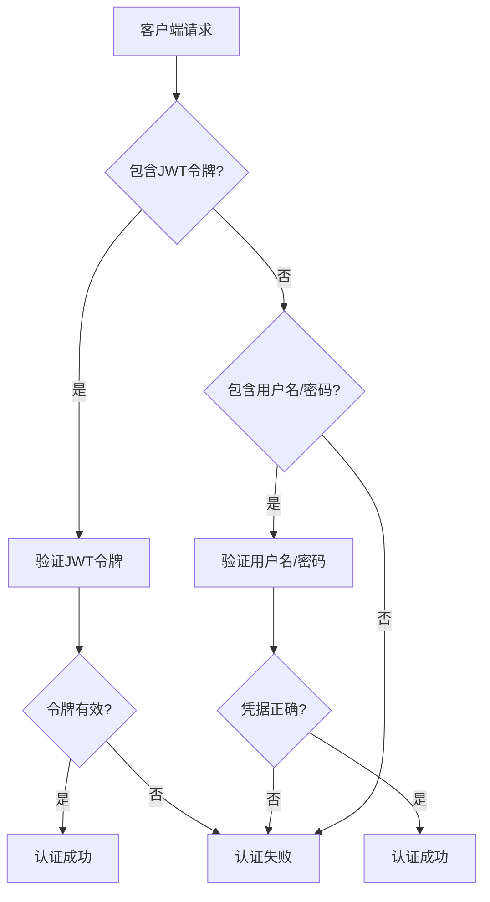
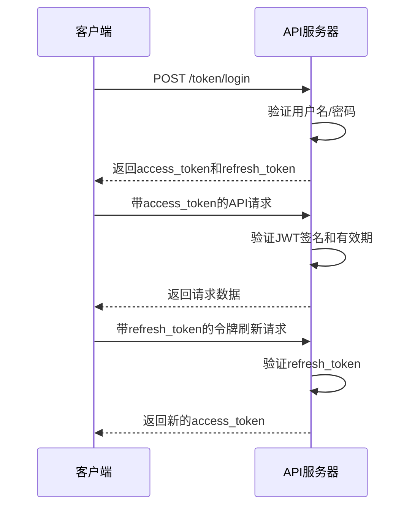
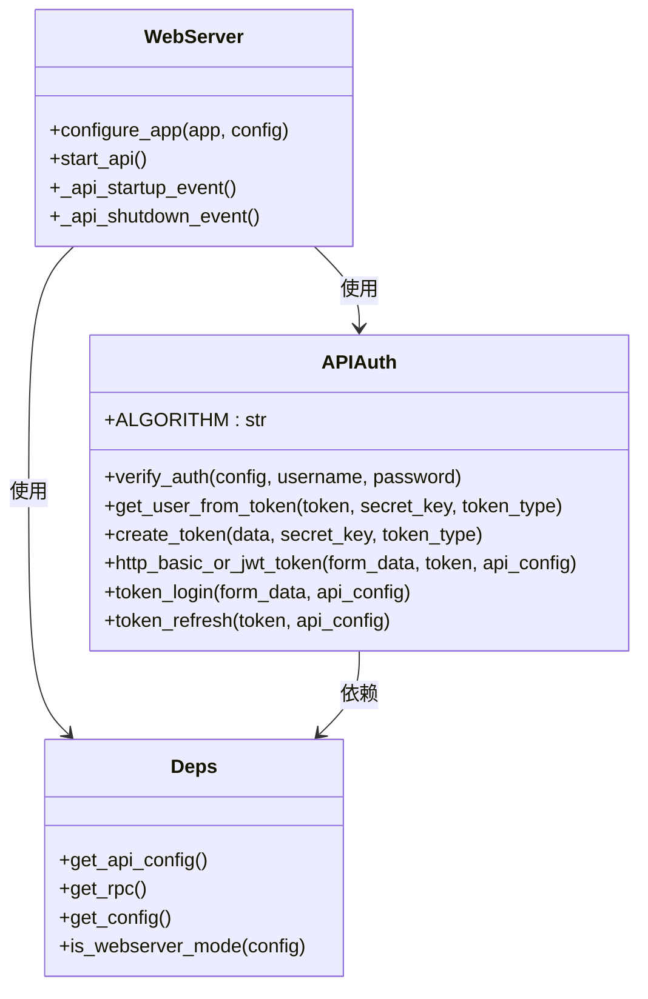

# 认证机制配置

<cite>
**本文档中引用的文件**
- [api_auth.py](file://freqtrade/rpc/api_server/api_auth.py)
- [webserver.py](file://freqtrade/rpc/api_server/webserver.py)
- [config.json](file://user_data/config.json)
- [deps.py](file://freqtrade/rpc/api_server/deps.py)
- [schema.json](file://build_helpers/schema.json)
</cite>

## 目录
1. [简介](#简介)
2. [认证方式详解](#认证方式详解)
3. [配置文件中的认证参数](#配置文件中的认证参数)
4. [JWT密钥安全](#jwt密钥安全)
5. [认证中间件工作流程](#认证中间件工作流程)
6. [依赖注入机制](#依赖注入机制)
7. [安全建议](#安全建议)

## 简介
Freqtrade API服务器提供了两种认证方式：HTTP基本认证和JWT令牌认证。这两种机制共同保障了API接口的安全访问，允许用户通过用户名/密码进行初始认证，并通过JWT令牌实现后续的无状态认证。本文档将深入解析这两种认证方式的实现原理、配置要求和安全最佳实践。

## 认证方式详解

Freqtrade API服务器支持两种主要的认证方式：HTTP基本认证和JWT（JSON Web Token）令牌认证。HTTP基本认证是一种简单的认证机制，客户端在请求头中直接发送经过Base64编码的用户名和密码。而JWT令牌认证则是一种更现代、更安全的无状态认证方式，用户在首次认证成功后会获得一个JWT令牌，后续请求只需携带该令牌即可完成认证。

这两种认证方式在API服务器中是并行支持的，系统会优先尝试JWT令牌认证，如果令牌不存在或无效，则回退到HTTP基本认证。这种设计既保证了向后兼容性，又提供了更安全的认证选项。对于WebSocket连接，系统还支持专门的ws_token认证方式，为实时数据流提供额外的安全层。

**Section sources**
- [api_auth.py](file://freqtrade/rpc/api_server/api_auth.py#L107-L147)
- [webserver.py](file://freqtrade/rpc/api_server/webserver.py#L118-L136)

## 配置文件中的认证参数

在配置文件中，`username`和`password`字段用于配置HTTP基本认证所需的凭据。这些参数位于`api_server`配置对象下，是启用API服务器基本安全保护的必要条件。`username`字段定义了访问API所需的用户名，而`password`字段则定义了对应的密码。这两个字段的值在认证过程中会与客户端提供的凭据进行恒定时间比较（constant-time comparison），以防止时序攻击。

强密码策略对于保护API服务器至关重要。密码应当足够复杂，包含大小写字母、数字和特殊字符的组合，并且长度不应过短。配置文件中的示例密码"SuperSecurePassword"强调了使用高强度密码的重要性。系统在启动时会检查是否配置了密码，如果没有配置，会发出明确的安全警告，提醒用户这可能带来安全风险。

**Diagram sources**
- [api_auth.py](file://freqtrade/rpc/api_server/api_auth.py#L107-L147)
- [webserver.py](file://freqtrade/rpc/api_server/webserver.py#L136)

**Section sources**
- [config.json](file://user_data/config.json#L80-L82)
- [schema.json](file://build_helpers/schema.json#L976-L980)

## JWT密钥安全

`jwt_secret_key`在JWT认证机制中扮演着核心角色，它是生成和验证JWT令牌的密钥。所有JWT令牌的签名都基于这个密钥，因此密钥的强度直接决定了认证系统的安全性。系统使用HS256算法对令牌进行签名，这是一种基于哈希的对称签名算法，要求密钥必须保密。

使用默认值如"super-secret"或"somethingrandom"存在严重的安全隐患，因为这些值是公开已知的，攻击者可以轻易地生成有效的JWT令牌来访问系统。系统在启动时会检测`jwt_secret_key`是否为默认值，并发出明确的安全警告。为了确保安全，用户应当生成一个高强度的随机密钥，理想情况下应使用至少32个字符的随机字符串，包含字母、数字和特殊字符的组合。

**Diagram sources**
- [api_auth.py](file://freqtrade/rpc/api_server/api_auth.py#L124-L160)
- [webserver.py](file://freqtrade/rpc/api_server/webserver.py#L118)

**Section sources**
- [config.json](file://user_data/config.json#L79)
- [api_auth.py](file://freqtrade/rpc/api_server/api_auth.py#L33-L61)

## 认证中间件工作流程

认证中间件的工作流程始于`http_basic_or_jwt_token`函数，该函数作为FastAPI的依赖注入函数被多个路由使用。当收到API请求时，中间件首先检查请求中是否包含JWT令牌。如果存在令牌，则调用`get_user_from_token`函数验证令牌的签名、有效期和类型。验证过程包括解码JWT、检查`exp`（过期时间）声明、`iat`（签发时间）声明以及`type`声明是否匹配预期的令牌类型。

如果JWT令牌验证失败或不存在，中间件会尝试HTTP基本认证。它会提取请求头中的用户名和密码，并与配置文件中的值进行比较。整个认证过程采用恒定时间比较算法，防止通过测量响应时间来推断凭据的正确性。认证成功后，中间件返回用户名，该用户名随后可用于后续的业务逻辑处理。

**Section sources**
- [api_auth.py](file://freqtrade/rpc/api_server/api_auth.py#L107-L147)
- [webserver.py](file://freqtrade/rpc/api_server/webserver.py#L136)

## 依赖注入机制

Freqtrade API服务器使用FastAPI的依赖注入系统来管理认证相关的组件。`get_api_config`函数是一个关键的依赖注入函数，它从全局配置中提取`api_server`配置部分，为认证函数提供所需的配置参数。这种设计实现了配置与业务逻辑的解耦，使得认证函数无需直接访问全局状态。

认证中间件通过`Depends`装饰器被注入到各个API路由中。例如，在`webserver.py`中，`dependencies=[Depends(http_basic_or_jwt_token)]`这一行将认证中间件应用到特定的路由组。这种机制确保了所有受保护的端点在执行业务逻辑之前都会经过统一的认证检查。依赖注入系统还支持异步函数，使得`validate_ws_token`这样的异步认证函数能够无缝集成到WebSocket路由中。

**Diagram sources**
- [api_auth.py](file://freqtrade/rpc/api_server/api_auth.py#L1-L161)
- [deps.py](file://freqtrade/rpc/api_server/deps.py#L42-L43)
- [webserver.py](file://freqtrade/rpc/api_server/webserver.py#L118-L161)

**Section sources**
- [deps.py](file://freqtrade/rpc/api_server/deps.py#L42-L43)
- [webserver.py](file://freqtrade/rpc/api_server/webserver.py#L118-L161)

## 安全建议

为了确保Freqtrade API服务器的安全性，强烈建议采取以下措施：首先，必须配置强密码策略，使用包含大小写字母、数字和特殊字符的复杂密码。其次，`jwt_secret_key`绝不能使用默认值，应当生成一个高强度的随机密钥。系统在启动时会检查这些安全配置，并在发现潜在风险时发出警告。

此外，建议将API服务器绑定到回环地址（127.0.0.1），避免对外部网络暴露。如果必须对外提供服务，应通过反向代理和防火墙规则进行保护。定期轮换`jwt_secret_key`和认证凭据也是良好的安全实践。最后，应监控系统日志中的安全警告，及时发现和修复配置问题。

**Section sources**
- [webserver.py](file://freqtrade/rpc/api_server/webserver.py#L200-L230)
- [config.json](file://user_data/config.json#L79-L82)