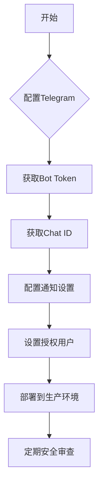

# Telegram机器人配置

<cite>
**本文档中引用的文件**   
- [config.json](file://user_data/config.json)
- [telegram.py](file://freqtrade/rpc/telegram.py)
- [config_schema.py](file://freqtrade/config_schema/config_schema.py)
- [schema.json](file://build_helpers/schema.json)
</cite>

## 目录
1. [简介](#简介)
2. [核心配置体系](#核心配置体系)
3. [通知系统配置](#通知系统配置)
4. [授权用户与安全](#授权用户与安全)
5. [自定义快捷命令面板](#自定义快捷命令面板)
6. [高级选项与生产实践](#高级选项与生产实践)
7. [常见问题排查](#常见问题排查)
8. [结论](#结论)

## 简介
Telegram远程控制是Freqtrade交易机器人的重要功能，它允许用户通过Telegram即时通讯应用实时监控和管理交易活动。本指南详细说明了如何配置和使用Telegram功能，包括获取和设置认证信息、精细化控制通知、配置授权用户以及使用高级功能。通过合理配置，用户可以在移动设备上随时掌握交易状态并执行关键操作。

## 核心配置体系

Telegram配置体系的核心是`telegram`配置块，它包含连接和身份验证所需的关键参数。在配置文件中，必须启用Telegram并提供有效的认证信息。

**配置参数说明：**
- **enabled**: 启用或禁用Telegram通知功能
- **token**: Telegram机器人的API令牌，用于身份验证
- **chat_id**: 接收消息的目标聊天或群组ID
- **topic_id**: 群组中特定话题的ID，用于消息隔离

要获取这些信息，用户需要在Telegram中创建一个机器人并获取其token，然后通过发送消息给机器人来获取chat_id。topic_id仅在群组聊天中使用，可以将不同类型的交易通知分隔到不同的话题中，实现消息的组织和隔离。

```json
"telegram": {
    "enabled": true,
    "token": "your_telegram_token",
    "chat_id": "your_telegram_chat_id",
    "topic_id": "optional_topic_id"
}
```

**Section sources**
- [config.json](file://user_data/config.json#L70-L76)

## 通知系统配置

通知系统通过`notification_settings`配置块实现精细化控制，允许用户为不同类型的事件设置不同的通知级别。

### 通知类型与级别
通知级别有三种状态：
- **on**: 正常通知，伴有提示音
- **off**: 完全禁用通知
- **silent**: 静默通知，无提示音

支持的通知类型包括：
- **ENTRY/ENTRY_FILL**: 交易入场信号
- **EXIT/EXIT_FILL**: 交易出场信号
- **STATUS**: 系统状态更新
- **WARNING**: 警告信息
- **PROTECTION_TRIGGER**: 保护机制触发

### 精细化退出通知配置
对于退出通知，系统支持基于`exit_reason`的精细化配置。例如，可以为不同的退出原因设置不同的通知级别：

```json
"notification_settings": {
    "exit": {
        "roi": "silent",
        "stop_loss": "on",
        "trailing_stop_loss": "on",
        "emergency_exit": "on",
        "*": "off"
    }
}
```

上述配置表示：ROI退出时静默通知，止损和追踪止损退出时正常通知，紧急退出时正常通知，其他所有退出原因的通知都被关闭。`*`作为通配符，定义了默认行为。

**Section sources**
- [config_schema.py](file://freqtrade/config_schema/config_schema.py#L524-L576)
- [schema.json](file://build_helpers/schema.json#L649-L786)

## 授权用户与安全

### 授权用户列表
`authorized_users`配置项允许指定哪些Telegram用户可以向机器人发送命令。这是一个安全关键功能，防止未授权用户控制交易机器人。

```json
"authorized_users": [
    "123456789",
    "987654321"
]
```

用户ID是Telegram用户的唯一标识符。只有列表中的用户才能执行`/start`、`/stop`等控制命令。

### 安全意义
此配置提供了多层安全保障：
1. **身份验证**: 即使攻击者获取了chat_id，也无法控制机器人
2. **权限分离**: 可以让多个用户接收通知，但只允许特定用户执行操作
3. **审计追踪**: 所有命令都与特定用户ID关联，便于追踪

**Section sources**
- [telegram.py](file://freqtrade/rpc/telegram.py#L100-L140)
- [config_schema.py](file://freqtrade/config_schema/config_schema.py#L515-L523)

## 自定义快捷命令面板

### 自定义键盘配置
通过`keyboard`配置项，用户可以自定义Telegram中的快捷命令面板，将常用命令组织成易于访问的按钮。

```json
"keyboard": [
    ["/daily", "/profit", "/balance"],
    ["/status", "/performance"],
    ["/start", "/stop"]
]
```

### 配置规则
- 只能使用预定义的有效命令
- 不能包含需要参数的命令
- 无效命令会导致配置错误

系统会验证自定义键盘中的所有命令，确保它们是安全且有效的。这既提供了灵活性，又保证了系统的稳定性。

**Section sources**
- [telegram.py](file://freqtrade/rpc/telegram.py#L164-L226)
- [test_rpc_telegram.py](file://tests/rpc/test_rpc_telegram.py#L2872-L2925)

## 高级选项与生产实践

### balance_dust_level配置
`balance_dust_level`用于定义被视为"灰尘"的最小余额水平。在余额查询中，低于此阈值的资产会被汇总显示，避免消息过长。

```json
"balance_dust_level": 0.0001
```

### 生产环境安全最佳实践
1. **环境变量**: 将敏感信息（如token、chat_id）通过环境变量设置
2. **最小权限**: 仅授权必要的用户
3. **通知分级**: 根据重要性设置不同的通知级别
4. **定期审查**: 定期检查授权用户列表和通知配置



**Diagram sources **
- [config.json](file://user_data/config.json#L70-L76)
- [telegram.py](file://freqtrade/rpc/telegram.py#L615-L651)

**Section sources**
- [config.json](file://user_data/config.json#L70-L76)
- [telegram.py](file://freqtrade/rpc/telegram.py#L1226-L1340)

## 常见问题排查

### 连接问题
1. **机器人未响应**: 检查token是否正确，机器人是否已启动
2. **消息未收到**: 确认chat_id正确，用户已与机器人开始对话
3. **命令无效**: 检查自定义键盘命令是否在允许列表中

### 通知问题
1. **通知缺失**: 检查`notification_settings`配置，确认级别不是"off"
2. **过多通知**: 使用"silent"级别或精细化配置减少干扰
3. **消息截断**: 启用`reload`选项或调整`balance_dust_level`

### 安全问题
1. **未授权访问**: 立即检查`authorized_users`列表，移除未知用户
2. **配置泄露**: 避免在代码仓库中存储敏感信息，使用环境变量

**Section sources**
- [telegram.py](file://freqtrade/rpc/telegram.py#L248-L341)
- [telegram.py](file://freqtrade/rpc/telegram.py#L377-L384)

## 结论
Telegram远程控制为Freqtrade机器人提供了强大而灵活的监控和管理能力。通过合理配置bot_token、chat_id和topic_id，用户可以实现安全的消息隔离。精细化的通知控制系统允许用户根据交易策略的重要性定制通知级别，避免信息过载。授权用户机制提供了关键的安全保障，确保只有可信用户才能控制交易活动。结合自定义快捷命令面板和高级选项，用户可以在生产环境中高效、安全地管理自动化交易系统。