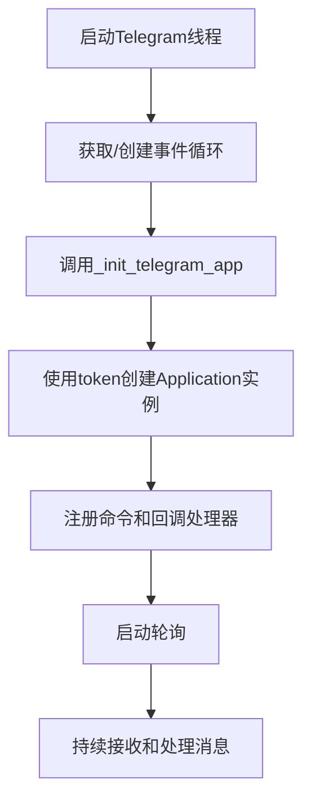

# Telegram连接配置

<cite>
**本文档中引用的文件**  
- [config_full.example.json](file://config_examples/config_full.example.json)
- [telegram.py](file://freqtrade/rpc/telegram.py)
- [config_schema.py](file://freqtrade/config_schema/config_schema.py)
</cite>

## 目录
1. [核心参数详解](#核心参数详解)  
2. [配置文件示例分析](#配置文件示例分析)  
3. [Telegram应用初始化](#telegram应用初始化)  
4. [实际操作步骤](#实际操作步骤)  
5. [生产环境安全建议](#生产环境安全建议)

## 核心参数详解

Telegram机器人连接配置的核心参数包括`bot_token`、`chat_id`和可选的`topic_id`，这些参数共同构建了安全的通信通道。

**bot_token**: 该参数是Telegram机器人的身份验证令牌，由BotFather提供。它用于初始化Telegram应用实例，确保机器人能够与Telegram服务器进行通信。在配置中，该参数通过`token`字段指定。

**chat_id**: 该参数标识了接收消息的目标聊天或群组。只有来自指定`chat_id`的消息才会被处理，这提供了基本的安全控制。在代码中，通过比较传入消息的`chat_id`与配置中的`chat_id`来实现授权检查。

**topic_id**: 此可选参数用于指定群组中的特定主题（话题）。当在Telegram群组中使用时，`topic_id`允许将机器人消息隔离到特定讨论线程中，避免干扰其他对话。如果配置了`topic_id`，则只有来自该主题的消息才会被接受。

这些参数共同作用，确保了通信的安全性和针对性。`bot_token`验证机器人身份，`chat_id`限制消息来源，而`topic_id`进一步细化消息路由。

**Section sources**
- [config_full.example.json](file://config_examples/config_full.example.json#L178-L188)
- [telegram.py](file://freqtrade/rpc/telegram.py#L107-L118)

## 配置文件示例分析

`config_full.example.json`文件提供了Telegram配置的完整示例：

```json
"telegram": {
    "enabled": false,
    "token": "your_telegram_token",
    "chat_id": "your_telegram_chat_id",
    "notification_settings": {
        "status": "on",
        "warning": "on",
        "startup": "on",
        "entry": "on",
        "entry_fill": "on",
        "exit": {
            "roi": "off",
            "emergency_exit": "off",
            "force_exit": "off",
            "exit_signal": "off",
            "trailing_stop_loss": "off",
            "stop_loss": "off",
            "stoploss_on_exchange": "off",
            "custom_exit": "off"
        },
        "exit_fill": "on",
        "entry_cancel": "on",
        "exit_cancel": "on",
        "protection_trigger": "off",
        "protection_trigger_global": "on",
        "show_candle": "off"
    },
    "reload": true,
    "balance_dust_level": 0.01
}
```

从该示例可以看出：
- `token`和`chat_id`是必填字段，分别用于设置机器人令牌和目标聊天ID。
- `notification_settings`允许精细控制不同类型通知的发送行为，使用"on"、"off"或"silent"选项。
- 配置中明确建议通过环境变量（如`FREQTRADE__TELEGRAM__CHAT_ID`）来设置敏感信息，以增强安全性。

**Section sources**
- [config_full.example.json](file://config_examples/config_full.example.json#L178-L206)

## Telegram应用初始化

`telegram.py`文件中的`_init_telegram_app()`方法负责使用配置参数初始化Telegram应用实例：

```python
def _init_telegram_app(self):
    return Application.builder().token(self._config["telegram"]["token"]).build()
```

该方法通过Telegram Bot API的Application构建器，使用配置中的`token`创建应用实例。整个初始化流程如下：

1. 在`Telegram`类的`__init__`方法中调用`_start_thread()`启动独立线程。
2. `_init()`方法在新线程中执行，首先获取或创建异步事件循环。
3. 调用`_init_telegram_app()`创建应用实例。
4. 注册所有命令处理器（如/status、/profit等）和回调处理器。
5. 调用`_startup_telegram()`启动Telegram机器人的轮询。

授权检查通过`authorized_only`装饰器实现，该装饰器在每个命令处理前验证`chat_id`和可选的`topic_id`，确保只有来自授权来源的消息被处理。



**Diagram sources**
- [telegram.py](file://freqtrade/rpc/telegram.py#L245-L246)
- [telegram.py](file://freqtrade/rpc/telegram.py#L140-L158)

**Section sources**
- [telegram.py](file://freqtrade/rpc/telegram.py#L245-L246)
- [telegram.py](file://freqtrade/rpc/telegram.py#L140-L158)

## 实际操作步骤

配置Telegram机器人通信通道的完整步骤如下：

1. **创建机器人**：在Telegram中与@BotFather对话，使用`/newbot`命令创建新机器人，获取唯一的`bot_token`。

2. **获取chat_id**：
   - 将机器人添加到目标聊天或群组。
   - 访问`https://api.telegram.org/bot<your_token>/getUpdates`（将`<your_token>`替换为实际令牌）。
   - 在返回的JSON数据中查找`message.chat.id`字段的值。

3. **确定topic_id（可选）**：
   - 如果在群组主题中使用机器人，需要获取主题ID。
   - 在目标主题中发送一条消息给机器人。
   - 再次调用`getUpdates`API，查找`message.message_thread_id`字段的值。

4. **配置参数**：
   - 在`config.json`中设置`telegram.enabled`为`true`。
   - 将获取的`bot_token`填入`token`字段。
   - 将获取的`chat_id`填入`chat_id`字段。
   - 如需使用主题，将`topic_id`填入相应字段。

5. **测试连接**：启动Freqtrade，发送`/status`命令到Telegram聊天，验证是否收到回复。

**Section sources**
- [config_full.example.json](file://config_examples/config_full.example.json#L178-L188)
- [telegram.py](file://freqtrade/rpc/telegram.py#L107-L118)

## 生产环境安全建议

在生产环境中配置Telegram连接时，应遵循以下安全最佳实践：

1. **使用环境变量**：敏感信息如`token`和`chat_id`应通过环境变量设置，而非直接写入配置文件。系统支持`FREQTRADE__TELEGRAM__TOKEN`和`FREQTRADE__TELEGRAM__CHAT_ID`等环境变量。

2. **限制授权用户**：利用`authorized_users`配置项，仅允许特定Telegram用户ID与机器人交互，防止未授权控制。

3. **合理设置通知**：通过`notification_settings`精细控制通知类型，避免关键信息被无关消息淹没。例如，可将`protection_trigger`设为"off"以减少干扰。

4. **定期轮换令牌**：定期通过BotFather重置`bot_token`，并更新配置，以降低令牌泄露的风险。

5. **监控日志**：关注日志中关于"Rejected unauthorized message"的记录，及时发现并阻止未授权访问尝试。

遵循这些安全建议，可以确保Telegram通信通道既可靠又安全，为交易机器人提供有效的监控和控制能力。

**Section sources**
- [config_schema.py](file://freqtrade/config_schema/config_schema.py#L463-L498)
- [telegram.py](file://freqtrade/rpc/telegram.py#L90-L137)
- [config_full.example.json](file://config_examples/config_full.example.json#L178-L188)