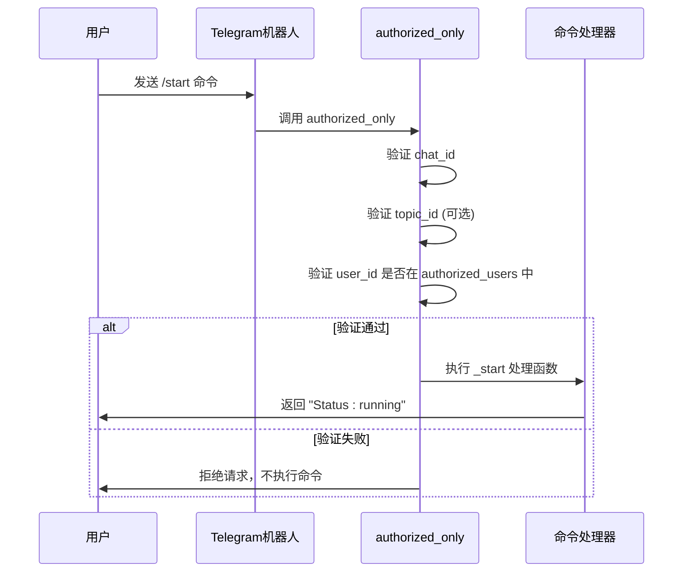

# 安全与授权控制

<cite>
**本文档中引用的文件**  
- [telegram.py](file://freqtrade/rpc/telegram.py#L90-L137)
- [config_full.example.json](file://config_examples/config_full.example.json#L188-L204)
</cite>

## 目录
1. [授权用户列表配置](#授权用户列表配置)
2. [authorized_only装饰器安全机制](#authorized_only装饰器安全机制)
3. [自定义快捷命令面板](#自定义快捷命令面板)
4. [高级安全选项](#高级安全选项)
5. [最佳实践](#最佳实践)

## 授权用户列表配置

在多用户环境中，Telegram机器人的安全控制首先依赖于`authorized_users`授权用户列表的正确配置。该列表定义了哪些Telegram用户ID被允许发送控制命令。配置方法是在`config.json`文件的`telegram`部分添加`authorized_users`数组，其中包含允许用户的Telegram用户ID字符串。此机制确保即使攻击者获取了机器人的聊天ID和token，也无法执行关键操作，从而实现了基于用户身份的访问控制。

**Section sources**
- [config_full.example.json](file://config_examples/config_full.example.json#L188-L204)

## authorized_only装饰器安全机制

`authorized_only`装饰器是Telegram机器人安全的核心，它通过三重验证来防止未授权访问。首先，它验证消息来源的`chat_id`是否与配置文件中指定的`chat_id`匹配，确保消息来自正确的聊天群组。其次，在多主题环境中，它检查`topic_id`是否匹配，防止来自错误子频道的消息被处理。最后，也是最关键的一步，它检查发送者的`user_id`是否存在于`authorized_users`列表中。如果用户ID不在授权列表中，即使消息来自正确的聊天和主题，也会被拒绝并记录警告。这种基于装饰器的验证机制被应用于所有关键命令处理函数，如`_force_exit`和`_start`，为机器人提供了统一的安全防护层。

**Diagram sources**
- [telegram.py](file://freqtrade/rpc/telegram.py#L90-L137)

**Section sources**
- [telegram.py](file://freqtrade/rpc/telegram.py#L90-L137)

## 自定义快捷命令面板

`custom_keyboard`功能允许用户定义安全的命令集合，以简化操作。配置方式是在`config.json`的`telegram`部分添加`keyboard`数组，其中每个元素代表一行按钮，每个按钮对应一个允许的命令。系统在启动时会严格验证所有自定义命令，确保它们属于预定义的安全命令列表（如`/status`, `/profit`, `/stop`等），并拒绝任何包含参数的命令（如`/forcebuy BTC`），从而防止通过自定义键盘执行高风险的强制交易操作。这种机制在提供便利性的同时，通过限制可执行命令的范围来增强安全性。

**Section sources**
- [telegram.py](file://freqtrade/rpc/telegram.py#L162-L188)

## 高级安全选项

`balance_dust_level`等高级选项也涉及安全考量。该选项定义了在`/balance`命令响应中被视为“灰尘”（dust）的最小余额阈值。低于此阈值的余额会被汇总显示，而不是单独列出，这可以防止通过余额查询精确探测账户的微小资金变动，增加了一层信息隐藏的安全性。此外，`notification_settings`允许为不同类型的警报设置不同的通知级别（on, off, silent），用户可以关闭高风险操作（如`emergency_exit`）的通知，减少敏感信息的暴露。

**Section sources**
- [config_full.example.json](file://config_examples/config_full.example.json#L198-L204)

## 最佳实践

为了确保Telegram机器人的最高安全性，应遵循以下最佳实践：首先，严格遵守最小权限原则，仅将`authorized_users`列表授予绝对必要的用户，并优先使用`custom_keyboard`来限制可用命令。其次，必须定期审查和更新`authorized_users`列表，及时移除不再需要访问权限的用户。最后，绝对避免在配置文件中硬编码敏感信息，如Telegram的`token`和交易所的`key`、`secret`，而应使用环境变量或外部密钥管理服务。这些实践共同构成了一个纵深防御的安全体系，有效保护交易机器人免受未授权访问和潜在攻击。