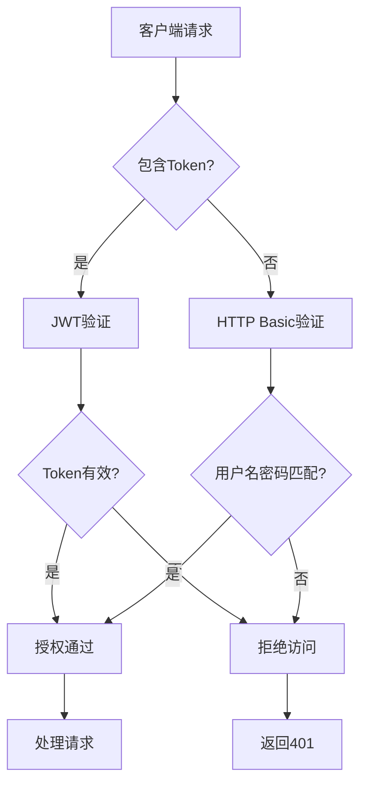

# 远程控制配置

<cite>
**本文档中引用的文件**  
- [telegram.py](file://freqtrade/rpc/telegram.py)
- [webserver.py](file://freqtrade/rpc/api_server/webserver.py)
- [api_auth.py](file://freqtrade/rpc/api_server/api_auth.py)
- [web_ui.py](file://freqtrade/rpc/api_server/web_ui.py)
- [deps.py](file://freqtrade/rpc/api_server/deps.py)
- [api_schemas.py](file://freqtrade/rpc/api_server/api_schemas.py)
- [rpc_manager.py](file://freqtrade/rpc/rpc_manager.py)
- [configuration.py](file://freqtrade/configuration/configuration.py)
</cite>

## 目录
1. [引言](#引言)
2. [Telegram配置体系](#telegram配置体系)
3. [API服务器配置体系](#api服务器配置体系)
4. [远程接口安全暴露机制](#远程接口安全暴露机制)
5. [WebUI访问配置要点](#webui访问配置要点)
6. [生产环境安全加固建议](#生产环境安全加固建议)
7. [故障排查方法](#故障排查方法)
8. [结论](#结论)

## 引言
本文档详细阐述Freqtrade系统的远程控制配置体系，重点分析Telegram和API服务器两大模块的配置机制。通过深入解析配置参数、安全机制和实现逻辑，为用户提供完整的远程控制配置指南。文档涵盖从基础配置到高级安全加固的完整知识体系，帮助用户安全高效地管理交易机器人。

## Telegram配置体系

Telegram模块作为Freqtrade的核心远程控制通道，提供双向通信能力。其配置体系围绕身份验证、消息通知和用户交互三大功能构建。

### 身份验证配置
Telegram的身份验证通过`chat_id`和`token`实现双重安全控制。`token`是Telegram Bot API的访问密钥，由BotFather创建Bot时生成。`chat_id`标识接收消息的特定聊天会话，可通过发送消息给GetIDs Bot获取。配置文件中通过`telegram`对象定义：
```json
"telegram": {
    "enabled": true,
    "token": "your_bot_token",
    "chat_id": 123456789
}
```

### 通知控制机制
通知设置通过`notification_settings`对象实现精细化控制。该配置允许用户按消息类型开关通知，支持`on`、`off`和`silent`三种模式：
- `on`：正常通知，触发设备提示音
- `off`：完全禁用该类型通知
- `silent`：接收通知但不触发提示音

支持的控制类型包括：
- `entry`：新交易开仓通知
- `entry_fill`：开仓订单成交通知
- `exit`：平仓通知
- `exit_fill`：平仓订单成交通知
- `status`：系统状态变更通知
- `warning`：警告信息通知

特殊功能`show_candle`可配置为`ohlc`以在通知中包含最新K线数据。

**Section sources**
- [telegram.py](file://freqtrade/rpc/telegram.py#L396)
- [telegram.py](file://freqtrade/rpc/telegram.py#L596)

## API服务器配置体系

API服务器模块提供RESTful和WebSocket接口，支持程序化访问和WebUI集成。其配置体系注重安全性、可访问性和跨域兼容性。

### 网络监听配置
服务器通过`listen_ip_address`和`listen_port`参数定义网络监听地址：
- `listen_ip_address`：监听IP地址，生产环境建议设为`127.0.0.1`以限制外部访问
- `listen_port`：监听端口号，通常设为`8080`

当监听非回环地址且未运行在Docker中时，系统会发出安全警告。

### 认证安全配置
认证体系采用双因素保护机制：

#### 基本身份验证
基于用户名密码的HTTP Basic认证：
```json
"api_server": {
    "username": "your_username",
    "password": "your_password"
}
```
未设置密码时会触发安全警告。

#### JWT安全密钥
JSON Web Token认证使用`jwt_secret_key`作为签名密钥：
- 默认值`super-secret`会触发安全警告
- 必须设置为高强度随机字符串
- 用于生成访问令牌和刷新令牌

**Section sources**
- [webserver.py](file://freqtrade/rpc/api_server/webserver.py#L199)
- [api_auth.py](file://freqtrade/rpc/api_server/api_auth.py#L61)

### 跨域资源共享配置
CORS（跨域资源共享）通过`CORS_origins`参数配置，允许指定来源的Web应用访问API：
```json
"CORS_origins": [
    "http://localhost:8080",
    "https://yourdomain.com"
]
```
此配置在`configure_app`方法中应用，支持通配符和精确匹配。

### 用户名密码认证机制
认证流程在`api_auth.py`中实现，包含以下关键组件：



**Diagram sources**
- [api_auth.py](file://freqtrade/rpc/api_server/api_auth.py#L21)
- [webserver.py](file://freqtrade/rpc/api_server/webserver.py#L140)

## 远程接口安全暴露机制

远程接口的安全暴露通过多层次防护机制实现，确保系统在开放远程控制的同时保持安全性。

### 单例模式与资源管理
API服务器采用单例模式设计，确保全局唯一实例：
```python
def __new__(cls, *args, **kwargs):
    if ApiServer.__instance is None:
        ApiServer.__instance = object.__new__(cls)
    return ApiServer.__instance
```
该设计防止资源重复分配，通过`cleanup`方法确保资源正确释放。

### 中间件安全防护
系统集成多种安全中间件：
- CORSMiddleware：控制跨域访问
- 异常处理器：捕获RPC异常并返回标准化错误
- 事件处理器：管理服务启动和关闭生命周期

### 消息流机制
WebSocket通信通过`MessageStream`实现双向消息流：
```python
def send_msg(self, msg: RPCSendMsg) -> None:
    if ApiServer._message_stream:
        ApiServer._message_stream.publish(msg)
```
该机制确保实时消息能够安全地推送到客户端。

**Section sources**
- [webserver.py](file://freqtrade/rpc/api_server/webserver.py#L34)
- [deps.py](file://freqtrade/rpc/api_server/deps.py#L50)

## WebUI访问配置要点

WebUI集成通过专用路由和静态文件服务实现，提供完整的用户界面访问能力。

### UI路由配置
UI路由在`web_ui.py`中定义，采用路径回退机制：
```python
@router_ui.get("/{rest_of_path:path}", include_in_schema=False)
async def index_html(rest_of_path: str):
    if rest_of_path.startswith("api"):
        raise HTTPException(status_code=404)
    # 返回静态文件或index.html
```
此设计确保API端点与UI资源的正确分离。

### 静态资源服务
系统提供以下静态资源：
- `favicon.ico`：浏览器标签图标
- `fallback_file.html`：降级页面
- `ui_version`：UI版本信息接口

UI文件存储在`ui/installed/`目录，通过`FileResponse`安全返回。

### 安全访问控制
访问控制通过以下机制实现：
- 路径验证：使用`is_relative_to`防止目录遍历攻击
- 媒体类型指定：为.js文件强制设置`application/javascript`类型
- API路径保护：阻止对API路径的直接文件访问

**Section sources**
- [web_ui.py](file://freqtrade/rpc/api_server/web_ui.py#L40)
- [deps.py](file://freqtrade/rpc/api_server/deps.py#L65)

## 生产环境安全加固建议

为确保生产环境安全，建议采取以下加固措施：

### 网络层安全
1. **限制监听地址**：将`listen_ip_address`设为`127.0.0.1`
2. **使用防火墙**：配置防火墙规则限制API端口访问
3. **部署反向代理**：通过Nginx等代理服务器提供SSL终止和访问控制

### 认证层安全
1. **强密码策略**：使用高强度随机密码
2. **定期轮换密钥**：定期更新`jwt_secret_key`
3. **多因素验证**：结合IP白名单和时间限制

### 配置最佳实践
```json
"api_server": {
    "enabled": true,
    "listen_ip_address": "127.0.0.1",
    "listen_port": 8080,
    "username": "secure_user",
    "password": "strong_password_here",
    "jwt_secret_key": "random_32_char_string_here",
    "CORS_origins": ["https://yourdomain.com"]
}
```

### 监控与审计
1. **日志记录**：启用详细日志记录所有API访问
2. **异常告警**：配置失败登录尝试告警
3. **定期审计**：定期审查配置文件和访问日志

## 故障排查方法

当远程控制功能出现故障时，可按以下步骤排查：

### 连接问题排查
1. **检查服务状态**：确认API服务器已成功启动
2. **验证网络连通性**：使用`telnet`测试端口连通性
3. **检查防火墙**：确认防火墙未阻止相关端口

### 认证问题排查
1. **验证凭据**：检查用户名密码是否正确
2. **检查JWT密钥**：确认`jwt_secret_key`配置正确
3. **查看日志**：检查认证失败的具体原因

### 配置验证步骤
```bash
# 1. 验证配置文件语法
python -m json.tool config.json

# 2. 检查API服务器日志
grep "Starting HTTP Server" freqtrade.log

# 3. 测试基本连接
curl http://127.0.0.1:8080/api/v1/ping
```

### 常见问题解决方案
- **502错误**：检查RPC处理器是否正确附加
- **401错误**：验证认证凭据和JWT令牌
- **CORS错误**：检查`CORS_origins`配置是否包含请求来源
- **WebSocket连接失败**：验证`ws_token`配置

## 结论
Freqtrade的远程控制配置体系提供了强大而灵活的管理能力。通过合理配置Telegram和API服务器模块，用户可以实现安全高效的远程监控和操作。关键在于平衡便利性与安全性，遵循最佳实践配置各项参数。生产环境中应特别注意网络暴露面的控制和认证机制的强化，确保交易系统的安全稳定运行。