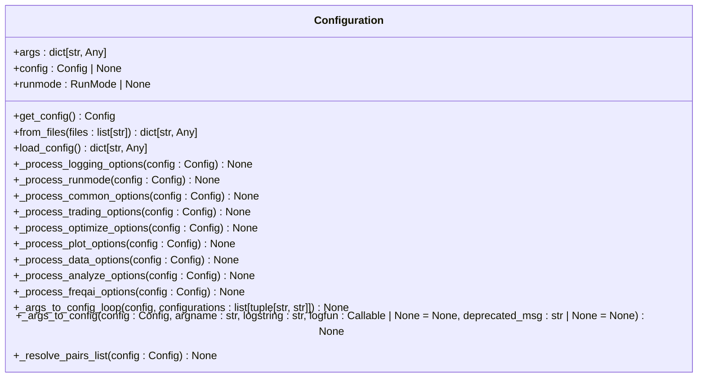
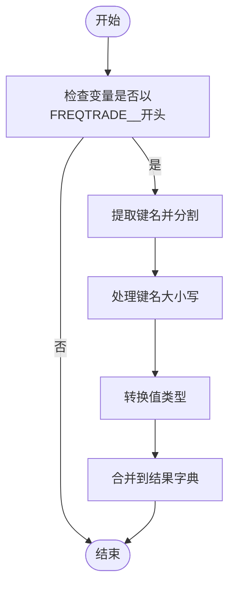
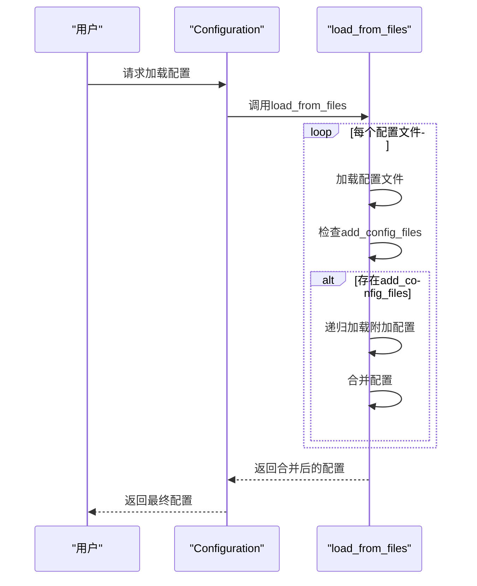
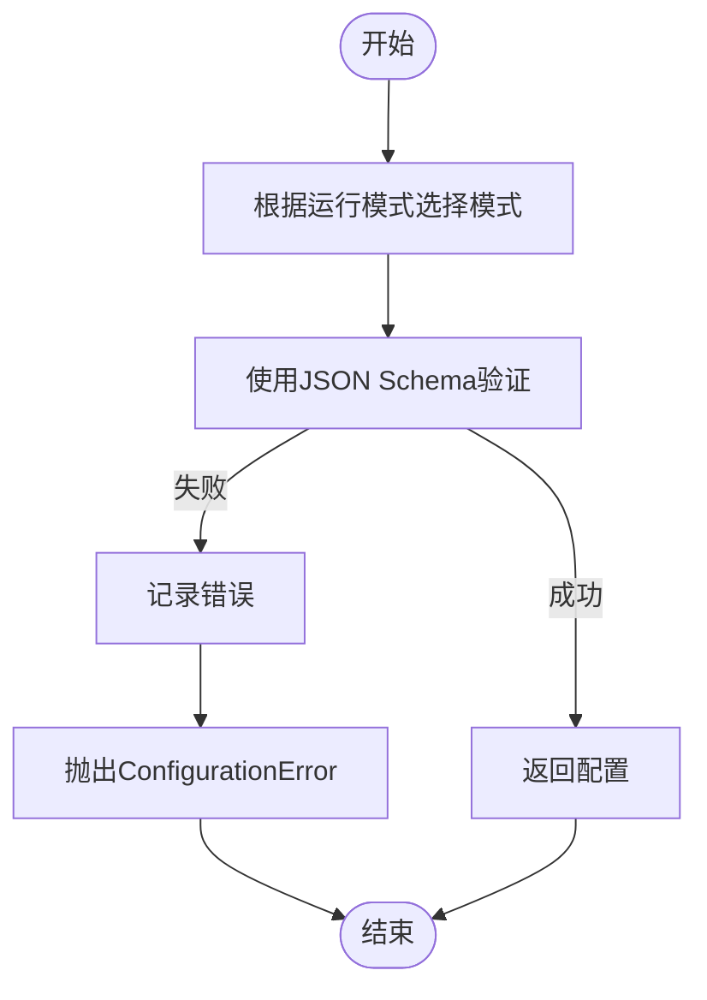
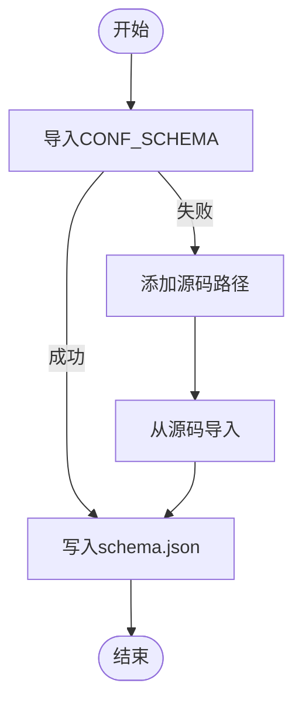

# 配置管理系统

<cite>
**本文档中引用的文件**  
- [config_full.example.json](file://config_examples/config_full.example.json)
- [configuration.py](file://freqtrade/configuration/configuration.py)
- [config_schema.py](file://freqtrade/config_schema/config_schema.py)
- [extract_config_json_schema.py](file://build_helpers/extract_config_json_schema.py)
- [config_validation.py](file://freqtrade/configuration/config_validation.py)
- [environment_vars.py](file://freqtrade/configuration/environment_vars.py)
- [load_config.py](file://freqtrade/configuration/load_config.py)
</cite>

## 目录
1. [配置参数详解](#配置参数详解)
2. [配置加载与合并逻辑](#配置加载与合并逻辑)
3. [环境变量注入机制](#环境变量注入机制)
4. [交易所定制配置](#交易所定制配置)
5. [配置继承与覆盖规则](#配置继承与覆盖规则)
6. [JSON Schema配置校验](#json-schema配置校验)
7. [配置模板生成](#配置模板生成)
8. [配置版本迁移指南](#配置版本迁移指南)
9. [敏感信息安全管理](#敏感信息安全管理)

## 配置参数详解

本节基于`config_full.example.json`文件，逐项解释每个配置参数的含义、取值范围和实际影响。

**Section sources**
- [config_full.example.json](file://config_examples/config_full.example.json)

## 配置加载与合并逻辑

深入分析`configuration.py`中的配置加载、验证与合并逻辑。`Configuration`类负责读取和初始化机器人配置，支持从多个配置文件加载并合并内容。文件按顺序加载，后一个配置文件中的参数会覆盖前一个文件中的同名参数（最后定义的生效）。

**Diagram sources**
- [configuration.py](file://freqtrade/configuration/configuration.py#L33-L546)

**Section sources**
- [configuration.py](file://freqtrade/configuration/configuration.py#L33-L546)

## 环境变量注入机制

`environment_vars.py`模块实现了环境变量注入机制。相关环境变量必须遵循`FREQTRADE__{section}__{key}`的命名模式。该模块会读取环境变量并返回一个嵌套字典，其中包含所有相关变量。`_flat_vars_to_nested_dict`函数负责将扁平化的环境变量转换为嵌套字典结构。

**Diagram sources**
- [environment_vars.py](file://freqtrade/configuration/environment_vars.py#L75-L81)

**Section sources**
- [environment_vars.py](file://freqtrade/configuration/environment_vars.py#L75-L81)

## 交易所定制配置

为不同交易所（如Binance、Kraken）定制配置文件。`config_examples`目录下提供了针对不同交易所的示例配置文件，如`config_binance.example.json`和`config_kraken.example.json`。这些文件展示了如何为特定交易所设置API密钥、交易对白名单和黑名单等。

**Section sources**
- [config_binance.example.json](file://config_examples/config_binance.example.json)
- [config_kraken.example.json](file://config_examples/config_kraken.example.json)

## 配置继承与覆盖规则

配置继承与覆盖规则通过`load_from_files`函数实现。该函数递归加载配置文件，子文件相对于初始配置文件路径。如果配置中包含`add_config_files`字段，会加载指定的附加配置文件，并将其内容合并到主配置中。合并时，后加载的配置会覆盖先加载的配置。

**Diagram sources**
- [load_config.py](file://freqtrade/configuration/load_config.py#L79-L119)

**Section sources**
- [load_config.py](file://freqtrade/configuration/load_config.py#L79-L119)

## JSON Schema配置校验

通过JSON Schema进行配置校验的技术实现。`config_validation.py`模块包含`validate_config_schema`函数，用于验证配置是否符合配置模式。该函数使用`jsonschema`库进行验证，并根据运行模式选择不同的必需字段集合。`FreqtradeValidator`扩展了`Draft4Validator`以支持子模式的默认值。

**Diagram sources**
- [config_validation.py](file://freqtrade/configuration/config_validation.py#L75-L81)

**Section sources**
- [config_validation.py](file://freqtrade/configuration/config_validation.py#L75-L81)

## 配置模板生成

使用`extract_config_json_schema.py`生成文档化配置模板。该脚本从`config_schema.py`文件中提取配置JSON模式，并将其写入`schema.json`文件。此模式可用于生成配置文件的文档和验证。

**Diagram sources**
- [extract_config_json_schema.py](file://build_helpers/extract_config_json_schema.py#L0-L30)

**Section sources**
- [extract_config_json_schema.py](file://build_helpers/extract_config_json_schema.py#L0-L30)

## 配置版本迁移指南

配置版本迁移指南涉及处理废弃设置。`deprecated_settings.py`模块包含`process_temporary_deprecated_settings`函数，用于处理临时废弃的设置。此外，`config_validation.py`中的`_strategy_settings`函数负责将旧的策略设置名称迁移到新的名称，如`use_sell_signal`迁移到`use_exit_signal`。

**Section sources**
- [config_validation.py](file://freqtrade/configuration/config_validation.py#L400-L422)

## 敏感信息安全管理

敏感信息（如API密钥）的安全管理方案。建议通过环境变量设置敏感信息，而不是直接在配置文件中明文存储。例如，Telegram聊天ID可以通过`FREQTRADE__TELEGRAM__CHAT_ID`环境变量设置。此外，配置文件中的密码字段不会被自动转换类型，以保持其原始字符串形式。

**Section sources**
- [environment_vars.py](file://freqtrade/configuration/environment_vars.py#L75-L81)
- [config_full.example.json](file://config_examples/config_full.example.json)