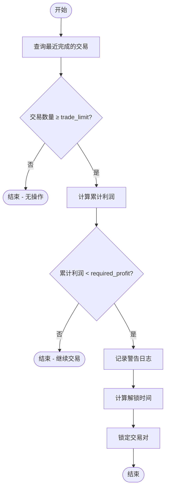
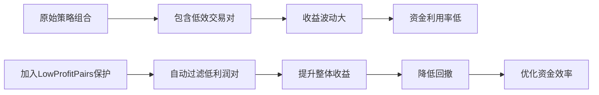

# 低利润交易对过滤配置

<cite>
**本文档引用文件**  
- [low_profit_pairs.py](file://freqtrade/plugins/protections/low_profit_pairs.py)
- [iprotection.py](file://freqtrade/plugins/protections/iprotection.py)
- [protectionmanager.py](file://freqtrade/plugins/protectionmanager.py)
- [config_schema.py](file://freqtrade/config_schema/config_schema.py)
- [config_full.example.json](file://config_examples/config_full.example.json)
</cite>

## 目录
1. [简介](#简介)
2. [核心机制实现逻辑](#核心机制实现逻辑)
3. [关键配置参数解析](#关键配置参数解析)
4. [基于回测数据的配置方案](#基于回测数据的配置方案)
5. [对策略组合优化的影响](#对策略组合优化的影响)
6. [多交易对策略实践建议](#多交易对策略实践建议)
7. [配置示例与验证](#配置示例与验证)
8. [总结](#总结)

## 简介
低利润交易对保护机制是Freqtrade系统中用于识别并暂停长期无法盈利交易对的重要功能。该机制通过分析历史交易数据，自动过滤表现不佳的交易对，从而提升整体策略组合的质量和稳定性。本文档详细阐述其实现逻辑、配置参数作用机制，并提供基于历史回测数据的配置方案与实践建议。

## 核心机制实现逻辑

低利润交易对保护机制的核心在于动态评估每个交易对在指定回溯周期内的累计收益表现。当某一交易对的累计利润低于预设阈值时，系统将暂停该交易对的新订单执行，防止进一步的资金损耗。

该机制由`LowProfitPairs`类实现，继承自`IProtection`抽象基类。其主要工作流程如下：

1. **初始化配置**：读取用户定义的保护参数，包括最低利润要求、回溯周期、交易次数限制等。
2. **交易数据分析**：查询指定交易对在过去一段时间内已完成的交易记录。
3. **利润计算与判断**：统计符合条件的交易总利润，若低于设定阈值，则触发保护机制。
4. **交易对锁定**：调用`PairLocks.lock_pair`方法，阻止该交易对在指定时间内开新仓。
5. **解锁时间计算**：根据配置的暂停时长或固定解锁时间点确定恢复交易的时间。



**图示来源**  
- [low_profit_pairs.py](file://freqtrade/plugins/protections/low_profit_pairs.py#L41-L81)
- [iprotection.py](file://freqtrade/plugins/protections/iprotection.py#L124-L139)

**本节来源**  
- [low_profit_pairs.py](file://freqtrade/plugins/protections/low_profit_pairs.py#L12-L101)
- [iprotection.py](file://freqtrade/plugins/protections/iprotection.py#L24-L140)

## 关键配置参数解析

### min_avg_profit（required_profit）
`min_avg_profit`参数对应代码中的`required_profit`字段，表示触发保护机制所需的最低累计利润阈值。

- **作用机制**：系统会统计指定回溯周期内该交易对所有已完成交易的总利润（close_profit之和），若总利润低于此值，则触发锁定。
- **默认值**：0.0（即任何亏损或零利润都会触发保护）
- **配置建议**：可根据策略历史平均收益设定合理阈值，例如设置为0.01表示至少需要1%的累计收益才视为可继续交易。

### lookback_periods（lookback_period）
`lookback_periods`参数对应`lookback_period`字段，定义了用于评估交易对表现的历史时间窗口。

- **作用机制**：系统仅考虑在过去`lookback_period`分钟内完成的交易进行利润统计。该值可直接以分钟为单位配置，也可通过`lookback_period_candles`以K线根数表示。
- **默认值**：60分钟
- **配置建议**：短期策略可设为15-30分钟，中长期策略可设为数小时甚至一天。

### stop_duration
`stop_duration`参数决定了交易对被锁定的时间长度。

- **作用机制**：一旦触发保护，该交易对将在`stop_duration`分钟内禁止新开仓。此参数可替代为`stop_duration_candles`（以K线周期计）或`unlock_at`（指定具体解锁时间点）。
- **默认值**：60分钟
- **配置建议**：应结合市场波动性和策略周期设置，避免过短导致频繁触发，或过长影响资金利用率。

### 其他相关参数
| 参数名 | 对应字段 | 说明 |
|-------|--------|------|
| trade_limit | _trade_limit | 触发保护所需的最小交易次数 |
| only_per_side | _only_per_side | 是否仅针对特定方向（多/空）进行利润评估 |

**本节来源**  
- [low_profit_pairs.py](file://freqtrade/plugins/protections/low_profit_pairs.py#L19-L21)
- [iprotection.py](file://freqtrade/plugins/protections/iprotection.py#L33-L45)
- [config_schema.py](file://freqtrade/config_schema/config_schema.py#L700-L750)

## 基于回测数据的配置方案

利用历史回测结果可科学设定低利润保护参数，实现自动化过滤低效交易对。

### 步骤一：获取回测汇总数据
运行完整回测后，系统生成包含各交易对收益详情的报告文件（如`backtest-result.meta.json`），其中包含：
- 每个交易对的总利润（profit_total_abs）
- 交易次数（nb_trades）
- 平均利润（profit_mean）

### 步骤二：计算动态阈值
可通过脚本分析回测数据，自动计算合理的`required_profit`值。例如：

```python
# 示例逻辑：取所有交易对平均利润的中位数作为阈值
median_avg_profit = df['profit_mean'].median()
config['protections'][0]['required_profit'] = median_avg_profit
```

### 步骤三：配置保护规则
结合回测周期与策略特性，推荐配置如下：

```json
{
  "method": "LowProfitPairs",
  "lookback_period": 1440,           // 回溯24小时
  "required_profit": 0.02,           // 最低累计利润2%
  "trade_limit": 3,                  // 至少3笔交易
  "stop_duration": 720               // 暂停12小时
}
```

**本节来源**  
- [config_full.example.json](file://config_examples/config_full.example.json#L150-L160)
- [low_profit_pairs.py](file://freqtrade/plugins/protections/low_profit_pairs.py#L41-L81)

## 对策略组合优化的影响

引入低利润交易对保护机制对策略组合具有显著的积极影响：

### 提升整体收益质量
- **减少拖累效应**：及时屏蔽持续亏损的交易对，避免其拉低整体收益率。
- **优化资金分配**：释放被低效交易对占用的资金，转向更具潜力的标的。

### 增强系统稳定性
- **降低最大回撤**：避免在弱势行情中反复尝试无效交易，减小账户波动。
- **提高胜率集中度**：促使系统聚焦于高胜率、高盈亏比的优质交易机会。

### 支持动态适应市场
- **自动淘汰机制**：随着市场结构变化，原本有效的交易对可能失效，该机制可自动识别并暂停。
- **促进策略迭代**：通过观察哪些交易对频繁被锁定，可反向优化策略逻辑或参数。



**图示来源**  
- [low_profit_pairs.py](file://freqtrade/plugins/protections/low_profit_pairs.py#L12-L101)
- [protectionmanager.py](file://freqtrade/plugins/protectionmanager.py#L19-L114)

**本节来源**  
- [low_profit_pairs.py](file://freqtrade/plugins/protections/low_profit_pairs.py#L41-L81)
- [protectionmanager.py](file://freqtrade/plugins/protectionmanager.py#L63-L77)

## 多交易对策略实践建议

在多交易对策略中应用低利润保护机制时，建议遵循以下最佳实践：

### 分层过滤策略
结合多种保护机制构建复合过滤体系：
```json
"protections": [
  {"method": "CooldownPeriod", "stop_duration": 30},
  {"method": "MaxDrawdown", "lookback_period": 1440, "max_relative_drawdown": 0.1},
  {"method": "LowProfitPairs", "lookback_period": 1440, "required_profit": 0.02}
]
```

### 差异化参数设置
根据不同交易对特性设置个性化参数：
- 高波动币种：适当放宽`required_profit`但缩短`stop_duration`
- 稳定币对：提高利润要求并延长观察周期

### 监控与调优
- 定期检查`PairLocks`日志，分析被锁定交易对的共性特征
- 结合Telegram通知功能，实时掌握保护机制触发情况
- 利用`protection_trigger`通知类型进行审计跟踪

### 避免过度保护
- 不宜设置过于敏感的阈值，以免误伤正常回调中的优质交易对
- 可结合`PerformanceFilter`等其他组件协同工作，避免单一指标决策

**本节来源**  
- [config_full.example.json](file://config_examples/config_full.example.json#L150-L160)
- [protectionmanager.py](file://freqtrade/plugins/protectionmanager.py#L19-L114)

## 配置示例与验证

以下为一个完整的低利润保护配置示例：

```json
"protections": [
  {
    "method": "LowProfitPairs",
    "lookback_period": 720,
    "required_profit": 0.015,
    "trade_limit": 2,
    "stop_duration": 360
  }
]
```

### 验证方法
1. **日志检查**：查看运行日志中是否出现类似信息：
   ```
   Trading for BTC/USDT stopped due to 0.012 < 0.015 within 720 minutes.
   ```
2. **API查询**：使用`/pairlocks`接口确认交易对是否被正确锁定
3. **回测模拟**：在历史数据上测试该配置的有效性与触发频率

**本节来源**  
- [config_full.example.json](file://config_examples/config_full.example.json#L150-L160)
- [low_profit_pairs.py](file://freqtrade/plugins/protections/low_profit_pairs.py#L23-L30)

## 总结
低利润交易对保护机制通过智能化地识别并暂停长期无法盈利的交易对，有效提升了多交易对策略的整体收益质量与稳定性。合理配置`min_avg_profit`、`lookback_periods`、`stop_duration`等参数，结合历史回测数据进行动态调整，可构建出具备自我优化能力的交易系统。建议在实际应用中与其他保护机制协同使用，并持续监控其表现以实现最佳效果。