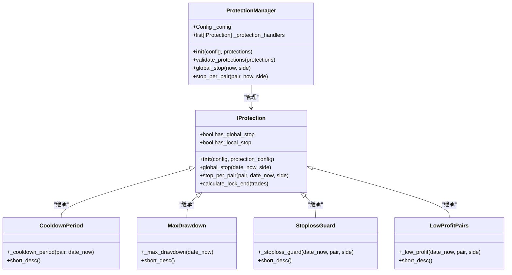
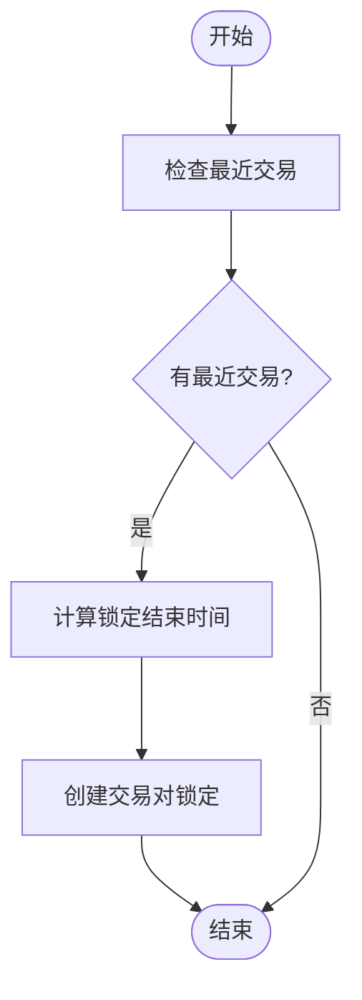
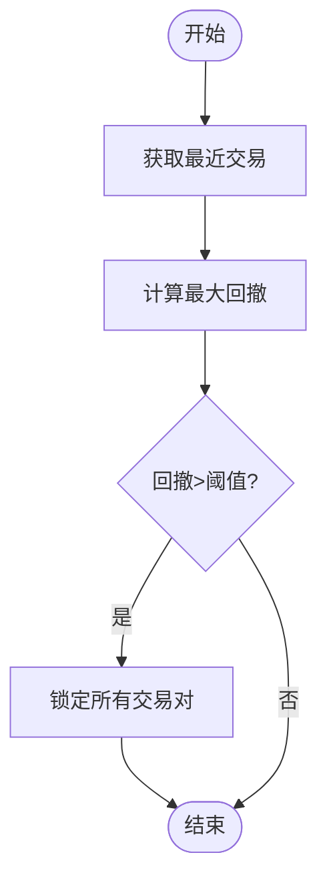
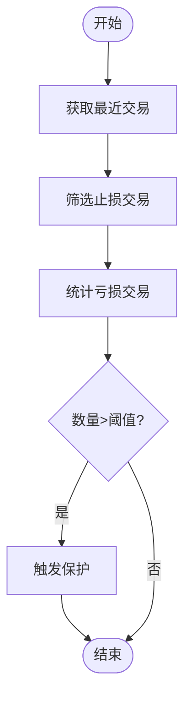
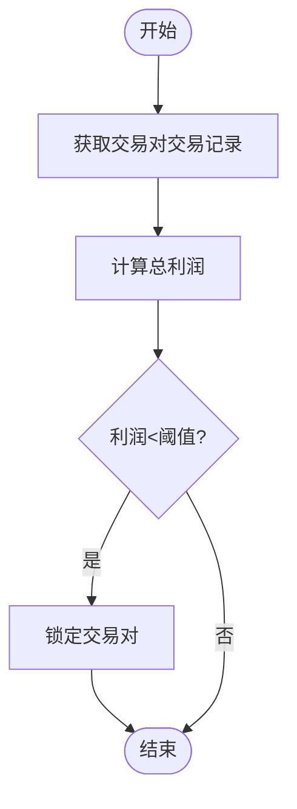
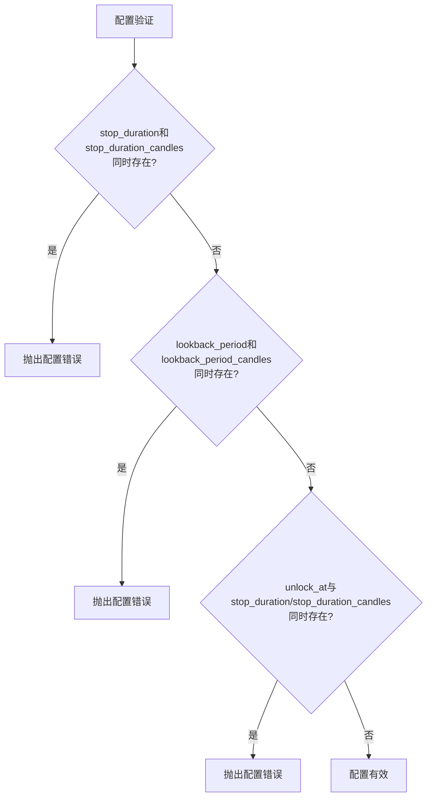
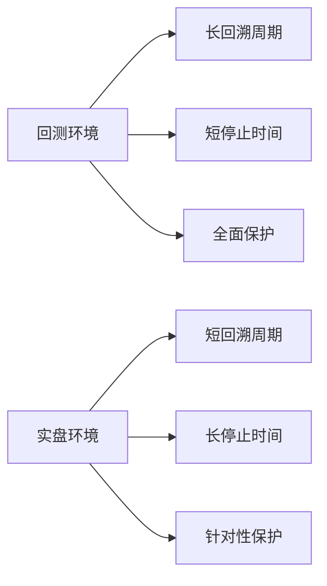

# 保护机制配置

<cite>
**本文档引用的文件**
- [cooldown_period.py](file://freqtrade/plugins/protections/cooldown_period.py)
- [max_drawdown_protection.py](file://freqtrade/plugins/protections/max_drawdown_protection.py)
- [stoploss_guard.py](file://freqtrade/plugins/protections/stoploss_guard.py)
- [low_profit_pairs.py](file://freqtrade/plugins/protections/low_profit_pairs.py)
- [iprotection.py](file://freqtrade/plugins/protections/iprotection.py)
- [protectionmanager.py](file://freqtrade/plugins/protectionmanager.py)
</cite>

## 目录
1. [简介](#简介)
2. [保护机制工作原理](#保护机制工作原理)
3. [核心保护组件详解](#核心保护组件详解)
4. [保护策略组合配置](#保护策略组合配置)
5. [实战配置示例](#实战配置示例)
6. [回测与实盘差异化配置](#回测与实盘差异化配置)
7. [性能影响分析](#性能影响分析)
8. [故障排除指南](#故障排除指南)

## 简介
Freqtrade的保护机制插件系统提供了一套完整的风险控制框架，旨在防止过度交易、控制风险暴露并过滤低质量交易对。该系统通过`protections`配置项启用和组合多个保护策略，包括冷却期（cooldown_period）、最大回撤保护（max_drawdown_protection）、止损守卫（stoploss_guard）和低利润交易对过滤（low_profit_pairs）等组件。这些保护机制在策略执行前进行评估，当触发条件时会锁定交易对或全局交易，从而有效控制风险。

**Section sources**
- [protectionmanager.py](file://freqtrade/plugins/protectionmanager.py#L19-L114)
- [iprotection.py](file://freqtrade/plugins/protections/iprotection.py#L24-L140)

## 保护机制工作原理
Freqtrade的保护机制通过`ProtectionManager`类统一管理，该类负责加载、验证和执行所有配置的保护策略。每个保护策略都继承自`IProtection`抽象基类，实现了统一的接口规范。保护机制在两个层面发挥作用：全局停止（global_stop）和单个交易对停止（stop_per_pair）。当保护条件被触发时，系统会创建交易对锁定（PairLock），阻止新的交易进入，直到锁定时间结束。



**Diagram sources**
- [protectionmanager.py](file://freqtrade/plugins/protectionmanager.py#L19-L114)
- [iprotection.py](file://freqtrade/plugins/protections/iprotection.py#L24-L140)

**Section sources**
- [protectionmanager.py](file://freqtrade/plugins/protectionmanager.py#L19-L114)
- [iprotection.py](file://freqtrade/plugins/protections/iprotection.py#L24-L140)

## 核心保护组件详解
### 冷却期（Cooldown Period）
冷却期保护机制通过`CooldownPeriod`类实现，主要用于防止在最近交易后立即重新进入同一交易对。该机制在单个交易对层面工作（has_local_stop=True），当检测到指定回溯周期内的最近交易时，会根据配置的停止持续时间锁定该交易对。

**配置参数：**
- `lookback_period`：回溯周期（分钟）
- `lookback_period_candles`：回溯周期（蜡烛数）
- `stop_duration`：停止持续时间（分钟）
- `stop_duration_candles`：停止持续时间（蜡烛数）
- `unlock_at`：解锁时间点（HH:MM格式）



**Diagram sources**
- [cooldown_period.py](file://freqtrade/plugins/protections/cooldown_period.py#L11-L73)

**Section sources**
- [cooldown_period.py](file://freqtrade/plugins/protections/cooldown_period.py#L11-L73)

### 最大回撤保护（Max Drawdown Protection）
最大回撤保护通过`MaxDrawdown`类实现，用于监控整体投资组合的回撤情况。该机制在全局层面工作（has_global_stop=True），当检测到指定回溯周期内的最大回撤超过阈值时，会暂停所有交易。

**配置参数：**
- `lookback_period`：回溯周期（分钟）
- `lookback_period_candles`：回溯周期（蜡烛数）
- `stop_duration`：停止持续时间（分钟）
- `stop_duration_candles`：停止持续时间（蜡烛数）
- `unlock_at`：解锁时间点（HH:MM格式）
- `trade_limit`：最小交易数量
- `max_allowed_drawdown`：允许的最大回撤



**Diagram sources**
- [max_drawdown_protection.py](file://freqtrade/plugins/protections/max_drawdown_protection.py#L15-L101)

**Section sources**
- [max_drawdown_protection.py](file://freqtrade/plugins/protections/max_drawdown_protection.py#L15-L101)

### 止损守卫（Stoploss Guard）
止损守卫通过`StoplossGuard`类实现，用于检测频繁止损的情况。该机制既可以在全局层面工作，也可以在单个交易对层面工作，当检测到指定回溯周期内发生过多亏损止损时，会触发保护。

**配置参数：**
- `lookback_period`：回溯周期（分钟）
- `lookback_period_candles`：回溯周期（蜡烛数）
- `stop_duration`：停止持续时间（分钟）
- `stop_duration_candles`：停止持续时间（蜡烛数）
- `unlock_at`：解锁时间点（HH:MM格式）
- `trade_limit`：止损交易数量阈值
- `required_profit`：利润阈值
- `only_per_pair`：仅针对单个交易对
- `only_per_side`：仅针对特定方向



**Diagram sources**
- [stoploss_guard.py](file://freqtrade/plugins/protections/stoploss_guard.py#L13-L108)

**Section sources**
- [stoploss_guard.py](file://freqtrade/plugins/protections/stoploss_guard.py#L13-L108)

### 低利润交易对过滤（Low Profit Pairs）
低利润交易对过滤通过`LowProfitPairs`类实现，用于识别和过滤持续产生低利润的交易对。该机制在单个交易对层面工作，当检测到指定回溯周期内的累计利润低于阈值时，会锁定该交易对。

**配置参数：**
- `lookback_period`：回溯周期（分钟）
- `lookback_period_candles`：回溯周期（蜡烛数）
- `stop_duration`：停止持续时间（分钟）
- `stop_duration_candles`：停止持续时间（蜡烛数）
- `unlock_at`：解锁时间点（HH:MM格式）
- `trade_limit`：最小交易数量
- `required_profit`：要求的最低利润
- `only_per_side`：仅针对特定方向



**Diagram sources**
- [low_profit_pairs.py](file://freqtrade/plugins/protections/low_profit_pairs.py#L12-L101)

**Section sources**
- [low_profit_pairs.py](file://freqtrade/plugins/protections/low_profit_pairs.py#L12-L101)

## 保护策略组合配置
Freqtrade允许通过`protections`配置项组合多个保护策略，形成多层次的风险控制体系。配置时需要遵循以下规则：

1. **互斥参数**：`stop_duration`和`stop_duration_candles`必须二选一
2. **互斥参数**：`lookback_period`和`lookback_period_candles`必须二选一
3. **互斥参数**：`unlock_at`、`stop_duration`和`stop_duration_candles`必须三选一



**Diagram sources**
- [protectionmanager.py](file://freqtrade/plugins/protectionmanager.py#L80-L114)

**Section sources**
- [protectionmanager.py](file://freqtrade/plugins/protectionmanager.py#L80-L114)

## 实战配置示例
以下是一个完整的保护机制配置示例，展示了如何组合多种保护策略：

```json
{
  "protections": [
    {
      "method": "CooldownPeriod",
      "stop_duration": 60,
      "lookback_period": 1440
    },
    {
      "method": "MaxDrawdown",
      "lookback_period": 1440,
      "trade_limit": 10,
      "stop_duration": 300,
      "max_allowed_drawdown": 0.1
    },
    {
      "method": "StoplossGuard",
      "lookback_period": 720,
      "trade_limit": 3,
      "stop_duration": 120,
      "required_profit": -0.02
    },
    {
      "method": "LowProfitPairs",
      "lookback_period": 1440,
      "trade_limit": 5,
      "stop_duration": 60,
      "required_profit": 0.01
    }
  ]
}
```

此配置实现了：
- 24小时内交易过的交易对冷却1小时
- 24小时内最大回撤超过10%时暂停5小时
- 12小时内发生3次以上亏损止损时暂停2小时
- 24小时内累计利润低于1%的交易对暂停1小时

**Section sources**
- [protectionmanager.py](file://freqtrade/plugins/protectionmanager.py#L20-L34)
- [iprotection.py](file://freqtrade/plugins/protections/iprotection.py#L30-L54)

## 回测与实盘差异化配置
在回测和实盘环境中，保护机制的配置需要有所区别：

**回测环境配置建议：**
- 使用较长的回溯周期以获得更准确的统计结果
- 设置较短的停止持续时间以加快回测速度
- 启用所有保护机制以全面评估策略稳健性

**实盘环境配置建议：**
- 使用较短的回溯周期以提高响应速度
- 设置较长的停止持续时间以确保风险充分释放
- 根据实际交易频率调整`trade_limit`参数
- 考虑使用`unlock_at`参数在特定时间点自动解锁



**Section sources**
- [protectionmanager.py](file://freqtrade/plugins/protectionmanager.py#L49-L61)
- [protectionmanager.py](file://freqtrade/plugins/protectionmanager.py#L63-L77)

## 性能影响分析
保护机制对策略性能的影响主要体现在以下几个方面：

1. **计算开销**：每个保护机制都需要查询历史交易数据并进行计算
2. **交易机会损失**：过度敏感的保护机制可能导致错过潜在盈利机会
3. **风险控制效果**：合理的保护配置可以显著降低最大回撤和波动率

建议通过回测来评估不同保护配置对策略性能的影响，重点关注夏普比率、最大回撤和盈利因子等指标的变化。

**Section sources**
- [max_drawdown_protection.py](file://freqtrade/plugins/protections/max_drawdown_protection.py#L50-L80)
- [stoploss_guard.py](file://freqtrade/plugins/protections/stoploss_guard.py#L50-L80)

## 故障排除指南
当保护机制配置出现问题时，可以参考以下常见问题及解决方案：

1. **配置验证错误**：检查是否违反了互斥参数规则
2. **保护未触发**：确认回溯周期和阈值设置是否合理
3. **过度触发**：调整`trade_limit`和利润/回撤阈值
4. **时间格式错误**：确保`unlock_at`参数使用正确的HH:MM格式

**Section sources**
- [protectionmanager.py](file://freqtrade/plugins/protectionmanager.py#L80-L114)
- [iprotection.py](file://freqtrade/plugins/protections/iprotection.py#L121-L140)