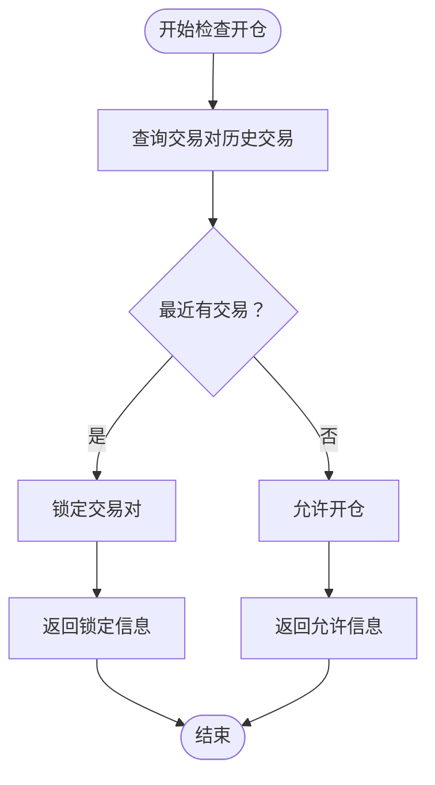
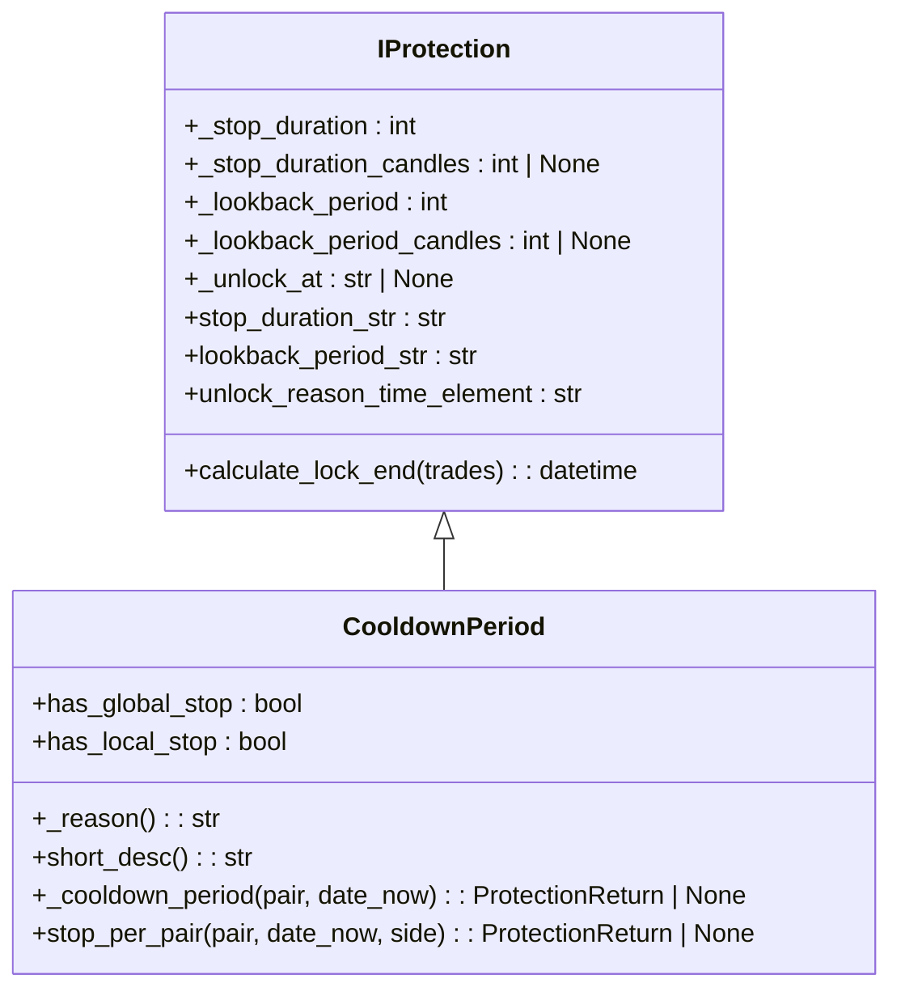
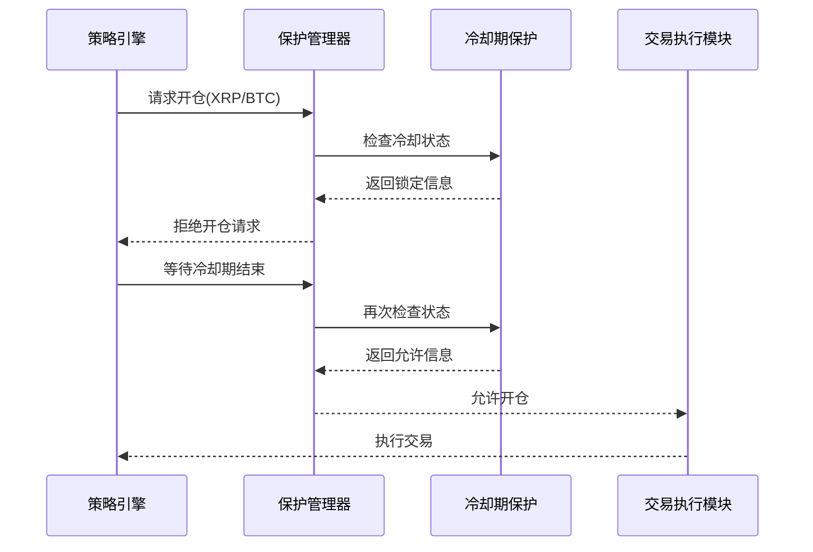
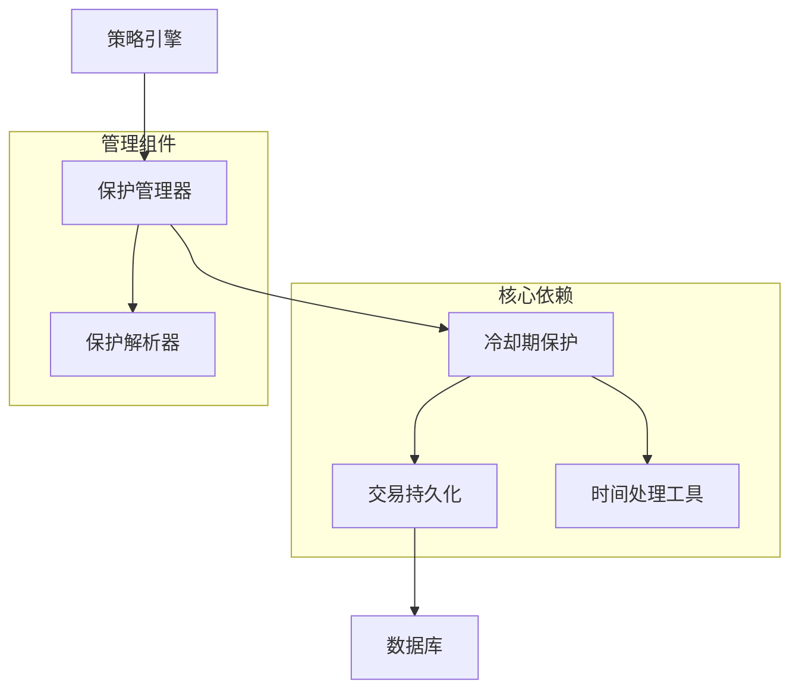

# 冷却期保护配置

<cite>
**本文档引用的文件**
- [cooldown_period.py](file://freqtrade/plugins/protections/cooldown_period.py)
- [iprotection.py](file://freqtrade/plugins/protections/iprotection.py)
- [protectionmanager.py](file://freqtrade/plugins/protectionmanager.py)
</cite>

## 目录
1. [简介](#简介)
2. [冷却期保护机制原理](#冷却期保护机制原理)
3. [配置参数详解](#配置参数详解)
4. [配置文件语法示例](#配置文件语法示例)
5. [策略高频触发抑制效果](#策略高频触发抑制效果)
6. [实盘配置建议](#实盘配置建议)
7. [依赖关系分析](#依赖关系分析)

## 简介
冷却期保护机制是Freqtrade系统中用于防止交易对频繁开仓的重要风控功能。该机制通过为交易对设置冷却时间，在最近一次交易结束后的一段时间内禁止新的开仓操作，从而有效避免因策略信号过于密集导致的过度交易问题。本文档详细说明该机制的实现原理、配置方法及实盘应用建议。

## 冷却期保护机制原理

冷却期保护机制的核心实现位于`freqtrade/plugins/protections/cooldown_period.py`文件中的`CooldownPeriod`类。该机制通过以下流程实现交易抑制：

1. **交易历史查询**：系统会查询指定交易对在`lookback_period`时间范围内的最近一次已关闭交易。
2. **冷却判断**：如果在设定的回溯周期内存在已关闭的交易，则触发冷却机制。
3. **交易对锁定**：将该交易对锁定至指定时间，锁定时长由`stop_duration`或`unlock_at`参数决定。
4. **开仓阻止**：在锁定期间，系统将阻止该交易对的新开仓操作。

该机制仅作用于单个交易对（`has_local_stop = True`），不提供全局停止功能（`has_global_stop = False`）。



**Diagram sources**
- [cooldown_period.py](file://freqtrade/plugins/protections/cooldown_period.py#L27-L52)

**Section sources**
- [cooldown_period.py](file://freqtrade/plugins/protections/cooldown_period.py#L11-L73)

## 配置参数详解

冷却期保护支持多种时间表达方式，主要配置参数如下：

### 停止持续时间参数
用于定义交易对被锁定的时间长度。

- **stop_duration**：以分钟为单位的冷却时间
- **stop_duration_candles**：以K线数量为单位的冷却时间
- **unlock_at**：指定具体的解锁时间点（格式：HH:MM）

### 回溯周期参数
用于定义系统检查历史交易的时间范围。

- **lookback_period**：以分钟为单位的回溯周期
- **lookback_period_candles**：以K线数量为单位的回溯周期

**重要约束**：
- `stop_duration`与`stop_duration_candles`不可同时配置
- `lookback_period`与`lookback_period_candles`不可同时配置
- `unlock_at`与其他停止时间参数互斥

这些参数的解析和验证逻辑在`IProtection`基类中实现，通过当前交易时间帧（timeframe）将K线数量转换为实际分钟数。



**Diagram sources**
- [iprotection.py](file://freqtrade/plugins/protections/iprotection.py#L24-L140)
- [cooldown_period.py](file://freqtrade/plugins/protections/cooldown_period.py#L11-L73)

**Section sources**
- [iprotection.py](file://freqtrade/plugins/protections/iprotection.py#L24-L140)

## 配置文件语法示例

在配置文件中启用冷却期保护的正确语法如下：

### 基于分钟数的配置
```json
{
  "protections": [
    {
      "method": "CooldownPeriod",
      "stop_duration": 30,
      "lookback_period": 60
    }
  ]
}
```

### 基于K线数量的配置
```json
{
  "protections": [
    {
      "method": "CooldownPeriod",
      "stop_duration_candles": 5,
      "lookback_period_candles": 10
    }
  ]
}
```

### 基于固定时间点的配置
```json
{
  "protections": [
    {
      "method": "CooldownPeriod",
      "unlock_at": "05:00",
      "lookback_period": 120
    }
  ]
}
```

### 多保护组合配置
```json
{
  "protections": [
    {
      "method": "CooldownPeriod",
      "stop_duration": 15,
      "lookback_period": 30
    },
    {
      "method": "MaxDrawdown",
      "lookback_period": 1440,
      "stop_duration": 60,
      "max_relative_drawdown": 0.05
    }
  ]
}
```

**Section sources**
- [protectionmanager.py](file://freqtrade/plugins/protectionmanager.py#L0-L115)
- [iprotection.py](file://freqtrade/plugins/protections/iprotection.py#L24-L140)

## 策略高频触发抑制效果

冷却期保护机制对策略高频触发具有显著的抑制效果：

1. **交易频率控制**：通过设置合理的冷却时间，可有效降低单位时间内的交易次数，避免因市场噪音导致的频繁进出。
2. **风险分散**：防止资金在短时间内集中于少数交易对，实现更好的风险分散。
3. **手续费优化**：减少不必要的交易，从而降低累计手续费支出。
4. **信号质量提升**：强制策略等待更高质量的信号出现，避免追涨杀跌。

当策略在短时间内产生连续信号时，冷却期机制会确保只有第一个信号被执行，后续信号将在冷却期内被忽略，直到冷却期结束。



**Diagram sources**
- [protectionmanager.py](file://freqtrade/plugins/protectionmanager.py#L95-L114)
- [cooldown_period.py](file://freqtrade/plugins/protections/cooldown_period.py#L64-L73)

## 实盘配置建议

针对实盘交易，建议采用以下配置策略：

1. **基础配置**：对于大多数策略，建议设置`stop_duration`为15-30分钟，`lookback_period`为30-60分钟，以平衡信号响应速度和交易频率。

2. **高波动市场**：在高波动性市场中，可适当缩短冷却时间至5-10分钟，以便及时捕捉快速行情。

3. **低风险偏好**：对于风险厌恶型投资者，建议设置较长的冷却期（60分钟以上）和回溯周期（120分钟以上）。

4. **多时间框架策略**：对于多时间框架策略，冷却时间应与主要交易时间框架相匹配，通常为2-5根K线。

5. **特定时段交易**：使用`unlock_at`参数可实现特定时段交易，如设置`"unlock_at": "09:00"`可避免夜间交易。

6. **组合使用**：建议将冷却期保护与其他保护机制（如最大回撤保护）组合使用，构建多层次风控体系。

**Section sources**
- [protectionmanager.py](file://freqtrade/plugins/protectionmanager.py#L0-L115)
- [cooldown_period.py](file://freqtrade/plugins/protections/cooldown_period.py#L11-L73)

## 依赖关系分析

冷却期保护机制与其他系统组件存在明确的依赖关系：



**Diagram sources**
- [protectionmanager.py](file://freqtrade/plugins/protectionmanager.py#L0-L115)
- [cooldown_period.py](file://freqtrade/plugins/protections/cooldown_period.py#L11-L73)

**Section sources**
- [protectionmanager.py](file://freqtrade/plugins/protectionmanager.py#L0-L115)