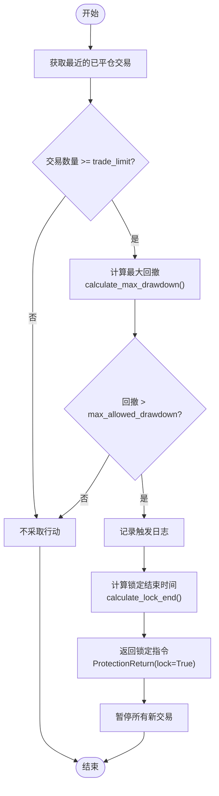
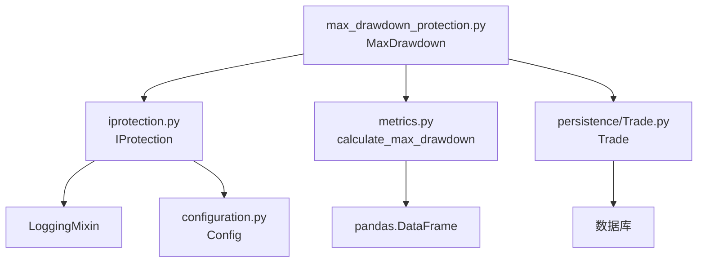

# 最大回撤保护配置

<cite>
**本文档引用的文件**   
- [max_drawdown_protection.py](file://freqtrade/plugins/protections/max_drawdown_protection.py)
- [iprotection.py](file://freqtrade/plugins/protections/iprotection.py)
- [metrics.py](file://freqtrade/data/metrics.py)
- [config_schema.py](file://freqtrade/config_schema/config_schema.py)
- [config_full.example.json](file://config_examples/config_full.example.json)
</cite>

## 目录
1. [简介](#简介)
2. [核心配置项详解](#核心配置项详解)
3. [行为逻辑与触发机制](#行为逻辑与触发机制)
4. [基于回测数据的阈值设定](#基于回测数据的阈值设定)
5. [实战配置示例](#实战配置示例)
6. [不同交易模式下的适用性分析](#不同交易模式下的适用性分析)
7. [依赖关系与架构图](#依赖关系与架构图)

## 简介
最大回撤保护（Max Drawdown Protection）是Freqtrade系统中的一项关键风险控制机制，旨在监控账户资产的整体回撤情况，并在达到预设阈值时触发全局交易暂停。该保护机制通过分析最近一段时间内的已平仓交易，计算累计最大回撤，当回撤超过设定的`max_allowed_drawdown`时，将停止所有新交易的开仓，以防止极端亏损的进一步扩大。此功能对于保护账户本金、控制下行风险具有重要意义。

## 核心配置项详解
最大回撤保护的核心配置参数定义了其监控范围和触发条件。这些参数在策略保护（protections）配置中指定。

**Section sources**
- [max_drawdown_protection.py](file://freqtrade/plugins/protections/max_drawdown_protection.py#L15-L25)
- [iprotection.py](file://freqtrade/plugins/protections/iprotection.py#L38-L71)
- [config_full.example.json](file://config_examples/config_full.example.json#L190-L200)

### max_relative_drawdown 与 max_absolute_drawdown
在Freqtrade的配置中，并未直接使用`max_relative_drawdown`或`max_absolute_drawdown`作为配置项。相反，`max_drawdown_protection`插件使用一个统一的`max_allowed_drawdown`参数。该参数的含义取决于`calculate_max_drawdown`函数的计算方式。
- **max_allowed_drawdown**: 这是用户配置的阈值，表示允许的最大回撤。根据代码分析，该值在计算时被用作**绝对回撤**（absolute drawdown）的阈值进行比较。绝对回撤指的是从最高点到最低点的利润金额差值。相对回撤（relative drawdown）则是一个百分比，表示回撤金额占最高点账户余额的比例。虽然配置项本身是绝对值，但用户在设定时，可以基于相对回撤的概念来推算出合理的绝对值阈值。

### drawdown_since (lookback_period / lookback_period_candles)
`drawdown_since`这一概念在配置中由`lookback_period`或`lookback_period_candles`参数实现。
- **lookback_period**: 定义了回撤计算的回溯时间窗口，单位为分钟。系统将分析在此时间窗口内所有已平仓的交易。
- **lookback_period_candles**: 可以替代`lookback_period`，通过指定回溯的K线数量来定义时间窗口。例如，`"lookback_period_candles": 24` 表示分析最近24根K线内的交易。系统会根据策略的`timeframe`（如5分钟）自动将其转换为分钟数（24 * 5 = 120分钟）。这两个参数是互斥的，只能配置其中一个。

### stop_duration
`stop_duration`参数定义了在触发最大回撤保护后，全局交易暂停的持续时间。
- **stop_duration**: 单位为分钟。例如，`"stop_duration": 60` 表示暂停交易60分钟。
- **stop_duration_candles**: 可以替代`stop_duration`，通过指定暂停的K线数量来定义时长。例如，`"stop_duration_candles": 12` 表示暂停12个K线周期。同样，这两个参数互斥。
- **unlock_at**: 提供了另一种解锁方式，即指定一个具体的UTC时间点（如`"unlock_at": "04:00"`），保护将在该时间点自动解除。`unlock_at`与`stop_duration`/`stop_duration_candles`也是互斥的。

### trade_limit
- **trade_limit**: 该参数设置了触发保护所需的最小交易数量。如果在`lookback_period`内完成的交易数量少于`trade_limit`，则不会计算回撤，也不会触发保护。这可以防止在交易稀疏的初期阶段因少量亏损交易而误触发保护。

## 行为逻辑与触发机制
最大回撤保护的行为逻辑遵循一个清晰的流程：监控、计算、比较、决策。



**Diagram sources **
- [max_drawdown_protection.py](file://freqtrade/plugins/protections/max_drawdown_protection.py#L44-L81)
- [iprotection.py](file://freqtrade/plugins/protections/iprotection.py#L124-L139)

**Section sources**
- [max_drawdown_protection.py](file://freqtrade/plugins/protections/max_drawdown_protection.py#L44-L81)
- [metrics.py](file://freqtrade/data/metrics.py#L190-L252)

### 详细流程
1.  **获取交易数据**: 在每次评估时，系统调用`Trade.get_trades_proxy()`，获取从当前时间往前推`lookback_period`分钟内所有已平仓的交易记录。
2.  **数量检查**: 检查获取到的交易数量是否大于或等于`trade_limit`。如果不足，则直接返回，不进行后续计算。
3.  **计算最大回撤**: 将交易数据转换为Pandas DataFrame，并调用`calculate_max_drawdown()`函数。该函数的核心逻辑是：
    - 计算交易利润的累计和（cumulative profit）。
    - 记录累计利润的最高点（high_value）。
    - 计算当前累计利润与历史最高点之间的差值，即为回撤（drawdown）。
    - 找出历史上的最大回撤值（drawdown_abs）。
4.  **阈值比较**: 将计算出的`drawdown_abs`与用户配置的`max_allowed_drawdown`进行比较。
5.  **触发决策**: 如果`drawdown_abs`大于`max_allowed_drawdown`，则触发保护。系统会记录一条日志信息，并通过`calculate_lock_end()`方法计算出交易暂停的结束时间（基于最后完成交易的时间加上`stop_duration`，或根据`unlock_at`确定）。
6.  **返回指令**: 返回一个`ProtectionReturn`对象，其中`lock=True`，`until`为计算出的结束时间，`reason`为触发原因。上层系统接收到此指令后，将阻止所有新交易的开仓。

## 基于回测数据的阈值设定
为`max_allowed_drawdown`设定合理的阈值是有效使用该保护的关键。这需要依赖历史回测数据进行分析。

**Section sources**
- [metrics.py](file://freqtrade/data/metrics.py#L190-L252)
- [optimize_reports.py](file://freqtrade/optimize/optimize_reports/optimize_reports.py#L625-L654)

### 分析回测结果
在完成策略的回测后，Freqtrade会生成详细的报告。报告中包含一个关键指标：**最大相对回撤**（max_relative_drawdown）。
- 该指标反映了策略在历史数据上最差的表现，即账户从最高点回落的最大百分比。
- 用户应首先分析该指标。例如，如果回测显示`max_relative_drawdown`为15%，这意味着策略在历史上曾经历过15%的账户价值缩水。

### 设定阈值
基于回测结果，可以按以下步骤设定`max_allowed_drawdown`：
1.  **确定风险承受能力**: 用户需要明确自己能接受的最大回撤。例如，设定为10%。
2.  **转换为绝对值**: `max_allowed_drawdown`是一个绝对值（利润金额）。需要将百分比转换为金额。例如，如果账户初始资金为1000 USDT，能接受10%的回撤，则`max_allowed_drawdown`应设为100 USDT。
3.  **考虑交易频率**: 如果策略交易非常频繁，短期内可能产生较大的浮动回撤。此时，可以适当放宽`lookback_period`（如设为240分钟）或提高`trade_limit`，以避免频繁触发保护。
4.  **保守原则**: 建议将阈值设定得比回测中的最大回撤略小，以提供安全边际。例如，回测最大回撤为15%，可将阈值设为12%对应的金额。

## 实战配置示例
以下是一个防止极端亏损的实战配置示例，适用于一个中等风险偏好的交易策略。

```json
"protections": [
    {
        "method": "MaxDrawdown",
        "lookback_period": 1440,
        "trade_limit": 5,
        "max_allowed_drawdown": 200,
        "stop_duration": 120
    }
]
```

**解释**:
- **method**: 指定使用`MaxDrawdown`保护方法。
- **lookback_period**: 24小时（1440分钟）。这确保了保护机制监控的是全天的交易表现，避免因短期波动而误触发。
- **trade_limit**: 5。要求在24小时内至少有5笔已平仓交易才会触发保护，增加了决策的可靠性。
- **max_allowed_drawdown**: 200。假设账户资金为2000 USDT，这相当于10%的回撤阈值。
- **stop_duration**: 120。一旦触发，暂停交易2小时，给市场和策略一个冷静期。

## 不同交易模式下的适用性分析
最大回撤保护在现货和期货等不同交易模式下均适用，但其效果和配置策略有所不同。

**Section sources**
- [config_schema.py](file://freqtrade/config_schema/config_schema.py#L150-L155)
- [max_drawdown_protection.py](file://freqtrade/plugins/protections/max_drawdown_protection.py#L60-L65)

### 现货交易 (Spot)
- **适用性**: 非常适用。现货交易的亏损上限是投入的本金，风险相对可控。最大回撤保护能有效防止本金的大幅缩水。
- **配置建议**: 可以设定相对严格的阈值（如5%-10%），因为现货的波动性通常低于期货。`lookback_period`可以设置为较短的周期（如几小时），以便快速响应市场变化。

### 期货交易 (Futures)
- **适用性**: 适用，但需谨慎。期货交易带有杠杆，亏损可能超过本金，甚至导致穿仓。虽然最大回撤保护能暂停开仓，但它无法阻止已持仓位的亏损继续扩大。
- **配置建议**: 
    - **更宽松的阈值**: 由于杠杆放大了波动，短期内的回撤可能非常大。因此，`max_allowed_drawdown`的阈值应设定得更宽松（如15%-25%），以避免在正常波动中频繁触发。
    - **更长的回溯期**: 建议使用更长的`lookback_period`（如24小时或更长），以平滑短期的剧烈波动。
    - **结合其他保护**: 必须与`StoplossGuard`等其他保护措施结合使用，形成多层次的风险控制体系。`StoplossGuard`可以防止连续止损，而`MaxDrawdown`则监控整体账户健康状况。

## 依赖关系与架构图
最大回撤保护组件依赖于多个核心模块，共同构成了一个完整的风险控制系统。



**Diagram sources **
- [max_drawdown_protection.py](file://freqtrade/plugins/protections/max_drawdown_protection.py)
- [iprotection.py](file://freqtrade/plugins/protections/iprotection.py)
- [metrics.py](file://freqtrade/data/metrics.py)

**Section sources**
- [max_drawdown_protection.py](file://freqtrade/plugins/protections/max_drawdown_protection.py)
- [iprotection.py](file://freqtrade/plugins/protections/iprotection.py)

### 组件说明
- **MaxDrawdown**: 核心实现类，继承自`IProtection`，负责具体的回撤计算和决策逻辑。
- **IProtection**: 所有保护插件的抽象基类，定义了统一的接口（如`global_stop`）和通用功能（如时间计算、日志记录）。
- **calculate_max_drawdown**: 数据计算函数，位于`metrics.py`中，提供计算最大回撤的算法。
- **Trade**: 数据模型，用于从数据库中查询历史交易记录。
- **Config**: 系统配置，`MaxDrawdown`通过它获取策略的`timeframe`等信息。