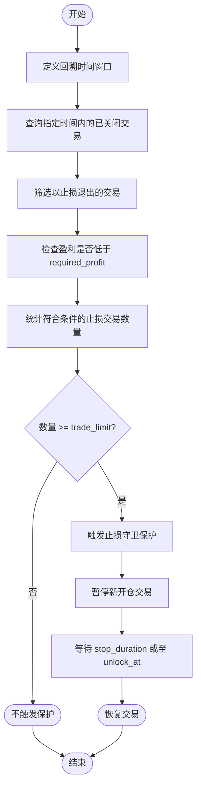

# 止损守卫配置

<cite>
**本文档引用的文件**  
- [stoploss_guard.py](file://freqtrade/plugins/protections/stoploss_guard.py)
- [iprotection.py](file://freqtrade/plugins/protections/iprotection.py)
- [config_schema.py](file://freqtrade/config_schema/config_schema.py)
- [config_full.example.json](file://config_examples/config_full.example.json)
</cite>

## 目录
1. [引言](#引言)
2. [止损守卫工作机制](#止损守卫工作机制)
3. [核心参数详解](#核心参数详解)
4. [配置示例与场景分析](#配置示例与场景分析)
5. [结论](#结论)

## 引言
止损守卫（Stoploss Guard）是Freqtrade框架中的一项关键保护机制，旨在防止交易策略在市场剧烈波动或震荡行情中因频繁触发止损而造成连续亏损。通过监控近期交易的止损触发频率，该机制能够智能地暂停交易活动，为策略提供必要的冷却期。本文档将深入解析止损守卫的工作流程，阐明其核心参数的配置意义，并提供实际配置示例。

**Section sources**
- [stoploss_guard.py](file://freqtrade/plugins/protections/stoploss_guard.py#L13-L108)

## 止损守卫工作机制

止损守卫的核心工作流程基于对历史交易记录的分析。当策略执行一笔交易并以止损方式平仓后，该笔交易会被记录。止损守卫会定期检查在指定的回溯周期（lookback period）内，有多少笔交易的盈利低于预设的阈值（`required_profit`）。

具体流程如下：
1.  **定义回溯窗口**：根据配置的`lookback_period_candles`或`lookback_period`，确定一个时间窗口。
2.  **筛选止损交易**：从数据库中查询在此时间窗口内已关闭的交易，并筛选出以`STOP_LOSS`、`TRAILING_STOP_LOSS`、`STOPLOSS_ON_EXCHANGE`或`LIQUIDATION`为退出原因的交易。
3.  **评估盈利水平**：检查这些止损交易的最终盈利（`close_profit`）是否低于`required_profit`的设定值。
4.  **计数与决策**：统计满足上述条件的交易数量。如果该数量达到或超过`trade_limit`设定的阈值，则触发保护机制。
5.  **暂停交易**：一旦触发，系统将根据`stop_duration`或`unlock_at`的配置，暂停所有或特定交易对的新开仓操作，直到冷却期结束。

此机制有效防止了策略在不利的市场条件下（如横盘震荡）反复“割肉”，从而保护了账户资金。



**Diagram sources**
- [stoploss_guard.py](file://freqtrade/plugins/protections/stoploss_guard.py#L43-L86)

**Section sources**
- [stoploss_guard.py](file://freqtrade/plugins/protections/stoploss_guard.py#L43-L86)

## 核心参数详解

止损守卫的保护行为由多个关键参数精确控制，理解这些参数对于有效配置至关重要。

### `required_profit`
- **作用**：此参数定义了“不成功”止损的盈利阈值。只有当一笔止损交易的盈利**低于**此值时，才会被计入统计。例如，若`required_profit`设为`-0.05`（即-5%），则任何亏损超过5%的止损交易都会被计数。若设为`0.0`，则所有亏损的止损交易（盈利为负）都会被计数。
- **意义**：它允许用户区分“轻微亏损”和“严重亏损”。通过设置一个负的`required_profit`，可以忽略那些小幅度的、可能是正常波动的止损，只对造成显著损失的连续止损进行干预，从而避免过度保护而错失交易机会。

### `lookback_period_candles`
- **作用**：此参数以**K线数量**为单位，定义了用于统计止损频率的回溯周期。例如，`"lookback_period_candles": 20`表示系统将检查最近20根K线内的交易记录。
- **与`lookback_period`的关系**：这是一个与`lookback_period`（以分钟为单位）互斥的参数。两者只能配置其一。使用`lookback_period_candles`的好处是，其时间跨度会自动适应策略的`timeframe`。例如，在5分钟图上，20根K线代表100分钟；而在1小时图上，20根K线则代表20小时。这使得配置更具通用性。
- **意义**：它决定了系统“记忆”的长度。较短的周期反应更灵敏，但可能因偶然事件而误触发；较长的周期更稳定，但响应速度较慢。

### `enable_avg_stake_amount`
- **说明**：经过对代码库的全面搜索，**并未找到名为`enable_avg_stake_amount`的参数**。该参数可能不存在于当前版本的Freqtrade中，或是与其他功能或策略混淆了。止损守卫的核心逻辑不涉及对平均投注金额的计算或判断。

### 其他重要参数
- **`trade_limit`**：触发保护所需达到的止损交易数量阈值。例如，`"trade_limit": 3`表示在回溯周期内发生3次或以上符合条件的止损交易时，保护机制启动。
- **`stop_duration` / `stop_duration_candles`**：保护机制生效的持续时间，即暂停交易的“冷却期”。可以以分钟或K线数量为单位配置。
- **`only_per_pair`**：若设为`true`，则保护仅针对单个交易对生效，而不是全局暂停所有交易。
- **`only_per_side`**：若设为`true`，则保护会区分多头和空头方向，即只统计并暂停特定方向（如仅多头）的交易。

**Section sources**
- [stoploss_guard.py](file://freqtrade/plugins/protections/stoploss_guard.py#L23)
- [iprotection.py](file://freqtrade/plugins/protections/iprotection.py#L47-L49)
- [config_schema.py](file://freqtrade/config_schema/config_schema.py#L500-L505)

## 配置示例与场景分析

以下是一个典型的止损守卫配置示例，旨在平衡风险控制与保留交易机会：

```json
"protections": [
    {
        "method": "StoplossGuard",
        "lookback_period_candles": 12,
        "trade_limit": 2,
        "required_profit": -0.05,
        "stop_duration": 60,
        "only_per_pair": true,
        "only_per_side": true
    }
]
```

### 场景分析
假设一个交易者在1小时图（1h）上运行策略，配置如上。

1.  **震荡行情应对**：
    - **场景**：市场进入横盘震荡，价格在窄幅区间内波动。策略因信号频繁发出，导致在短时间内（例如3小时内）连续触发了2次止损，且这两次亏损均超过了5%。
    - **机制响应**：`lookback_period_candles`为12，对应12小时。系统在最近12小时内检测到2次亏损超5%的止损，达到了`trade_limit`的阈值。因此，止损守卫被触发。
    - **结果**：由于`only_per_pair`和`only_per_side`为`true`，系统将暂停该交易对在当前方向（如多头）上的新开仓，持续60分钟。这为市场提供了摆脱震荡区间的时间，防止了策略在区间内反复止损。

2.  **平衡风险与机会**：
    - **为何有效**：此配置通过`required_profit: -0.05`过滤掉了小额亏损，避免了因正常市场波动导致的误触发。`lookback_period_candles: 12`提供了一个足够长的观察窗口，确保触发是基于持续的不利条件，而非偶然事件。`stop_duration: 60`的冷却期既给予了市场调整时间，又不会让策略长时间离场而错过反转机会。
    - **优势**：`only_per_pair`和`only_per_side`的设置使得保护更加精准。如果某个交易对的多头策略表现不佳，只会暂停该对的多头开仓，其空头策略和其他交易对的交易仍可正常进行，最大限度地保留了潜在的盈利机会。

**Section sources**
- [config_full.example.json](file://config_examples/config_full.example.json#L150-L160)
- [stoploss_guard.py](file://freqtrade/plugins/protections/stoploss_guard.py#L777-L816)

## 结论
止损守卫是一项强大的风险控制工具，通过量化近期交易的止损频率和亏损程度，智能地暂停交易以规避连续亏损。正确配置`required_profit`和`lookback_period_candles`等参数，可以在保护资金安全和维持策略活性之间取得最佳平衡。通过结合`only_per_pair`和`only_per_side`等精细化控制选项，交易者可以构建出适应复杂市场环境的稳健交易系统。值得注意的是，`enable_avg_stake_amount`并非止损守卫的有效配置参数。