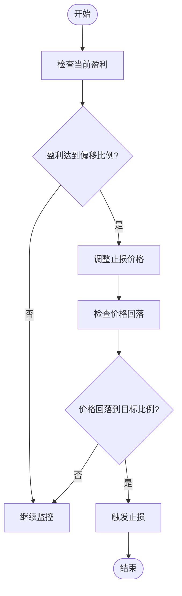

# 止损配置

<cite>
**本文档引用的文件**   
- [trade_model.py](file://freqtrade/persistence/trade_model.py)
- [interface.py](file://freqtrade/strategy/interface.py)
- [config.json](file://user_data/config.json)
- [config_full.example.json](file://config_examples/config_full.example.json)
</cite>

## 目录
1. [引言](#引言)
2. [静态止损机制](#静态止损机制)
3. [移动止损机制](#移动止损机制)
4. [止损参数协同工作原理](#止损参数协同工作原理)
5. [实际配置示例](#实际配置示例)
6. [回测结果分析](#回测结果分析)
7. [常见配置错误及规避方法](#常见配置错误及规避方法)

## 引言
Freqtrade中的止损（stoploss）参数是风险管理的核心组成部分，用于控制交易中的最大亏损。止损机制包括静态止损和移动止损（trailing_stop）两种模式。静态止损在交易开仓时设定固定的止损价格，而移动止损则根据市场价格的变动动态调整止损价格，以保护已实现的利润。本文将详细解释这些机制的配置方法和工作原理。

## 静态止损机制
静态止损通过`stoploss`参数配置，该参数为负数，表示相对于开仓价格的百分比亏损。例如，`stoploss = -0.10`表示当价格下跌10%时触发止损。在策略类中，`stoploss`属性定义了最优的止损比例。当交易开仓时，系统会根据当前价格和`stoploss`值计算出止损价格，并在达到该价格时执行卖出操作。

**Section sources**
- [interface.py](file://freqtrade/strategy/interface.py#L74)
- [config.json](file://user_data/config.json#L15)

## 移动止损机制
移动止损通过`trailing_stop`参数启用，当设置为`True`时，系统会根据市场价格的上涨动态调整止损价格。`trailing_stop_positive`参数定义了触发移动止损的盈利比例，`trailing_stop_positive_offset`参数定义了移动止损的偏移比例，`trailing_only_offset_is_reached`参数决定是否只有在达到偏移比例后才开始移动止损。

**Section sources**
- [interface.py](file://freqtrade/strategy/interface.py#L80-L83)
- [config_full.example.json](file://config_examples/config_full.example.json#L10-L13)

## 止损参数协同工作原理
`trailing_stop_positive`、`trailing_stop_positive_offset`和`trailing_only_offset_is_reached`参数协同工作，以实现更精细的风险控制。当`trailing_only_offset_is_reached`为`True`时，只有当盈利达到`trailing_stop_positive_offset`定义的比例后，才会开始移动止损。`trailing_stop_positive`定义了移动止损的目标比例，即当价格从最高点回落到该比例时触发止损。



**Diagram sources **
- [interface.py](file://freqtrade/strategy/interface.py#L80-L83)

## 实际配置示例
以下是一个实际的配置示例，展示了如何在配置文件中设置止损参数：

```json
{
    "stoploss": -0.10,
    "trailing_stop": true,
    "trailing_stop_positive": 0.02,
    "trailing_stop_positive_offset": 0.03,
    "trailing_only_offset_is_reached": true
}
```

此配置表示：初始止损为10%的亏损，启用移动止损，当盈利达到3%时开始移动止损，移动止损的目标为2%的盈利。

**Section sources**
- [config.json](file://user_data/config.json#L15)
- [config_full.example.json](file://config_examples/config_full.example.json#L10-L13)

## 回测结果分析
通过回测可以评估不同止损策略对收益曲线和最大回撤的影响。通常，较紧的止损（如-5%）会导致更多的交易被止损，但可以减少单笔交易的亏损；较松的止损（如-15%）可能会让亏损扩大，但可以避免因市场波动而过早止损。移动止损可以在趋势行情中保护利润，但在震荡行情中可能会频繁触发。

**Section sources**
- [config.json](file://user_data/config.json#L15)
- [config_full.example.json](file://config_examples/config_full.example.json#L10-L13)

## 常见配置错误及规避方法
常见的配置错误包括：止损设置过紧导致频繁止损、移动止损参数设置不合理导致无法有效保护利润、忽略市场波动性导致止损过早触发。规避方法包括：根据历史波动性调整止损幅度、结合技术指标动态调整止损、在不同市场条件下使用不同的止损策略。

**Section sources**
- [config.json](file://user_data/config.json#L15)
- [config_full.example.json](file://config_examples/config_full.example.json#L10-L13)