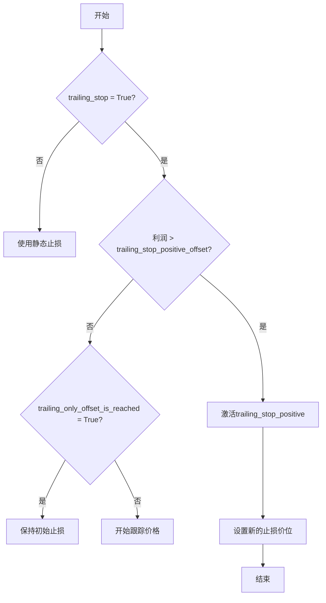
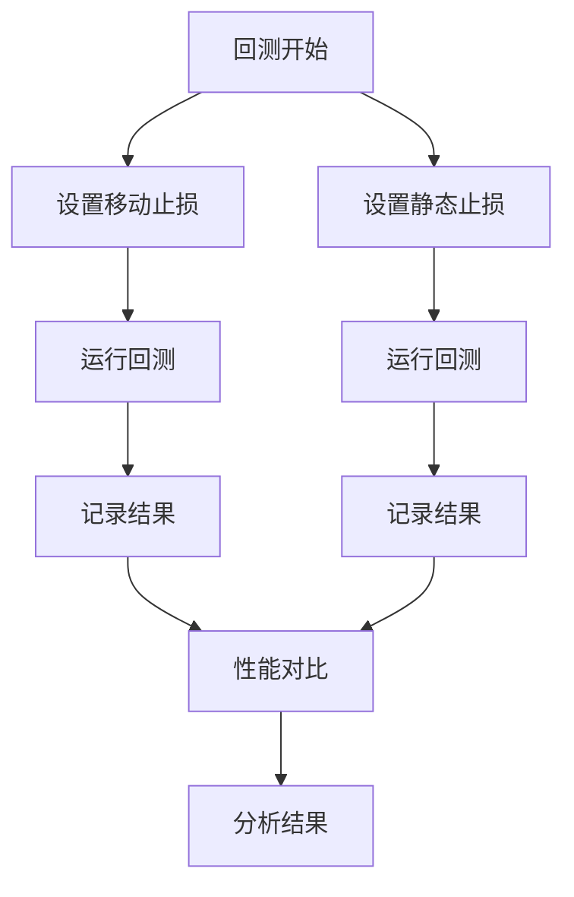

# 移动止损

<cite>
**本文档中引用的文件**   
- [config_schema.py](file://freqtrade/config_schema/config_schema.py)
- [interface.py](file://freqtrade/strategy/interface.py)
- [hlhb.py](file://user_data/strategies/hlhb.py)
</cite>

## 目录
1. [引言](#引言)
2. [移动止损参数详解](#移动止损参数详解)
3. [移动止损工作流程](#移动止损工作流程)
4. [实际配置示例](#实际配置示例)
5. [趋势跟踪与震荡市场表现](#趋势跟踪与震荡市场表现)
6. [回测性能对比](#回测性能对比)
7. [常见配置陷阱](#常见配置陷阱)
8. [日志监控](#日志监控)
9. [结论](#结论)

## 引言
移动止损（Trailing Stop）是Freqtrade中一种动态风险管理机制，允许交易者在价格向有利方向移动时自动调整止损价位。与静态止损不同，移动止损能够锁定已实现的利润，同时为交易提供继续获利的空间。本文档深入解析Freqtrade中移动止损的实现机制和参数协同工作原理，帮助用户理解如何有效配置和使用这一功能。

## 移动止损参数详解
Freqtrade中的移动止损由四个核心参数协同工作：`trailing_stop`、`trailing_stop_positive`、`trailing_stop_positive_offset`和`trailing_only_offset_is_reached`。这些参数共同定义了移动止损的行为逻辑。

### trailing_stop
`trailing_stop`是一个布尔型参数，用于启用或禁用移动止损功能。当设置为`True`时，系统将根据后续参数动态调整止损价位。此参数是启动移动止损机制的开关。

**Section sources**
- [config_schema.py](file://freqtrade/config_schema/config_schema.py#L215-L217)

### trailing_stop_positive
`trailing_stop_positive`定义了当价格向有利方向移动时，新的止损价位相对于当前价格的正向偏移量。例如，设置为0.05表示止损价位将设置在当前价格下方5%的位置。此参数仅在价格已达到`trailing_stop_positive_offset`定义的激活偏移量后生效。

**Section sources**
- [config_schema.py](file://freqtrade/config_schema/config_schema.py#L218-L220)

### trailing_stop_positive_offset
`trailing_stop_positive_offset`定义了触发移动止损逻辑的激活偏移量。只有当交易的利润超过此偏移量时，`trailing_stop_positive`才会被激活。这可以防止在价格小幅波动时就过早地启动移动止损。

**Section sources**
- [config_schema.py](file://freqtrade/config_schema/config_schema.py#L221-L223)

### trailing_only_offset_is_reached
`trailing_only_offset_is_reached`是一个布尔型参数，控制移动止损的激活条件。当设置为`True`时，只有在利润达到`trailing_stop_positive_offset`定义的偏移量后，移动止损才会开始工作。如果设置为`False`，移动止损将从交易开仓后立即开始跟踪价格。

**Section sources**
- [config_schema.py](file://freqtrade/config_schema/config_schema.py#L224-L226)

## 移动止损工作流程
移动止损的工作流程在`IStrategy.ft_stoploss_adjust`方法中实现。该方法在每次价格更新时被调用，负责动态调整止损价位。



**Diagram sources **
- [interface.py](file://freqtrade/strategy/interface.py#L1514-L1586)

**Section sources**
- [interface.py](file://freqtrade/strategy/interface.py#L1514-L1586)

## 实际配置示例
以下是一个实际的配置示例，展示了如何设置5%的追踪止损和2%的激活偏移量：

```python
class hlhb(IStrategy):
    # 追踪止损
    trailing_stop = True
    trailing_stop_positive = 0.05
    trailing_stop_positive_offset = 0.02
    trailing_only_offset_is_reached = True
```

在此配置中，当交易利润达到2%时，移动止损功能被激活。一旦激活，止损价位将设置在当前价格下方5%的位置，并随着价格的上涨而动态上移。

**Section sources**
- [hlhb.py](file://user_data/strategies/hlhb.py#L33-L169)

## 趋势跟踪与震荡市场表现
移动止损在趋势跟踪策略中表现出色，因为它能够有效锁定利润并让盈利交易继续运行。然而，在震荡市场中，频繁的价格波动可能导致移动止损被频繁触发，从而产生不必要的交易。

### 趋势跟踪优势
- **利润保护**：在价格持续上涨时，止损价位随之上移，保护已实现的利润。
- **风险控制**：限制了潜在的亏损，同时为交易提供了继续获利的空间。
- **自动化管理**：无需手动干预，系统自动管理止损价位。

### 震荡市场问题
- **频繁触发**：在价格上下波动的市场中，移动止损可能被反复触发。
- **交易成本增加**：频繁的止损触发会导致更多的交易，增加交易成本。
- **策略失效**：在震荡市场中，移动止损可能导致策略过早退出，错失后续的盈利机会。

## 回测性能对比
通过回测可以对比移动止损与静态止损的性能差异。移动止损通常在趋势明显的市场中表现更好，而在震荡市场中可能表现较差。



**Diagram sources **
- [backtesting.py](file://freqtrade/optimize/backtesting.py#L0-L799)

## 常见配置陷阱
在配置移动止损时，需要注意一些常见的陷阱，以避免逻辑错误。

### trailing_stop_positive_offset未正确设置
如果`trailing_stop_positive_offset`设置得过高，可能导致移动止损功能几乎从不被激活。反之，如果设置得过低，可能会在价格小幅波动时就过早地启动移动止损。

### trailing_only_offset_is_reached逻辑错误
当`trailing_only_offset_is_reached`设置为`False`时，移动止损将从交易开仓后立即开始跟踪价格，这可能导致在价格尚未达到有利水平时就过早地调整止损价位。

## 日志监控
通过日志可以监控移动止损的触发状态。Freqtrade在日志中记录了移动止损的调整过程，包括当前价格、止损价位和利润水平。

```python
logger.debug(
    f"{trade.pair} - Using positive stoploss: {stop_loss_value} "
    f"offset: {sl_offset:.4g} profit: {bound_profit:.2%}"
)
```

**Section sources**
- [interface.py](file://freqtrade/strategy/interface.py#L1514-L1586)

## 结论
移动止损是Freqtrade中一个强大的风险管理工具，能够在趋势跟踪策略中有效保护利润。通过合理配置`trailing_stop`、`trailing_stop_positive`、`trailing_stop_positive_offset`和`trailing_only_offset_is_reached`四个参数，用户可以根据市场情况灵活调整止损策略。然而，在震荡市场中，移动止损可能导致频繁触发，因此需要根据具体市场环境谨慎使用。通过回测和日志监控，用户可以评估移动止损的性能并优化配置。