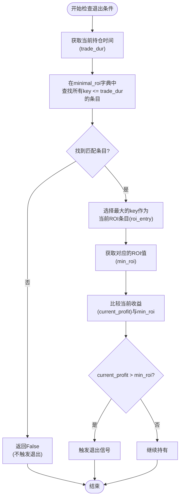
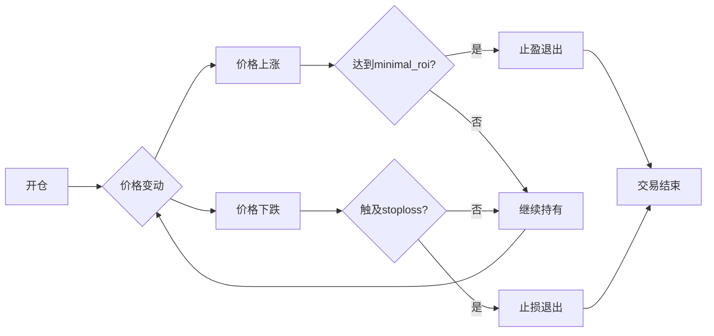

# 止盈配置

<cite>
**Referenced Files in This Document**   
- [interface.py](file://freqtrade/strategy/interface.py)
- [config_full.example.json](file://config_examples/config_full.example.json)
- [UniversalMACD.py](file://user_data/strategies/UniversalMACD.py)
- [config.json](file://user_data/config.json)
- [backtesting.py](file://freqtrade/optimize/backtesting.py)
</cite>

## 目录
1. [简介](#简介)
2. [minimal_roi配置规则](#minimal_roi配置规则)
3. [时间-收益率映射机制](#时间-收益率映射机制)
4. [ROI策略配置示例](#roi策略配置示例)
5. [minimal_roi与stoploss的协同工作](#minimal_roi与stoploss的协同工作)
6. [优化配置建议](#优化配置建议)

## 简介
本文档系统化地阐述了Freqtrade交易框架中`minimal_roi`参数的配置规则和时间-收益率映射机制。`minimal_roi`（最小投资回报率）是决定交易退出时机的核心参数之一，它通过字典格式定义了不同持仓时间窗口对应的最低收益率要求。该机制直接影响交易决策，当实际收益达到预设的ROI阈值时，系统将触发退出信号。本文将详细解释该机制的工作原理，并提供多种ROI策略的配置示例。

## minimal_roi配置规则
`minimal_roi`参数在Freqtrade中以字典（dictionary）格式进行配置，其键（key）代表持仓时间（以分钟为单位），值（value）代表在该时间点或之后必须达到的最低收益率（以小数表示）。配置遵循"最长时间优先"原则，即系统会查找所有小于或等于当前持仓时间的键，并选择其中最大的一个作为当前有效的ROI阈值。

例如，在`config_full.example.json`中，`minimal_roi`被配置为：
```json
"minimal_roi": {
    "40": 0.0,
    "30": 0.01,
    "20": 0.02,
    "0": 0.04
}
```
这表示：
- 持仓0分钟时，要求收益率达到4%
- 持仓20分钟时，要求收益率达到2%
- 持仓30分钟时，要求收益率达到1%
- 持仓40分钟及以上时，不设最低收益要求（0%）

**Section sources**
- [config_full.example.json](file://config_examples/config_full.example.json#L24-L29)

## 时间-收益率映射机制
`minimal_roi`的时间-收益率映射机制通过`IStrategy`接口中的`min_roi_reached_entry`和`min_roi_reached`方法实现。该机制的核心逻辑是动态调整收益目标，鼓励快速盈利并防止利润回吐。



**Diagram sources**
- [interface.py](file://freqtrade/strategy/interface.py#L1649-L1691)

**Section sources**
- [interface.py](file://freqtrade/strategy/interface.py#L1649-L1691)

## ROI策略配置示例
根据不同的交易风格和市场预期，可以配置多种类型的ROI策略。以下是三种典型的配置模式：

### 递减型ROI策略
这是最常见的配置，收益目标随时间推移而降低，鼓励快速获利了结。
```json
"minimal_roi": {
    "0": 0.05,
    "30": 0.03,
    "60": 0.01,
    "120": 0
}
```
此配置适用于短线交易，要求在开仓瞬间就达到5%的收益，若未能立即达成，则在30分钟后降至3%，60分钟后降至1%，2小时后无收益要求。

### 阶梯型ROI策略
此策略在特定时间点设置固定的收益目标，适用于有明确目标价位的交易。
```json
"minimal_roi": {
    "0": 0.02,
    "15": 0.02,
    "30": 0.04,
    "60": 0.06
}
```
此配置表示在前15分钟内，只要达到2%即可退出；若未达到，则在30分钟时目标升至4%，60分钟时升至6%。这种配置适用于预期价格会分阶段上涨的情况。

### 激进型ROI策略
此策略设置极高的初始收益目标，旨在捕捉剧烈的价格波动。
```json
"minimal_roi": {
    "0": 0.10,
    "5": 0.08,
    "10": 0.05,
    "30": 0
}
```
此配置要求开仓瞬间就达到10%的收益，极具挑战性，但一旦成功，将获得丰厚回报。若在5分钟内未达成，则目标降至8%，以此类推。这种策略适合在高波动性市场中捕捉"闪电崩盘"或"暴涨"行情。

**Section sources**
- [config.json](file://user_data/config.json#L15-L18)
- [UniversalMACD.py](file://user_data/strategies/UniversalMACD.py#L71-L75)

## minimal_roi与stoploss的协同工作
`minimal_roi`与`stoploss`（止损）是交易策略中一对关键的互补机制。`stoploss`负责控制下行风险，而`minimal_roi`则负责锁定上行利润。两者协同工作，共同定义了交易的风险-收益边界。

在`UniversalMACD.py`策略中，可以看到两者的协同配置：
```python
# 止损:
stoploss = RealParameter(-0.35, -0.25, default=-0.318, space='protection', optimize=True)

# ROI table
roi_p1 = RealParameter(0.15, 0.3, default=0.213, space='roi', optimize=True)
roi_p2 = RealParameter(0.05, 0.15, default=0.099, space='roi', optimize=True)
roi_p3 = RealParameter(0.01, 0.05, default=0.03, space='roi', optimize=True)

def __init__(self, *args, **kwargs):
    super().__init__(*args, **kwargs)
    self.minimal_roi = {
        "0": self.roi_p1.value,
        "27": self.roi_p2.value,
        "60": self.roi_p3.value,
        "164": 0
    }
```
在此配置中，最大亏损被限制在31.8%以内，而预期的最低收益则从21.3%开始，随时间递减。这种配置体现了"高风险、高回报"的交易哲学。



**Diagram sources**
- [UniversalMACD.py](file://user_data/strategies/UniversalMACD.py#L77-L95)
- [interface.py](file://freqtrade/strategy/interface.py#L457-L487)

**Section sources**
- [UniversalMACD.py](file://user_data/strategies/UniversalMACD.py#L77-L95)
- [interface.py](file://freqtrade/strategy/interface.py#L457-L487)

## 优化配置建议
为了在不同市场环境下实现最佳表现，建议根据交易策略的类型进行`minimal_roi`的优化配置。

### 高频交易策略
对于高频交易，应配置递减型且时间窗口较短的`minimal_roi`，以快速锁定微小利润。例如：
```json
"minimal_roi": {
    "0": 0.01,
    "5": 0.005,
    "10": 0
}
```
这种配置要求在开仓瞬间就达到1%的收益，非常适合捕捉微小的价格波动。

### 趋势跟踪策略
对于趋势跟踪策略，应配置阶梯型且时间窗口较长的`minimal_roi`，以让利润充分奔跑。例如：
```json
"minimal_roi": {
    "0": 0.02,
    "60": 0.05,
    "120": 0.10,
    "240": 0.15
}
```
此配置允许在趋势初期有较低的收益目标，随着持仓时间增加，收益目标逐步提高，以捕获趋势的大部分利润。

### 过拟合风险警示
在使用超参数优化（Hyperopt）工具对`minimal_roi`进行优化时，必须警惕过拟合风险。过度优化的ROI参数可能在历史数据上表现完美，但在未来市场中完全失效。建议：
1. 使用足够长的历史数据进行回测。
2. 在不同市场周期（牛市、熊市、震荡市）中进行验证。
3. 保持参数的简洁性，避免过于复杂的ROI结构。
4. 结合`stoploss`和`trailing_stop`等其他风险管理工具，构建稳健的交易系统。

**Section sources**
- [backtesting.py](file://freqtrade/optimize/backtesting.py#L582-L613)
- [UniversalMACD.py](file://user_data/strategies/UniversalMACD.py#L71-L95)