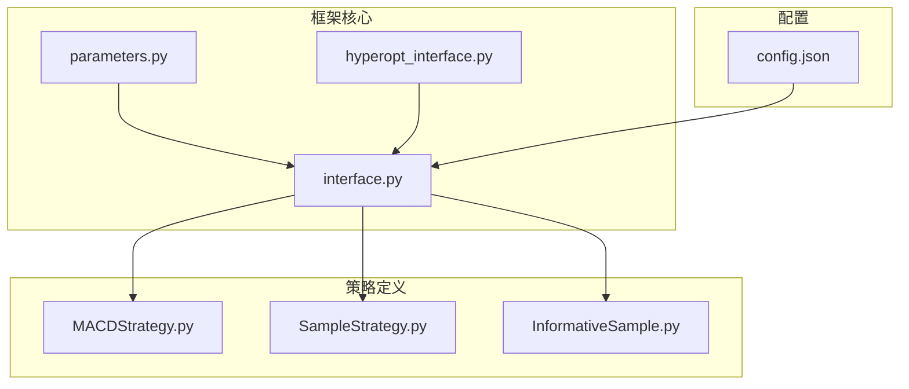
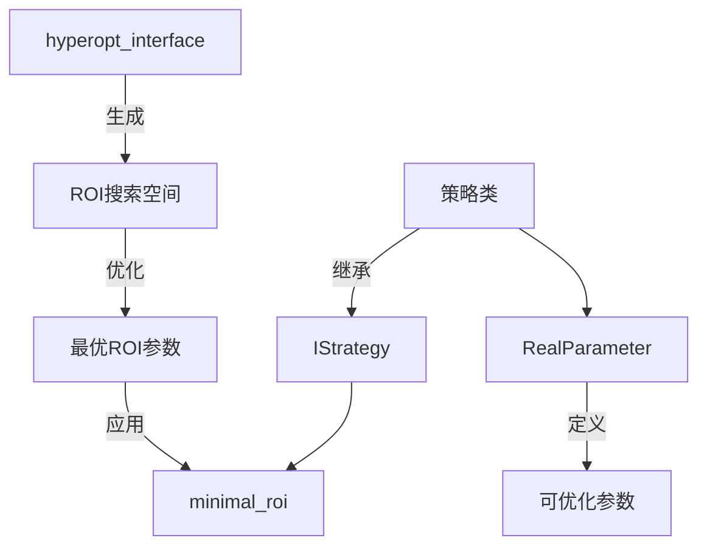
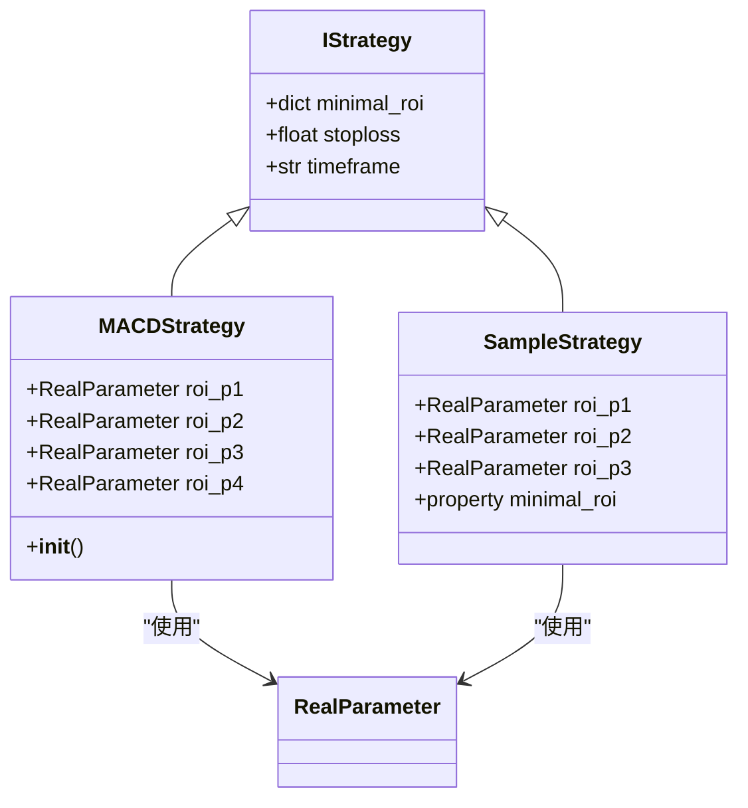
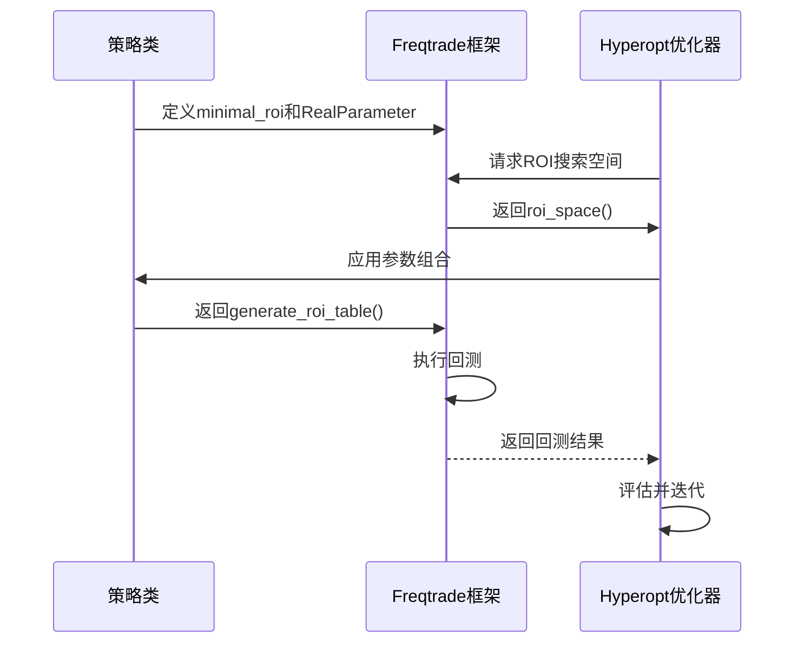
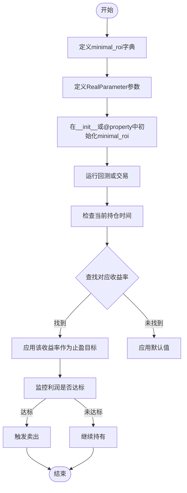
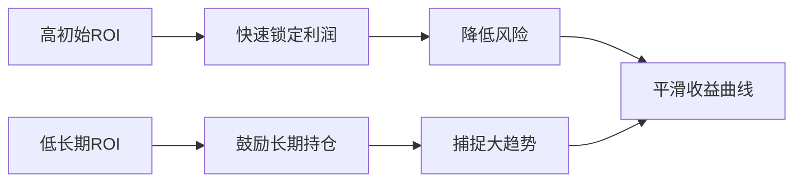
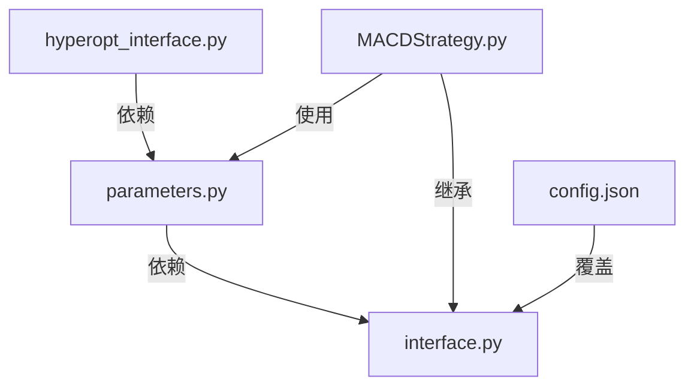

# 递减型ROI策略

<cite>
**本文档中引用的文件**  
- [interface.py](file://freqtrade/strategy/interface.py)
- [parameters.py](file://freqtrade/strategy/parameters.py)
- [hyperopt_interface.py](file://freqtrade/optimize/hyperopt/hyperopt_interface.py)
- [MACDStrategy.py](file://user_data/strategies/MACDStrategy.py)
- [SampleStrategy.py](file://user_data/strategies/SampleStrategy.py)
- [InformativeSample.py](file://user_data/strategies/InformativeSample.py)
- [config.json](file://user_data/config.json)
</cite>

## 目录
1. [简介](#简介)
2. [项目结构](#项目结构)
3. [核心组件](#核心组件)
4. [架构概述](#架构概述)
5. [详细组件分析](#详细组件分析)
6. [依赖分析](#依赖分析)
7. [性能考量](#性能考量)
8. [故障排除指南](#故障排除指南)
9. [结论](#结论)
10. [附录](#附录)（如有必要）

## 简介
递减型ROI（投资回报率）策略是一种在趋势跟踪系统中广泛应用的动态止盈机制。该策略的核心思想是：随着持仓时间的延长，逐步降低对收益率的要求，从而鼓励长期持有资产，避免在趋势尚未结束时过早止盈。通过配置时间-收益率映射关系，如{60: 0.05, 30: 0.03, 0: 0.01}，策略在持仓初期设置较高的收益目标以快速锁定利润，随着时间推移，目标收益率逐渐降低，允许交易在更长的时间内持续获利。这种机制在趋势跟踪中具有显著优势，能够平滑收益曲线，减少交易频率，但同时也可能在高波动市场中产生滞后风险。

## 项目结构
Freqtrade项目采用模块化设计，核心策略逻辑位于`user_data/strategies`目录下，而框架级的策略接口和参数定义则位于`freqtrade/strategy`目录。策略通过继承`IStrategy`类并实现其方法来定义交易逻辑，其中`minimal_roi`属性用于配置递减型ROI表。超参数优化功能通过`RealParameter`等类实现，允许在指定范围内自动搜索最优参数组合。

**图表来源**  
- [interface.py](file://freqtrade/strategy/interface.py#L70)
- [parameters.py](file://freqtrade/strategy/parameters.py#L110)
- [hyperopt_interface.py](file://freqtrade/optimize/hyperopt/hyperopt_interface.py#L50)
- [MACDStrategy.py](file://user_data/strategies/MACDStrategy.py#L50)
- [SampleStrategy.py](file://user_data/strategies/SampleStrategy.py#L70)
- [InformativeSample.py](file://user_data/strategies/InformativeSample.py#L50)
- [config.json](file://user_data/config.json#L10)

**章节来源**
- [interface.py](file://freqtrade/strategy/interface.py#L1-L100)
- [project_structure](file://#L1-L20)

## 核心组件
递减型ROI策略的核心组件包括`minimal_roi`字典、`RealParameter`类和`IStrategy`接口。`minimal_roi`定义了时间（分钟）与目标收益率的映射关系，是策略实现动态止盈的直接配置。`RealParameter`类用于定义可优化的浮点型参数，使得ROI表中的收益率值可以在超参数优化过程中自动调整。`IStrategy`接口作为所有策略的基类，提供了`minimal_roi`属性的默认定义和继承机制。

**章节来源**
- [interface.py](file://freqtrade/strategy/interface.py#L70)
- [parameters.py](file://freqtrade/strategy/parameters.py#L110)
- [MACDStrategy.py](file://user_data/strategies/MACDStrategy.py#L50)

## 架构概述
递减型ROI策略的架构基于Freqtrade的策略框架，通过继承和属性覆盖实现。策略类继承自`IStrategy`，并重写`minimal_roi`属性以定义特定的收益率衰减曲线。超参数优化器通过`RealParameter`实例访问和调整这些收益率值，从而在回测中寻找最优的衰减参数组合。整个流程由`hyperopt_interface.py`中的`roi_space`方法协调，该方法根据时间框架自动缩放ROI空间的搜索范围。

**图表来源**  
- [interface.py](file://freqtrade/strategy/interface.py#L70)
- [parameters.py](file://freqtrade/strategy/parameters.py#L110)
- [hyperopt_interface.py](file://freqtrade/optimize/hyperopt/hyperopt_interface.py#L50)

## 详细组件分析

### 递减型ROI机制分析
递减型ROI策略通过`minimal_roi`字典实现收益率随时间递减的逻辑。字典的键表示持仓时间（分钟），值表示该时间点之前需要达到的收益率。例如，`{"60": 0.05, "30": 0.03, "0": 0.01}`表示：持仓60分钟内需达到5%收益，30分钟内需达到3%收益，即时（0分钟）需达到1%收益。系统会根据当前持仓时间，查找并应用相应的收益率阈值。

#### 对于对象导向组件：

**图表来源**  
- [interface.py](file://freqtrade/strategy/interface.py#L70)
- [MACDStrategy.py](file://user_data/strategies/MACDStrategy.py#L50)
- [SampleStrategy.py](file://user_data/strategies/SampleStrategy.py#L70)

#### 对于API/服务组件：

**图表来源**  
- [hyperopt_interface.py](file://freqtrade/optimize/hyperopt/hyperopt_interface.py#L50)
- [parameters.py](file://freqtrade/strategy/parameters.py#L110)

#### 对于复杂逻辑组件：

**图表来源**  
- [MACDStrategy.py](file://user_data/strategies/MACDStrategy.py#L60)
- [SampleStrategy.py](file://user_data/strategies/SampleStrategy.py#L80)

**章节来源**
- [MACDStrategy.py](file://user_data/strategies/MACDStrategy.py#L50-L80)
- [SampleStrategy.py](file://user_data/strategies/SampleStrategy.py#L70-L100)
- [InformativeSample.py](file://user_data/strategies/InformativeSample.py#L50-L80)

### 概念概述
递减型ROI策略作为一种趋势跟踪的辅助机制，其核心价值在于平衡利润锁定与趋势延续之间的矛盾。通过设置随时间递减的收益率目标，策略在初期快速锁定部分利润以降低风险，同时在后期降低止盈门槛以捕捉更大的趋势收益。这种机制特别适用于波动性较大、趋势性强的市场环境。

[无来源，因为此图表展示的是概念性工作流，而非实际代码结构]

[无来源，因为此章节不分析特定文件]

## 依赖分析
递减型ROI策略的实现依赖于Freqtrade框架的多个核心模块。`freqtrade/strategy/interface.py`提供了`IStrategy`基类和`minimal_roi`属性定义。`freqtrade/strategy/parameters.py`提供了`RealParameter`类，用于定义可优化的收益率参数。`freqtrade/optimize/hyperopt/hyperopt_interface.py`负责生成ROI搜索空间，并协调超参数优化过程。用户策略文件（如`MACDStrategy.py`）则通过继承和配置，将这些组件组合成完整的交易策略。

**图表来源**  
- [hyperopt_interface.py](file://freqtrade/optimize/hyperopt/hyperopt_interface.py#L1)
- [parameters.py](file://freqtrade/strategy/parameters.py#L1)
- [interface.py](file://freqtrade/strategy/interface.py#L1)
- [MACDStrategy.py](file://user_data/strategies/MACDStrategy.py#L1)
- [config.json](file://user_data/config.json#L1)

**章节来源**
- [hyperopt_interface.py](file://freqtrade/optimize/hyperopt/hyperopt_interface.py#L1-L200)
- [parameters.py](file://freqtrade/strategy/parameters.py#L1-L100)
- [interface.py](file://freqtrade/strategy/interface.py#L1-L100)
- [MACDStrategy.py](file://user_data/strategies/MACDStrategy.py#L1-L100)
- [config.json](file://user_data/config.json#L1-L20)

## 性能考量
递减型ROI策略的性能受参数选择的显著影响。衰减曲线越陡峭（即初期ROI越高，衰减越快），交易频率通常越高，收益曲线可能更不稳定；反之，平缓的衰减曲线会降低交易频率，使收益曲线更加平滑。在高波动市场中，该策略可能因收益率目标调整滞后而错失最佳止盈点，产生滞后风险。因此，参数优化（如通过Hyperopt）对于找到适应特定市场条件的最佳衰减曲线至关重要。

[无来源，因为此章节提供一般性指导]

## 故障排除指南
在配置递减型ROI策略时，常见问题包括参数未被优化器识别、收益率目标未按预期应用等。应检查`RealParameter`的`space='roi'`参数是否正确设置，并确认`minimal_roi`字典中的值引用了`RealParameter`的`.value`属性。此外，确保`config.json`中的`minimal_roi`配置不会意外覆盖策略中的定义。

**章节来源**
- [MACDStrategy.py](file://user_data/strategies/MACDStrategy.py#L60-L70)
- [SampleStrategy.py](file://user_data/strategies/SampleStrategy.py#L80-L90)

## 结论
递减型ROI策略通过动态调整收益率目标，有效解决了趋势跟踪中止盈时机的难题。它鼓励长期持仓，有助于平滑收益曲线并降低交易频率。通过合理配置如{60: 0.05, 30: 0.03, 0: 0.01}这样的时间-收益率映射，并结合超参数优化，可以显著提升策略的适应性和盈利能力。然而，用户需警惕在高波动市场中的滞后风险，并通过充分的回测来验证策略的稳健性。

[无来源，因为此章节总结而不分析特定文件]