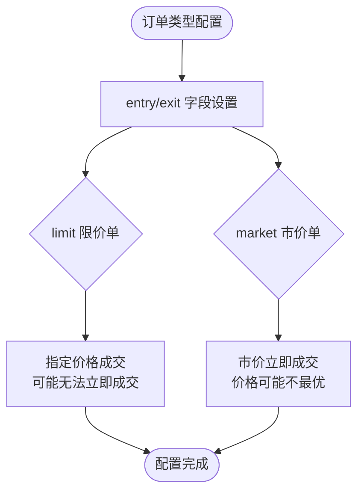
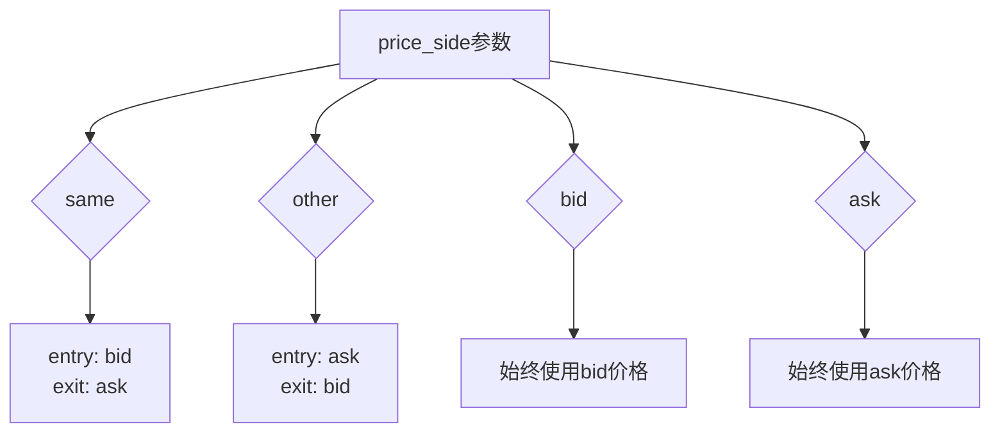

# 市价单与限价单配置

<cite>
**本文档引用文件**  
- [config_full.example.json](file://config_examples/config_full.example.json)
- [ordertypevalue.py](file://freqtrade/enums/ordertypevalue.py)
- [config_validation.py](file://freqtrade/configuration/config_validation.py)
- [api_schemas.py](file://freqtrade/rpc/api_server/api_schemas.py)
- [config_schema.py](file://freqtrade/config_schema/config_schema.py)
- [exchange.py](file://freqtrade/exchange/exchange.py)
- [config.json](file://user_data/config.json)
- [test_pricing_conf.json](file://tests/testdata/testconfigs/test_pricing_conf.json)
- [test_pricing2_conf.json](file://tests/testdata/testconfigs/test_pricing2_conf.json)
</cite>

## 目录
1. [简介](#简介)
2. [订单类型配置结构](#订单类型配置结构)
3. [市价单与限价单模式设置](#市价单与限价单模式设置)
4. [现货与期货交易中的执行差异](#现货与期货交易中的执行差异)
5. [price_side参数对订单价格的影响](#priceside参数对订单价格的影响)
6. [不同市场条件下的订单类型选择建议](#不同市场条件下的订单类型选择建议)
7. [最优下单策略配置示例](#最优下单策略配置示例)
8. [结论](#结论)

## 简介
本文档详细解释了Freqtrade系统中配置文件`order_types`字段的`entry`和`exit`如何设置市价单（market）和限价单（limit）模式。文档分析了两种订单类型在现货和期货交易中的执行差异，深入探讨了`price_side`参数对订单价格的影响，并提供了在不同市场条件下选择合适订单类型的实践建议。通过实际配置示例，展示了如何通过配置实现最优下单策略。

## 订单类型配置结构
Freqtrade系统中的订单类型配置主要通过`order_types`字段进行定义，该字段包含多个子字段，用于指定不同交易场景下的订单类型。核心字段包括`entry`（入场订单）、`exit`（出场订单）、`emergency_exit`（紧急出场）、`force_exit`（强制出场）等。这些配置直接影响交易执行的价格和时机。

**Section sources**
- [config_full.example.json](file://config_examples/config_full.example.json#L100-L110)
- [api_schemas.py](file://freqtrade/rpc/api_server/api_schemas.py#L215-L220)

## 市价单与限价单模式设置
在Freqtrade配置中，`order_types`字段的`entry`和`exit`可以设置为`limit`（限价单）或`market`（市价单）。限价单允许用户指定一个具体的价格进行交易，只有当市场价格达到或优于该价格时才会成交。市价单则以当前市场上最优的价格立即成交，保证了交易的即时性但可能牺牲价格最优性。



**Diagram sources**
- [ordertypevalue.py](file://freqtrade/enums/ordertypevalue.py#L3-L5)
- [config_full.example.json](file://config_examples/config_full.example.json#L100-L110)

**Section sources**
- [ordertypevalue.py](file://freqtrade/enums/ordertypevalue.py#L3-L5)
- [config_validation.py](file://freqtrade/configuration/config_validation.py#L250-L270)

## 现货与期货交易中的执行差异
在现货交易中，市价单和限价单的执行相对直接，主要关注买卖价格的匹配。而在期货交易中，由于存在杠杆和保证金机制，订单执行更为复杂。市价单在期货市场中可能导致滑点较大，特别是在市场波动剧烈时。限价单虽然能控制价格，但可能因市场快速变动而无法成交，错失交易机会。

此外，期货交易中的`price_side`参数对订单执行价格有更显著的影响。例如，在做空时，使用`bid`价格作为参考可能更有利于快速平仓，而在做多时，`ask`价格则更为关键。

**Section sources**
- [exchange.py](file://freqtrade/exchange/exchange.py#L2099-L2114)
- [config_full.example.json](file://config_examples/config_full.example.json#L100-L110)

## price_side参数对订单价格的影响
`price_side`参数决定了订单价格的参考基准，可选值包括`bid`、`ask`、`same`和`other`。当`price_side`设置为`same`时，入场订单使用`bid`价格，出场订单使用`ask`价格；当设置为`other`时，情况则相反。这一参数在市价单和限价单中均有重要影响。

对于市价单，`price_side`直接决定了成交价格的参考点。对于限价单，它影响了限价的基准价格。例如，在`entry_pricing`中设置`price_side`为`other`，意味着入场价格将参考相反方向的价格，这在某些策略中可以避免价格冲击。



**Diagram sources**
- [config_schema.py](file://freqtrade/config_schema/config_schema.py#L240-L337)
- [test_pricing_conf.json](file://tests/testdata/testconfigs/test_pricing_conf.json#L1-L20)

**Section sources**
- [config_schema.py](file://freqtrade/config_schema/config_schema.py#L240-L337)
- [test_pricing2_conf.json](file://tests/testdata/testconfigs/test_pricing2_conf.json#L0-L17)

## 不同市场条件下的订单类型选择建议
在高波动性市场中，建议使用市价单以确保交易的及时执行，避免因价格快速变动而错失机会。在低波动性或趋势明确的市场中，限价单更为合适，可以更好地控制交易成本。对于大额交易，应谨慎使用市价单，以避免造成市场冲击和较大的滑点。

在流动性较差的市场中，限价单是更好的选择，因为它可以避免以不利价格成交。而在流动性充足的市场中，市价单的执行效率更高。此外，结合`unfilledtimeout`设置，可以为限价单设置超时机制，避免订单长时间挂单不成交。

**Section sources**
- [config_full.example.json](file://config_examples/config_full.example.json#L80-L90)
- [config.json](file://user_data/config.json#L50-L60)

## 最优下单策略配置示例
以下是一个优化的下单策略配置示例，结合了市价单和限价单的优势：

```json
"order_types": {
    "entry": "limit",
    "exit": "market",
    "emergency_exit": "market",
    "force_exit": "market",
    "stoploss": "market"
},
"entry_pricing": {
    "price_side": "same",
    "use_order_book": true,
    "order_book_top": 1
},
"exit_pricing": {
    "price_side": "other",
    "use_order_book": true,
    "order_book_top": 1
},
"unfilledtimeout": {
    "entry": 10,
    "exit": 10
}
```

此配置在入场时使用限价单以控制成本，在出场时使用市价单以确保及时性。紧急出场和止损均使用市价单，保证风险控制的即时性。同时，通过`unfilledtimeout`设置，入场限价单在10分钟内未成交将自动取消。

**Section sources**
- [config_full.example.json](file://config_examples/config_full.example.json#L100-L130)
- [config.json](file://user_data/config.json#L40-L70)

## 结论
正确配置`order_types`中的`entry`和`exit`字段对于实现高效的交易策略至关重要。市价单和限价单各有优劣，应根据市场条件和交易策略灵活选择。`price_side`参数的合理设置可以显著影响订单执行价格，特别是在期货交易中。通过结合不同订单类型和参数配置，可以构建出适应各种市场环境的最优下单策略。