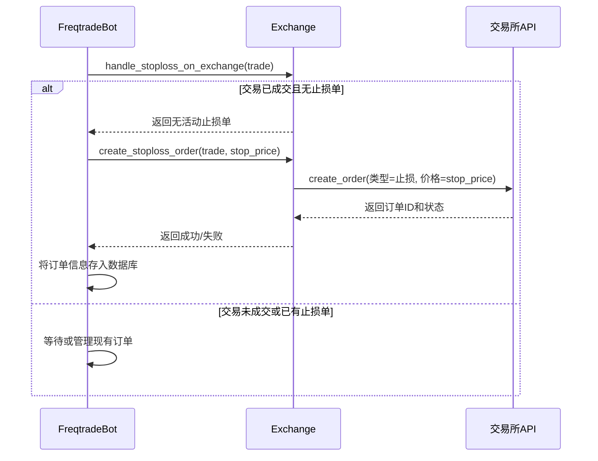

# 交易所层面止损机制

<cite>
**本文档中引用的文件**   
- [exchange.py](file://freqtrade/exchange/exchange.py)
- [freqtradebot.py](file://freqtrade/freqtradebot.py)
- [exchange_types.py](file://freqtrade/exchange/exchange_types.py)
- [test_binance.py](file://tests/exchange/test_binance.py)
- [test_htx.py](file://tests/exchange/test_htx.py)
- [test_kucoin.py](file://tests/exchange/test_kucoin.py)
</cite>

## 目录
1. [简介](#简介)
2. [核心组件分析](#核心组件分析)
3. [技术流程与执行机制](#技术流程与执行机制)
4. [执行速度优势与资金费率影响](#执行速度优势与资金费率影响)
5. [启用前提条件](#启用前提条件)
6. [配置示例与协同作用](#配置示例与协同作用)

## 简介
`stoploss_on_exchange` 参数是 Freqtrade 交易框架中的一个关键功能，允许用户在交易所层面直接设置止损单。与传统的在本地策略中监控价格并手动发送市价单不同，该功能通过在交易所创建真正的止损订单，实现更快速、更可靠的自动止损执行。本文档将深入解析 `stoploss_on_exchange` 的工作原理，详细说明其技术流程、性能优势、配置要求以及与其他交易参数的协同作用。

## 核心组件分析

`stoploss_on_exchange` 功能的实现依赖于 Freqtrade 框架中的多个核心模块，主要包括 `Exchange` 类和 `FreqtradeBot` 类。`Exchange` 类负责与具体交易所的 API 进行交互，而 `FreqtradeBot` 类则管理交易的整个生命周期，包括止损单的创建和管理。

**Section sources**
- [exchange.py](file://freqtrade/exchange/exchange.py#L1452-L1551)
- [freqtradebot.py](file://freqtrade/freqtradebot.py#L1429-L1483)

## 技术流程与执行机制

当用户在策略配置中启用 `stoploss_on_exchange` 后，系统会遵循一系列精确的步骤来在交易所层面执行止损单。整个流程始于交易订单的确认，终于止损单的创建与监控。



**Diagram sources**
- [freqtradebot.py](file://freqtrade/freqtradebot.py#L1429-L1483)
- [exchange.py](file://freqtrade/exchange/exchange.py#L1452-L1551)

### 止损单创建流程

1.  **条件检查**：`FreqtradeBot.handle_stoploss_on_exchange()` 方法首先检查交易是否已经成交（`has_open_position`）且没有正在处理的其他订单。如果条件满足，系统将继续执行。
2.  **获取止损价格**：系统从交易对象中获取预设的止损价格（`stoploss_or_liquidation`）。
3.  **调用创建方法**：`FreqtradeBot.create_stoploss_order()` 方法被调用，该方法是 `handle_stoploss_on_exchange` 的核心。
4.  **执行创建**：`create_stoploss_order` 方法最终调用 `Exchange.create_stoploss()` 方法。此方法会根据配置的订单类型（市价单或限价单）和交易所的API规范，构造并发送创建止损单的请求。
5.  **参数处理**：对于限价止损单，系统会根据 `stoploss_on_exchange_limit_ratio` 参数计算一个略低于（做多时）或高于（做空时）止损触发价的限价。例如，如果 `limit_ratio` 设置为 0.99，则限价为触发价的 99%。
6.  **API请求**：`Exchange.create_stoploss()` 方法使用 `ccxt` 库向交易所的API发送 `create_order` 请求，其中包含交易对、数量、订单类型、价格（限价）以及关键的 `stopPrice` 参数。
7.  **结果处理**：如果API调用成功，交易所会返回一个包含订单ID的响应。`FreqtradeBot` 会将此订单信息（如订单ID、类型、价格）解析并存储在本地数据库中，以便后续跟踪和管理。

**Section sources**
- [freqtradebot.py](file://freqtrade/freqtradebot.py#L1393-L1427)
- [exchange.py](file://freqtrade/exchange/exchange.py#L1452-L1551)

## 执行速度优势与资金费率影响

启用 `stoploss_on_exchange` 带来了显著的执行速度优势，同时也对资金费率的计算和管理产生了影响。

### 执行速度优势

最大的优势在于**执行速度的提升和可靠性增强**。传统模式下，机器人需要定期从交易所获取最新价格（例如每秒一次），然后在本地判断是否触发止损。这个过程存在固有的延迟，包括网络延迟、机器人处理延迟和交易所API的响应延迟。在极端行情下，这可能导致止损价格与实际成交价格产生巨大偏差（滑点）。

相比之下，`stoploss_on_exchange` 将止损逻辑完全交由交易所处理。交易所的撮合引擎在价格触及 `stopPrice` 时，会以极低的延迟（通常在毫秒级）立即执行订单。这极大地减少了滑点风险，确保了止损能够更精确地在预设价格附近成交。

### 资金费率影响

对于永续合约（Futures）交易，资金费率（Funding Rate）是一个持续发生的成本或收益。`stoploss_on_exchange` 机制本身并不直接改变资金费率的计算方式，但它通过**更快地关闭头寸**间接影响了资金费用的累积。

当一个交易头寸被快速止损平仓时，它在市场中暴露的时间缩短了。这意味着该头寸需要支付或收取资金费用的周期也相应缩短。因此，虽然单次资金费率不变，但总的累积资金费用会因为持仓时间的减少而降低。这对于频繁交易或在高资金费率环境下交易的用户来说，是一个重要的成本优化点。

**Section sources**
- [freqtradebot.py](file://freqtrade/freqtradebot.py#L1429-L1483)
- [exchange.py](file://freqtrade/exchange/exchange.py#L1452-L1551)

## 启用前提条件

并非所有交易所都支持 `stoploss_on_exchange` 功能。其启用依赖于特定的交易所支持和账户权限。

### 交易所支持列表

该功能的可用性由 `Exchange` 类中的 `_ft_has` 字典决定，其中 `stoploss_on_exchange` 键的值为 `True` 表示支持。根据代码分析，以下交易所明确支持此功能：
- **Binance (币安)**：通过 `test_binance.py` 中的测试用例可以验证其支持。
- **HTX (火币)**：通过 `test_htx.py` 中的测试用例可以验证其支持。
- **KuCoin (库币)**：通过 `test_kucoin.py` 中的测试用例可以验证其支持。
- **Gate.io (芝麻开门)**：通过 `test_gate.py` 中的测试用例可以验证其支持。

其他支持 `stopPrice` 参数的期货/杠杆交易所（如 Bybit, OKX）通常也支持此功能，但需要在具体实现中进行确认。

### 账户权限要求

要成功创建止损单，用户的交易所账户必须满足以下权限要求：
1.  **API密钥权限**：用于连接交易所的API密钥必须拥有“交易”（Trade）权限。如果API密钥仅具有“只读”权限，则无法创建任何订单。
2.  **足够的保证金**：账户中必须有足够的保证金来覆盖交易头寸。如果保证金不足，`create_stoploss` 方法会抛出 `InsufficientFundsError` 异常。
3.  **正确的交易模式**：该功能主要在**合约（Futures）** 模式下使用，但也支持**杠杆（Margin）** 交易。在现货（Spot）模式下，部分交易所可能不支持止损单。

**Section sources**
- [exchange_types.py](file://freqtrade/exchange/exchange_types.py#L14)
- [test_binance.py](file://tests/exchange/test_binance.py#L71-L93)
- [test_htx.py](file://tests/exchange/test_htx.py#L41-L67)
- [test_kucoin.py](file://tests/exchange/test_kucoin.py#L41-L73)

## 配置示例与协同作用

### 配置示例

在策略的配置文件（如 `config.json`）中，可以通过以下方式启用和配置 `stoploss_on_exchange`：

```json
{
  "exchange": {
    "name": "binance",
    "key": "your_api_key",
    "secret": "your_api_secret"
  },
  "order_types": {
    "stoploss": "limit",
    "stoploss_on_exchange": true,
    "stoploss_on_exchange_limit_ratio": 0.99
  },
  "stoploss": -0.05
}
```

- `stoploss_on_exchange: true`：启用交易所层面止损。
- `stoploss: -0.05`：设置止损比例为 -5%。
- `stoploss_on_exchange_limit_ratio: 0.99`：设置限价止损的限价为触发价的 99%。

### 与订单类型和价格类型的协同作用

`stoploss_on_exchange` 的行为与 `order_types` 中的其他设置紧密协同：
- **订单类型 (`stoploss`)**：决定了止损单是市价单（`market`）还是限价单（`limit`）。市价单执行速度最快，但滑点风险最高；限价单可以控制成交价格，但有无法成交的风险。
- **价格类型 (`stoploss_price_type`)**：在期货交易中，用户可以指定止损价格是基于**标记价格（mark）** 还是**最新价格（last）** 触发。这通过 `order_types` 中的 `stoploss_price_type` 参数设置。例如，`"stoploss_price_type": "mark"` 可以防止因市场短暂插针（Wick）而导致的误触发。

这些参数的组合使用，使得用户可以根据自己的风险偏好和市场策略，精细地控制止损单的行为。

**Section sources**
- [config_examples/config_binance.example.json](file://config_examples/config_binance.example.json)
- [exchange.py](file://freqtrade/exchange/exchange.py#L1452-L1551)