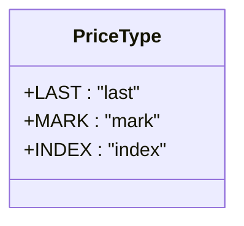
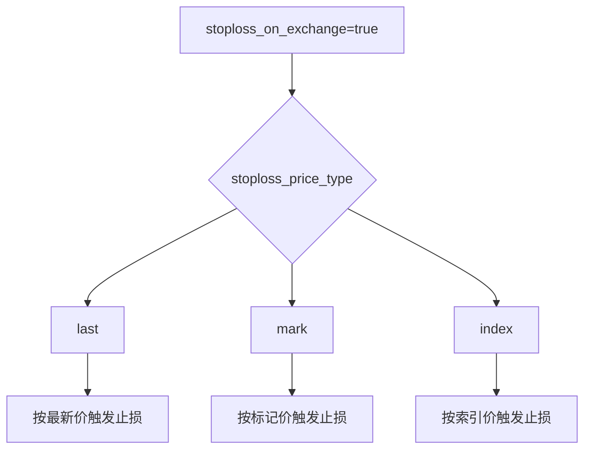

# 止损价格类型配置

<cite>
**本文档中引用的文件**   
- [pricetype.py](file://freqtrade/enums/pricetype.py)
- [config_full.example.json](file://config_examples/config_full.example.json)
- [constants.py](file://freqtrade/constants.py)
- [stoploss.md](file://docs/stoploss.md)
- [exchange.py](file://freqtrade/exchange/exchange.py)
- [configuration.py](file://freqtrade/configuration/configuration.py)
</cite>

## 目录
1. [stoploss_price_type参数介绍](#stoploss_price_type参数介绍)
2. [不同价格类型详解](#不同价格类型详解)
3. [期货合约交易中的差异分析](#期货合约交易中的差异分析)
4. [高波动市场下的表现](#高波动市场下的表现)
5. [与stoploss_on_exchange功能的联动关系](#与stoploss_on_exchange功能的联动关系)
6. [不同交易模式的推荐配置方案](#不同交易模式的推荐配置方案)
7. [完整配置示例](#完整配置示例)

## stoploss_price_type参数介绍

`stoploss_price_type`参数仅适用于期货市场（在支持该功能的交易所中）。此参数定义了止损单在交易所触发时所依据的价格类型。Freqtrade会在启动时对此设置进行验证，如果为交易所选择了无效的设置，则会启动失败。

该参数仅在期货市场中有效，在现货交易中不适用。不同交易所支持的价格类型可能有所不同，具体需参考各交易所的技术文档。

**Section sources**
- [stoploss.md](file://docs/stoploss.md#L60-L71)
- [pricetype.py](file://freqtrade/enums/pricetype.py#L1-L10)

## 不同价格类型详解

### 最新价 (last)

最新价是指合约的最新成交价格，也称为"合约价格"。这是最直接的价格参考，反映了市场上最近的实际交易价格。

### 标记价 (mark)

标记价是交易所计算的参考价格，通常基于多个交易所的指数价格和资金费率等因素综合计算得出。标记价的设计目的是防止价格操纵，提供更稳定的价格参考。

### 索引价 (index)

索引价是基于多个主要交易所的加权平均价格计算得出的基准价格。它通常不受单一交易所短期价格波动的影响，提供了更广泛的市场视角。



**Diagram sources**
- [pricetype.py](file://freqtrade/enums/pricetype.py#L1-L10)

**Section sources**
- [pricetype.py](file://freqtrade/enums/pricetype.py#L1-L10)
- [constants.py](file://freqtrade/constants.py#L28-L28)

## 期货合约交易中的差异分析

在期货合约交易中，不同价格类型的选择对止损单的触发行为有显著影响：

- **最新价**：对市场波动最敏感，能够快速响应价格变化，但在剧烈波动时可能导致过早触发止损
- **标记价**：相对稳定，减少了因短期价格操纵或闪崩导致的误触发风险
- **索引价**：最为稳定，完全基于外部市场价格，不受单一交易所订单簿影响

选择不同的价格类型会影响止损单的风险管理效果。最新价适合追求快速反应的交易策略，而标记价和索引价更适合追求稳定性的长期持仓策略。

**Section sources**
- [stoploss.md](file://docs/stoploss.md#L60-L71)
- [exchange.py](file://freqtrade/exchange/exchange.py#L1451-L1477)

## 高波动市场下的表现

在高波动市场环境下，不同价格类型的表现差异更加明显：

### 市场剧烈波动时的风险

当市场出现剧烈波动时，最新价可能会出现短暂的极端值，导致止损单在非理性价格水平触发。这种情况在流动性不足或遭遇市场操纵时尤为常见。

### 不同价格类型的稳定性比较

- **最新价**：在高波动市场中表现最不稳定，容易受到"闪电崩盘"或"暴涨"的影响
- **标记价**：通过算法平滑处理，减少了极端价格的影响，提供了更好的保护
- **索引价**：由于基于多个交易所的综合价格，具有最高的稳定性

在极端市场条件下，使用标记价或索引价作为止损触发价格可以有效避免因短期价格失真导致的不必要的止损触发。

**Section sources**
- [stoploss.md](file://docs/stoploss.md#L60-L71)
- [config_full.example.json](file://config_examples/config_full.example.json#L1-L217)

## 与stoploss_on_exchange功能的联动关系

`stoploss_price_type`参数与`stoploss_on_exchange`功能密切相关，二者共同决定了止损单的执行方式。

### stoploss_on_exchange功能说明

当`stoploss_on_exchange`设置为`true`时，止损单将直接在交易所创建，而不是由Freqtrade机器人监控和执行。这种方式具有以下优势：
- 更快的执行速度
- 即使机器人离线也能保证止损生效
- 减少网络延迟带来的风险

### 参数联动机制



**Diagram sources**
- [config_full.example.json](file://config_examples/config_full.example.json#L1-L217)

**Section sources**
- [config_full.example.json](file://config_examples/config_full.example.json#L1-L217)
- [exchange.py](file://freqtrade/exchange/exchange.py#L1451-L1477)

## 不同交易模式的推荐配置方案

### 现货交易模式

在现货交易模式下，`stoploss_price_type`参数不适用，因为现货交易通常不支持交易所层面的止损单。建议使用机器人的内部止损机制。

### USDT永续合约

对于USDT计价的永续合约，推荐配置：
- 高频交易：`"last"` - 追求快速反应
- 中长期持仓：`"mark"` - 追求稳定性
- 极端风险规避：`"index"` - 最大程度避免价格操纵

### 币本位永续合约

对于币本位永续合约，由于其特殊的结算机制，推荐使用：
- `"mark"`作为默认选择，平衡反应速度和稳定性
- 在市场极度不稳定时可临时切换到`"index"`

**Section sources**
- [config_full.example.json](file://config_examples/config_full.example.json#L1-L217)
- [stoploss.md](file://docs/stoploss.md#L60-L71)

## 完整配置示例

```json
{
    "order_types": {
        "entry": "limit",
        "exit": "limit",
        "emergency_exit": "market",
        "force_exit": "market",
        "force_entry": "market",
        "stoploss": "market",
        "stoploss_on_exchange": true,
        "stoploss_price_type": "mark",
        "stoploss_on_exchange_interval": 60,
        "stoploss_on_exchange_limit_ratio": 0.99
    }
}
```

此配置示例展示了推荐的完整止损配置：
- 启用交易所止损功能
- 使用标记价作为触发价格
- 设置合理的限价单比例
- 配置适当的检查间隔

**Section sources**
- [config_full.example.json](file://config_examples/config_full.example.json#L1-L217)
- [configuration.py](file://freqtrade/configuration/configuration.py#L1-L547)