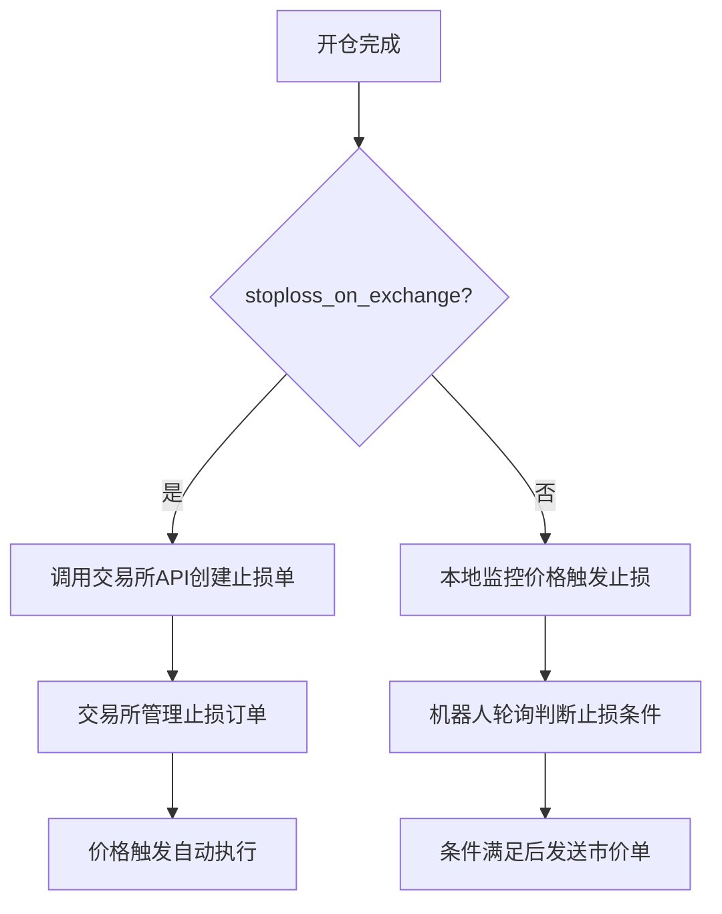

# 止损单类型配置

<cite>
**本文档中引用的文件**  
- [exchange.py](file://freqtrade/exchange/exchange.py)
- [test_stoploss_on_exchange.py](file://tests/freqtradebot/test_stoploss_on_exchange.py)
- [constants.py](file://freqtrade/constants.py)
- [exchange_types.py](file://freqtrade/exchange/exchange_types.py)
- [api_schemas.py](file://freqtrade/rpc/api_server/api_schemas.py)
</cite>

## 目录
1. [订单类型配置概述](#订单类型配置概述)
2. [stoploss_on_exchange工作机制](#stoploss_on_exchange工作机制)
3. [关联参数协同作用](#关联参数协同作用)
4. [完整配置示例](#完整配置示例)

## 订单类型配置概述

在Freqtrade系统中，止损订单类型配置主要涉及`market`和`stop_loss_limit`两种模式的区别。`market`模式会在触发时以市价立即执行，确保快速平仓但可能面临滑点风险；而`stop_loss_limit`模式则会设置一个限价，当价格达到止损价时按指定限价挂单，有助于控制成交价格但存在无法完全成交的风险。这些配置通过策略中的`order_types`字典进行定义，影响着交易执行的具体行为。

**Section sources**
- [exchange.py](file://freqtrade/exchange/exchange.py#L1451-L1477)

## stoploss_on_exchange工作机制

`stoploss_on_exchange`参数控制是否在交易所层面直接设置止损单。当启用此功能时，系统会在开仓后立即在交易所创建止损订单，从而实现更快的执行速度，因为不需要通过机器人轮询来触发止损。这种机制的优势在于响应时间更短，特别是在市场剧烈波动时能更快地保护资金安全。然而，该功能受限于交易所的支持程度，并且某些交易所可能会对此类订单收取额外费用。

此外，使用`stoploss_on_exchange`需要确保交易所支持相应的API调用，如`create_stoploss`方法。如果交易所不支持或API调用失败，则系统将回退到本地管理止损的方式。同时，由于此类订单由交易所直接处理，因此其状态更新和取消操作也需要通过交易所API完成，增加了对网络稳定性的依赖。



**Diagram sources**
- [exchange.py](file://freqtrade/exchange/exchange.py#L1479-L1512)
- [test_stoploss_on_exchange.py](file://tests/freqtradebot/test_stoploss_on_exchange.py#L0-L799)

**Section sources**
- [exchange.py](file://freqtrade/exchange/exchange.py#L1451-L1512)
- [test_stoploss_on_exchange.py](file://tests/freqtradebot/test_stoploss_on_exchange.py#L0-L799)

## 关联参数协同作用

`stoploss_price_type`参数用于指定止损价格的参考类型，可选值包括`last`（最新成交价）、`mark`（标记价格）和`index`（指数价格），不同交易所支持的类型可能有所差异。选择合适的参考价格类型可以更好地适应市场情况，例如在高波动性市场中使用标记价格可以减少因短暂价格波动导致的误触发。

`stoploss_on_exchange_interval`参数定义了检查和调整交易所止损订单的时间间隔（单位为秒）。当启用了追踪止损（trailing stop）功能时，系统会根据此间隔定期检查是否需要调整止损价位。较短的间隔可以更及时地响应市场价格变化，但也可能导致频繁的API调用，增加网络负担和潜在的调用限制风险。

这些参数与`stoploss_on_exchange`共同作用，形成了一套完整的止损管理机制。例如，在配置中同时启用`stoploss_on_exchange`并设置合理的`stoploss_on_exchange_interval`，可以在保证快速响应的同时，动态调整止损位置以最大化收益。

**Section sources**
- [exchange_types.py](file://freqtrade/exchange/exchange_types.py#L8-L66)
- [constants.py](file://freqtrade/constants.py#L28-L28)
- [api_schemas.py](file://freqtrade/rpc/api_server/api_schemas.py#L214-L222)

## 完整配置示例

以下是一个启用`stoploss_on_exchange`功能的完整配置示例，展示了如何结合使用相关参数：

```json
{
  "stoploss": -0.05,
  "trailing_stop": true,
  "trailing_stop_positive": 0.02,
  "trailing_stop_positive_offset": 0.04,
  "trailing_only_offset_is_reached": true,
  "order_types": {
    "entry": "limit",
    "exit": "limit",
    "stoploss": "limit",
    "stoploss_on_exchange": true,
    "stoploss_price_type": "mark",
    "stoploss_on_exchange_interval": 60
  },
  "use_custom_stoploss": false
}
```

在此配置中，设置了5%的基础止损，启用了追踪止损功能，并将止损单直接放在交易所。止损价格参考类型设为标记价格，每60秒检查一次是否需要调整止损价位。这样的配置既保证了止损的快速执行，又能根据市场走势灵活调整止损点位。

**Section sources**
- [api_schemas.py](file://freqtrade/rpc/api_server/api_schemas.py#L214-L260)