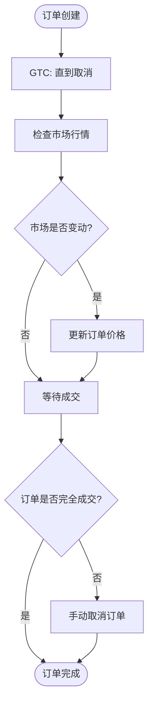
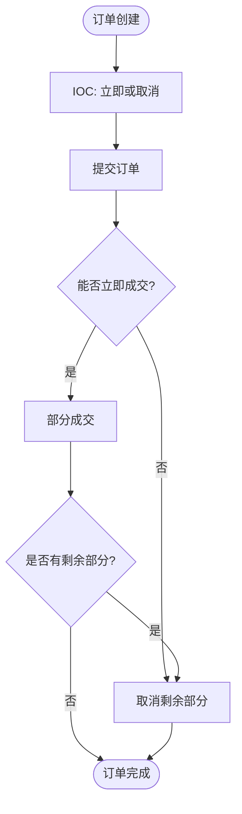
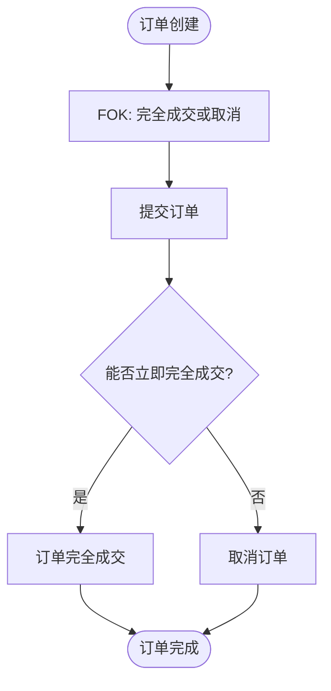

# 订单时效性配置

<cite>
**本文档引用的文件**
- [config_full.example.json](file://config_examples/config_full.example.json)
- [interface.py](file://freqtrade/strategy/interface.py)
- [exchange.py](file://freqtrade/exchange/exchange.py)
- [config_validation.py](file://freqtrade/configuration/config_validation.py)
</cite>

## 目录
1. [引言](#引言)
2. [订单时效策略概述](#订单时效策略概述)
3. [GTC策略详解](#gtc策略详解)
4. [IOC策略详解](#ioc策略详解)
5. [FOK策略详解](#fok策略详解)
6. [配置与实现](#配置与实现)
7. [最佳实践与场景分析](#最佳实践与场景分析)
8. [风险与注意事项](#风险与注意事项)

## 引言
订单时效性配置是量化交易系统中的关键参数，它决定了订单在交易所的挂单行为和成交模式。不同的订单时效策略适用于不同的交易场景和策略需求。本文档将详细说明`order_time_in_force`配置项中GTC、IOC、FOK等订单时效策略的含义和适用场景，解释这些策略如何影响订单在交易所的挂单行为和成交模式，分析不同交易策略下选择合适时效策略的最佳实践，并结合具体交易场景展示各种时效策略的实际效果和潜在风险。

## 订单时效策略概述
订单时效策略（Time in Force, TIF）是交易指令中的一个重要参数，用于指定订单在交易所的有效期限和执行方式。常见的订单时效策略包括GTC（Good Till Cancelled）、IOC（Immediate or Cancel）和FOK（Fill or Kill）。这些策略直接影响订单的挂单行为、成交模式以及交易策略的执行效果。

在Freqtrade系统中，订单时效策略通过`order_time_in_force`配置项进行设置，该配置项定义了订单在交易所的有效期限和执行方式。通过合理配置订单时效策略，交易者可以更好地控制订单的执行过程，优化交易策略的效果。

**Section sources**
- [config_full.example.json](file://config_examples/config_full.example.json#L148-L150)

## GTC策略详解
GTC（Good Till Cancelled）策略表示订单在交易所的有效期限为“直到取消”。这意味着订单将一直保留在交易所的订单簿中，直到被完全成交或被手动取消。GTC策略适用于那些希望订单在较长时间内保持有效的交易者，尤其是在市场波动较大或交易机会较少的情况下。

使用GTC策略的优点是订单有更多的时间等待成交，增加了成交的可能性。然而，这也意味着订单可能会在不利的价格下成交，特别是在市场快速变动时。因此，GTC策略适合那些对成交价格有一定容忍度的交易者。



**Diagram sources**
- [interface.py](file://freqtrade/strategy/interface.py#L102-L105)

## IOC策略详解
IOC（Immediate or Cancel）策略表示订单必须立即成交，否则将被取消。这意味着订单在提交到交易所后，如果不能立即以指定价格成交，剩余未成交的部分将被立即取消。IOC策略适用于那些希望快速执行订单的交易者，尤其是在市场流动性充足的情况下。

使用IOC策略的优点是可以快速执行订单，避免订单在不利的价格下成交。然而，这也意味着订单可能无法完全成交，特别是在市场流动性不足时。因此，IOC策略适合那些对成交速度有较高要求的交易者。



**Diagram sources**
- [exchange.py](file://freqtrade/exchange/exchange.py#L1447-L1483)

## FOK策略详解
FOK（Fill or Kill）策略表示订单必须立即完全成交，否则将被取消。这意味着订单在提交到交易所后，如果不能立即以指定价格完全成交，整个订单将被立即取消。FOK策略适用于那些希望确保订单完全成交的交易者，尤其是在市场流动性充足且价格稳定的情况下。

使用FOK策略的优点是可以确保订单完全成交，避免部分成交带来的风险。然而，这也意味着订单可能无法成交，特别是在市场流动性不足时。因此，FOK策略适合那些对成交完整性和速度都有较高要求的交易者。



**Diagram sources**
- [exchange.py](file://freqtrade/exchange/exchange.py#L1604-L1639)

## 配置与实现
在Freqtrade系统中，订单时效策略通过`order_time_in_force`配置项进行设置。该配置项通常包含`entry`和`exit`两个子项，分别用于定义入场和出场订单的时效策略。例如，在`config_full.example.json`文件中，`order_time_in_force`配置项的默认值为`{"entry": "GTC", "exit": "GTC"}`，表示入场和出场订单都采用GTC策略。

```json
"order_time_in_force": {
    "entry": "GTC",
    "exit": "GTC"
}
```

此外，系统还提供了`_validate_time_in_force`函数来验证订单时效策略的配置是否正确。该函数会检查配置项中是否包含`buy`和`sell`等旧的配置项，并提示用户迁移到新的`entry`和`exit`配置项。

**Section sources**
- [config_full.example.json](file://config_examples/config_full.example.json#L148-L150)
- [config_validation.py](file://freqtrade/configuration/config_validation.py#L219-L237)

## 最佳实践与场景分析
选择合适的订单时效策略需要根据具体的交易场景和策略需求来决定。以下是一些常见的最佳实践和场景分析：

1. **趋势跟踪策略**：对于趋势跟踪策略，通常希望订单在较长时间内保持有效，以便捕捉到趋势的延续。因此，GTC策略是一个合适的选择。
2. **高频交易策略**：对于高频交易策略，通常希望订单能够快速执行，以减少市场波动带来的影响。因此，IOC或FOK策略是更好的选择。
3. **套利策略**：对于套利策略，通常希望订单能够立即完全成交，以确保套利机会的实现。因此，FOK策略是最合适的选择。

在实际应用中，交易者应根据自己的交易策略和市场情况，灵活选择和调整订单时效策略，以达到最佳的交易效果。

## 风险与注意事项
虽然订单时效策略可以帮助交易者更好地控制订单的执行过程，但也存在一些潜在的风险和注意事项：

1. **市场流动性风险**：在市场流动性不足的情况下，IOC和FOK策略可能导致订单无法成交，从而错失交易机会。
2. **价格波动风险**：在市场快速变动时，GTC策略可能导致订单在不利的价格下成交，增加交易成本。
3. **系统延迟风险**：在高频率交易中，系统延迟可能导致订单无法及时执行，影响交易策略的效果。

因此，交易者在选择和使用订单时效策略时，应充分考虑这些风险，并采取相应的风险管理措施。