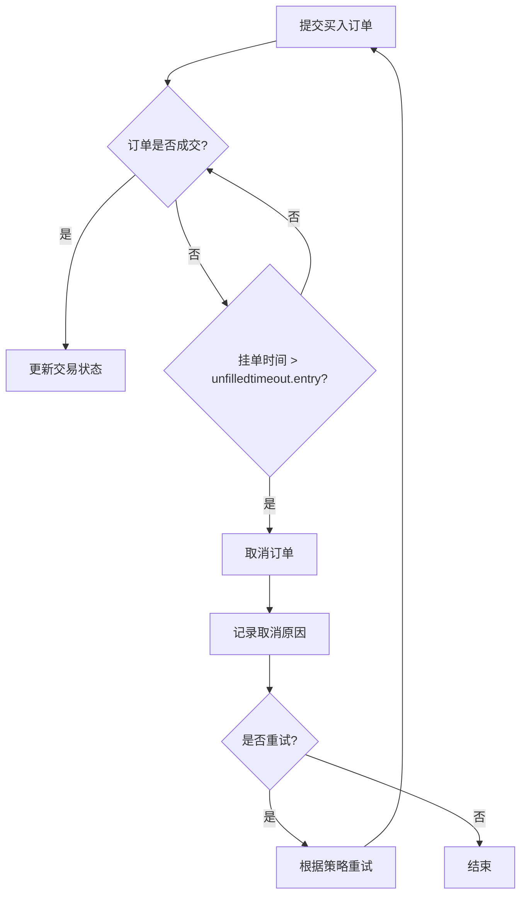

# 买入订单超时配置

<cite>
**本文档中引用的文件**  
- [config_full.example.json](file://config_examples/config_full.example.json)
- [config_validation.py](file://freqtrade/configuration/config_validation.py)
- [freqtradebot.py](file://freqtrade/freqtradebot.py)
</cite>

## 目录
1. [unfilledtimeout.entry参数详解](#unfilledtimeoutentry参数详解)  
2. [超时配置与交易所API限流协同](#超时配置与交易所api限流协同)  
3. [不同市场条件下的配置策略](#不同市场条件下的配置策略)  
4. [防止资金长期锁定的最佳实践](#防止资金长期锁定的最佳实践)  
5. [超时后的订单取消与重试逻辑](#超时后的订单取消与重试逻辑)

## unfilledtimeout.entry参数详解

`unfilledtimeout.entry`参数用于控制未成交买入订单的等待时间。当交易机器人在交易所提交买入订单后，若在指定时间内未能完全成交，该订单将被自动取消。此参数在配置文件中以分钟为单位设置，是防止资金因挂单未成交而长期锁定的关键机制。

该参数属于`unfilledtimeout`配置对象的一部分，其配置结构如下：
```json
"unfilledtimeout": {
    "entry": 10,
    "exit": 10,
    "exit_timeout_count": 0,
    "unit": "minutes"
}
```
其中`entry`字段即为买入订单的超时时间。系统在运行时会持续监控所有未完成的买入订单，一旦发现订单的挂单时间超过了`entry`所设定的值，便会触发取消流程。

**Section sources**
- [config_full.example.json](file://config_examples/config_full.example.json#L45-L52)

## 超时配置与交易所API限流协同

`unfilledtimeout.entry`的配置必须与交易所的API限流机制协同工作。频繁地查询订单状态和取消订单会消耗API调用额度，不当的配置可能导致API被限流，从而影响交易机器人的正常运行。

为避免此问题，建议将`unfilledtimeout.entry`的值设置为略长于预期的成交时间，以减少不必要的订单状态查询和取消操作。例如，在高波动性市场中，可以将超时时间设置得更长，以适应价格快速变动导致的成交延迟。

**Section sources**
- [freqtradebot.py](file://freqtrade/freqtradebot.py#L1450-L1480)

## 不同市场条件下的配置策略

在不同市场条件下，`unfilledtimeout.entry`的配置策略应有所不同：

- **高波动性市场**：在价格快速变动的市场中，订单可能因价格跳动而难以成交。此时应将`unfilledtimeout.entry`设置为较长的时间（如15-30分钟），以给予订单足够的成交机会，避免因短暂的价格偏离而被过早取消。
- **低流动性市场**：在交易量较小的市场中，买卖盘口深度不足，订单成交需要更长时间。建议将超时时间设置为20-60分钟，以确保订单有足够的时间匹配到对手方。

**Section sources**
- [config_validation.py](file://freqtrade/configuration/config_validation.py#L275-L291)

## 防止资金长期锁定的最佳实践

为防止资金因未成交订单而长期锁定，应遵循以下最佳实践：

1. **合理设置超时时间**：根据交易对的流动性和市场波动性，设置合理的`unfilledtimeout.entry`值。过短的超时时间可能导致订单频繁取消和重试，增加API调用压力；过长的超时时间则可能导致资金长时间被占用。
2. **启用订单取消通知**：通过配置RPC（远程过程调用）通知，及时获知订单被取消的信息，以便进行后续处理或调整策略。
3. **定期审查配置**：定期审查和调整`unfilledtimeout.entry`的配置，以适应市场条件的变化。

**Section sources**
- [freqtradebot.py](file://freqtrade/freqtradebot.py#L1480-L1500)

## 超时后的订单取消与重试逻辑

当买入订单的挂单时间超过`unfilledtimeout.entry`设定的阈值时，系统会自动执行取消操作。取消逻辑在`freqtradebot.py`中的`manage_open_orders`方法中实现，该方法会遍历所有未完成的交易，检查每个订单的挂单时间。

一旦订单被取消，系统会记录取消原因，并根据策略决定是否重新提交订单。重试逻辑通常由交易策略本身控制，例如在下一个交易信号出现时重新尝试买入。取消和重试的过程确保了资金的流动性，避免了因单一订单失败而导致的交易停滞。



**Diagram sources**
- [freqtradebot.py](file://freqtrade/freqtradebot.py#L1450-L1500)

**Section sources**
- [freqtradebot.py](file://freqtrade/freqtradebot.py#L1450-L1500)