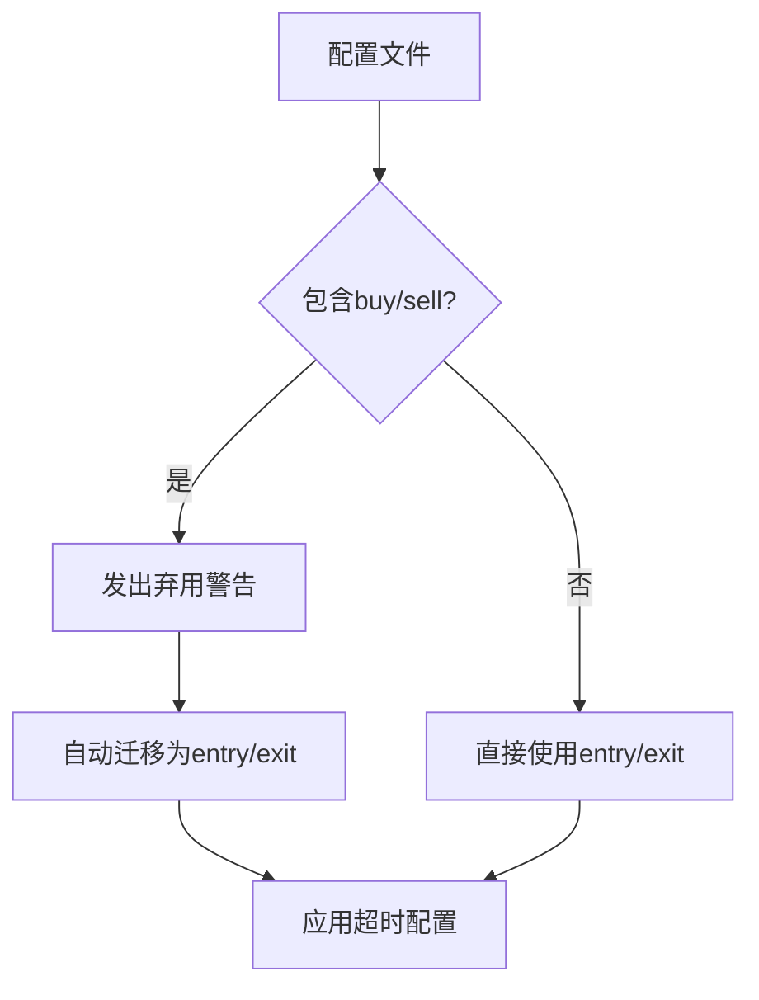
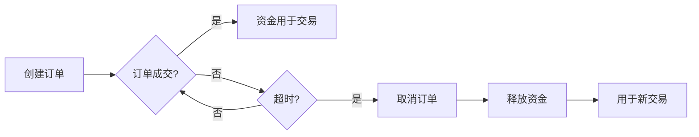
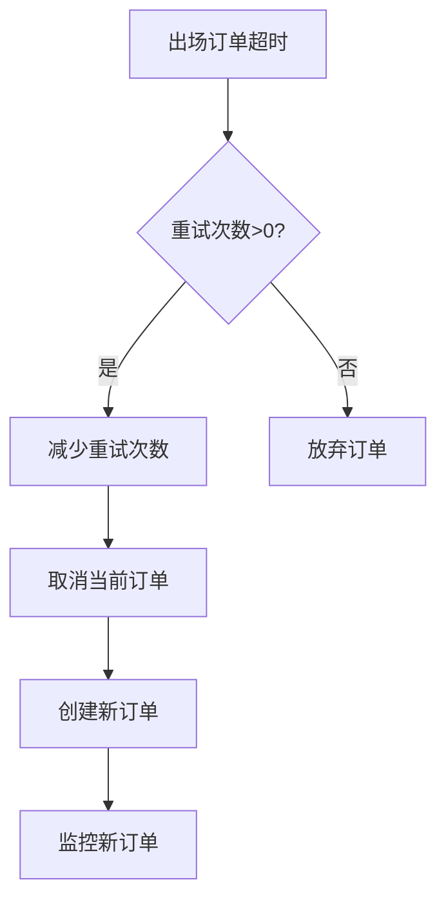

# 订单超时配置

<cite>
**本文档中引用的文件**   
- [config_schema.py](file://freqtrade/config_schema/config_schema.py)
- [config_validation.py](file://freqtrade/configuration/config_validation.py)
- [interface.py](file://freqtrade/strategy/interface.py)
- [freqtradebot.py](file://freqtrade/freqtradebot.py)
</cite>

## 目录
1. [简介](#简介)
2. [unfilledtimeout参数详解](#unfilledtimeout参数详解)
3. [订单超时机制与资金利用率](#订单超时机制与资金利用率)
4. [订单取消重试机制](#订单取消重试机制)
5. [不同市场条件下的配置策略](#不同市场条件下的配置策略)
6. [与交易所API限流的协调](#与交易所api限流的协调)

## 简介
本文档全面解析Freqtrade交易系统中`unfilledtimeout`参数的配置选项及其对交易执行的影响。该参数用于管理未成交订单的超时行为，防止资金长期锁定，提高资金利用率。文档将详细说明`entry`、`exit`、`exit_timeout_count`等子参数的含义和使用场景，并分析订单取消重试机制的工作流程，提供高波动性和低流动性市场中的最佳实践。

**Section sources**
- [config_schema.py](file://freqtrade/config_schema/config_schema.py#L234-L250)

## unfilledtimeout参数详解
`unfilledtimeout`参数用于配置未成交订单的超时时间，防止资金因订单长期未成交而被锁定。该参数包含多个子参数，用于精细化控制订单行为。

### 参数结构与子参数
`unfilledtimeout`是一个对象，包含以下子参数：

- **entry**: 入场订单的超时时间，单位由`unit`参数决定。
- **exit**: 出场订单的超时时间，单位由`unit`参数决定。
- **exit_timeout_count**: 出场订单超时后重试的次数。
- **unit**: 超时时间的单位，可选值为`minutes`（分钟）或`seconds`（秒）。

### 参数迁移与兼容性
在早期版本中，使用`buy`和`sell`作为子参数名称。从新版本开始，推荐使用`entry`和`exit`以提高语义清晰度。系统会自动处理旧参数的迁移，但会发出弃用警告。



**Diagram sources **
- [config_validation.py](file://freqtrade/configuration/config_validation.py#L275-L291)

**Section sources**
- [config_schema.py](file://freqtrade/config_schema/config_schema.py#L234-L250)
- [config_validation.py](file://freqtrade/configuration/config_validation.py#L275-L291)

## 订单超时机制与资金利用率
订单超时机制是防止资金长期锁定的关键功能。通过合理配置超时时间，可以确保资金在订单无法成交时及时释放，用于其他交易机会。

### 防止资金锁定
当订单因市场流动性不足或其他原因无法成交时，资金会被锁定在该订单上。通过设置合理的超时时间，系统会在订单超时后自动取消，释放被锁定的资金。

### 提高资金利用率
及时取消未成交订单可以提高资金利用率。释放的资金可以用于其他交易机会，特别是在高波动性市场中，这可以显著提高整体收益。



**Diagram sources **
- [freqtradebot.py](file://freqtrade/freqtradebot.py#L1613)
- [interface.py](file://freqtrade/strategy/interface.py#L1708-L1731)

**Section sources**
- [freqtradebot.py](file://freqtrade/freqtradebot.py#L1613)
- [interface.py](file://freqtrade/strategy/interface.py#L1708-L1731)

## 订单取消重试机制
订单取消重试机制允许系统在订单超时后进行重试，以应对短暂的市场波动或网络延迟。

### 重试流程
当出场订单超时时，系统会根据`exit_timeout_count`参数决定是否重试。重试机制可以提高订单成交的概率，特别是在高波动性市场中。

### 重试策略
重试策略应根据市场条件进行调整。在高波动性市场中，可以适当增加重试次数，以应对价格快速变动。在低流动性市场中，应谨慎使用重试，以避免频繁的订单取消和重新下单。



**Diagram sources **
- [freqtradebot.py](file://freqtrade/freqtradebot.py#L1613)
- [interface.py](file://freqtrade/strategy/interface.py#L1708-L1731)

**Section sources**
- [freqtradebot.py](file://freqtrade/freqtradebot.py#L1613)
- [interface.py](file://freqtrade/strategy/interface.py#L1708-L1731)

## 不同市场条件下的配置策略
不同市场条件需要不同的`unfilledtimeout`配置策略，以优化交易性能。

### 高波动性市场
在高波动性市场中，价格变动迅速，订单可能很快变得不具吸引力。建议设置较短的超时时间，以快速响应市场变化。

- **entry**: 1-2分钟
- **exit**: 1-2分钟
- **exit_timeout_count**: 1-2次

### 低流动性市场
在低流动性市场中，订单可能需要较长时间才能成交。建议设置较长的超时时间，以增加订单成交的机会。

- **entry**: 5-10分钟
- **exit**: 5-10分钟
- **exit_timeout_count**: 0-1次

### 配置示例
```json
"unfilledtimeout": {
    "entry": 2,
    "exit": 2,
    "exit_timeout_count": 1,
    "unit": "minutes"
}
```

**Section sources**
- [config_schema.py](file://freqtrade/config_schema/config_schema.py#L234-L250)
- [config_validation.py](file://freqtrade/configuration/config_validation.py#L275-L291)

## 与交易所API限流的协调
`unfilledtimeout`配置需要与交易所API的限流策略协调，以避免触发限流。

### 限流风险
频繁的订单取消和重新下单可能触发交易所的API限流。因此，需要合理设置超时时间和重试次数，以平衡订单成交率和API调用频率。

### 协调策略
- 监控API调用频率，确保在限流阈值内。
- 在高频率交易策略中，适当延长超时时间，减少订单取消和重新下单的频率。
- 使用交易所提供的批量订单API，减少API调用次数。

**Section sources**
- [freqtradebot.py](file://freqtrade/freqtradebot.py#L1613)
- [interface.py](file://freqtrade/strategy/interface.py#L1708-L1731)