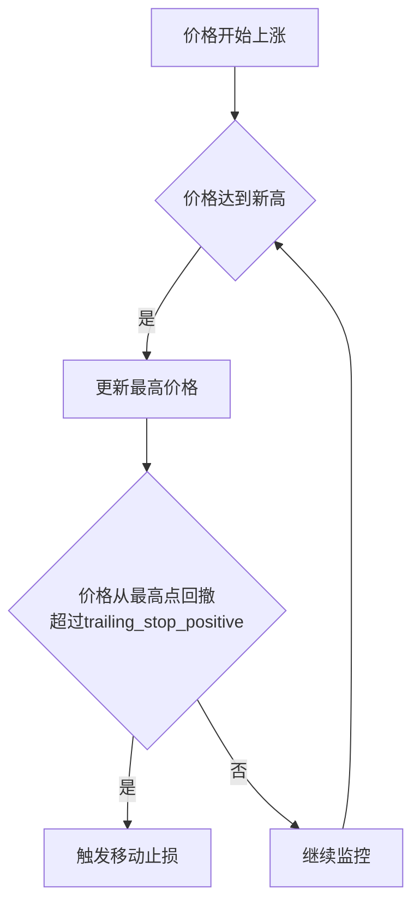
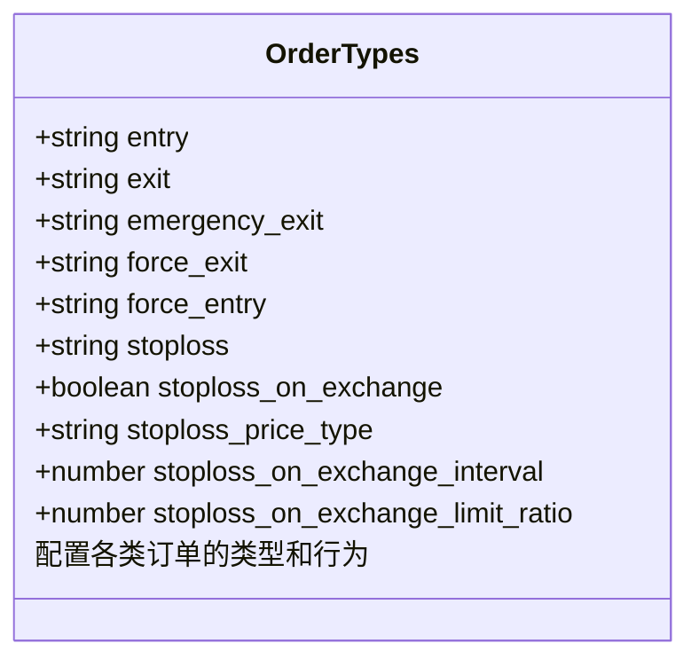
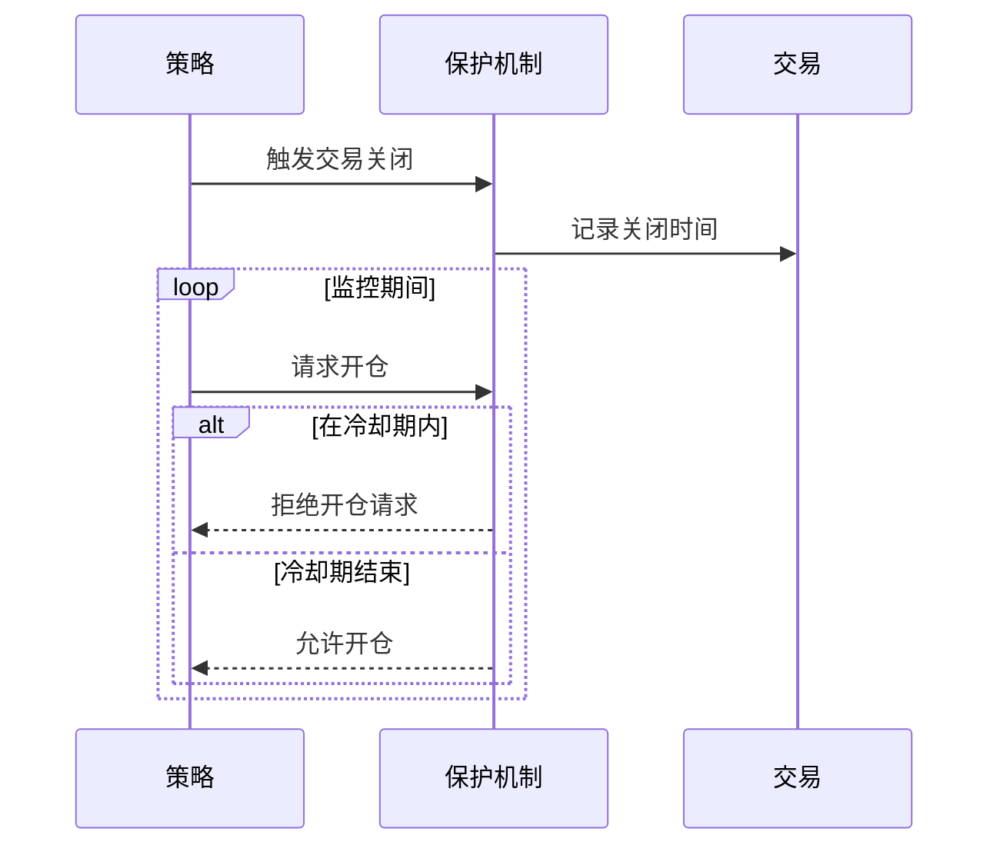

# 风险管理配置

<cite>
**本文档引用的文件**   
- [config_schema.py](file://freqtrade/config_schema/config_schema.py)
- [interface.py](file://freqtrade/strategy/interface.py)
- [config_full.example.json](file://config_examples/config_full.example.json)
- [cooldown_period.py](file://freqtrade/plugins/protections/cooldown_period.py)
- [max_drawdown_protection.py](file://freqtrade/plugins/protections/max_drawdown_protection.py)
- [stoploss_guard.py](file://freqtrade/plugins/protections/stoploss_guard.py)
- [iprotection.py](file://freqtrade/plugins/protections/iprotection.py)
- [protectionmanager.py](file://freqtrade/plugins/protectionmanager.py)
</cite>

## 目录
1. [引言](#引言)
2. [核心风险参数详解](#核心风险参数详解)
3. [trailing_stop系列参数工作机制](#trailing_stop系列参数工作机制)
4. [order_types订单类型配置](#order_types订单类型配置)
5. [高级保护机制配置](#高级保护机制配置)
6. [实战案例与常见陷阱](#实战案例与常见陷阱)

## 引言
Freqtrade提供了一套完整的风险管理配置体系，旨在帮助交易者有效控制交易风险。本文档系统化地介绍了stoploss、minimal_roi、unfilledtimeout等核心风险参数的配置方法，深入分析了trailing_stop系列参数的工作机制，详细说明了order_types中各类订单类型的配置选项，并结合plugins/protections中的保护机制，展示了如何通过配置启用cooldown_period、max_drawdown_protection等高级保护功能。通过本指南，用户可以全面掌握Freqtrade的风险管理配置，构建稳健的交易策略。

## 核心风险参数详解

### stoploss参数配置
stoploss参数用于设置交易的最大亏损比例，是风险管理的基础。该参数在策略中定义，作为硬性止损阈值。当交易亏损达到此比例时，系统将自动执行止损操作，防止损失进一步扩大。

**Section sources**
- [interface.py](file://freqtrade/strategy/interface.py#L74)
- [config_schema.py](file://freqtrade/config_schema/config_schema.py#L140)

### minimal_roi参数配置
minimal_roi参数定义了最小投资回报率，采用字典形式配置，键值为剩余交易时间（分钟），值为对应的最低收益率。系统会根据当前交易的持续时间，动态调整目标收益率，鼓励在不同持有周期内实现盈利。

**Section sources**
- [interface.py](file://freqtrade/strategy/interface.py#L70)
- [config_schema.py](file://freqtrade/config_schema/config_schema.py#L135)

### unfilledtimeout参数配置
unfilledtimeout参数用于设置未成交订单的超时时间，防止订单长时间挂单占用资金。该参数包含entry（入场）和exit（出场）两个子参数，分别控制入场和出场订单的超时时间，单位由unit参数指定。

**Section sources**
- [api_schemas.py](file://freqtrade/rpc/api_server/api_schemas.py#L245)
- [config_schema.py](file://freqtrade/config_schema/config_schema.py#L200)

## trailing_stop系列参数工作机制

### trailing_stop参数
trailing_stop是一个布尔值参数，用于启用或禁用移动止损功能。当设置为true时，系统将根据trailing_stop_positive和trailing_stop_positive_offset参数的配置，动态调整止损价格。

**Section sources**
- [interface.py](file://freqtrade/strategy/interface.py#L76)
- [config_schema.py](file://freqtrade/config_schema/config_schema.py#L143)

### trailing_stop_positive参数
trailing_stop_positive参数定义了移动止损的正向偏移量，即当价格从最高点回撤此比例时，触发移动止损。该值必须大于0且小于trailing_stop_positive_offset。



**Diagram sources**
- [config_schema.py](file://freqtrade/config_schema/config_schema.py#L146)

### trailing_stop_positive_offset参数
trailing_stop_positive_offset参数定义了移动止损的激活偏移量，即价格必须先上涨此比例，移动止损功能才会被激活。该值必须大于trailing_stop_positive，确保止损不会过早触发。

**Section sources**
- [interface.py](file://freqtrade/strategy/interface.py#L78)
- [config_schema.py](file://freqtrade/config_schema/config_schema.py#L149)

## order_types订单类型配置

### 订单类型配置选项
order_types参数用于配置各类订单的类型，包括entry（入场）、exit（出场）、stoploss（止损）等。每个订单类型可设置为limit（限价单）或market（市价单），以满足不同的交易需求。



**Diagram sources**
- [interface.py](file://freqtrade/strategy/interface.py#L93)
- [config_schema.py](file://freqtrade/config_schema/config_schema.py#L220)

### stoploss_on_exchange配置
stoploss_on_exchange参数用于控制是否在交易所层面设置止损单。启用此功能需要交易所支持，且需配置stoploss_on_exchange_interval（检查间隔）和stoploss_on_exchange_limit_ratio（限价单比例）等参数。

**Section sources**
- [exchange_types.py](file://freqtrade/exchange/exchange_types.py#L14)
- [config_schema.py](file://freqtrade/config_schema/config_schema.py#L230)

## 高级保护机制配置

### cooldown_period保护机制
cooldown_period保护机制用于在交易对关闭后设置冷却期，防止立即重新开仓。该机制通过在protections列表中添加CooldownPeriod配置来启用，可设置lookback_period（回溯期）和stop_duration（停止期）。



**Diagram sources**
- [cooldown_period.py](file://freqtrade/plugins/protections/cooldown_period.py#L0)
- [iprotection.py](file://freqtrade/plugins/protections/iprotection.py#L0)

### max_drawdown_protection保护机制
max_drawdown_protection保护机制用于监控最大回撤，当回撤超过设定阈值时，暂停所有交易。该机制通过在protections列表中添加MaxDrawdown配置来启用，可设置max_allowed_drawdown（最大允许回撤）和trade_limit（交易限制）。

**Section sources**
- [max_drawdown_protection.py](file://freqtrade/plugins/protections/max_drawdown_protection.py#L0)
- [protectionmanager.py](file://freqtrade/plugins/protectionmanager.py#L0)

### stoploss_guard保护机制
stoploss_guard保护机制用于防止频繁止损，当在指定时间内发生过多止损时，暂停交易。该机制通过在protections列表中添加StoplossGuard配置来启用，可设置trade_limit（止损次数限制）和required_profit（所需利润）。

**Section sources**
- [stoploss_guard.py](file://freqtrade/plugins/protections/stoploss_guard.py#L0)
- [iprotection.py](file://freqtrade/plugins/protections/iprotection.py#L0)

## 实战案例与常见陷阱

### 风险参数配置实战案例
以下是一个完整的风险参数配置示例，展示了如何综合运用各种风险参数：

```json
{
  "stoploss": -0.10,
  "minimal_roi": {
    "40": 0.0,
    "30": 0.01,
    "20": 0.02,
    "0": 0.04
  },
  "trailing_stop": true,
  "trailing_stop_positive": 0.02,
  "trailing_stop_positive_offset": 0.03,
  "unfilledtimeout": {
    "entry": 15,
    "exit": 15,
    "unit": "minutes"
  },
  "order_types": {
    "entry": "limit",
    "exit": "limit",
    "stoploss": "market",
    "stoploss_on_exchange": true,
    "stoploss_on_exchange_interval": 60
  },
  "protections": [
    {
      "method": "CooldownPeriod",
      "stop_duration": 60
    },
    {
      "method": "MaxDrawdown",
      "lookback_period": 1440,
      "trade_limit": 3,
      "stop_duration": 300,
      "max_allowed_drawdown": 0.1
    }
  ]
}
```

**Section sources**
- [config_full.example.json](file://config_examples/config_full.example.json#L0)

### 常见陷阱与规避方法
1. **trailing_stop配置错误**：确保trailing_stop_positive_offset大于trailing_stop_positive，否则系统将抛出配置错误。
2. **stoploss_on_exchange兼容性问题**：并非所有交易所都支持在交易所层面设置止损单，使用前需确认交易所支持情况。
3. **protections配置冲突**：避免在同一策略中配置相互冲突的保护机制，如同时启用多个全局停止的保护机制。
4. **unfilledtimeout设置过短**：过短的超时时间可能导致订单频繁取消，影响交易执行效率。

**Section sources**
- [config_validation.py](file://freqtrade/configuration/config_validation.py#L324)
- [config_schema.py](file://freqtrade/config_schema/config_schema.py#L0)