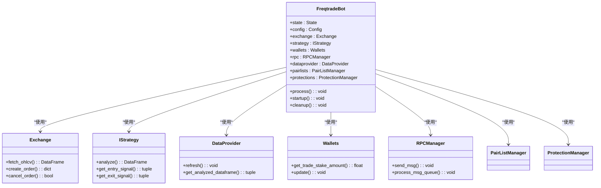
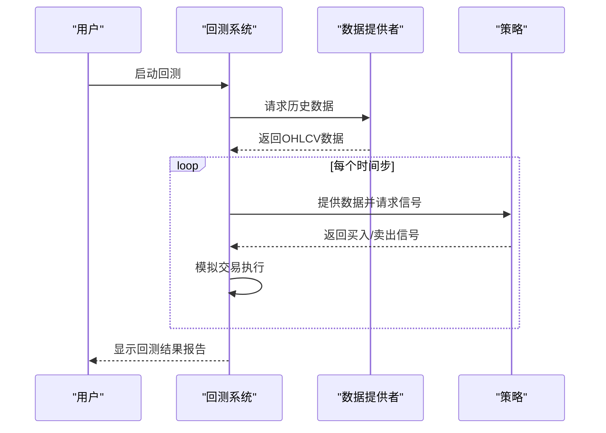
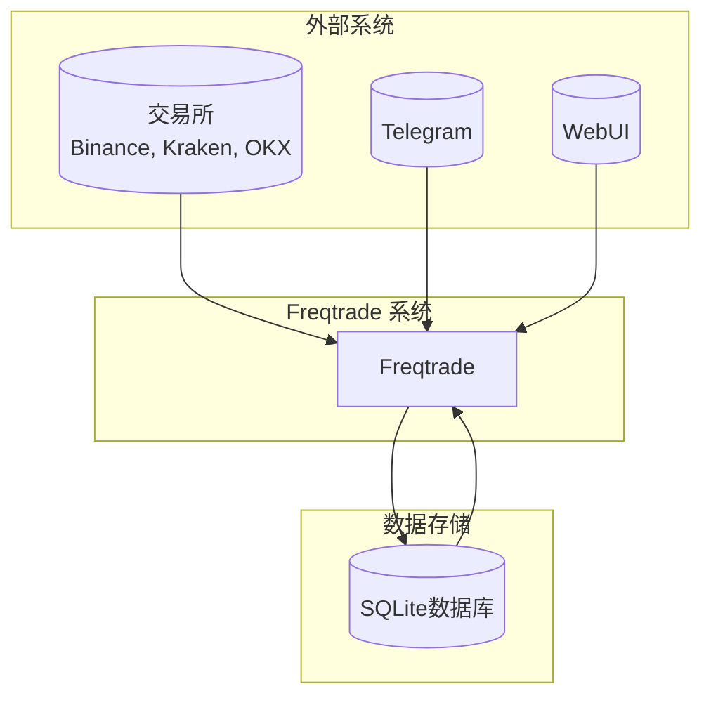

# 项目概述

<cite>
**本文档中引用的文件**  
- [README.md](file://README.md)
- [freqtradebot.py](file://freqtrade/freqtradebot.py)
- [backtesting.py](file://freqtrade/optimize/backtesting.py)
- [freqai_interface.py](file://freqtrade/freqai/freqai_interface.py)
- [trade_commands.py](file://freqtrade/commands/trade_commands.py)
- [webserver.py](file://freqtrade/rpc/api_server/webserver.py)
</cite>

## 目录
1. [引言](#引言)
2. [系统架构设计](#系统架构设计)
3. [核心功能组件](#核心功能组件)
4. [系统上下文图](#系统上下文图)
5. [技术愿景与差异化优势](#技术愿景与差异化优势)
6. [典型使用路径](#典型使用路径)
7. [结论](#结论)

## 引言

Freqtrade 是一个免费且开源的加密货币交易机器人，使用 Python 编写。它旨在支持所有主要交易所，并可通过 Telegram 或 WebUI 进行控制。该项目包含回测、绘图和资金管理工具，以及通过机器学习进行策略优化的功能。Freqtrade 的设计目标是为用户提供一个灵活、可扩展且功能强大的自动化交易解决方案。

**重要提示**：此软件仅用于教育目的。请勿使用您害怕损失的资金进行交易。使用本软件风险自负。作者及所有关联方不对您的交易结果承担任何责任。

**Section sources**
- [README.md](file://README.md#L0-L22)

## 系统架构设计

Freqtrade 采用模块化架构设计，其核心是一个基于事件驱动的交易引擎。系统通过 `FreqtradeBot` 类协调各个组件的交互。该架构遵循清晰的职责分离原则，将数据获取、策略执行、交易管理和用户交互等功能解耦。

系统的核心是 `FreqtradeBot` 类，它负责初始化所有必要的对象，如交易所接口、策略解析器、钱包管理器和 RPC 管理器。`process` 方法是主循环，它按顺序执行以下步骤：刷新市场数据、更新活跃交易对白名单、刷新数据提供者中的蜡烛图数据、分析策略信号、管理开放订单、处理退出位置、处理开放交易头寸，并最终尝试进入新的交易位置。

这种设计允许高度的可扩展性和灵活性。例如，策略通过 `StrategyResolver` 动态加载，使得用户可以轻松地创建和切换不同的交易策略。插件机制（如配对列表和保护机制）也通过类似的解析器模式实现，允许在不修改核心代码的情况下添加新功能。

**Diagram sources**
- [freqtradebot.py](file://freqtrade/freqtradebot.py#L72-L477)

**Section sources**
- [freqtradebot.py](file://freqtrade/freqtradebot.py#L72-L477)

## 核心功能组件

Freqtrade 的核心功能由几个关键组件构成，它们协同工作以实现自动化交易。

### 交易引擎

交易引擎是 Freqtrade 的核心，由 `FreqtradeBot` 类实现。它负责执行交易生命周期的各个阶段，包括进入、管理、调整和退出交易。引擎通过 `enter_positions` 和 `exit_positions` 方法处理交易信号，并通过 `manage_open_orders` 方法监控订单状态。它还集成了保护机制，如 `ProtectionManager`，以防止在市场剧烈波动时进行不利交易。

### 回测系统

回测系统 (`Backtesting`) 允许用户在历史数据上模拟其交易策略，以评估其性能。该系统通过 `load_data` 方法加载指定时间范围内的历史蜡烛图数据，然后使用 `process` 方法模拟交易执行。回测结果包括总利润、胜率、最大回撤等关键指标，帮助用户优化其策略。

**Diagram sources**
- [backtesting.py](file://freqtrade/optimize/backtesting.py#L100-L200)

### FreqAI 机器学习框架

FreqAI 是一个集成的机器学习框架，允许用户构建能够自我训练以适应市场变化的智能策略。它通过 `IFreqaiModel` 接口与策略集成，提供数据预处理、模型训练和预测功能。FreqAI 支持多种机器学习模型，包括分类器和回归器，并可以使用自适应预测建模来优化交易决策。

**Section sources**
- [freqtradebot.py](file://freqtrade/freqtradebot.py#L72-L477)
- [backtesting.py](file://freqtrade/optimize/backtesting.py#L100-L200)
- [freqai_interface.py](file://freqtrade/freqai/freqai_interface.py#L40-L100)

## 系统上下文图

Freqtrade 作为一个独立的应用程序，与多个外部系统进行交互。它从各种加密货币交易所（如 Binance、Kraken、OKX）获取实时市场数据和执行交易。用户可以通过 Telegram 机器人或内置的 WebUI（FreqUI）与系统进行交互，发送命令和接收状态更新。系统将交易数据和配置持久化存储在本地 SQLite 数据库中。

**Diagram sources**
- [README.md](file://README.md#L23-L62)
- [freqtradebot.py](file://freqtrade/freqtradebot.py#L72-L477)

## 技术愿景与差异化优势

Freqtrade 的技术愿景是成为一个功能全面、社区驱动的开源交易框架。其主要优势在于其模块化设计、对机器学习的深度集成以及对多种交易所和交易模式（现货、期货）的广泛支持。

与其他交易框架相比，Freqtrade 的差异化优势体现在以下几个方面：
1.  **内置机器学习 (FreqAI)**：提供了一个完整的框架，用于在策略中集成自适应机器学习模型。
2.  **多平台支持**：支持超过 20 个交易所，并且可以通过 Docker 轻松部署。
3.  **丰富的功能集**：除了基本的交易功能外，还提供回测、超参数优化（Hyperopt）、绘图和多种用户界面（Telegram、WebUI）。
4.  **活跃的社区**：拥有一个活跃的 Discord 社区，提供支持和协作开发。

**Section sources**
- [README.md](file://README.md#L23-L62)

## 典型使用路径

Freqtrade 为不同技能水平的用户提供了清晰的使用路径。

### 初学者路径

1.  **安装**：通过 Docker 或原生方式安装 Freqtrade。
2.  **配置**：创建一个配置文件 (`config.json`)，设置交易所 API 密钥、交易对白名单和初始资金。
3.  **干运行 (Dry-run)**：在不使用真实资金的情况下启动机器人，以验证其行为。
4.  **回测**：使用历史数据测试交易策略，评估其性能。
5.  **实盘交易**：在干运行成功后，切换到实盘模式进行真实交易。

### 专家用户路径

1.  **策略开发**：编写自定义的 Python 策略类，实现复杂的交易逻辑。
2.  **超参数优化**：使用 Hyperopt 模块优化策略参数，以最大化收益。
3.  **集成 FreqAI**：在策略中集成机器学习模型，以进行更智能的预测。
4.  **自动化部署**：使用脚本和 CI/CD 管道自动化部署和监控机器人。

**Section sources**
- [README.md](file://README.md#L137-L184)
- [trade_commands.py](file://freqtrade/commands/trade_commands.py#L1-L30)

## 结论

Freqtrade 是一个功能强大且灵活的加密货币交易机器人框架。其模块化架构、对机器学习的深度集成以及对多种交易所的支持，使其成为从初学者到专家用户的理想选择。通过遵循从干运行到实盘交易的逐步路径，用户可以安全地探索和利用自动化交易的力量。该项目的开源性质和活跃的社区确保了其持续的创新和发展。